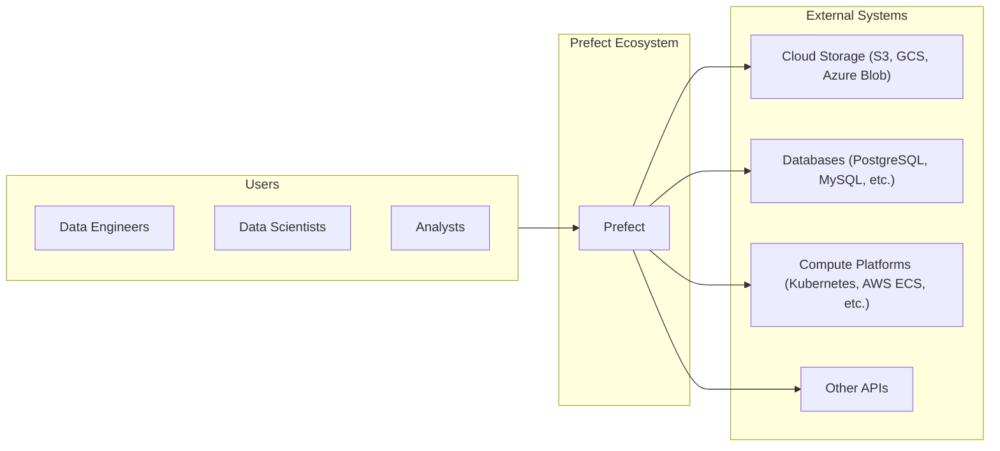
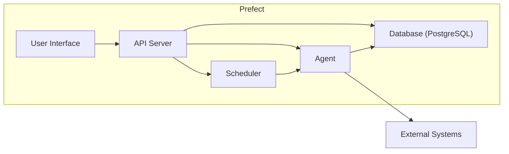
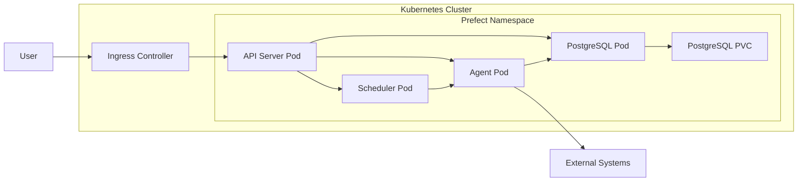
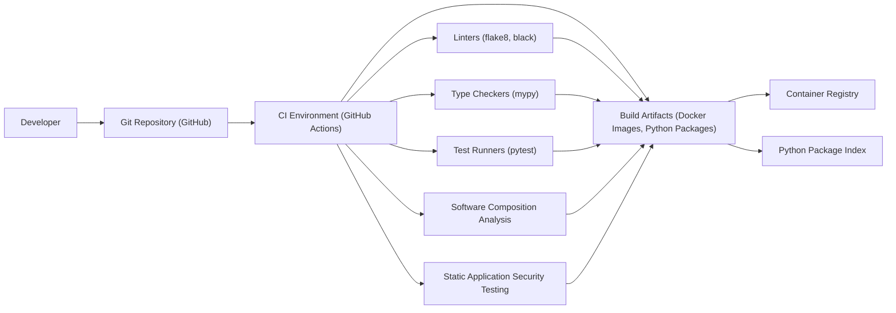

Okay, let's create a design document for the Prefect project, focusing on aspects relevant to threat modeling.

# BUSINESS POSTURE

Prefect is a workflow management system designed to build, run, and monitor data pipelines.  It appears to be a mature project, likely past the initial startup phase, and is now focused on scaling and enterprise adoption.  This suggests a moderate risk appetite, balancing innovation with stability and security.

Business Priorities and Goals:

*   Reliable workflow orchestration: Ensuring that data pipelines execute as expected, with robust error handling and recovery.
*   Scalability:  Handling increasing volumes of data and workflow complexity.
*   Observability: Providing clear visibility into workflow execution and performance.
*   Ease of use:  Making it simple for data engineers and scientists to define and manage workflows.
*   Extensibility:  Allowing users to integrate Prefect with a wide range of tools and systems.
*   Enterprise readiness: Meeting the security, compliance, and support needs of large organizations.

Business Risks:

*   Data breaches: Unauthorized access to sensitive data processed by workflows.
*   Workflow disruption:  Failures that prevent workflows from executing, leading to data loss or delays.
*   Compliance violations:  Failure to meet regulatory requirements related to data privacy and security.
*   Reputational damage:  Security incidents or reliability issues that erode trust in Prefect.
*   Supply chain attacks: Compromise of Prefect's codebase or dependencies, leading to vulnerabilities.
*   Incorrect workflow execution: Workflows that execute but produce incorrect results due to logic errors or data corruption.

# SECURITY POSTURE

Existing Security Controls (Based on the GitHub repository and project documentation):

*   security control: Authentication: Prefect Cloud and Prefect Server support user authentication, including API key management. (Described in Prefect documentation and API specifications).
*   security control: Authorization: Role-Based Access Control (RBAC) is available in Prefect Cloud to manage user permissions. (Described in Prefect Cloud documentation).
*   security control: Input validation: Prefect uses Pydantic for data validation and serialization, helping to prevent injection vulnerabilities. (Visible in the codebase, use of Pydantic).
*   security control: Encryption in transit: Communication with Prefect Cloud and a properly configured Prefect Server uses HTTPS. (Assumed based on standard practices and documentation).
*   security control: Encryption at rest: Prefect Cloud likely encrypts data at rest (specific details would require confirmation from Prefect). User-configured storage (e.g., S3, GCS) can be configured for encryption at rest.
*   security control: Dependency management: Prefect uses tools like `poetry` to manage dependencies and pin versions, reducing the risk of supply chain issues. (Visible in `pyproject.toml` and `poetry.lock`).
*   security control: Code scanning: GitHub Actions workflows include steps for code linting (e.g., `flake8`, `black`) and static analysis (e.g., `mypy`). (Visible in `.github/workflows`).
*   security control: Regular updates: Prefect has a regular release cycle, providing bug fixes and security patches.
*   security control: Secret Management: Prefect provides mechanisms for securely storing and accessing secrets (e.g., API keys, passwords) used in workflows. (Described in Prefect documentation).

Accepted Risks:

*   accepted risk: Local deployments: Users deploying Prefect Server themselves are responsible for securing their infrastructure and following security best practices.
*   accepted risk: Third-party integrations:  The security of integrations with external systems (e.g., databases, cloud services) depends on the user's configuration and the security of those systems.
*   accepted risk: User-defined code: Prefect executes user-provided code, which may contain vulnerabilities. Users are responsible for the security of their own workflow code.

Recommended Security Controls:

*   Implement Software Composition Analysis (SCA) to identify known vulnerabilities in dependencies.
*   Implement Static Application Security Testing (SAST) to automatically scan the codebase for potential security flaws.
*   Implement Dynamic Application Security Testing (DAST) on deployed instances of Prefect Server.
*   Formalize a security vulnerability disclosure program.
*   Conduct regular penetration testing of Prefect Cloud and Prefect Server.
*   Provide detailed security hardening guides for self-hosted Prefect Server deployments.

Security Requirements:

*   Authentication:
    *   All users must be authenticated before accessing Prefect Cloud or Server.
    *   Support for multi-factor authentication (MFA) should be considered.
    *   API keys should be managed securely and have appropriate permissions.

*   Authorization:
    *   RBAC should be enforced to restrict user access to resources based on their roles.
    *   Principle of least privilege should be applied to all users and services.

*   Input Validation:
    *   All user-provided input should be validated to prevent injection attacks.
    *   Data serialization and deserialization should be handled securely.

*   Cryptography:
    *   All communication between clients and servers should be encrypted using TLS 1.2 or higher.
    *   Sensitive data at rest should be encrypted using strong encryption algorithms.
    *   Cryptographic keys should be managed securely.

# DESIGN

## C4 CONTEXT

Element Descriptions:

*   Element:
    *   Name: Data Engineers
    *   Type: User
    *   Description: Users who build and maintain data pipelines.
    *   Responsibilities: Defining, deploying, and monitoring workflows.
    *   Security controls: Authentication, Authorization (RBAC).

*   Element:
    *   Name: Data Scientists
    *   Type: User
    *   Description: Users who use data pipelines for analysis and modeling.
    *   Responsibilities: Running workflows and analyzing results.
    *   Security controls: Authentication, Authorization (RBAC).

*   Element:
    *   Name: Analysts
    *   Type: User
    *   Description: Users who consume the output of data pipelines.
    *   Responsibilities: Using data for reporting and decision-making.
    *   Security controls: Authentication, Authorization (RBAC).

*   Element:
    *   Name: Prefect
    *   Type: System
    *   Description: The workflow management system.
    *   Responsibilities: Orchestrating workflow execution, managing state, providing observability.
    *   Security controls: Authentication, Authorization (RBAC), Input Validation, Encryption (in transit and at rest), Secret Management.

*   Element:
    *   Name: Cloud Storage (S3, GCS, Azure Blob)
    *   Type: External System
    *   Description: Cloud storage services used to store data and artifacts.
    *   Responsibilities: Storing data reliably and securely.
    *   Security controls: Encryption (at rest and in transit), Access Control (IAM).

*   Element:
    *   Name: Databases (PostgreSQL, MySQL, etc.)
    *   Type: External System
    *   Description: Databases used to store data and metadata.
    *   Responsibilities: Storing data reliably and securely.
    *   Security controls: Authentication, Authorization, Encryption (at rest and in transit), Auditing.

*   Element:
    *   Name: Compute Platforms (Kubernetes, AWS ECS, etc.)
    *   Type: External System
    *   Description: Platforms used to execute workflow tasks.
    *   Responsibilities: Providing compute resources for task execution.
    *   Security controls: Authentication, Authorization, Network Security, Container Security.

*   Element:
    *   Name: Other APIs
    *   Type: External System
    *   Description: External APIs that workflows may interact with.
    *   Responsibilities: Providing specific services or data.
    *   Security controls: Authentication, Authorization, Rate Limiting, Input Validation.

## C4 CONTAINER

Element Descriptions:

*   Element:
    *   Name: User Interface
    *   Type: Container
    *   Description: Web-based interface for interacting with Prefect.
    *   Responsibilities: Displaying workflow information, allowing users to manage workflows.
    *   Security controls: Authentication, Authorization (RBAC), Input Validation.

*   Element:
    *   Name: API Server
    *   Type: Container
    *   Description: REST API for interacting with Prefect.
    *   Responsibilities: Handling requests from the UI and other clients, managing workflow state.
    *   Security controls: Authentication, Authorization (RBAC), Input Validation, Rate Limiting, Encryption (in transit).

*   Element:
    *   Name: Scheduler
    *   Type: Container
    *   Description: Service that schedules workflow runs.
    *   Responsibilities: Determining when workflows should run based on their schedules.
    *   Security controls: Authentication, Authorization.

*   Element:
    *   Name: Agent
    *   Type: Container
    *   Description: Process that executes workflow tasks.
    *   Responsibilities: Running tasks, reporting status to the API Server.
    *   Security controls: Authentication, Authorization, Secure Communication with API Server, Limited Privileges.

*   Element:
    *   Name: Database (PostgreSQL)
    *   Type: Container
    *   Description: Database used to store workflow metadata and state.
    *   Responsibilities: Storing data reliably and securely.
    *   Security controls: Authentication, Authorization, Encryption (at rest and in transit), Auditing.

*   Element:
    *   Name: External Systems
    *   Type: External Systems
    *   Description: External systems that Prefect interacts with.
    *   Responsibilities: Providing specific services or data.
    *   Security controls: Dependent on the specific system.

## DEPLOYMENT

Possible Deployment Solutions:

1.  Prefect Cloud: Fully managed SaaS offering.
2.  Self-hosted Prefect Server: Deploying Prefect Server on user-managed infrastructure (e.g., Kubernetes, VMs).
3.  Hybrid: Using Prefect Cloud for orchestration and self-hosted agents for task execution.

Chosen Solution (for detailed description): Self-hosted Prefect Server on Kubernetes.

Element Descriptions:

*   Element:
    *   Name: Kubernetes Cluster
    *   Type: Infrastructure Node
    *   Description: The Kubernetes cluster where Prefect Server is deployed.
    *   Responsibilities: Providing compute, networking, and storage resources.
    *   Security controls: Network Policies, RBAC, Node Security, Pod Security Policies.

*   Element:
    *   Name: Prefect Namespace
    *   Type: Logical Grouping
    *   Description: A Kubernetes namespace dedicated to Prefect resources.
    *   Responsibilities: Isolating Prefect components from other applications.
    *   Security controls: Network Policies, Resource Quotas.

*   Element:
    *   Name: API Server Pod
    *   Type: Container Instance
    *   Description: A pod running the Prefect API Server container.
    *   Responsibilities: Handling API requests.
    *   Security controls: Authentication, Authorization, Input Validation, Network Policies.

*   Element:
    *   Name: Scheduler Pod
    *   Type: Container Instance
    *   Description: A pod running the Prefect Scheduler container.
    *   Responsibilities: Scheduling workflow runs.
    *   Security controls: Authentication, Authorization, Network Policies.

*   Element:
    *   Name: Agent Pod
    *   Type: Container Instance
    *   Description: A pod running the Prefect Agent container.
    *   Responsibilities: Executing workflow tasks.
    *   Security controls: Authentication, Authorization, Network Policies, Limited Privileges.

*   Element:
    *   Name: PostgreSQL Pod
    *   Type: Container Instance
    *   Description: A pod running the PostgreSQL database container.
    *   Responsibilities: Storing workflow metadata and state.
    *   Security controls: Authentication, Authorization, Encryption (at rest and in transit), Network Policies.

*   Element:
    *   Name: PostgreSQL PVC
    *   Type: Persistent Volume Claim
    *   Description: A persistent volume claim for the PostgreSQL database.
    *   Responsibilities: Providing persistent storage for the database.
    *   Security controls: Encryption at rest.

*   Element:
    *   Name: Ingress Controller
    *   Type: Infrastructure Node
    *   Description: An Ingress controller that exposes the Prefect API Server to external traffic.
    *   Responsibilities: Routing traffic to the API Server.
    *   Security controls: TLS termination, Access Control.

*   Element:
    *   Name: User
    *   Type: User
    *   Description: A user interacting with the Prefect UI or API.
    *   Responsibilities: Initiating requests.
    *   Security controls: Authentication.

*   Element:
    *   Name: External Systems
    *   Type: External Systems
    *   Description: External systems that Prefect interacts with.
    *   Responsibilities: Providing specific services or data.
    *   Security controls: Dependent on the specific system.

## BUILD

Build Process Description:

1.  Developers write code and push changes to the Git repository (GitHub).
2.  GitHub Actions (CI environment) triggers a workflow on push or pull request.
3.  The workflow performs the following steps:
    *   Code linting using `flake8` and `black`.
    *   Type checking using `mypy`.
    *   Running unit and integration tests using `pytest`.
    *   Software Composition Analysis (SCA) to identify vulnerabilities in dependencies (recommended addition).
    *   Static Application Security Testing (SAST) to scan for code vulnerabilities (recommended addition).
    *   Building Docker images and Python packages.
4.  Build artifacts (Docker images) are pushed to a container registry.
5.  Build artifacts (Python packages) are published to a Python package index (e.g., PyPI).

Security Controls:

*   security control: Code review: Pull requests are used to review code changes before merging.
*   security control: Automated testing: Unit and integration tests are run automatically to catch bugs.
*   security control: Linting and type checking: Static analysis tools are used to enforce code quality and prevent errors.
*   security control: Dependency management: `poetry` is used to manage dependencies and pin versions.
*   security control: (Recommended) SCA: Scan dependencies for known vulnerabilities.
*   security control: (Recommended) SAST: Scan codebase for security vulnerabilities.

# RISK ASSESSMENT

Critical Business Processes:

*   Workflow orchestration: Ensuring reliable and timely execution of data pipelines.
*   Data processing: Handling sensitive data securely and accurately.
*   Data integration: Connecting to various data sources and destinations.

Data Sensitivity:

*   Prefect itself stores metadata about workflows, including schedules, configurations, and execution logs. This data may contain sensitive information, such as API keys or database credentials, if not properly managed using Prefect's secrets management features.
*   The data processed by workflows managed by Prefect can range from non-sensitive to highly sensitive, depending on the user's use case. This includes PII, financial data, and other confidential information.

# QUESTIONS & ASSUMPTIONS

Questions:

*   What is the specific threat model used by Prefect for their Cloud offering?
*   What are the details of Prefect Cloud's data encryption at rest implementation?
*   Are there any plans to implement more advanced security features, such as dynamic analysis or fuzzing?
*   What is the process for reporting security vulnerabilities in Prefect?
*   What level of support is provided for users who self-host Prefect Server?

Assumptions:

*   BUSINESS POSTURE: Prefect is targeting enterprise customers and prioritizes security.
*   SECURITY POSTURE: Prefect Cloud follows industry best practices for security. Users deploying Prefect Server are responsible for securing their infrastructure.
*   DESIGN: The provided diagrams are a simplified representation of the actual architecture. The deployment model assumes a Kubernetes-based deployment, but other options are available. The build process assumes the use of GitHub Actions, but other CI/CD systems could be used.