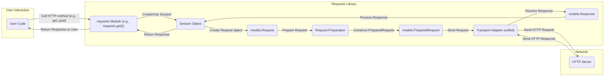

## Project Design Document: Requests Library

**1. Introduction**

This document outlines the design of the Python Requests library, an elegant and simple HTTP library for human beings. It aims to provide a clear understanding of the library's architecture, components, and data flow, which will be crucial for subsequent threat modeling activities. This document focuses on the core functionality and does not delve into every internal detail or edge case.

**2. Goals and Objectives**

The primary goal of the Requests library is to simplify the process of making HTTP requests in Python. Key objectives include:

*   Providing a user-friendly API for common HTTP methods (GET, POST, PUT, DELETE, etc.).
*   Handling complex HTTP features such as sessions, cookies, redirects, and authentication.
*   Abstracting away the underlying complexities of socket programming and HTTP protocol details.
*   Offering robust error handling and informative exceptions.
*   Maintaining a clean and readable codebase.
*   Providing a consistent and predictable interface for developers.

**3. Architectural Overview**

Requests adopts a layered architecture, abstracting away complexities at each level. The core components work together to facilitate the creation and processing of HTTP requests and responses.

*   **User Interface (API):** This is the primary entry point for users interacting with the library. It provides high-level functions like `requests.get()`, `requests.post()`, etc., and the `Session` object for managing persistent connections and settings. This layer focuses on providing a simple and intuitive way for users to express their HTTP needs.
*   **Request Construction and Preparation:** This layer takes user-provided parameters (URL, headers, data, etc.) and transforms them into a structured `PreparedRequest` object. This involves crucial steps like URL encoding, header formatting, data serialization (e.g., for POST requests), and applying any configured authentication.
*   **Session Management:** The `Session` object is central to managing state across multiple requests. It handles persistent parameters such as cookies, authentication credentials, and default headers. It also incorporates connection pooling, reusing underlying TCP connections to improve performance.
*   **Transport Abstraction (Adapters):** This layer provides an abstraction for the actual transmission of the HTTP request over the network. Requests uses pluggable transport adapters, allowing different underlying HTTP libraries to be used. The default adapter leverages the robust `urllib3` library. This design allows for flexibility and potential future integration with other transport mechanisms.
*   **Response Handling and Processing:** Once a response is received from the server, this layer parses the raw data, including headers and content, and creates a user-friendly `Response` object. This object provides convenient methods for accessing the response status, headers, content in various formats (text, JSON, bytes), cookies, and redirection history.

**4. Component Details**

*   **`requests` Module:** The top-level module providing the main API functions and entry points.
    *   Convenience functions for common HTTP methods: `get()`, `post()`, `put()`, `delete()`, `head()`, `options()`, `patch()`. These functions typically create a `Session` object internally if one is not provided.
    *   The core `Session` class for managing request sessions and persistent settings.
    *   Utility functions for tasks like status code lookup and exception handling.
    *   Definitions for custom exceptions raised by the library.
*   **`sessions.Session` Class:** Manages persistent session parameters, connection pooling, and request preparation.
    *   Stores and manages cookies using a `RequestsCookieJar` instance.
    *   Handles authentication by applying registered authentication handlers.
    *   Provides the `request()` method, which is the core method for sending requests, handling preparation and transport.
    *   Manages a pool of connections via `urllib3` for efficient reuse.
    *   Allows setting default headers, authentication, proxies, and other request options.
*   **`models.Request` Class:** Represents an outgoing HTTP request as initially constructed by the user or internally.
    *   Stores the raw, user-provided request parameters: URL, HTTP method, headers (as a dictionary), data (payload), parameters (query string), cookies, files, auth details, timeouts, etc.
*   **`models.PreparedRequest` Class:** Represents a fully prepared and ready-to-be-sent HTTP request.
    *   Contains the final, encoded URL, the complete set of headers (including those added by the session), and the serialized request body (if any).
    *   Created by the `Session` object's `prepare_request()` method, which performs URL encoding, header merging, and data serialization.
*   **`models.Response` Class:** Represents the server's response to an HTTP request.
    *   Stores the HTTP status code, response headers (as a dictionary), the response content (as bytes), cookies received from the server, and the history of any redirects followed.
    *   Provides methods for accessing the response content in different formats: `.text` (decoded text), `.json()` (parsed JSON), `.content` (raw bytes), `.iter_content()` (for streaming).
    *   Includes attributes for accessing the request that generated the response (`.request`).
*   **`cookies.RequestsCookieJar` Class:** Implements a cookie jar (based on `http.cookiejar`) for storing and managing HTTP cookies.
    *   Handles setting, retrieving, and deleting cookies based on server directives.
    *   Persists cookies across multiple requests within a session.
    *   Supports various cookie attributes like domain, path, secure, and HttpOnly.
*   **`auth` Module:** Provides authentication handler classes for various authentication schemes.
    *   Includes built-in handlers for Basic and Digest authentication.
    *   Provides an interface for implementing custom authentication handlers.
    *   Authentication handlers modify the `PreparedRequest` by adding necessary authentication headers.
*   **`adapters` Module:** Defines the interface for transport adapters and provides concrete implementations.
    *   The `BaseAdapter` class defines the interface that transport adapters must implement (e.g., `send()`, `close()`).
    *   The `HTTPAdapter` is the default adapter, built on top of `urllib3`, handling both HTTP and HTTPS requests.
    *   Allows users to register custom adapters for different protocols or underlying libraries.
*   **`compat` Module:** Provides compatibility shims and helper functions to ensure the library works across different Python versions.
*   **`packages` Directory:** Contains vendored dependencies, primarily `urllib3`, to manage dependencies and avoid potential conflicts with system-installed versions.
*   **`utils` Module:** Contains various utility functions used throughout the library, such as header parsing, encoding detection, and stream handling.

**5. Data Flow**

The typical flow of data when making a request using the Requests library is as follows:

Detailed steps:

*   The user's code initiates an HTTP request by calling a function in the `requests` module (e.g., `requests.get(url, params, headers)`).
*   The `requests` module function either uses an existing `Session` object or creates a new one.
*   A `models.Request` object is instantiated, encapsulating the user's provided request parameters (URL, method, headers, data, etc.).
*   The `Session` object's `prepare_request()` method is invoked to prepare the request. This crucial step involves:
    *   Merging session-level default parameters (headers, cookies, auth) with the request-specific parameters.
    *   Applying any configured authentication mechanisms.
    *   Encoding the URL and request body as needed.
    *   Constructing a `models.PreparedRequest` object, which is a fully formed HTTP request ready for transmission.
*   The `Session` object selects the appropriate transport adapter based on the request's URL scheme (e.g., HTTP or HTTPS). The default `HTTPAdapter` (using `urllib3`) is typically used.
*   The transport adapter's `send()` method is called with the `PreparedRequest` object and other parameters (e.g., timeout, stream).
*   The transport adapter (via `urllib3`) handles the low-level details of sending the HTTP request over the network to the target HTTP server.
*   The HTTP server processes the incoming request and generates an HTTP response.
*   The transport adapter receives the raw HTTP response from the server.
*   A `models.Response` object is created, populated with the response's status code, headers, and content.
*   Session-level cookies received in the response are extracted and stored in the `Session`'s `RequestsCookieJar`.
*   The `models.Response` object is returned to the `Session` object.
*   Finally, the `Session` object returns the `models.Response` object to the user's code.

**6. Dependencies**

The Requests library relies on several external libraries for its functionality:

*   **`urllib3`:** A powerful and feature-rich HTTP client library that handles low-level details such as connection management, thread safety, connection pooling, SSL/TLS verification, and HTTP/1.1 features. Requests delegates the actual network communication to `urllib3`.
*   **`charset-normalizer`:** Used for robustly detecting the character encoding of HTTP response bodies, especially when the server doesn't explicitly specify it. This ensures proper decoding of text content.
*   **`idna`:** Implements the Internationalized Domain Names in Applications (IDNA) protocol, allowing Requests to handle URLs with non-ASCII characters correctly.
*   **`certifi`:** Provides a curated and frequently updated collection of root certificates from the Mozilla trust store. This is essential for verifying the authenticity of SSL/TLS certificates when making HTTPS requests, enhancing security.

**7. Security Considerations (High-Level)**

A detailed threat model will be performed separately, but the following are key security considerations based on the design:

*   **Input Validation and Sanitization:** The library must rigorously validate and sanitize user-provided inputs like URLs, headers, and data to prevent injection attacks. For example, unsanitized URLs could lead to Server-Side Request Forgery (SSRF), and malicious headers could cause unexpected server behavior.
*   **TLS/SSL Security:** Ensuring secure communication over HTTPS is paramount. This involves proper certificate verification (using `certifi`), secure protocol negotiation (avoiding outdated protocols), and handling potential certificate errors gracefully. Vulnerabilities in `urllib3`'s SSL handling could directly impact Requests.
*   **Cookie Security:** Securely managing cookies is crucial to prevent session hijacking and other cookie-related vulnerabilities. This includes respecting cookie attributes like `HttpOnly` and `Secure`, and potentially providing options for stricter cookie handling.
*   **Authentication Security:** The authentication mechanisms (Basic, Digest, etc.) need to be implemented correctly to prevent unauthorized access. Vulnerabilities in authentication handling could expose sensitive data.
*   **Dependency Management and Vulnerabilities:**  The security of Requests is tightly coupled with its dependencies, especially `urllib3`. Regularly updating dependencies and monitoring for known vulnerabilities is essential. Vulnerabilities in dependencies could be exploited through Requests.
*   **Redirection Handling Vulnerabilities:**  Careless handling of HTTP redirects can lead to open redirect vulnerabilities, where an attacker can trick a user into visiting a malicious site. Requests needs to validate redirect targets and potentially limit the number of redirects followed.
*   **Error Handling and Information Disclosure:** Error messages should be informative for debugging but should not leak sensitive information about the application or the server.
*   **Denial of Service (DoS) Attacks:** The library should be designed to mitigate potential DoS attacks. For example, setting appropriate timeouts for requests and limiting the size of request bodies can help prevent resource exhaustion.
*   **Proxy Security:** When using proxies, Requests needs to handle proxy authentication securely and avoid leaking credentials. The security of the proxy server itself is also a consideration.

**8. Future Considerations**

*   **Asynchronous Support:**  Integrating asynchronous request capabilities (potentially using `asyncio` or `trio`) would significantly improve performance for I/O-bound operations and allow for more concurrent requests.
*   **Improved Type Hinting:**  Adding more comprehensive and accurate type hints throughout the codebase would enhance code maintainability, improve static analysis, and help catch potential errors during development.
*   **Pluggable Transport Layer Enhancements:**  Further abstracting the transport layer could make it easier to integrate alternative HTTP libraries or custom transport mechanisms without significant code changes.
*   **Enhanced Observability:**  Adding more robust logging and tracing capabilities could aid in debugging and monitoring the library's behavior in production environments.
*   **Security Audits and Best Practices:**  Regular security audits and adherence to security best practices are crucial for maintaining the library's security posture.

This document provides a more detailed and comprehensive understanding of the Requests library's design, serving as a solid foundation for subsequent threat modeling activities.
