## Project Design Document: Requests Library (Improved)

**1. Introduction**

This document provides an enhanced design overview of the Python Requests library, a widely used and highly regarded HTTP library designed for ease of use and human readability. This detailed description of the library's architecture, core components, and data flow serves as a foundation for subsequent threat modeling exercises. The focus remains on the essential functionalities and architectural elements, omitting highly granular internal implementation details.

**2. Goals and Objectives**

The primary objective of the Requests library is to abstract the complexities of making HTTP requests in Python, offering a clean and intuitive API. Key goals include:

*   **Simplified HTTP Interaction:** Providing an easy-to-use interface for common HTTP methods (GET, POST, PUT, DELETE, PATCH, OPTIONS, HEAD).
*   **Comprehensive HTTP Feature Support:**  Handling advanced HTTP features such as:
    *   Persistent connections and session management.
    *   Cookie handling (setting, sending, and receiving).
    *   Automatic content decompression.
    *   Redirection handling (with control over behavior).
    *   Various authentication schemes.
    *   File uploads (multipart encoding).
    *   Timeouts.
*   **Abstraction of Underlying Mechanisms:** Shielding developers from low-level socket programming and intricate HTTP protocol specifications.
*   **Robust Error Handling:** Providing informative exceptions and clear error messages for various failure scenarios.
*   **Maintainable and Readable Codebase:** Adhering to Pythonic principles and promoting code clarity for ease of understanding and contribution.

**3. Architectural Overview**

Requests employs a layered architectural pattern, where each layer builds upon the previous one, abstracting away increasing levels of complexity. The core components interact to facilitate the creation, transmission, and processing of HTTP requests and responses.

*   **User-Facing API:** This is the primary interface through which users interact with the library. It consists of high-level functions (e.g., `requests.get()`, `requests.post()`) and the `Session` object, offering a convenient and flexible way to make HTTP requests.
*   **Request Construction and Preparation:** This layer takes user-provided parameters (URL, headers, data, etc.) and transforms them into a standardized `PreparedRequest` object. This involves tasks such as URL encoding, header formatting, data serialization (e.g., for POST requests), and applying authentication.
*   **Session Management and Persistence:** The `Session` object plays a crucial role in managing persistent parameters across multiple requests. This includes handling cookies, authentication credentials, default headers, and connection pooling, improving efficiency and simplifying stateful interactions with web services.
*   **Transport Abstraction:**  Requests utilizes pluggable transport adapters to handle the actual transmission of HTTP requests over the network. This design allows for flexibility and the potential to support different underlying HTTP client implementations. The default adapter relies on the robust `urllib3` library.
*   **Response Processing and Handling:** Once a response is received from the server, this layer parses the raw data, including headers and content, and constructs a user-friendly `Response` object. This object provides methods for accessing the response status, headers, content in various formats (text, JSON, bytes), cookies, and other relevant information.

**4. Component Details**

*   **`requests` Top-Level Module:** The primary entry point for users, providing core functionalities.
    *   Convenience functions for common HTTP methods: `get()`, `post()`, `put()`, `delete()`, `head()`, `options()`, `patch()`. These functions internally create and use a `Session` object.
    *   The `Session` class definition for managing persistent request parameters.
    *   Exception classes for handling various error conditions during request processing.
    *   Utility functions for tasks like status code checking and header manipulation.
*   **`sessions.Session` Class:**  Manages and persists request parameters across multiple requests.
    *   Maintains a `RequestsCookieJar` for storing and sending cookies.
    *   Handles authentication using registered authentication handlers.
    *   Manages a pool of connections for efficient reuse (provided by `urllib3`).
    *   Provides methods for sending requests (`request()`, `get()`, `post()`, etc.) with session-specific settings.
    *   Allows setting default headers, proxies, and other request options.
*   **`models.Request` Class:** Represents an outgoing HTTP request before it is fully prepared for transmission.
    *   Stores the user-provided request parameters: URL, HTTP method, headers, data (body), parameters (query string), cookies, files, auth details, timeouts, etc.
*   **`models.PreparedRequest` Class:** Represents a fully constructed and ready-to-send HTTP request.
    *   Contains the final, encoded URL, formatted headers, and serialized request body.
    *   Created by the `Session` object's `prepare_request()` method, which applies session settings and performs necessary transformations.
*   **`models.Response` Class:** Represents the server's response to an HTTP request.
    *   Attributes include: `status_code`, `headers`, `content` (response body as bytes), `text` (decoded response body), `json()` (for JSON responses), `cookies`, `history` (list of redirects), `url`, `encoding`, `reason` (status text).
    *   Methods for accessing response data and metadata.
*   **`cookies.RequestsCookieJar` Class:** Implements a cookie jar interface for storing and managing HTTP cookies.
    *   Handles setting, retrieving, and deleting cookies based on server responses and user actions.
    *   Persists cookies across requests within a session.
*   **`auth` Module:** Provides base classes and implementations for various authentication schemes.
    *   Includes handlers for Basic Authentication, Digest Authentication, and allows for custom authentication mechanisms.
*   **`adapters` Module:** Defines the interface for transport adapters and provides concrete implementations.
    *   The default `HTTPAdapter` uses `urllib3` for making HTTP and HTTPS requests.
    *   Allows for registering custom adapters for different protocols or underlying libraries.
*   **`compat` Module:** Provides compatibility shims and abstractions for differences between Python versions.
*   **`packages` Directory:** Contains vendored copies of essential dependencies, primarily `urllib3`, to ensure consistent behavior and simplify installation.
*   **`utils` Module:** Contains various utility functions used throughout the library for tasks like header parsing, URL handling, and encoding detection.

**5. Data Flow (Detailed)**

The following diagram illustrates the detailed flow of data when a user makes an HTTP request using the Requests library:

```mermaid
graph LR
    subgraph "User Interaction"
        A["User Code (e.g., requests.get())"]
    end
    subgraph "Requests Library"
        B["requests Module"]
        C["Session Object"]
        D["models.Request Object"]
        E["Request Preparation Logic"]
        F["models.PreparedRequest Object"]
        G["Transport Adapter (HTTPAdapter/urllib3)"]
        H["Response Processing"]
        I["models.Response Object"]
        J["RequestsCookieJar"]
        K["Authentication Handlers"]
    end
    subgraph "Network"
        L["HTTP Server"]
    end

    A -- "Calls HTTP method function" --> B
    B -- "Gets/Creates Session" --> C
    C -- "Creates Request object" --> D
    D -- "Passed to Session.prepare_request()" --> E
    E -- "Applies session settings, auth, cookies" --> F
    F -- "Passed to Transport Adapter" --> G
    G -- "Sends HTTP request" --> L
    L -- "Sends HTTP response" --> G
    G -- "Receives raw response data" --> H
    H -- "Parses headers, content" --> I
    I -- "Returns Response object" --> C
    C -- "Returns Response object" --> B
    B -- "Returns Response object" --> A
    C -- "Manages cookies" --> J
    E -- "Applies authentication" --> K
    K --> F
    J --> G
```

Detailed steps:

*   The user initiates a request by calling a function in the `requests` module (e.g., `requests.post(url, data={'key': 'value'}, headers={'Content-Type': 'application/json'})`).
*   The `requests` module either retrieves an existing `Session` object or creates a new one if none is explicitly provided.
*   A `models.Request` object is instantiated, encapsulating the user's provided request details (URL, method, headers, data, etc.).
*   The `Session` object's `prepare_request()` method is invoked, taking the `models.Request` object as input.
*   **Request Preparation Logic:** This stage involves several crucial steps:
    *   Merging request-specific parameters with session-level defaults (headers, cookies, proxies, etc.).
    *   Applying any registered authentication handlers to add necessary authentication headers.
    *   Adding relevant cookies from the `RequestsCookieJar` to the request headers.
    *   Encoding the URL and request body as needed.
    *   Constructing the `models.PreparedRequest` object, which represents the final HTTP request ready for transmission.
*   The `Session` object selects the appropriate transport adapter based on the request's URL scheme (e.g., `HTTPAdapter` for HTTP and HTTPS).
*   The transport adapter (typically the `HTTPAdapter` using `urllib3`) takes the `models.PreparedRequest` object and sends the HTTP request over the network to the target HTTP server.
*   The HTTP server processes the request and sends back an HTTP response.
*   The transport adapter receives the raw HTTP response data.
*   **Response Processing:** The received data is processed:
    *   Headers are parsed.
    *   The response body is read.
    *   Content encoding is determined and applied.
*   A `models.Response` object is created, populated with the response status code, headers, content, cookies, and other relevant information.
*   Cookies from the response headers are extracted and stored in the `Session`'s `RequestsCookieJar`.
*   The `models.Response` object is returned to the `Session` object.
*   Finally, the `models.Response` object is returned to the user's code.

**6. Dependencies**

The Requests library relies on the following key external libraries:

*   **`urllib3`:** A comprehensive and thread-safe HTTP client library providing low-level functionalities like connection pooling, socket management, SSL/TLS verification, and HTTP parsing. Requests delegates the actual network communication to `urllib3`.
*   **`charset-normalizer`:** Used for robustly detecting the encoding of character sets in HTTP responses, especially when the server doesn't explicitly specify it.
*   **`idna`:** Implements the Internationalized Domain Names in Applications (IDNA) protocol, allowing Requests to handle URLs with non-ASCII characters.
*   **`certifi`:** Provides a curated bundle of root certificates used for verifying the authenticity of SSL/TLS certificates when making HTTPS requests.

**7. Security Considerations (Detailed)**

Based on the design and functionality of the Requests library, several security considerations are paramount:

*   **URL Handling and Validation:**
    *   **Threat:** Maliciously crafted URLs could lead to unexpected behavior, such as SSRF (Server-Side Request Forgery) attacks if user-provided URLs are not properly validated before being used in requests.
    *   **Mitigation:** Requests should employ robust URL parsing and validation to prevent the construction of dangerous URLs.
*   **Header Injection:**
    *   **Threat:** Attackers might attempt to inject malicious headers by manipulating user-provided input that is used to construct HTTP headers. This could lead to various vulnerabilities, including XSS (Cross-Site Scripting) if the injected headers influence the server's response.
    *   **Mitigation:**  Requests should sanitize or escape user-provided input that is used in header construction.
*   **TLS/SSL Verification:**
    *   **Threat:**  Disabling or improperly configuring SSL/TLS verification can expose users to man-in-the-middle attacks, allowing attackers to intercept and potentially modify sensitive data transmitted over HTTPS.
    *   **Mitigation:** Requests, through `urllib3`, should enforce strict certificate verification by default, using the `certifi` bundle. Users should be strongly discouraged from disabling verification.
*   **Cookie Security:**
    *   **Threat:** Improper handling of cookies can lead to session hijacking or other cookie-related attacks.
    *   **Mitigation:** Requests should respect cookie attributes like `HttpOnly` and `Secure`. Developers using Requests should be aware of the implications of setting and handling cookies.
*   **Authentication Vulnerabilities:**
    *   **Threat:** Weak or improperly implemented authentication schemes can be exploited to gain unauthorized access.
    *   **Mitigation:** Requests provides support for various authentication methods. Developers should choose strong authentication mechanisms and handle credentials securely.
*   **Dependency Vulnerabilities:**
    *   **Threat:** Security vulnerabilities in the dependencies (especially `urllib3`) can directly impact the security of applications using Requests.
    *   **Mitigation:**  Regularly updating dependencies and monitoring for security advisories is crucial. Vendoring dependencies helps manage versions but requires careful attention to updates.
*   **Redirection Handling:**
    *   **Threat:** Uncontrolled or poorly validated redirection handling can lead to open redirect vulnerabilities, where attackers can trick users into visiting malicious sites.
    *   **Mitigation:** Requests provides options to control redirection behavior (e.g., limiting the number of redirects, preventing redirection to different domains).
*   **Denial of Service (DoS):**
    *   **Threat:**  An attacker might try to exhaust resources by sending a large number of requests or requests with excessively large bodies.
    *   **Mitigation:** While Requests itself doesn't inherently prevent DoS, developers using the library should implement appropriate rate limiting and resource management in their applications. Timeouts provided by Requests can help prevent indefinite hangs.
*   **Content Handling and Deserialization:**
    *   **Threat:** If the application automatically deserializes content (e.g., JSON) from untrusted sources, vulnerabilities in the deserialization process could be exploited.
    *   **Mitigation:** Developers should exercise caution when automatically processing content from external sources and consider security implications of deserialization libraries.

**8. Future Considerations**

*   **Enhanced Asynchronous Support:**  Exploring and potentially integrating more robust asynchronous request capabilities (beyond the current limited support) to improve performance and concurrency.
*   **Improved Type Hinting and Static Analysis:**  Adding more comprehensive and accurate type hints to enhance code maintainability and enable better static analysis for catching potential errors.
*   **Pluggable Content Encoding/Decoding:**  Making the content encoding and decoding mechanisms more pluggable to support a wider range of formats or custom implementations.
*   **Standardized Interface for Interceptors/Middleware:**  Providing a more structured way for developers to intercept and modify requests and responses, similar to middleware patterns in web frameworks.
*   **Further Abstraction of Transport Layers:**  Exploring options for supporting alternative underlying transport libraries beyond `urllib3` more seamlessly.

This improved design document provides a more comprehensive understanding of the Requests library's architecture and key considerations. This detailed information will be invaluable for conducting thorough threat modeling and identifying potential security vulnerabilities.
