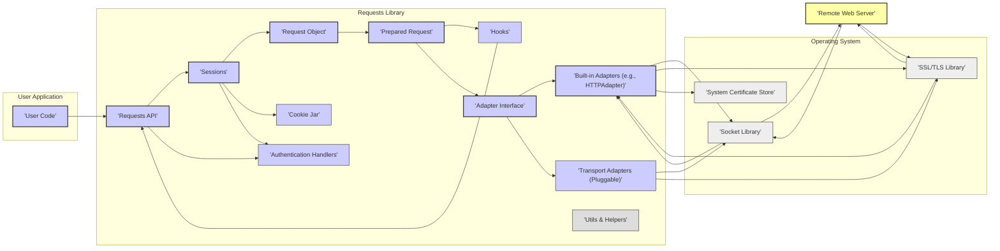

# Project Design Document: Requests Library

**Version:** 1.1
**Date:** October 26, 2023
**Author:** AI Software Architect

## 1. Introduction

This document provides an enhanced architectural design of the Python Requests library (https://github.com/psf/requests). This design serves as a foundation for subsequent threat modeling activities. It outlines the key components, data flow, and external interactions of the library in greater detail than the previous version.

## 2. Goals

*   Clearly define the architecture of the Requests library with sufficient detail for effective threat modeling.
*   Identify key components and their specific responsibilities within the request lifecycle.
*   Illustrate the flow of data within the library, highlighting transformations and potential interception points.
*   Highlight external dependencies and interaction points, emphasizing security implications.
*   Provide a robust foundation for identifying potential security vulnerabilities and planning mitigation strategies.

## 3. Non-Goals

*   Microscopic details of internal implementation within individual functions or methods.
*   Performance testing results or optimization techniques.
*   Comprehensive documentation of all possible usage scenarios or API parameters.
*   A complete mapping of all supported HTTP specifications.

## 4. Architectural Overview

The Requests library simplifies making HTTP requests in Python. It abstracts the underlying network complexities, offering a consistent and user-friendly API. The architecture is designed around the concept of sessions and adapters, providing flexibility and maintainability.

### 4.1. Architecture Diagram

### 4.2. Component Descriptions

*   **User Code:** The Python application that initiates HTTP requests using the Requests library. This is the actor driving the interaction.
*   **Requests API:** The public interface of the library, providing functions like `get()`, `post()`, `put()`, `delete()`, etc. It handles user input and delegates to lower-level components.
*   **Sessions:** Manages persistent parameters across multiple requests, including cookies, authentication, and connection pooling. This improves efficiency and simplifies stateful interactions.
*   **Request Object:** An internal representation of a user's intended HTTP request, containing the URL, headers, parameters, data, and other request details as initially provided by the user.
*   **Prepared Request:** A processed and structured version of the `Request Object`, ready to be sent over the network. This involves encoding data, adding default headers, and finalizing the request structure.
*   **Hooks:**  A mechanism for intercepting and modifying request and response processing at various stages. This allows for custom logic like logging, signing, or retrying requests.
*   **Adapter Interface:** Defines a contract for transport adapters, allowing different underlying mechanisms for sending HTTP requests. This promotes extensibility.
*   **Built-in Adapters (e.g., HTTPAdapter):** The default adapter using Python's `http.client` module. It handles standard HTTP and HTTPS communication, including connection management and protocol specifics.
*   **Transport Adapters (Pluggable):** Allows developers to implement custom adapters for specialized transport needs, such as using `urllib3` directly or integrating with other networking libraries.
*   **Utils & Helpers:**  A collection of utility functions for tasks such as URL parsing, header manipulation, encoding/decoding, and more.
*   **Authentication Handlers:** Components responsible for adding authentication information to requests, such as basic authentication, digest authentication, or custom authentication schemes.
*   **Cookie Jar:** Manages cookies for a session, storing and sending them with subsequent requests according to HTTP cookie specifications.
*   **Socket Library (Operating System):** Provides low-level access to network sockets, used by the adapters to establish connections and transmit data.
*   **SSL/TLS Library (Operating System):** Handles secure communication over HTTPS, providing encryption, authentication, and integrity checks. This often interfaces with the **System Certificate Store**.
*   **System Certificate Store (Operating System):** A repository of trusted root certificates used to verify the authenticity of remote servers during TLS/SSL handshakes.
*   **Remote Web Server:** The target server receiving the HTTP request and sending back a response.

## 5. Data Flow

The journey of an HTTP request using the Requests library involves several stages:

1. **Request Initiation:** The **User Code** calls a function in the **Requests API**, providing details like the URL, headers, and data.
2. **Session Handling:** The **Requests API** interacts with a **Session** object. If one doesn't exist, it's created. The session provides configuration and persistence.
3. **Request Object Creation:** A **Request Object** is created, encapsulating the user's input.
4. **Hook Processing (Pre-Request):** Registered **Hooks** are executed, potentially modifying the **Request Object**.
5. **Preparation:** The **Session** or the **Requests API** prepares the request, creating a **Prepared Request** object. This involves encoding data, adding default headers, and applying session-level settings.
6. **Adapter Selection:** The **Session** selects an appropriate **Adapter** based on the request's protocol (e.g., `HTTPAdapter` for HTTP/HTTPS). Pluggable **Transport Adapters** can be chosen based on URL prefixes.
7. **Authentication:**  **Authentication Handlers** within the **Session** (if configured) add authentication headers to the **Prepared Request**.
8. **Connection Establishment:** The selected **Adapter** uses the **Socket Library** to establish a network connection to the **Remote Web Server**. For HTTPS, it utilizes the **SSL/TLS Library**, verifying the server's certificate against the **System Certificate Store**.
9. **Data Transmission:** The **Prepared Request**'s data (headers and body) is serialized and sent over the established socket.
10. **Response Reception:** The **Socket Library** receives the response data from the **Remote Web Server**.
11. **Response Processing:** The **Adapter** processes the raw response data, parsing headers and the body.
12. **Cookie Handling:** The **Session**'s **Cookie Jar** updates based on the `Set-Cookie` headers in the response.
13. **Response Object Creation:** A `Response` object is created, containing the status code, headers, body, and other response details.
14. **Hook Processing (Post-Response):** Registered **Hooks** are executed, potentially modifying the `Response` object or performing actions based on the response.
15. **Response Return:** The `Response` object is returned to the **Requests API** and finally to the **User Code**.

## 6. External Interactions

The Requests library interacts with several external systems:

*   **Remote Web Servers:** This is the primary interaction. Requests sends HTTP requests and receives responses. This involves transmitting potentially sensitive data (credentials, personal information) and receiving potentially malicious content. Security considerations include validating server certificates, handling redirects securely, and mitigating injection vulnerabilities on the server-side.
*   **Operating System Network Stack (Socket Library):** Requests relies on the OS for low-level network operations. Vulnerabilities in the OS's networking implementation could affect Requests. This includes potential issues with socket handling, TCP/IP stack vulnerabilities, and DNS resolution.
*   **Operating System SSL/TLS Library:** For HTTPS, Requests depends on the OS's SSL/TLS library for secure communication. Vulnerabilities in this library (e.g., known TLS protocol weaknesses, implementation flaws) could compromise the confidentiality and integrity of HTTPS connections. Proper configuration and up-to-date libraries are crucial.
*   **System Certificate Store (Operating System):** Used to verify the authenticity of HTTPS servers. If the certificate store is compromised or misconfigured, it could lead to accepting fraudulent certificates and MITM attacks.
*   **DNS Servers:** Requests relies on DNS to resolve domain names to IP addresses. DNS spoofing or poisoning attacks could redirect requests to malicious servers. Secure DNS protocols (DNSSEC) can mitigate this risk, though Requests' direct involvement is limited.
*   **Proxy Servers (Optional):** If configured, Requests routes traffic through proxy servers. Security considerations include the trustworthiness of the proxy server, potential for eavesdropping or modification of traffic by the proxy, and proper handling of proxy authentication.
*   **Authentication Providers (Optional):** When using authentication mechanisms like OAuth, Requests interacts with external authentication providers. Security considerations include the security of the authentication flow, proper handling of tokens, and protection against token theft or replay attacks.
*   **Custom Transport Adapters (Optional):** If using custom adapters, the security of these adapters becomes a concern. Vulnerabilities in custom adapters could expose the application to various risks.

## 7. Security Considerations (Pre-Threat Modeling)

Building upon the previous version, here are more specific security considerations:

*   **Man-in-the-Middle (MITM) Attacks:** Remains a significant threat, especially for HTTP connections. Even with HTTPS, misconfigurations (disabled certificate verification, outdated SSL/TLS libraries) can leave applications vulnerable. Threat modeling should explore scenarios where attackers intercept and manipulate communication.
*   **Injection Attacks:**  If user-provided data is incorporated into request headers or the request body without proper sanitization, it can lead to **HTTP Header Injection**, allowing attackers to inject arbitrary headers. Similarly, unsanitized data in the request body can lead to vulnerabilities on the remote server (e.g., SQL injection if the request data is used in a database query on the server).
*   **Denial of Service (DoS):**  Applications using Requests could be vulnerable to DoS attacks by making a large number of requests, exhausting server resources. Additionally, manipulating connection parameters or sending oversized requests could also lead to DoS conditions on the target server or within the Requests library itself.
*   **Credential Exposure:** Improper handling or logging of authentication credentials (e.g., hardcoding credentials, logging sensitive headers) can lead to their exposure. Secure storage and transmission of credentials are paramount.
*   **Cookie Security:**  Vulnerabilities related to cookie handling include **Session Fixation**, where an attacker forces a user to use a known session ID, and exposure of cookies to **Cross-Site Scripting (XSS)** attacks if not handled with `HttpOnly` and `Secure` flags.
*   **TLS/SSL Vulnerabilities:** Using outdated TLS protocols or cipher suites makes connections vulnerable to known attacks. Threat modeling should consider scenarios where attackers downgrade connections or exploit protocol weaknesses.
*   **Dependency Vulnerabilities:** Security flaws in Requests' dependencies (e.g., `urllib3`) can indirectly affect applications using Requests. Regular updates and vulnerability scanning of dependencies are essential.
*   **Proxy Security:** Using untrusted proxies introduces risks of eavesdropping and traffic manipulation. Improperly configured proxies can also create security vulnerabilities.
*   **DNS Spoofing/Poisoning:** While Requests doesn't directly control DNS resolution, understanding the risk of DNS attacks is important. If DNS is compromised, requests could be directed to malicious servers, leading to phishing or malware delivery.
*   **SSRF (Server-Side Request Forgery):** If an application allows users to control the destination URL used by Requests, attackers can potentially make requests to internal resources or other unintended targets. Proper input validation and sanitization are crucial to prevent SSRF.
*   **Open Redirects:** If the application blindly follows redirects returned by the server, attackers could potentially redirect users to malicious sites. Careful handling and validation of redirect URLs are necessary.

## 8. Future Considerations

*   Develop more granular diagrams focusing on the internal workings of specific components like the `HTTPAdapter` and the `Session` object.
*   Create detailed sequence diagrams illustrating the interaction between components for specific request types and scenarios (e.g., a successful GET request, a failed POST request with authentication).
*   Analyze the security implications of different authentication methods supported by Requests in more detail.
*   Investigate the security aspects of custom transport adapters and how to ensure their secure implementation.
*   Document the error handling mechanisms within Requests and potential security vulnerabilities arising from error conditions.
*   Explore the integration of security scanning tools into the development and maintenance process of applications using Requests.

This enhanced design document provides a more detailed and nuanced understanding of the Requests library's architecture, offering a stronger foundation for thorough threat modeling. The added details in component descriptions, data flow, and security considerations aim to facilitate a more comprehensive identification of potential vulnerabilities and the development of effective security measures.
