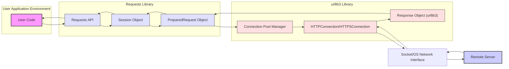

# Project Design Document: Requests Library

**Version:** 1.1
**Date:** October 26, 2023
**Author:** AI Software Architect

## 1. Introduction

This document provides an enhanced and detailed design overview of the Python Requests library, specifically tailored for threat modeling. It elaborates on the library's architecture, key components, data flow, and security considerations to facilitate a comprehensive security analysis.

## 2. Project Overview

The Requests library remains a cornerstone for making HTTP requests in Python. Its primary objective is to simplify HTTP interactions, offering a more intuitive and feature-rich alternative to Python's built-in `urllib`. This design document focuses on the internal workings relevant to security vulnerabilities and attack surfaces.

## 3. Architectural Design

The Requests library employs a layered architecture, prioritizing a user-friendly API while managing the complexities of HTTP communication through its underlying components.

### 3.1. High-Level Architecture Diagram (Mermaid)

### 3.2. Component Description

*   **User Code:** The Python script or application leveraging the Requests library to initiate HTTP requests. This is the entry point and potential source of vulnerabilities if not used correctly.
*   **Requests API:** The public-facing interface of the Requests library. It provides functions like `get()`, `post()`, etc., and handles user input validation and parameter processing before delegating to lower layers.
*   **Session Object:** Manages persistent session parameters (cookies, headers, authentication). It optimizes performance through connection pooling and provides a central point for configuring request defaults.
*   **PreparedRequest Object:** Represents a fully constructed HTTP request, ready for transmission. This includes the URL, headers, body, and method. It's a crucial stage for inspecting the final request structure before it's sent.
*   **Connection Pool Manager (urllib3):**  Manages a pool of HTTP(S) connections for reuse, reducing connection overhead. This component handles connection establishment, recycling, and potentially, connection timeouts.
*   **HTTPConnection/HTTPSConnection (urllib3):**  Handles the actual socket-level communication with the remote server. `HTTPSConnection` manages TLS/SSL negotiation and encryption.
*   **Response Object (urllib3):** Represents the raw HTTP response received from the server, including headers and body, before being processed by Requests.
*   **Socket/OS Network Interface:** The operating system's interface for sending and receiving network data. This is the boundary between the application and the network.
*   **Remote Server:** The target server processing the HTTP request and generating a response. This is the external entity and a potential source of malicious responses.

## 4. Data Flow

This section details the flow of data when making an HTTP request, highlighting security-relevant steps.

1. **Request Invocation:** User code calls a Requests API function (e.g., `requests.post('https://api.example.com/data', json={'key': 'value'})`).
2. **API Processing and Session Association:** The Requests API function receives the call and associates it with a `Session` object (either an existing one or a new default session).
3. **PreparedRequest Creation:** The `Session` object or the API function creates a `PreparedRequest` object. This involves:
    *   **URL Construction:** Combining the base URL with any provided parameters. *Potential vulnerability: Improper URL construction could lead to SSRF.*
    *   **Header Merging:** Combining default session headers, request-specific headers, and automatically added headers (e.g., `Content-Type`). *Potential vulnerability: Header injection if user-controlled data is not sanitized.*
    *   **Data Encoding:** Encoding the request body based on the provided data and headers. *Potential vulnerability: Incorrect encoding could lead to data corruption or interpretation issues on the server.*
    *   **Cookie Handling:** Attaching relevant cookies from the `Session`'s cookie jar. *Potential vulnerability: Exposure of sensitive cookies if not handled securely.*
    *   **Authentication Processing:** Applying any configured authentication mechanisms. *Potential vulnerability: Weak or insecure authentication methods.*
4. **Transmission via urllib3:** The `PreparedRequest` is passed to `urllib3`.
5. **Connection Acquisition:** `urllib3`'s `Connection Pool Manager` attempts to retrieve an existing connection from the pool. If none is available, a new connection is established.
6. **DNS Resolution (if needed):** If the hostname is not an IP address, `urllib3` performs DNS resolution. *Potential vulnerability: DNS spoofing if the resolver is compromised.*
7. **Socket Connection:** `urllib3` establishes a TCP connection to the remote server using the OS's socket interface.
8. **TLS Handshake (for HTTPS):** If the URL uses HTTPS, `urllib3` initiates a TLS handshake:
    *   **Client Hello:** The client sends its TLS version, supported cipher suites, and a random value.
    *   **Server Hello:** The server responds with its chosen TLS version, cipher suite, and a random value, along with its digital certificate.
    *   **Certificate Verification:** `urllib3` verifies the server's certificate against a trusted CA store. *Crucial security step: Failure to verify or use an outdated CA store can lead to MITM attacks.*
    *   **Key Exchange and Session Key Generation:**  The client and server exchange information to generate a shared secret key.
    *   **Encryption Established:**  All subsequent communication is encrypted using the negotiated cipher suite and session key.
9. **Request Sending:** The `PreparedRequest` (headers and body) is sent over the established socket connection.
10. **Response Reception:** The remote server sends back an HTTP response.
11. **Response Processing (urllib3):** `urllib3` receives the raw response data:
    *   **Header Parsing:** Parses the HTTP response headers.
    *   **Body Reading:** Reads the response body, handling chunked transfer encoding if necessary.
    *   **SSL/TLS Decryption (for HTTPS):** Decrypts the response data.
12. **Response Handling (Requests):** `urllib3`'s `Response Object` is wrapped by a Requests `Response` object. This involves:
    *   **Cookie Extraction:** Extracts and stores cookies from the `Set-Cookie` headers into the `Session`'s cookie jar. *Potential vulnerability: Insecure handling of `Set-Cookie` directives.*
    *   **Redirection Handling (if enabled):** If the response indicates a redirect, Requests can automatically follow it, creating a new request. *Potential vulnerability: Open redirects to malicious sites.*
13. **Response Return:** The Requests `Response` object is returned to the user's application code.

## 5. Security Considerations

This section expands on the security aspects of the Requests library, providing more specific examples of potential threats.

### 5.1. Key Security Areas and Potential Threats

*   **TLS/SSL Security:**
    *   **Vulnerability:** Insufficient certificate verification (e.g., disabling verification, using outdated CA certificates) allows MITM attacks, where attackers can eavesdrop on and modify communication.
    *   **Vulnerability:** Using weak or deprecated cipher suites makes the connection vulnerable to cryptographic attacks.
    *   **Vulnerability:** Failure to enforce HTTPS and allowing fallback to HTTP exposes sensitive data in transit.
*   **Authentication:**
    *   **Vulnerability:** Transmitting credentials over unencrypted connections (HTTP) exposes them to interception.
    *   **Vulnerability:** Using basic authentication without HTTPS is highly insecure.
    *   **Vulnerability:** Improper handling of authentication tokens (e.g., storing them insecurely) can lead to credential theft.
*   **Cookie Security:**
    *   **Vulnerability:** Missing `HttpOnly` flag allows client-side scripts to access cookies, increasing the risk of cross-site scripting (XSS) attacks leading to session hijacking.
    *   **Vulnerability:** Missing `Secure` flag allows cookies to be transmitted over unencrypted HTTP connections, making them vulnerable to interception.
    *   **Vulnerability:**  Long-lived or predictable session cookies increase the window of opportunity for attackers.
*   **Input Validation:**
    *   **Vulnerability:**  Using user-provided data directly in URLs without proper sanitization can lead to Server-Side Request Forgery (SSRF), allowing attackers to access internal resources.
    *   **Vulnerability:**  Injecting malicious characters into headers can lead to HTTP header injection attacks, potentially allowing control over the server's response.
*   **Redirection Handling:**
    *   **Vulnerability:** Automatically following redirects to untrusted or malicious sites can expose sensitive information or trick users into visiting phishing sites (open redirects).
*   **Proxy Support:**
    *   **Vulnerability:** Using untrusted or compromised proxy servers can expose traffic to interception or modification.
    *   **Vulnerability:** Incorrectly configured proxies might leak internal IP addresses or other sensitive information.
*   **Timeouts:**
    *   **Vulnerability:**  Not setting appropriate timeouts can lead to denial-of-service (DoS) on the client-side (resource exhaustion) or allow connections to hang indefinitely.
*   **Data Handling:**
    *   **Vulnerability:**  Improper handling of sensitive data in request bodies or responses (e.g., logging sensitive information) can lead to data leaks.
    *   **Vulnerability:**  Deserializing untrusted data received in responses can lead to remote code execution vulnerabilities if vulnerable deserialization libraries are used.

### 5.2. Security Best Practices for Users (Mitigation Strategies)

*   **Always use HTTPS:** Enforce secure connections to protect data in transit.
*   **Verify SSL Certificates:** Do not disable certificate verification in production environments.
*   **Use Strong Authentication Methods:** Prefer more secure authentication mechanisms over basic authentication.
*   **Handle Cookies Securely:** Understand and utilize cookie security flags (`HttpOnly`, `Secure`).
*   **Sanitize User Input:**  Carefully validate and sanitize any user-provided data used in URLs, headers, or request bodies to prevent injection attacks.
*   **Be Cautious with Redirects:**  Consider disabling automatic redirects or carefully validate the target of redirects.
*   **Use Trusted Proxies:** Only use proxy servers that are known to be secure.
*   **Set Appropriate Timeouts:** Configure timeouts to prevent resource exhaustion and hanging connections.
*   **Securely Handle Sensitive Data:** Avoid logging or storing sensitive information unnecessarily.
*   **Keep Requests and urllib3 Updated:** Regularly update the library to patch known security vulnerabilities.

## 6. Deployment

The Requests library is deployed as a dependency within Python applications. Its execution context is the Python interpreter of the application. No separate deployment is required for the library itself.

## 7. Technologies Used

*   **Programming Language:** Python
*   **Core HTTP Library:** `urllib3`
*   **Standard Library Modules:**  `ssl`, `socket`, `http.client`, `email.parser`, etc.
*   **Potentially External Libraries:**  `cryptography`, `idna`, `chardet`, and others for specific functionalities or extended features.

## 8. Key Interfaces

*   **Public API (requests module):** Functions like `get`, `post`, `Session`, `Response`, and related classes and exceptions.
*   **urllib3 API (internal):** The methods and classes within `urllib3` that Requests utilizes for low-level HTTP communication.
*   **Operating System Network Interface (socket API):** The system calls used for network operations.
*   **Remote HTTP Servers:** The external endpoints that Requests interacts with over the network.

## 9. Future Considerations (Beyond Initial Threat Model)

*   Integration with asynchronous frameworks (e.g., `asyncio`).
*   More advanced control over connection pooling and management.
*   Enhanced support for HTTP/2 and future HTTP versions.
*   Improved observability and debugging capabilities.

This improved design document provides a more detailed and security-focused overview of the Requests library, enhancing its utility for threat modeling activities. It highlights potential vulnerabilities and areas of concern for security analysis.