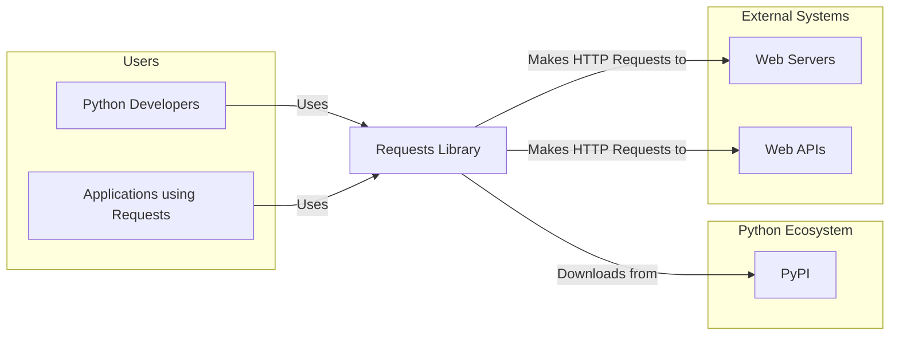
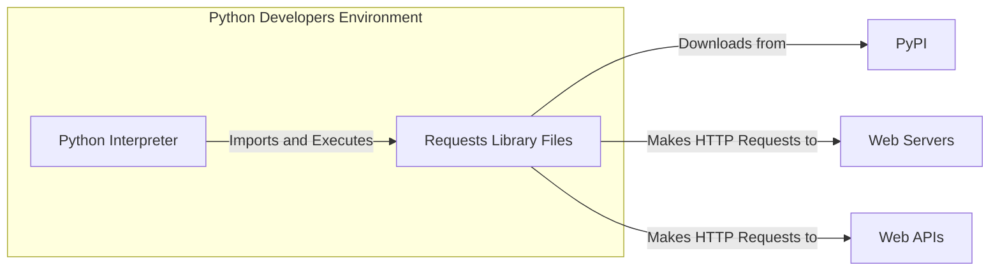
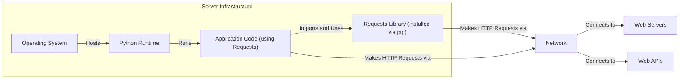
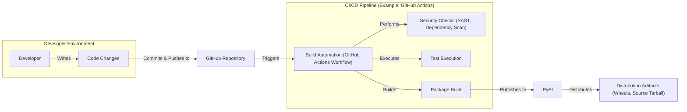

# BUSINESS POSTURE

- Business Priorities and Goals:
 - Provide a user-friendly and reliable Python library for making HTTP requests.
 - Enable Python developers to easily integrate with web services and APIs.
 - Maintain a widely adopted and trusted open-source project within the Python ecosystem.
 - Ensure the library is performant and efficient for various use cases.
 - Foster a community of contributors and users around the project.

- Business Risks:
 - Security vulnerabilities in the library could impact a vast number of downstream applications, leading to data breaches or service disruptions.
 - Reputational damage to the project and the Python Software Foundation if the library is perceived as unreliable or insecure.
 - Supply chain attacks targeting the library's dependencies or distribution channels could compromise users.
 - Lack of timely security updates and patches could leave users vulnerable to known exploits.
 - Compatibility issues with different Python versions or platforms could hinder adoption and create maintenance overhead.

# SECURITY POSTURE

- Existing Security Controls:
 - security control: Version control using Git and GitHub. Implemented in: GitHub repository.
 - security control: Public issue tracking on GitHub. Implemented in: GitHub repository issue tracker.
 - security control: Pull requests and code review process for contributions. Implemented in: GitHub contribution guidelines and GitHub workflow.
 - security control: Distribution via PyPI (Python Package Index). Implemented in: PyPI infrastructure.
 - accepted risk: Reliance on community contributions, which may introduce security vulnerabilities if not properly vetted.
 - accepted risk: Limited resources for dedicated security testing and audits due to open-source nature.
 - accepted risk: Potential vulnerabilities in dependencies that are not immediately addressed.

- Recommended Security Controls:
 - security control: Implement automated security scanning (SAST/DAST) in the CI/CD pipeline to detect potential vulnerabilities in code changes.
 - security control: Integrate dependency vulnerability scanning to identify and address known vulnerabilities in third-party libraries.
 - security control: Establish a clear security policy and vulnerability disclosure process to handle security issues effectively.
 - security control: Conduct periodic security audits and penetration testing to proactively identify and remediate security weaknesses.
 - security control: Implement code signing for releases to ensure integrity and authenticity of distributed packages.

- Security Requirements:
 - Authentication:
  - Requirement: The library should securely handle authentication credentials (e.g., API keys, tokens) provided by users, avoiding storage in logs or insecure locations.
  - Requirement: Support various authentication methods including but not limited to Basic Auth, Digest Auth, OAuth, and API Key authentication.
 - Authorization:
  - Requirement: While the library itself does not enforce authorization, it should provide mechanisms for applications to implement authorization checks based on server responses (e.g., checking HTTP status codes like 401, 403).
  - Requirement: The library should not automatically follow redirects to different domains without user awareness, to prevent potential authorization bypass issues.
 - Input Validation:
  - Requirement: The library must validate all user-provided inputs, such as URLs, headers, parameters, and data, to prevent injection attacks (e.g., URL injection, header injection).
  - Requirement: Sanitize or encode user inputs when constructing HTTP requests to mitigate injection risks.
 - Cryptography:
  - Requirement: Enforce HTTPS by default for all requests to protect data in transit.
  - Requirement: Properly handle TLS/SSL certificate validation to prevent man-in-the-middle attacks.
  - Requirement: Support secure renegotiation and other TLS best practices.
  - Requirement: Avoid implementing custom cryptography; rely on well-vetted and established cryptographic libraries provided by Python and the operating system.

# DESIGN

## C4 CONTEXT

- Context Diagram Elements:
 - - Name: Python Developers
   - Type: Person
   - Description: Software developers who use the Requests library to build Python applications.
   - Responsibilities: Utilize the Requests library to interact with web services and APIs in their Python projects.
   - Security controls: Responsible for using the library securely, handling sensitive data appropriately in their applications, and keeping their development environments secure.
 - - Name: Applications using Requests
   - Type: Software System
   - Description: Various Python applications (web applications, scripts, CLIs, etc.) that depend on the Requests library for HTTP communication.
   - Responsibilities: Leverage the Requests library to perform HTTP requests as part of their functionality.
   - Security controls: Application developers are responsible for securing their applications, including proper input validation, authorization, and handling of data received via Requests.
 - - Name: Requests Library
   - Type: Software System
   - Description: The Python Requests library, an HTTP client library for making HTTP requests in Python.
   - Responsibilities: Provide a user-friendly and reliable interface for making HTTP requests, handling various HTTP methods, headers, data, and responses.
   - Security controls: Implement security best practices within the library itself, such as input validation, secure handling of credentials, and proper TLS/SSL configuration.
 - - Name: PyPI
   - Type: Software System
   - Description: Python Package Index, the official repository for Python packages, used to distribute the Requests library.
   - Responsibilities: Host and distribute the Requests library packages to Python developers.
   - Security controls: PyPI implements security controls to protect the package repository and ensure the integrity of packages, including package signing and malware scanning.
 - - Name: Web Servers
   - Type: Software System
   - Description: Web servers that host websites and web applications, which Requests library interacts with.
   - Responsibilities: Serve web content and APIs, handle HTTP requests from clients including those made by Requests library.
   - Security controls: Web servers implement various security controls to protect themselves and the data they host, such as firewalls, intrusion detection systems, and access controls.
 - - Name: Web APIs
   - Type: Software System
   - Description: Application Programming Interfaces exposed over the web, which Requests library interacts with to retrieve or send data.
   - Responsibilities: Provide programmatic interfaces for accessing data and functionality, handle API requests from clients including those made by Requests library.
   - Security controls: APIs implement security controls such as authentication, authorization, rate limiting, and input validation to protect themselves and the data they expose.

## C4 CONTAINER

- Container Diagram Elements:
 - - Name: Python Interpreter
   - Type: Container - Runtime Environment
   - Description: The Python runtime environment where Python applications and the Requests library are executed.
   - Responsibilities: Execute Python code, including the Requests library, and manage system resources.
   - Security controls: Operating system level security controls, Python interpreter security features, and potentially containerization or sandboxing technologies in deployment environments.
 - - Name: Requests Library Files
   - Type: Container - Library
   - Description: The collection of Python files that constitute the Requests library.
   - Responsibilities: Implement the HTTP client functionality, handle request construction, response processing, and error handling.
   - Security controls: Security controls within the library code itself, such as input validation, secure coding practices, and dependency management.
 - - Name: PyPI
   - Type: External System
   - Description: Python Package Index, the repository for Python packages.
   - Responsibilities: Distribute and host the Requests library packages.
   - Security controls: PyPI security measures for package integrity and availability.
 - - Name: Web Servers
   - Type: External System
   - Description: Web servers that Requests library interacts with.
   - Responsibilities: Host web applications and serve content.
   - Security controls: Web server security configurations and infrastructure security.
 - - Name: Web APIs
   - Type: External System
   - Description: Web APIs that Requests library interacts with.
   - Responsibilities: Provide API endpoints and handle requests.
   - Security controls: API security measures including authentication, authorization, and rate limiting.

## DEPLOYMENT

- Deployment Options:
 - Developer Machine: Python developers install Requests library locally using `pip` for development and testing.
 - Server Environment: Requests library is deployed as a dependency of Python applications running on servers (e.g., web servers, application servers).
 - Cloud Environment: Requests library is used in Python applications deployed in cloud environments (e.g., AWS, Azure, GCP) as part of serverless functions, containers, or virtual machines.

- Detailed Deployment (Server Environment - typical scenario):

- Deployment Diagram Elements:
 - - Name: Operating System
   - Type: Infrastructure - Software
   - Description: The server operating system (e.g., Linux, Windows) hosting the Python runtime and application.
   - Responsibilities: Provide the base environment for running Python and applications.
   - Security controls: Operating system level security controls, such as user access management, firewalls, and security updates.
 - - Name: Python Runtime
   - Type: Infrastructure - Software
   - Description: The Python interpreter and associated libraries installed on the server.
   - Responsibilities: Execute Python code, including the application and Requests library.
   - Security controls: Python runtime security features and configurations, and potentially virtual environments for dependency isolation.
 - - Name: Requests Library (installed via pip)
   - Type: Container - Software Library
   - Description: The Requests library installed within the Python environment on the server, typically using `pip install requests`.
   - Responsibilities: Provide HTTP client functionality to the application running on the server.
   - Security controls: Package integrity checks during installation via `pip`, and reliance on the security of the PyPI repository.
 - - Name: Application Code (using Requests)
   - Type: Container - Application
   - Description: The Python application code that utilizes the Requests library to make HTTP requests.
   - Responsibilities: Implement application logic, including making HTTP requests using Requests library and processing responses.
   - Security controls: Application-level security controls, such as input validation, authorization, and secure data handling.
 - - Name: Network
   - Type: Infrastructure - Network
   - Description: The network infrastructure connecting the server to external systems.
   - Responsibilities: Provide network connectivity for HTTP communication.
   - Security controls: Network security controls, such as firewalls, intrusion detection systems, and network segmentation.
 - - Name: Web Servers
   - Type: External System
   - Description: External web servers that the application communicates with via HTTP requests made by Requests library.
   - Responsibilities: Serve web content and APIs.
   - Security controls: Web server security configurations and infrastructure security.
 - - Name: Web APIs
   - Type: External System
   - Description: External web APIs that the application communicates with via HTTP requests made by Requests library.
   - Responsibilities: Provide API endpoints and handle requests.
   - Security controls: API security measures including authentication, authorization, and rate limiting.

## BUILD

- Build Diagram Elements:
 - - Name: Developer
   - Type: Person
   - Description: Software developer contributing to the Requests library.
   - Responsibilities: Write code, fix bugs, implement features, and contribute to the project.
   - Security controls: Secure development practices, code review participation, and adherence to contribution guidelines.
 - - Name: Code Changes
   - Type: Software - Code
   - Description: Modifications to the Requests library codebase.
   - Responsibilities: Implement new functionality, fix bugs, and improve code quality.
   - Security controls: Code review process to identify potential security vulnerabilities before merging changes.
 - - Name: GitHub Repository
   - Type: Platform - Version Control
   - Description: GitHub repository hosting the Requests library source code.
   - Responsibilities: Version control, collaboration platform, issue tracking, and hosting CI/CD workflows.
   - Security controls: GitHub's security features, access controls, and audit logs.
 - - Name: Build Automation (GitHub Actions Workflow)
   - Type: Tool - CI/CD
   - Description: Automated build pipeline using GitHub Actions (example CI/CD system).
   - Responsibilities: Automate build, test, security checks, and package publishing processes.
   - Security controls: Secure configuration of CI/CD pipelines, secrets management, and access control to workflow definitions.
 - - Name: Security Checks (SAST, Dependency Scan)
   - Type: Tool - Security Scanning
   - Description: Automated security scanning tools integrated into the CI/CD pipeline, including Static Application Security Testing (SAST) and dependency vulnerability scanning.
   - Responsibilities: Identify potential security vulnerabilities in the code and dependencies.
   - Security controls: Configuration and maintenance of security scanning tools, and remediation of identified vulnerabilities.
 - - Name: Test Execution
   - Type: Process - Testing
   - Description: Automated execution of unit tests and integration tests to ensure code quality and functionality.
   - Responsibilities: Verify the correctness and stability of code changes.
   - Security controls: Well-designed test suite to cover security-relevant aspects of the library.
 - - Name: Package Build
   - Type: Process - Packaging
   - Description: Process of creating distribution packages (wheels, source tarball) of the Requests library.
   - Responsibilities: Package the library for distribution on PyPI.
   - Security controls: Ensuring build process integrity, using trusted build environments, and potentially code signing of packages.
 - - Name: PyPI
   - Type: Platform - Package Registry
   - Description: Python Package Index, the official repository for Python packages.
   - Responsibilities: Host and distribute Requests library packages.
   - Security controls: PyPI's security measures for package integrity, malware scanning, and account security.
 - - Name: Distribution Artifacts (Wheels, Source Tarball)
   - Type: Software - Packages
   - Description: The packaged versions of the Requests library distributed via PyPI.
   - Responsibilities: Provide installable packages for Python developers.
   - Security controls: Package signing (if implemented), and PyPI's distribution security.

# RISK ASSESSMENT

- Critical Business Processes:
 - Enabling reliable and secure HTTP communication for Python applications across various domains.
 - Facilitating integration of Python applications with web services and APIs.
 - Maintaining the trust and reputation of the Requests library as a fundamental component of the Python ecosystem.

- Data to Protect and Sensitivity:
 - The Requests library itself does not store or process sensitive data directly. However, it is used by applications that may handle highly sensitive data.
 - Data sensitivity depends entirely on the applications using the Requests library. This could include:
  - Authentication credentials (API keys, passwords, tokens) used in requests. Sensitivity: High.
  - User data transmitted in requests and responses (personal information, financial data, etc.). Sensitivity: Varies, potentially High.
  - Application logic and configuration that could be exposed through vulnerabilities in the library. Sensitivity: Medium to High.
 - The integrity and availability of the Requests library itself are also critical, as its compromise could impact a vast number of applications. Sensitivity: High (for integrity and availability of the library).

# QUESTIONS & ASSUMPTIONS

- Questions:
 - What is the formal security policy for the Requests project? Is there a public security policy document?
 - Is there a dedicated security team or point of contact for security vulnerabilities?
 - What is the process for reporting and handling security vulnerabilities? Is there a vulnerability disclosure policy?
 - Are there regular security audits or penetration testing performed on the Requests library?
 - Are automated security scanning tools (SAST/DAST, dependency scanning) integrated into the CI/CD pipeline? If so, which tools are used?
 - Is code signing used for releases to ensure package integrity and authenticity?
 - What is the process for managing and updating dependencies, especially in response to security vulnerabilities?

- Assumptions:
 - The Requests project follows standard open-source development practices, including code review and public issue tracking.
 - The project relies on the security of the GitHub and PyPI platforms for version control and distribution.
 - Security testing is primarily performed through community contributions and may not be as comprehensive as in commercial software projects.
 - The project aims to address security vulnerabilities reported by the community in a timely manner, but resources may be limited.
 - HTTPS is the default and recommended protocol for making requests using the library.