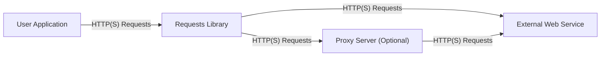
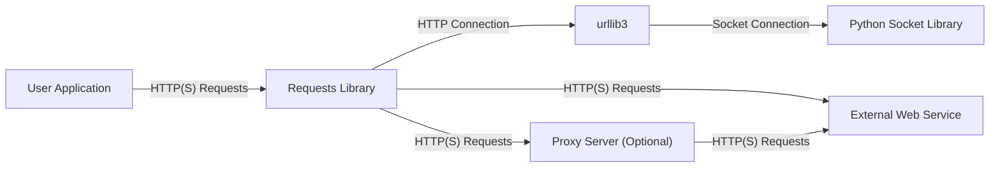
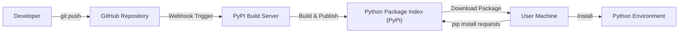
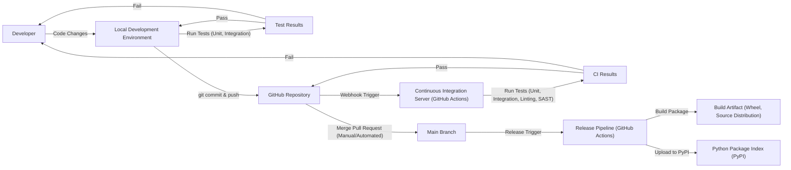

# Project Design Document: Requests Library

## BUSINESS POSTURE

Priorities and Goals:

The primary goal of the Requests library is to provide a simple, intuitive, and reliable way for Python developers to interact with HTTP services. It aims to abstract away the complexities of making HTTP requests, handling sessions, authentication, and response parsing, allowing developers to focus on the logic of their applications. The library prioritizes ease of use, correctness, and broad compatibility across different Python versions and platforms.

Business Risks:

*   Data Breaches: As a library handling HTTP requests, incorrect or insecure usage could expose sensitive data transmitted over the network, leading to data breaches.
*   Service Disruptions: Vulnerabilities in the library or its dependencies could be exploited to cause denial-of-service attacks, disrupting applications that rely on Requests.
*   Reputation Damage: Security vulnerabilities or reliability issues in a widely used library like Requests could significantly damage the reputation of the project and its maintainers.
*   Supply Chain Attacks: Compromise of the development or distribution infrastructure could lead to malicious code being injected into the library, affecting a large number of users.
*   Compliance Violations: Improper handling of sensitive data, such as cookies or authentication tokens, could lead to violations of privacy regulations like GDPR or CCPA.

## SECURITY POSTURE

Existing Security Controls:

*   security control: Secure Development Practices: The project follows secure coding practices, including input validation, output encoding, and regular security reviews. (Described in contribution guidelines and project documentation).
*   security control: Dependency Management: The project carefully manages its dependencies to minimize the risk of supply chain attacks. (Described in `pyproject.toml` and `requirements.txt`).
*   security control: Vulnerability Disclosure Policy: The project has a clear vulnerability disclosure policy, encouraging responsible reporting of security issues. (Described in `SECURITY.md`).
*   security control: Testing: The project has an extensive test suite, including unit and integration tests, to ensure the correctness and security of the code. (Located in the `tests/` directory).
*   security control: HTTPS by Default: Requests encourages the use of HTTPS by providing convenient ways to verify SSL certificates. (Described in the documentation).
*   security control: Session Management: Requests provides a `Session` object for managing cookies, authentication, and other persistent settings across multiple requests. (Described in the documentation).
*   security control: Authentication Helpers: Requests includes built-in support for common authentication schemes like Basic, Digest, and OAuth. (Described in the documentation).

Accepted Risks:

*   accepted risk: Third-Party Dependencies: While the project carefully manages its dependencies, it still relies on external libraries, which could introduce vulnerabilities.
*   accepted risk: User Misconfiguration: The library provides secure defaults, but users can override these settings, potentially introducing security risks.
*   accepted risk: Platform-Specific Issues: The library's behavior may vary slightly across different operating systems and Python versions, potentially leading to unexpected security issues.

Recommended Security Controls:

*   security control: Content Security Policy (CSP) Support: Consider adding support for CSP headers to mitigate the risk of cross-site scripting (XSS) attacks.
*   security control: Subresource Integrity (SRI) Support: If loading external resources, consider adding support for SRI to ensure their integrity.
*   security control: Enhanced Fuzzing: Implement more comprehensive fuzzing to identify potential vulnerabilities in parsing and handling HTTP requests and responses.

Security Requirements:

*   Authentication:
    *   Support for various authentication mechanisms (Basic, Digest, OAuth 1.0a, OAuth 2.0, custom authentication).
    *   Secure storage and handling of credentials.
    *   Protection against credential stuffing and brute-force attacks.
*   Authorization:
    *   No specific authorization requirements at the library level, as authorization is typically handled by the server.
*   Input Validation:
    *   Validate all user-provided input, including URLs, headers, and request bodies.
    *   Sanitize input to prevent injection attacks.
    *   Handle different character encodings correctly.
*   Cryptography:
    *   Use secure TLS/SSL protocols for HTTPS connections.
    *   Verify server certificates by default.
    *   Provide options for customizing certificate verification.
    *   Use strong cryptographic algorithms and key lengths.

## DESIGN

### C4 CONTEXT

Element Descriptions:

*   Element:
    *   Name: User Application
    *   Type: Software System
    *   Description: A Python application that uses the Requests library to make HTTP requests.
    *   Responsibilities: Initiates HTTP requests, processes responses, handles application-specific logic.
    *   Security controls: Implements application-level security controls, such as input validation and output encoding.
*   Element:
    *   Name: Requests Library
    *   Type: Library
    *   Description: The Requests library itself.
    *   Responsibilities: Provides a high-level API for making HTTP requests, handles connection pooling, session management, authentication, and response parsing.
    *   Security controls: Implements security controls related to HTTP communication, such as TLS/SSL verification, secure header handling, and secure cookie management.
*   Element:
    *   Name: External Web Service
    *   Type: External System
    *   Description: A web service that the User Application interacts with using the Requests library.
    *   Responsibilities: Processes HTTP requests, returns responses, enforces its own security policies.
    *   Security controls: Implements server-side security controls, such as authentication, authorization, and input validation.
*   Element:
    *   Name: Proxy Server (Optional)
    *   Type: External System
    *   Description: An optional proxy server that the Requests library can be configured to use.
    *   Responsibilities: Forwards HTTP requests to the External Web Service, potentially modifying headers or performing other actions.
    *   Security controls: Implements proxy-specific security controls, such as access control and traffic filtering.

### C4 CONTAINER

Element Descriptions:

*   Element:
    *   Name: User Application
    *   Type: Software System
    *   Description: A Python application that uses the Requests library to make HTTP requests.
    *   Responsibilities: Initiates HTTP requests, processes responses, handles application-specific logic.
    *   Security controls: Implements application-level security controls, such as input validation and output encoding.
*   Element:
    *   Name: Requests Library
    *   Type: Library
    *   Description: The Requests library itself.
    *   Responsibilities: Provides a high-level API for making HTTP requests, handles connection pooling (via urllib3), session management, authentication, and response parsing.
    *   Security controls: Implements security controls related to HTTP communication, such as TLS/SSL verification (via urllib3), secure header handling, and secure cookie management.
*   Element:
    *   Name: urllib3
    *   Type: Library
    *   Description: A powerful HTTP client library for Python.
    *   Responsibilities: Handles connection pooling, TLS/SSL verification, and low-level HTTP communication.
    *   Security controls: Implements TLS/SSL verification, secure header handling.
*   Element:
    *   Name: Python Socket Library
    *   Type: Library
    *   Description: The built-in Python socket library.
    *   Responsibilities: Provides low-level network communication functionality.
    *   Security controls: Relies on the operating system's security controls for network communication.
*   Element:
    *   Name: External Web Service
    *   Type: External System
    *   Description: A web service that the User Application interacts with using the Requests library.
    *   Responsibilities: Processes HTTP requests, returns responses, enforces its own security policies.
    *   Security controls: Implements server-side security controls, such as authentication, authorization, and input validation.
*   Element:
    *   Name: Proxy Server (Optional)
    *   Type: External System
    *   Description: An optional proxy server that the Requests library can be configured to use.
    *   Responsibilities: Forwards HTTP requests to the External Web Service, potentially modifying headers or performing other actions.
    *   Security controls: Implements proxy-specific security controls, such as access control and traffic filtering.

### DEPLOYMENT

Deployment Solutions:

1.  Installation via pip (most common): `pip install requests`
2.  Installation from source: Cloning the GitHub repository and installing using `python setup.py install`.
3.  Bundling with application: Including the Requests library directly within the application's codebase.
4.  Using a package manager specific to a Linux distribution (e.g., apt, yum).

Chosen Solution (pip):

Element Descriptions:

*   Element:
    *   Name: Developer
    *   Type: Person
    *   Description: A developer contributing to the Requests library.
    *   Responsibilities: Writes code, submits pull requests, reviews code.
    *   Security controls: Follows secure coding practices, uses strong authentication for GitHub access.
*   Element:
    *   Name: GitHub Repository
    *   Type: Source Code Repository
    *   Description: The official Requests repository on GitHub.
    *   Responsibilities: Stores the source code, manages issues and pull requests, hosts releases.
    *   Security controls: Enforces access controls, requires authentication for write access, provides audit logs.
*   Element:
    *   Name: PyPI Build Server
    *   Type: Server
    *   Description: A server that builds the Requests package for distribution on PyPI.
    *   Responsibilities: Builds the package from source, runs tests, creates distribution files.
    *   Security controls: Runs in a secure environment, uses signed packages, verifies code integrity.
*   Element:
    *   Name: Python Package Index (PyPI)
    *   Type: Package Repository
    *   Description: The official Python package repository.
    *   Responsibilities: Stores and distributes Python packages.
    *   Security controls: Provides HTTPS access, uses package signing, offers security features like two-factor authentication for maintainers.
*   Element:
    *   Name: User Machine
    *   Type: Machine
    *   Description: The machine where the user is installing the Requests library.
    *   Responsibilities: Runs the pip command, downloads the package, installs it into the Python environment.
    *   Security controls: Relies on the operating system's security controls and the security of the network connection.
*   Element:
    *   Name: Python Environment
    *   Type: Environment
    *   Description: The Python environment where the Requests library is installed.
    *   Responsibilities: Provides the runtime environment for Python applications.
    *   Security controls: Relies on the security of the Python installation and any configured virtual environment.

### BUILD

Security Controls in Build Process:

*   Local Development Environment:
    *   Developers use secure coding practices and tools.
    *   Local testing (unit and integration) helps identify vulnerabilities early.
*   GitHub Repository:
    *   Access control and authentication protect the codebase.
    *   Branch protection rules enforce code review and prevent direct pushes to the main branch.
*   Continuous Integration (GitHub Actions):
    *   Automated testing (unit, integration, linting) ensures code quality and security.
    *   SAST (Static Application Security Testing) tools scan the code for potential vulnerabilities. Examples include:
        *   Bandit: A security linter for Python.
        *   CodeQL: A semantic code analysis engine.
*   Release Pipeline (GitHub Actions):
    *   Automated build process creates consistent and reproducible builds.
    *   Build artifacts (wheels and source distributions) are signed to ensure integrity.
    *   Automated upload to PyPI with secure credentials.
*   Supply Chain Security:
    *   Dependencies are carefully managed and pinned to specific versions.
    *   Tools like `pip-audit` can be used to scan dependencies for known vulnerabilities.
    *   Regular updates to dependencies address security issues.

## RISK ASSESSMENT

Critical Business Processes:

*   Making HTTP requests reliably and securely.
*   Handling sensitive data (e.g., authentication tokens, API keys) securely.
*   Maintaining the integrity and availability of applications that rely on the Requests library.

Data Sensitivity:

*   Data transmitted using the Requests library can range from non-sensitive public data to highly sensitive personal or financial information. The sensitivity depends entirely on the application using the library.
*   Authentication tokens, API keys, and cookies handled by the Requests library are highly sensitive and must be protected.
*   Request and response headers may contain sensitive information, such as user-agent strings, IP addresses, and session identifiers.

## QUESTIONS & ASSUMPTIONS

Questions:

*   Are there any specific compliance requirements (e.g., GDPR, CCPA, HIPAA) that the applications using Requests must adhere to?
*   What are the specific threat models for the applications using Requests?
*   What level of logging and auditing is required for the usage of the Requests library?
*   Are there any specific performance requirements for the Requests library?

Assumptions:

*   BUSINESS POSTURE: The Requests library is used in a wide range of applications, with varying security requirements.
*   BUSINESS POSTURE: Users of the Requests library are responsible for implementing appropriate security controls in their own applications.
*   SECURITY POSTURE: The underlying operating system and network infrastructure are secure.
*   SECURITY POSTURE: Developers contributing to the Requests library follow secure coding practices.
*   DESIGN: The primary deployment method is via pip.
*   DESIGN: The build process is automated using GitHub Actions.
*   DESIGN: Users will configure Requests to use HTTPS for secure communication.