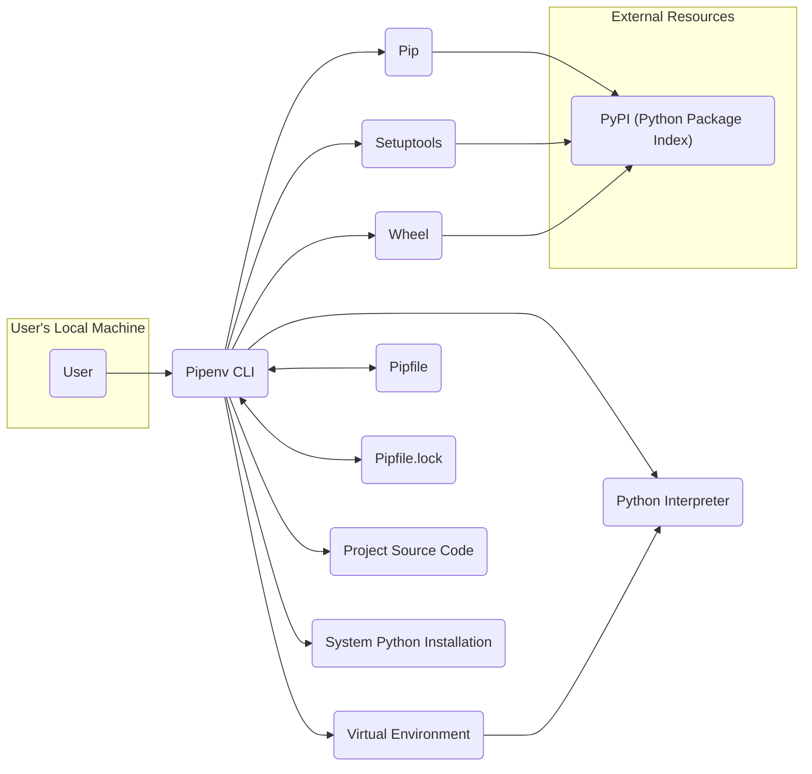
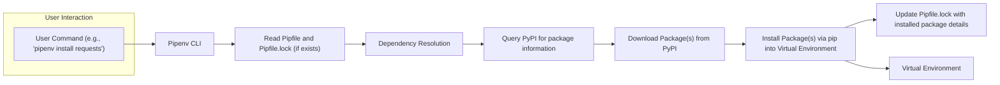

## Project Design Document: Pipenv

**1. Introduction**

This document provides a detailed architectural design of Pipenv, a tool for managing dependencies and virtual environments for Python projects. This document serves as a foundation for subsequent threat modeling activities. It outlines the key components, data flows, and interactions within the Pipenv ecosystem, offering a comprehensive understanding of its inner workings.

**2. Goals and Objectives**

The primary goals of Pipenv are to:

*   Simplify dependency management for Python projects by providing a higher-level interface compared to `pip` alone.
*   Ensure reproducible builds by utilizing a deterministic lock file (`Pipfile.lock`) that pins exact dependency versions.
*   Provide a user-friendly and intuitive command-line interface for common virtual environment and dependency management tasks.
*   Promote best practices for Python project setup and dependency isolation, reducing the risk of conflicts and environment inconsistencies.

**3. System Architecture**

### 3.1. High-Level Architecture



**Description:**

*   **User:** Interacts with Pipenv through the command-line interface (CLI) to manage project dependencies and environments.
*   **Pipenv CLI:** The central executable, acting as the orchestrator for all Pipenv operations. It interprets user commands and manages the underlying tools and configurations.
*   **Virtual Environment:** An isolated directory containing a dedicated Python installation and its associated packages, ensuring project dependencies don't interfere with other projects or the system Python.
*   **Python Interpreter:** The specific Python version executable within the virtual environment, used to run project code and installed packages.
*   **Pip:** The standard Python package installer, directly utilized by Pipenv for installing, uninstalling, and managing packages within the virtual environment.
*   **Setuptools:** A library that provides mechanisms for packaging Python projects, used internally by `pip` and Pipenv during the installation process.
*   **Wheel:** A pre-built package format that simplifies and speeds up the installation process compared to building from source distributions.
*   **Pipfile:** A TOML file residing in the project root, declaring the project's direct dependencies and their version constraints.
*   **Pipfile.lock:** A JSON file, also in the project root, containing the exact versions and cryptographic hashes of all direct and transitive dependencies, ensuring reproducible builds.
*   **Project Source Code:** The actual Python code and other files that constitute the project being managed by Pipenv.
*   **System Python Installation:** The default Python installation present on the user's operating system, which Pipenv may use as a base for creating virtual environments.
*   **PyPI (Python Package Index):** The primary public repository where Python packages are hosted and from which Pipenv downloads packages.

### 3.2. Detailed Component Description

*   **CLI Interface (`pipenv` executable):**
    *   **Responsibility:** Parses user commands (e.g., `install`, `uninstall`, `lock`, `run`) and their arguments, acting as the entry point for user interaction.
    *   **Functionality:**  Validates user input, orchestrates calls to other internal Pipenv modules and external tools like `pip`, and presents output and error messages to the user.
    *   **Configuration:** Reads configuration from environment variables and potentially a user-specific Pipenv configuration file.
*   **Virtual Environment Management:**
    *   **Responsibility:** Creates, activates, and manages isolated Python environments for each project.
    *   **Functionality:**  Utilizes underlying tools like `virtualenv` or the built-in `venv` module to create isolated environments. Tracks the location of the virtual environment (typically `.venv` in the project directory or a centralized location). Provides commands to activate and deactivate these environments.
*   **Dependency Resolution:**
    *   **Responsibility:** Determines the correct versions of all direct and transitive dependencies required by the project based on the `Pipfile`.
    *   **Functionality:** Reads and parses the `Pipfile`, interpreting version specifiers. Interacts with package indexes (primarily PyPI) to retrieve metadata about available package versions and their dependencies. Employs a resolver algorithm (often a backtracking algorithm) to find a consistent set of compatible package versions.
*   **Lock File Management:**
    *   **Responsibility:** Generates and updates the `Pipfile.lock` file to capture the exact versions and integrity hashes of all resolved dependencies.
    *   **Functionality:** After successful dependency resolution, writes the resolved dependency graph, including package names, versions, and cryptographic hashes (SHA256) to the `Pipfile.lock` file. Reads the `Pipfile.lock` during installation to ensure reproducible builds by installing the exact specified versions.
*   **Package Installation/Uninstallation:**
    *   **Responsibility:** Installs and uninstalls Python packages within the active virtual environment.
    *   **Functionality:** Delegates the actual installation and uninstallation process to `pip`. Pipenv constructs the appropriate `pip install` or `pip uninstall` commands based on user input and the `Pipfile` or `Pipfile.lock` contents. Handles different package formats (wheels, source distributions). Verifies downloaded package integrity against the hashes stored in `Pipfile.lock`.
*   **Configuration Management:**
    *   **Responsibility:** Manages Pipenv's own configuration settings and project-specific configurations.
    *   **Functionality:** Reads configuration values from environment variables (e.g., `PIPENV_PYPI_MIRROR`, `PIPENV_VIRTUALENV`), command-line flags, and potentially configuration files. Affects how Pipenv interacts with PyPI and manages virtual environments.
*   **Hashing and Integrity Checks:**
    *   **Responsibility:** Ensures the integrity of downloaded packages to prevent tampering or corruption.
    *   **Functionality:**  Calculates the SHA256 hash of downloaded package files. Compares these calculated hashes against the expected hashes stored in the `Pipfile.lock`. If the hashes don't match, the installation process is halted to prevent the use of potentially compromised packages.
*   **Integration with `pip`:**
    *   **Responsibility:**  Leverages the functionality of the underlying `pip` tool for core package management tasks.
    *   **Functionality:**  Pipenv does not reimplement package installation logic but instead orchestrates calls to `pip` with appropriate arguments. This ensures compatibility with `pip`'s features and updates.

**4. Data Flow**



**Description of Data Flow for `pipenv install <package>`:**

1. **User Command:** The user initiates the installation process by executing a Pipenv command, such as `'pipenv install requests'`.
2. **Pipenv CLI:** The Pipenv CLI receives and parses the command, identifying the user's intent to install a new package.
3. **Read Pipfile and Pipfile.lock (if exists):** Pipenv reads the `Pipfile` to understand the project's existing dependencies and version constraints. If a `Pipfile.lock` exists, it's also read to potentially inform the resolution process or for comparison.
4. **Dependency Resolution:** Pipenv's dependency resolver analyzes the requested package and its dependencies, considering the constraints specified in the `Pipfile` and the contents of the `Pipfile.lock` (if present).
5. **Query PyPI for package information:** Pipenv queries the PyPI API to retrieve metadata about the requested package and its dependencies, including available versions, dependencies, and checksums.
6. **Download Package(s) from PyPI:** Once the appropriate package versions are determined, Pipenv downloads the corresponding package files (typically wheel files) from PyPI.
7. **Install Package(s) via pip into Virtual Environment:** Pipenv utilizes `pip` to install the downloaded packages into the active virtual environment.
8. **Update Pipfile.lock with installed package details:** After successful installation, Pipenv updates the `Pipfile.lock` file to include the newly installed package and its exact version and cryptographic hash, ensuring future installations are consistent.

**Data Flow for `pipenv lock`:**

1. **User Command:** The user executes the `'pipenv lock'` command to generate or update the lock file.
2. **Pipenv CLI:** The Pipenv CLI receives the command.
3. **Read Pipfile:** Pipenv reads the `Pipfile` to obtain the current project dependencies and their version constraints.
4. **Dependency Resolution:** Pipenv resolves all direct and transitive dependencies based on the specifications in the `Pipfile`, potentially querying PyPI for the latest available versions that satisfy the constraints.
5. **Query PyPI for package information:** Pipenv queries PyPI to gather detailed information about the resolved dependencies, including their current versions and cryptographic hashes.
6. **Generate Pipfile.lock:** Pipenv generates or updates the `Pipfile.lock` file, recording the exact versions and SHA256 hashes of all resolved dependencies. This file represents the frozen state of the project's dependencies.

**5. Security Considerations**

*   **Dependency Vulnerabilities:** Pipenv relies on external packages from PyPI, which may contain security vulnerabilities. Regular dependency updates and the use of vulnerability scanning tools are crucial.
    *   **Mitigation:** Pipenv's lock file helps ensure that all developers use the same versions of dependencies, making it easier to identify and address vulnerabilities. Tools like `safety` can be integrated to scan the `Pipfile.lock` for known vulnerabilities.
*   **Supply Chain Attacks:** Malicious actors could potentially upload compromised packages to PyPI.
    *   **Mitigation:** Pipenv stores cryptographic hashes of packages in the `Pipfile.lock`. During installation, it verifies the downloaded package against this hash, mitigating the risk of installing tampered packages.
*   **Secrets Management:** Storing sensitive information (API keys, passwords) directly in `Pipfile` or `Pipfile.lock` is a security risk.
    *   **Mitigation:** Encourage the use of environment variables or dedicated secrets management solutions (e.g., HashiCorp Vault, AWS Secrets Manager) instead of hardcoding secrets in configuration files.
*   **Virtual Environment Isolation Bypass:**  If the virtual environment is not properly activated or if commands are executed outside the environment, the project might use system-level packages, potentially leading to conflicts or security issues.
    *   **Mitigation:** Emphasize the importance of activating the virtual environment before running project-related commands. Pipenv provides mechanisms to automatically activate the environment.
*   **Code Injection Risks with `pipenv run`:** The `pipenv run` command executes arbitrary commands within the virtual environment. If user input is incorporated into these commands without proper sanitization, it could lead to code injection vulnerabilities.
    *   **Mitigation:**  Advise caution when using `pipenv run` with untrusted input. Ensure proper sanitization and validation of any user-provided data used in executed commands.
*   **Permissions and Access Control:** Inadequate file system permissions on `Pipfile`, `Pipfile.lock`, and the virtual environment directory could allow unauthorized modification of dependencies or project settings.
    *   **Mitigation:** Recommend setting appropriate file system permissions to restrict access to these critical files.
*   **Man-in-the-Middle Attacks on PyPI:** If connections to PyPI are not secured (HTTPS), attackers could intercept and potentially modify downloaded packages.
    *   **Mitigation:** Pipenv defaults to using HTTPS for PyPI connections. Encourage users to maintain this default configuration.
*   **Configuration Vulnerabilities:** Misconfigured Pipenv settings or environment variables could expose sensitive information or weaken security measures.
    *   **Mitigation:**  Provide clear documentation on secure configuration practices for Pipenv.
*   **Denial of Service (DoS) through Dependency Resolution:**  A maliciously crafted `Pipfile` with overly complex or conflicting dependency requirements could cause the dependency resolver to consume excessive resources, leading to a denial of service.
    *   **Mitigation:** Implement safeguards or timeouts within the dependency resolution process to prevent unbounded resource consumption.

**6. External Dependencies**

*   **Python Interpreter:** A specific version of the Python interpreter is required to run Pipenv and the Python projects it manages.
*   **`pip`:** The standard Python package installer, which Pipenv relies on for installing and managing packages.
*   **`setuptools`:** A library used for building and distributing Python packages, essential for the underlying package installation process.
*   **`wheel`:** A built-package format that facilitates faster and more reliable package installations.
*   **`virtualenv` or `venv`:** Tools used for creating isolated Python environments. Pipenv typically defaults to using `virtualenv` if available.
*   **`requests`:** A widely used Python library for making HTTP requests, used by Pipenv to interact with PyPI.
*   **`toml` library:** A library for parsing TOML files, used to read and interpret the `Pipfile`.
*   **`json` library:** A library for working with JSON data, used to read and write the `Pipfile.lock`.
*   **Package Indexes (primarily PyPI):** The primary source from which Pipenv downloads Python packages and their metadata.

**7. Deployment**

Pipenv is typically installed using `pip`:

```bash
pip install --user pipenv
```

This command installs Pipenv into the user's Python environment. Alternatively, it can be installed system-wide depending on user preferences and system configuration. After installation, the `pipenv` command becomes available in the user's terminal.

**8. Future Considerations (Out of scope for immediate threat modeling but relevant for long-term design)**

*   **Enhanced Dependency Resolution:** Exploring more advanced and efficient dependency resolution algorithms to handle complex dependency graphs more effectively.
*   **Integration with other Packaging Tools:**  Potentially integrating with other emerging Python packaging standards or tools.
*   **Built-in Vulnerability Scanning:** Incorporating integrated vulnerability scanning capabilities directly into Pipenv to proactively identify and alert users about vulnerable dependencies.
*   **Improved User Interface/Experience:**  Exploring ways to further enhance the user interface and experience, potentially through more informative error messages or improved command-line options.
*   **Support for Alternative Package Sources:**  Expanding support for private package repositories or alternative package indexes beyond PyPI.

This document provides a comprehensive and detailed architectural design of Pipenv, serving as a valuable resource for threat modeling and security analysis. The outlined components, data flows, and security considerations offer a solid foundation for identifying potential vulnerabilities and developing appropriate mitigation strategies.