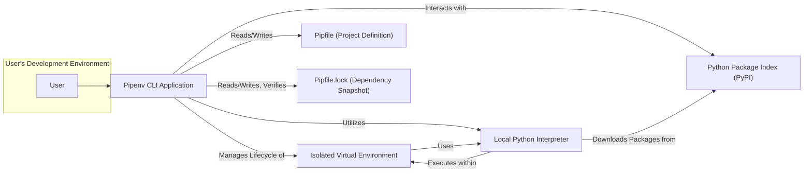
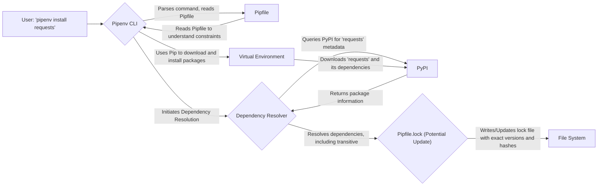
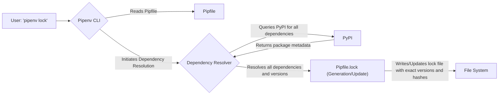

# Project Design Document: Pipenv (Improved)

**Version:** 1.1
**Date:** October 26, 2023
**Author:** AI Software Architect

## 1. Introduction

This document provides an enhanced and more detailed design overview of the Pipenv project, a crucial tool for managing dependencies and virtual environments in Python development. This revised document aims to provide a clearer and more comprehensive understanding of the system's architecture, components, and data flows, with a strong emphasis on security considerations relevant for thorough threat modeling.

## 2. Goals and Objectives

The core goals of Pipenv are to:

*   Streamline and simplify dependency management for Python projects, reducing complexity and potential errors.
*   Automate the creation, management, and activation of isolated virtual environments, ensuring project dependencies are contained.
*   Guarantee consistent and reproducible development environments across different machines and over time.
*   Enhance the security posture of Python projects by explicitly managing dependencies and providing mechanisms for verification.
*   Offer an intuitive and user-friendly command-line interface (CLI) for common dependency management tasks, improving developer experience.

## 3. Target Audience

This document is primarily intended for:

*   Security engineers and architects responsible for conducting threat modeling and security assessments of systems utilizing Pipenv.
*   Software developers actively contributing to the Pipenv project or maintaining applications that rely on it.
*   DevOps and operations engineers involved in deploying and managing applications that use Pipenv for dependency management.
*   Technical stakeholders seeking a deep understanding of Pipenv's internal workings, data flows, and security implications.

## 4. System Architecture

### 4.1. High-Level Architecture

**Description:**

*   The **User** interacts with the **Pipenv CLI Application** to perform dependency management tasks.
*   The **Pipenv CLI Application** reads and writes to the **Pipfile (Project Definition)** to understand project dependencies.
*   The **Pipenv CLI Application** reads, writes, and verifies the **Pipfile.lock (Dependency Snapshot)** for reproducible builds and security.
*   The **Pipenv CLI Application** manages the creation, activation, and deactivation of the **Isolated Virtual Environment**.
*   The **Pipenv CLI Application** utilizes the **Local Python Interpreter** within the active virtual environment.
*   The **Pipenv CLI Application** interacts with the **Python Package Index (PyPI)** to resolve and download packages.
*   The **Isolated Virtual Environment** provides an isolated space for project dependencies and utilizes a specific **Local Python Interpreter**.
*   The **Local Python Interpreter** executes within the isolated environment and downloads packages from PyPI as needed.

### 4.2. Detailed Component Architecture

The Pipenv system comprises several interconnected components:

*   **Pipenv CLI (Command-Line Interface):**
    *   Serves as the primary entry point for user interaction, accepting and processing commands.
    *   Handles argument parsing, command dispatching, and user feedback.
    *   Orchestrates the actions of other internal components.
    *   Provides commands for installing, uninstalling, updating, locking, and managing dependencies and virtual environments.
*   **Dependency Resolver (Leveraging `resolvelib`):**
    *   Responsible for analyzing the `Pipfile` and determining the optimal set of compatible dependency versions.
    *   Utilizes the `resolvelib` library, a standardized dependency resolution implementation.
    *   Navigates complex dependency graphs, resolves version conflicts, and respects specified constraints.
    *   Interacts with package indexes (like PyPI) to retrieve package metadata and version information.
*   **Virtual Environment Manager (Utilizing `virtualenv` or `venv`):**
    *   Manages the creation, activation, and deactivation of isolated Python environments.
    *   Abstracts the underlying virtual environment creation tools (`virtualenv` or the built-in `venv` module).
    *   Ensures that project dependencies are installed within the isolated environment, preventing conflicts with system-level packages.
*   **Pipfile Parser and Serializer:**
    *   Handles the reading and writing of the `Pipfile`, which defines the project's direct dependencies and their version constraints.
    *   Ensures the `Pipfile` adheres to the TOML specification.
    *   Supports different sections within the `Pipfile`, including `packages`, `dev-packages`, and `requires`.
*   **Pipfile.lock Generator and Updater:**
    *   Generates and updates the `Pipfile.lock` file, which captures the exact versions of all resolved dependencies (including transitive dependencies).
    *   Ensures reproducible builds by freezing dependency versions.
    *   Calculates and stores cryptographic hashes (SHA256) of downloaded packages within the `Pipfile.lock` for integrity verification, mitigating against compromised packages.
*   **Package Installer Interface (Abstraction over `pip`):**
    *   Provides an interface to the underlying `pip` package installer.
    *   Handles the downloading and installation of packages from PyPI or other configured package sources.
    *   Ensures packages are installed within the currently active virtual environment.
    *   Manages package installation failures and retries, providing robust installation capabilities.
*   **PyPI Interaction Layer (HTTP Client):**
    *   Manages communication with the Python Package Index (PyPI) or other specified package indexes.
    *   Utilizes HTTP requests to retrieve package metadata, download package distributions (wheels or source archives), and verify package information.
    *   Handles authentication credentials for accessing private package indexes, ensuring secure access to restricted packages.

## 5. Data Flow Diagrams

### 5.1. Installing a New Dependency

**Description:**

1. The **User** issues a command to install a new dependency (e.g., `pipenv install requests`).
2. The **Pipenv CLI** parses the command and reads the existing **Pipfile** to understand current dependencies and constraints.
3. The **Pipenv CLI** initiates the **Dependency Resolution** process.
4. The **Dependency Resolver** queries **PyPI** for metadata related to the requested package (`requests`).
5. **PyPI** returns package information, including available versions and dependencies.
6. The **Dependency Resolver** determines the appropriate versions for `requests` and its transitive dependencies, potentially updating the **Pipfile.lock**.
7. The **Pipenv CLI** utilizes **Pip** to download and install the resolved packages into the **Virtual Environment**.
8. The **Virtual Environment** downloads the necessary packages from **PyPI**.
9. The **Pipfile.lock** is written or updated with the exact versions and cryptographic hashes of the installed packages on the **File System**.
10. The **Pipenv CLI** reads the **Pipfile** to ensure the installation aligns with the project's defined dependencies.

### 5.2. Locking Dependencies

**Description:**

1. The **User** issues the command `pipenv lock` to explicitly lock the project's dependencies.
2. The **Pipenv CLI** reads the **Pipfile** to understand the project's declared dependencies.
3. The **Pipenv CLI** initiates the **Dependency Resolution** process.
4. The **Dependency Resolver** queries **PyPI** for metadata related to all dependencies listed in the `Pipfile`.
5. **PyPI** returns the necessary package metadata.
6. The **Dependency Resolver** determines the exact versions for all direct and transitive dependencies, preparing to generate or update the **Pipfile.lock**.
7. The **Pipfile.lock** is written or updated with the exact versions and cryptographic hashes of all resolved dependencies on the **File System**.

## 6. Key Components in Detail

*   **Pipfile (Project Definition):** A human-readable TOML file that declares the project's direct dependencies and their version constraints.
    *   Organized into sections like `packages` (for production dependencies), `dev-packages` (for development dependencies), and `requires` (specifying the required Python version).
    *   Allows for specifying version ranges, environment markers, and direct URLs for package sources.
*   **Pipfile.lock (Dependency Snapshot):** A JSON file that captures the exact versions of all resolved dependencies, including transitive ones, ensuring reproducible builds.
    *   Crucially includes cryptographic SHA256 hashes of downloaded package files, providing a mechanism to verify the integrity of installed packages and mitigate against supply chain attacks.
    *   Automatically generated or updated by the `pipenv lock` command or during dependency installation/removal.
*   **Isolated Virtual Environment:** A self-contained directory that holds a specific Python interpreter and the project's dependencies, isolated from the system-wide Python installation.
    *   Created and managed by Pipenv using tools like `virtualenv` or `venv`.
    *   Ensures that different projects can have their own independent set of dependencies without causing conflicts.
*   **`setup.py` (Legacy Support and Generation):** While Pipenv aims to supersede `setup.py` for dependency management, it can still interact with projects that utilize it.
    *   Pipenv can generate a `setup.py` file based on the contents of the `Pipfile` if required for compatibility with certain tools or workflows.

## 7. Security Considerations (Enhanced)

This section details potential security vulnerabilities and considerations associated with Pipenv:

*   **Dependency Confusion/Substitution Attacks:**
    *   **Risk:** An attacker could publish a malicious package with the same name as a private or internal dependency on a public repository like PyPI. Pipenv might inadvertently install the malicious public package.
    *   **Mitigation:**
        *   **Prioritize Private Indexes:** Configure Pipenv to prioritize private package indexes over public ones.
        *   **Use `--pypi-mirror` with Trusted Mirrors:** Point Pipenv to a trusted PyPI mirror that has been vetted for security.
        *   **Explicitly Specify Index URLs:** In the `Pipfile`, explicitly define the index URLs for private packages.
*   **Supply Chain Attacks (Compromised Dependencies):**
    *   **Risk:** Legitimate packages on PyPI could be compromised by attackers, injecting malicious code into seemingly safe dependencies.
    *   **Mitigation:**
        *   **Hash Verification:** Pipenv stores SHA256 hashes in `Pipfile.lock`. Implement processes to verify these hashes against known good values or trusted sources.
        *   **Dependency Scanning Tools:** Integrate security scanning tools that analyze dependencies for known vulnerabilities.
        *   **Regularly Update Dependencies:** Keep dependencies updated to patch known security flaws, but carefully review changes before updating.
*   **Virtual Environment Security:**
    *   **Risk:** If the virtual environment directory has insecure permissions, attackers could inject malicious code or replace binaries within the environment.
    *   **Mitigation:**
        *   **Restrict Permissions:** Ensure the virtual environment directory is only writable by the intended user.
        *   **Regularly Inspect Environment:** Periodically check the contents of the virtual environment for unexpected files or modifications.
*   **Exposure of Secrets in Configuration Files:**
    *   **Risk:** Storing sensitive information like API keys or database passwords directly in the `Pipfile` or environment variables managed by Pipenv can lead to exposure.
    *   **Mitigation:**
        *   **Avoid Storing Secrets Directly:** Never hardcode secrets in `Pipfile`.
        *   **Utilize Environment Variables Securely:** If using environment variables, ensure they are managed securely and not exposed in version control.
        *   **Use Dedicated Secret Management Solutions:** Integrate with dedicated secret management tools (e.g., HashiCorp Vault, AWS Secrets Manager).
*   **Insecure Communication with Package Indexes:**
    *   **Risk:** If communication with PyPI or other indexes is not over HTTPS, attackers could perform man-in-the-middle attacks to inject malicious packages during download.
    *   **Mitigation:**
        *   **Enforce HTTPS:** Ensure Pipenv is configured to use HTTPS for all package index interactions. This is the default behavior but should be verified.
*   **Vulnerabilities in Pipenv Itself:**
    *   **Risk:** Bugs or security vulnerabilities within the Pipenv codebase could be exploited by attackers.
    *   **Mitigation:**
        *   **Keep Pipenv Updated:** Regularly update Pipenv to the latest version to benefit from security patches and bug fixes.
        *   **Monitor Security Advisories:** Stay informed about any security advisories related to Pipenv.
*   **Handling of Untrusted `Pipfile` or `Pipfile.lock`:**
    *   **Risk:** Processing a malicious `Pipfile` or `Pipfile.lock` from an untrusted source could lead to the installation of unwanted or compromised packages.
    *   **Mitigation:**
        *   **Verify Source:** Only use `Pipfile` and `Pipfile.lock` files from trusted sources.
        *   **Review Contents:** Carefully review the contents of these files before using them, especially if they originate from an external source.
*   **Permissions Issues During Installation:**
    *   **Risk:** Running Pipenv commands with elevated privileges (e.g., `sudo`) unnecessarily can introduce security risks by potentially installing packages system-wide or altering system files.
    *   **Mitigation:**
        *   **Avoid `sudo`:** Do not use `sudo` with Pipenv commands unless absolutely necessary and understand the implications.
        *   **Ensure Proper User Permissions:** Ensure the user running Pipenv has the necessary permissions within the virtual environment and project directory.

## 8. Deployment Considerations

*   Pipenv significantly simplifies deployment by ensuring that the exact dependencies used in development are replicated in production environments through the `Pipfile.lock`.
*   Deployment processes should leverage the `Pipfile.lock` to create consistent and reproducible environments, minimizing the risk of dependency-related issues.
*   Containerization technologies like Docker work seamlessly with Pipenv, allowing for the packaging of applications along with their Pipenv-managed dependencies.
*   CI/CD pipelines can automate the build and deployment process, using `pipenv install --deploy --ignore-pipfile` to install dependencies based on the `Pipfile.lock`, ensuring consistency.
*   Consider using multi-stage Docker builds to separate the installation of development dependencies from production dependencies, optimizing the final image size.

## 9. Future Considerations

*   Enhanced support for managing and verifying software bills of materials (SBOMs) for improved supply chain transparency.
*   Deeper integration with security scanning tools to provide automated vulnerability detection within the dependency management workflow.
*   More granular control over dependency resolution strategies and conflict resolution mechanisms.
*   Improved support for alternative package sources and artifact repositories beyond PyPI.
*   Further enhancements to the user interface and command-line experience for complex dependency management scenarios.

This improved document provides a more detailed and security-focused overview of the Pipenv project's design. It should serve as a more robust foundation for conducting thorough threat modeling and understanding the security implications of using Pipenv in software development and deployment.