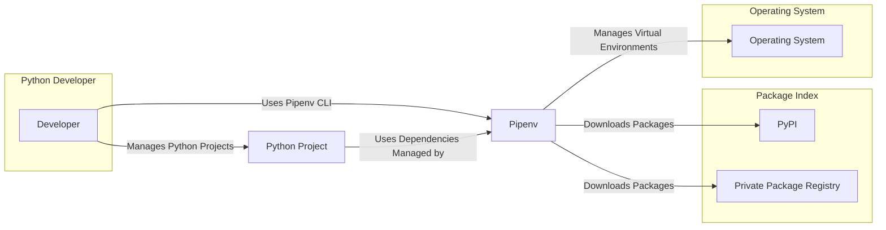
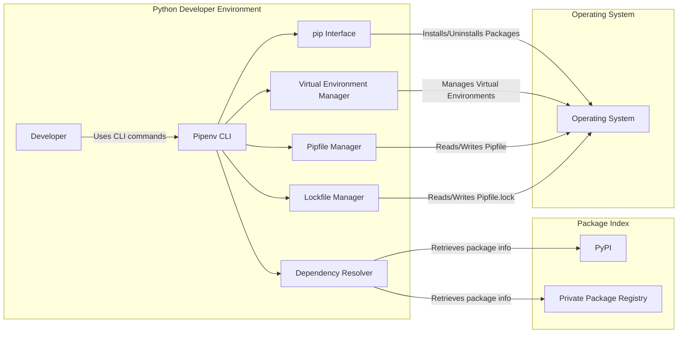
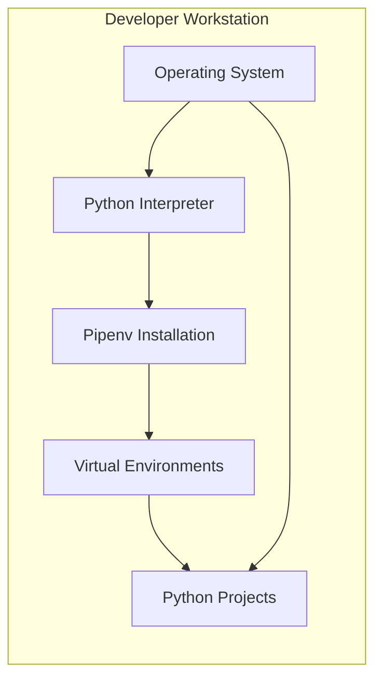

# BUSINESS POSTURE

Pipenv is a dependency management tool for Python projects. It aims to bring the best of all packaging worlds (bundler, composer, npm, yarn, etc.) to the Python world. It automatically creates and manages a virtualenv for your projects, as well as adds/removes packages from your Pipfile as you install/uninstall packages. It generates the Pipfile.lock, which is used to produce deterministic builds.

Business Priorities and Goals:
- Simplify Python dependency management for developers.
- Ensure reproducible builds by using Pipfile.lock.
- Improve developer experience in Python packaging.
- Promote best practices in Python project setup and dependency management.
- Reduce dependency conflicts and environment inconsistencies.

Business Risks:
- Supply chain attacks through compromised dependencies.
- Vulnerabilities in Pipenv itself leading to project compromise.
- Data integrity issues in Pipfile and Pipfile.lock leading to broken builds.
- Availability issues if PyPI or other dependency sources are unavailable.
- Misconfiguration of Pipenv leading to insecure or unstable environments.

# SECURITY POSTURE

Existing Security Controls:
- security control: Usage of `pip` under the hood, inheriting `pip`'s security features (e.g., package verification via hashes). Implemented in: Pipenv codebase.
- security control: Generation of `Pipfile.lock` to ensure reproducible builds and mitigate against dependency confusion attacks by pinning specific versions and hashes. Implemented in: Pipenv codebase.
- security control: Virtual environment isolation to separate project dependencies. Implemented in: Pipenv codebase, leveraging virtualenv or venv.
- security control: Open source project with community review and contributions. Implemented in: GitHub repository and community contribution process.
- security control: Dependency scanning and vulnerability checks can be integrated into CI/CD pipelines using third-party tools. Implemented in: User responsibility and external CI/CD systems.

Accepted Risks:
- accepted risk: Reliance on PyPI and other package indices for package integrity and availability.
- accepted risk: Potential vulnerabilities in dependencies managed by Pipenv.
- accepted risk: User misconfiguration leading to security issues.
- accepted risk: Security of user's development environment where Pipenv is used.

Recommended Security Controls:
- security control: Implement automated dependency vulnerability scanning as part of Pipenv's development and release process.
- security control: Enhance documentation with security best practices for Pipenv usage, including dependency verification and secure configuration.
- security control: Consider integrating signature verification for Pipenv releases.
- security control: Regularly audit Pipenv's codebase for security vulnerabilities.

Security Requirements:
- Authentication: Not directly applicable to Pipenv itself as it's a CLI tool. Authentication is relevant for accessing package repositories (PyPI, private registries), which is handled by `pip` or repository clients.
- Authorization: Not directly applicable to Pipenv itself. Authorization is relevant in the context of accessing project files and system resources, which is handled by the operating system's permissions.
- Input Validation: Pipenv needs to validate inputs such as package names, versions, and options provided by users to prevent injection attacks and unexpected behavior. Implemented in: Pipenv codebase, specifically in argument parsing and dependency resolution logic.
- Cryptography: Pipenv uses cryptography indirectly through `pip` for secure communication with package repositories (HTTPS) and package verification (hashes). Pipenv itself does not handle sensitive cryptographic keys directly.

# DESIGN

## C4 CONTEXT



### C4 Context Elements

- Name: Python Developer
  - Type: Person
  - Description: Software developer using Pipenv to manage Python project dependencies.
  - Responsibilities: Uses Pipenv to install, update, and manage Python packages for their projects. Creates and maintains Python projects.
  - Security controls: Follows secure development practices, manages access to development environment.

- Name: Pipenv
  - Type: Software System
  - Description: Python dependency management tool. Manages virtual environments, Pipfile, and Pipfile.lock.
  - Responsibilities: Resolves dependencies, manages virtual environments, generates lock files, installs and uninstalls packages.
  - Security controls: Input validation, dependency integrity checks (via `pip`), virtual environment isolation.

- Name: PyPI
  - Type: External System
  - Description: Python Package Index, the default public repository for Python packages.
  - Responsibilities: Hosts and serves Python packages.
  - Security controls: HTTPS for secure communication, package signing (optional, not universally enforced), vulnerability scanning (limited).

- Name: Private Package Registry
  - Type: External System
  - Description: Private or organization-specific Python package registry.
  - Responsibilities: Hosts and serves private Python packages.
  - Security controls: Authentication and authorization, HTTPS, package signing, vulnerability scanning (depending on the registry).

- Name: Operating System
  - Type: External System
  - Description: User's operating system (macOS, Linux, Windows).
  - Responsibilities: Provides the environment for running Pipenv and Python projects, manages file system and processes.
  - Security controls: User permissions, file system access controls, process isolation.

- Name: Python Project
  - Type: Software System
  - Description: Python software project that uses Pipenv for dependency management.
  - Responsibilities: Contains application code, Pipfile, and Pipfile.lock. Relies on dependencies managed by Pipenv.
  - Security controls: Application-level security controls, secure coding practices, dependency vulnerability management.

## C4 CONTAINER



### C4 Container Elements

- Name: Pipenv CLI
  - Type: Application
  - Description: Command-line interface for interacting with Pipenv. Handles user commands and orchestrates other components.
  - Responsibilities: Parses user commands, invokes other Pipenv components, provides user feedback.
  - Security controls: Input validation of CLI arguments, secure handling of user input.

- Name: Virtual Environment Manager
  - Type: Application
  - Description: Manages the creation, activation, and deactivation of Python virtual environments.
  - Responsibilities: Creates isolated Python environments, manages environment paths.
  - Security controls: Isolation of project dependencies, prevention of system-wide package conflicts.

- Name: Dependency Resolver
  - Type: Application
  - Description: Resolves project dependencies based on Pipfile and available packages in package indices.
  - Responsibilities: Reads Pipfile, queries package indices (PyPI, private registries), resolves dependency conflicts, determines compatible package versions.
  - Security controls: Handling of package index responses, preventing dependency confusion attacks by using lock files and hashes.

- Name: Pipfile Manager
  - Type: Application
  - Description: Manages the Pipfile, which specifies project dependencies.
  - Responsibilities: Reads and writes Pipfile, adds and removes dependencies from Pipfile.
  - Security controls: Validation of Pipfile format, secure handling of file operations.

- Name: Lockfile Manager
  - Type: Application
  - Description: Manages the Pipfile.lock, which ensures deterministic builds.
  - Responsibilities: Generates and updates Pipfile.lock, reads Pipfile.lock for dependency installation.
  - Security controls: Integrity of Pipfile.lock, ensuring reproducible builds and mitigating supply chain risks.

- Name: pip Interface
  - Type: Application
  - Description: Interface to the `pip` package installer, used by Pipenv to install and uninstall packages within virtual environments.
  - Responsibilities: Executes `pip` commands to install, uninstall, and manage Python packages.
  - Security controls: Inherits security controls from `pip`, such as package verification via hashes and secure communication with package repositories.

## DEPLOYMENT

Pipenv is primarily deployed as a command-line tool installed on developer machines. It is not a server-side application that requires a complex deployment architecture.

Deployment Architecture: Developer Workstation



### Deployment Elements

- Name: Developer Workstation
  - Type: Environment
  - Description: The local computer of a software developer where Pipenv is installed and used.
  - Responsibilities: Provides the environment for development, including running Pipenv and Python projects.
  - Security controls: Workstation security policies, operating system security controls, user access controls.

- Name: Operating System
  - Type: Infrastructure
  - Description: The operating system installed on the developer workstation (e.g., macOS, Linux, Windows).
  - Responsibilities: Provides core system functionalities, file system, process management.
  - Security controls: OS security updates, user account management, firewall, antivirus.

- Name: Python Interpreter
  - Type: Software
  - Description: Python interpreter required to run Pipenv and Python projects.
  - Responsibilities: Executes Python code.
  - Security controls: Keeping Python interpreter updated with security patches.

- Name: Pipenv Installation
  - Type: Software
  - Description: Pipenv tool installed on the developer workstation, typically in the user's Python environment or a system-wide location.
  - Responsibilities: Provides dependency management functionalities.
  - Security controls: Installation from trusted sources (PyPI), keeping Pipenv updated.

- Name: Virtual Environments
  - Type: Software
  - Description: Isolated Python environments created and managed by Pipenv for individual projects.
  - Responsibilities: Isolates project dependencies, prevents conflicts.
  - Security controls: File system permissions to protect environment contents.

- Name: Python Projects
  - Type: Software
  - Description: Python software projects residing on the developer workstation, using Pipenv for dependency management.
  - Responsibilities: Contains application code and project-specific files.
  - Security controls: Project-level security measures, secure coding practices.

## BUILD

Pipenv's build process focuses on packaging and releasing Pipenv itself, not on building user projects that use Pipenv.

```mermaid
flowchart LR
    subgraph "Developer"
        Dev[Developer]
    end
    subgraph "GitHub"
        GitRepo[GitHub Repository]
        GitHubActions[GitHub Actions CI]
    end
    subgraph "PyPI"
        PyPI[PyPI]
    end

    Dev -->|Code Changes, Pull Requests| GitRepo
    GitRepo -->|Triggers CI Workflow| GitHubActions
    GitHubActions -->|Builds, Tests, Lints, Security Checks| BuildArtifacts[Build Artifacts]
    GitHubActions -->|Publishes Release| PyPI
    BuildArtifacts -->|Stored in GitHub Releases & PyPI| PyPI

    style BuildArtifacts fill:#f9f,stroke:#333,stroke-width:2px
```

### Build Elements

- Name: Developer
  - Type: Person
  - Description: Pipenv developers who contribute code changes.
  - Responsibilities: Writes code, submits pull requests, reviews code.
  - Security controls: Secure coding practices, code review process, access control to the repository.

- Name: GitHub Repository
  - Type: Code Repository
  - Description: GitHub repository hosting the Pipenv source code.
  - Responsibilities: Version control, code storage, collaboration platform.
  - Security controls: Access control, branch protection, audit logs.

- Name: GitHub Actions CI
  - Type: CI/CD System
  - Description: GitHub Actions workflows used for automated build, test, and release processes.
  - Responsibilities: Automated building, testing, linting, security checks (e.g., vulnerability scanning, SAST), and publishing releases.
  - Security controls: Secure workflow configuration, secret management, access control to CI/CD pipelines, dependency scanning in CI.

- Name: Build Artifacts
  - Type: Software Artifacts
  - Description: Compiled and packaged versions of Pipenv, ready for distribution.
  - Responsibilities: Installable packages of Pipenv.
  - Security controls: Signing of releases, integrity checks (hashes).

- Name: PyPI
  - Type: Package Registry
  - Description: Python Package Index, used to distribute Pipenv releases.
  - Responsibilities: Hosts and serves Pipenv packages.
  - Security controls: HTTPS, package signing (PyPI supports signing, Pipenv releases should be signed).

# RISK ASSESSMENT

Critical Business Processes:
- Ensuring reliable and reproducible Python project dependency management.
- Providing a secure and user-friendly tool for Python developers.
- Maintaining the integrity and availability of Pipenv as a dependency management tool.

Data Sensitivity:
- Pipfile and Pipfile.lock: Contain project dependencies and versions. Sensitivity: Low to Medium. Exposure could lead to dependency confusion attacks or information disclosure about project dependencies.
- Developer environment configurations: Pipenv manages virtual environments and project settings. Sensitivity: Low. Misconfiguration could lead to operational issues.
- Package hashes in Pipfile.lock: Used for integrity verification. Sensitivity: Medium. Compromise could lead to bypassing integrity checks.

# QUESTIONS & ASSUMPTIONS

Questions:
- Are there any specific compliance requirements for Pipenv (e.g., security certifications, industry standards)?
- What is the process for handling security vulnerabilities reported in Pipenv or its dependencies?
- Are there any plans to integrate more advanced security features directly into Pipenv (e.g., dependency vulnerability scanning)?
- What is the target user profile for Pipenv (individual developers, small teams, large enterprises)? This can influence the risk appetite.

Assumptions:
- BUSINESS POSTURE: The primary goal is to provide a user-friendly and reliable dependency management tool for the Python community. Security is a high priority, but usability and developer experience are also crucial.
- SECURITY POSTURE: Pipenv relies on `pip` for core package management functionalities and inherits some of its security features. The project aims to be secure by default but relies on users to follow best practices.
- DESIGN: Pipenv is designed as a CLI tool for developer workstations. The architecture is relatively simple, focusing on dependency resolution, virtual environment management, and interaction with package indices. The build process uses standard open-source practices with GitHub Actions and PyPI for distribution.