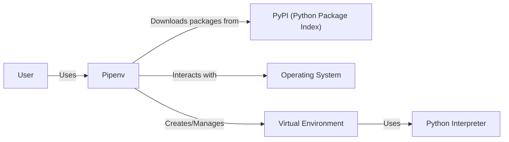
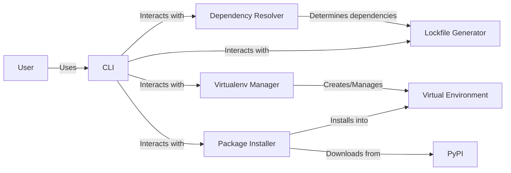
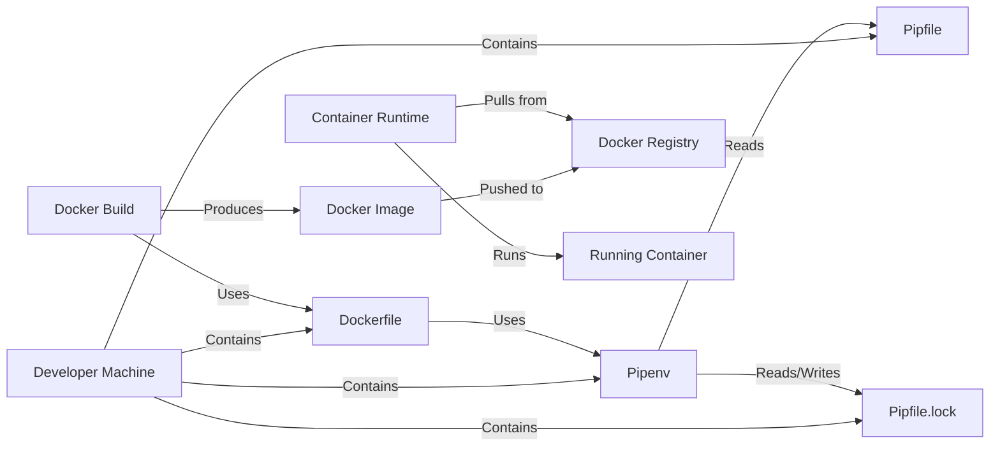
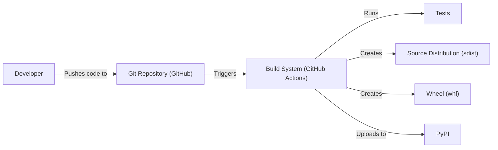

Okay, let's create a design document for Pipenv based on the provided GitHub repository.

# BUSINESS POSTURE

Pipenv is a tool that aims to bring the best of all packaging worlds (bundler, composer, npm, cargo, yarn, etc.) to the Python world. It automatically creates and manages a virtualenv for projects, as well as adds/removes packages from Pipfile as you install/uninstall packages. It also generates the ever-important `Pipfile.lock`, which is used to produce deterministic builds.

Priorities:

*   Simplify dependency management for Python developers.
*   Provide a consistent and reliable way to manage project environments.
*   Ensure reproducible builds across different machines and environments.
*   Improve the security of Python projects by promoting the use of virtual environments and locked dependencies.
*   Provide user friendly CLI.

Goals:

*   Become the recommended dependency management tool for Python projects.
*   Reduce the complexity of managing Python project dependencies.
*   Improve the reliability and reproducibility of Python project builds.

Business Risks:

*   Inconsistent dependency resolution leading to "it works on my machine" problems.
*   Security vulnerabilities introduced by outdated or compromised dependencies.
*   Difficulties in collaborating on projects due to differing development environments.
*   Compatibility issues with different Python versions or operating systems.
*   Lack of adoption by the Python community.

# SECURITY POSTURE

Existing Security Controls:

*   security control: Virtual environment management: Pipenv automatically creates and manages virtual environments, isolating project dependencies and reducing the risk of conflicts. (Implemented in Pipenv's core functionality).
*   security control: Dependency locking: Pipenv generates a `Pipfile.lock` file, which specifies the exact versions of all dependencies, ensuring reproducible builds and preventing unexpected changes. (Implemented in Pipenv's core functionality).
*   security control: Hashing: Pipenv verifies the hashes of downloaded packages against those in `Pipfile.lock`, ensuring that the downloaded files have not been tampered with. (Implemented in Pipenv's core functionality).
*   security control: Code is open source and available for public audit on GitHub. (GitHub repository).

Accepted Risks:

*   accepted risk: Reliance on external package repositories (e.g., PyPI): Pipenv relies on external repositories for downloading packages, which introduces a potential risk of supply chain attacks if the repository is compromised.
*   accepted risk: User error: Users may inadvertently introduce vulnerabilities by installing malicious packages or misconfiguring Pipenv.
*   accepted risk: Vulnerabilities in Pipenv itself: Like any software, Pipenv may contain vulnerabilities that could be exploited by attackers.

Recommended Security Controls:

*   security control: Regularly update Pipenv: Ensure that you are using the latest version of Pipenv to benefit from security patches and improvements.
*   security control: Integrate with vulnerability scanning tools: Consider integrating Pipenv with tools that can scan dependencies for known vulnerabilities.
*   security control: Review and audit dependencies: Before installing new packages, review their source code and reputation to minimize the risk of introducing malicious code.

Security Requirements:

*   Authentication: Not directly applicable to Pipenv itself, as it primarily operates locally. However, authentication may be required when interacting with private package repositories.
*   Authorization: Not directly applicable to Pipenv itself.
*   Input Validation: Pipenv should validate user inputs, such as package names and versions, to prevent command injection or other attacks. Pipenv should also validate the contents of `Pipfile` and `Pipfile.lock` to ensure they are well-formed and do not contain malicious data.
*   Cryptography: Pipenv should use secure cryptographic algorithms for hashing and verifying package integrity.

# DESIGN

## C4 CONTEXT

Element Descriptions:

*   Element:
    *   Name: User
    *   Type: Person
    *   Description: A Python developer who uses Pipenv to manage project dependencies.
    *   Responsibilities: Interacts with Pipenv CLI, defines project dependencies in Pipfile.
    *   Security controls: N/A (External to Pipenv)

*   Element:
    *   Name: Pipenv
    *   Type: Software System
    *   Description: The Pipenv dependency management tool.
    *   Responsibilities: Manages virtual environments, resolves and installs dependencies, generates Pipfile.lock.
    *   Security controls: Virtual environment isolation, dependency locking, hash verification.

*   Element:
    *   Name: PyPI (Python Package Index)
    *   Type: External System
    *   Description: The default repository for Python packages.
    *   Responsibilities: Hosts Python packages.
    *   Security controls: PyPI's internal security measures (external to Pipenv).

*   Element:
    *   Name: Operating System
    *   Type: External System
    *   Description: The underlying operating system (e.g., Windows, macOS, Linux).
    *   Responsibilities: Provides file system access, process management, and other system-level services.
    *   Security controls: OS-level security controls (external to Pipenv).

*   Element:
    *   Name: Virtual Environment
    *   Type: Environment
    *   Description: An isolated environment for Python projects, containing specific versions of packages.
    *   Responsibilities: Isolates project dependencies.
    *   Security controls: Isolation from other projects and the system's global Python installation.

*   Element:
    *   Name: Python Interpreter
    *   Type: Software System
    *   Description: The Python interpreter used to run the project's code.
    *   Responsibilities: Executes Python code.
    *   Security controls: Python interpreter's built-in security features.

## C4 CONTAINER

Element Descriptions:

*   Element:
    *   Name: User
    *   Type: Person
    *   Description: A Python developer.
    *   Responsibilities: Uses the Pipenv CLI.
    *   Security controls: N/A

*   Element:
    *   Name: CLI
    *   Type: Component
    *   Description: Command-line interface for interacting with Pipenv.
    *   Responsibilities: Parses user commands, interacts with other components.
    *   Security controls: Input validation.

*   Element:
    *   Name: Dependency Resolver
    *   Type: Component
    *   Description: Resolves project dependencies based on Pipfile.
    *   Responsibilities: Determines the correct versions of packages to install.
    *   Security controls: N/A

*   Element:
    *   Name: Virtualenv Manager
    *   Type: Component
    *   Description: Creates and manages virtual environments.
    *   Responsibilities: Creates, activates, and deactivates virtual environments.
    *   Security controls: Virtual environment isolation.

*   Element:
    *   Name: Lockfile Generator
    *   Type: Component
    *   Description: Generates the `Pipfile.lock` file.
    *   Responsibilities: Creates a lockfile with specific package versions and hashes.
    *   Security controls: Hash verification.

*   Element:
    *   Name: Package Installer
    *   Type: Component
    *   Description: Downloads and installs packages.
    *   Responsibilities: Retrieves packages from PyPI, installs them into the virtual environment.
    *   Security controls: Hash verification.

*   Element:
    *   Name: PyPI
    *   Type: External System
    *   Description: Python Package Index.
    *   Responsibilities: Hosts Python packages.
    *   Security controls: External to Pipenv.

*   Element:
    *   Name: Virtual Environment
    *   Type: Environment
    *   Description: Isolated project environment.
    *   Responsibilities: Contains project-specific dependencies.
    *   Security controls: Isolation.

## DEPLOYMENT

Pipenv is a development tool and is not typically "deployed" in the traditional sense. However, the artifacts it produces (`Pipfile` and `Pipfile.lock`) are crucial for deploying the *application* that uses Pipenv. Here are a few deployment scenarios and a detailed description of one:

Possible Deployment Solutions:

1.  **Cloud Platforms (Heroku, AWS, GCP, Azure, etc.):** These platforms often detect `Pipfile` and `Pipfile.lock` and use them to install dependencies during the deployment process.
2.  **Docker Containers:** A Dockerfile can use Pipenv to install dependencies within a container image.
3.  **Traditional Server Deployment (VPS, Dedicated Server):**  Pipenv can be used on the server to create a virtual environment and install dependencies.
4.  **Serverless Functions:** Dependencies are typically bundled with the function code. Pipenv can be used to manage these dependencies during development and packaging.

Chosen Deployment Solution: Docker Container

Element Descriptions:

*   Element:
    *   Name: Developer Machine
    *   Type: Environment
    *   Description: The developer's local machine.
    *   Responsibilities: Hosts the project code, Pipenv, Dockerfile, etc.
    *   Security controls: Developer machine security.

*   Element:
    *   Name: Dockerfile
    *   Type: File
    *   Description: Instructions for building a Docker image.
    *   Responsibilities: Defines the steps to create the container image, including installing dependencies using Pipenv.
    *   Security controls: Secure base image, minimal dependencies.

*   Element:
    *   Name: Pipenv
    *   Type: Software System
    *   Description: Dependency management tool.
    *   Responsibilities: Installs dependencies within the Docker build process.
    *   Security controls: Hash verification, virtual environment (within the container).

*   Element:
    *   Name: Pipfile
    *   Type: File
    *   Description: Defines project dependencies.
    *   Responsibilities: Lists the required packages.
    *   Security controls: N/A

*   Element:
    *   Name: Pipfile.lock
    *   Type: File
    *   Description: Specifies exact dependency versions.
    *   Responsibilities: Ensures reproducible builds.
    *   Security controls: Hash verification.

*   Element:
    *   Name: Docker Build
    *   Type: Process
    *   Description: The process of building a Docker image.
    *   Responsibilities: Executes the instructions in the Dockerfile.
    *   Security controls: Secure build environment.

*   Element:
    *   Name: Docker Image
    *   Type: Artifact
    *   Description: The packaged application and its dependencies.
    *   Responsibilities: Contains everything needed to run the application.
    *   Security controls: Image signing, vulnerability scanning.

*   Element:
    *   Name: Docker Registry
    *   Type: External System
    *   Description: A repository for storing Docker images.
    *   Responsibilities: Stores and distributes Docker images.
    *   Security controls: Access control, image scanning.

*   Element:
    *   Name: Container Runtime
    *   Type: Software System
    *   Description: Software that runs Docker containers (e.g., Docker Engine, containerd).
    *   Responsibilities: Executes containers.
    *   Security controls: Container isolation, resource limits.

*   Element:
    *   Name: Running Container
    *   Type: Environment
    *   Description: A running instance of the Docker image.
    *   Responsibilities: Executes the application.
    *   Security controls: Container security best practices.

## BUILD

Pipenv itself is not "built" in the same way as a compiled application. However, it is packaged and distributed as a Python package. The build process for Pipenv (the tool itself) involves creating a source distribution and a wheel, which are then uploaded to PyPI. The build process for an *application* using Pipenv involves using Pipenv to install dependencies, and potentially creating a deployable artifact (e.g., a Docker image, a zip file for serverless functions, etc.).

Security Controls in the Build Process (for Pipenv itself):

*   security control: Code Review: All changes to Pipenv's codebase should be reviewed by other developers before being merged.
*   security control: Automated Testing: Pipenv has a comprehensive test suite that is run automatically on every code change. This includes unit tests, integration tests, and end-to-end tests.
*   security control: Continuous Integration (CI): Pipenv uses CI (GitHub Actions) to automatically build and test the software on every commit.
*   security control: Static Analysis: Linters and static analysis tools can be used to identify potential code quality and security issues.
*   security control: Signed Commits: Developers should sign their commits to ensure the integrity and authenticity of the code.

# RISK ASSESSMENT

Critical Business Processes:

*   Dependency Management: Ensuring that project dependencies are correctly resolved and installed.
*   Reproducible Builds: Guaranteeing that the same code produces the same result across different environments.
*   Development Workflow: Providing a smooth and efficient workflow for Python developers.

Data:

*   Pipfile: Contains a list of project dependencies, including package names and version specifiers. Sensitivity: Low (generally public information).
*   Pipfile.lock: Contains the exact versions and hashes of all installed dependencies. Sensitivity: Medium (could reveal information about specific versions used, potentially aiding targeted attacks if vulnerabilities are known in those versions).
*   Source Code of Dependencies: Pipenv downloads and installs the source code of project dependencies. Sensitivity: Varies depending on the dependency. Could range from low (publicly available open-source code) to high (proprietary or sensitive code).

# QUESTIONS & ASSUMPTIONS

Questions:

*   Are there any specific compliance requirements (e.g., PCI DSS, HIPAA) that need to be considered?
*   Are there any plans to integrate Pipenv with other tools or services?
*   What is the expected frequency of updates and releases for Pipenv?
*   What level of support is provided for Pipenv users?
*   Are there any specific security auditing or penetration testing procedures in place for Pipenv?

Assumptions:

*   BUSINESS POSTURE: The primary users of Pipenv are Python developers.
*   BUSINESS POSTURE: The Python community will continue to use and support Pipenv.
*   SECURITY POSTURE: PyPI will remain a relatively secure and reliable source for Python packages.
*   SECURITY POSTURE: Developers will follow security best practices when using Pipenv.
*   DESIGN: The design of Pipenv will continue to evolve to meet the needs of the Python community.
*   DESIGN: Pipenv will continue to support a wide range of Python versions and operating systems.
*   DESIGN: Docker will be used as a primary deployment method.