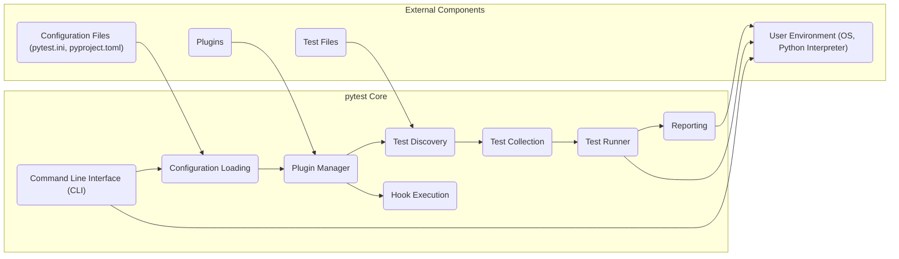
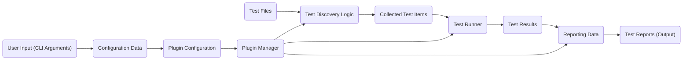

# Project Design Document: pytest - Python Testing Framework

**Version:** 1.1
**Date:** October 26, 2023
**Author:** AI Software Architect

## 1. Introduction

This document provides a detailed architectural design of the pytest framework, a popular Python testing tool. This design document is intended to serve as a foundation for subsequent threat modeling activities, providing a clear understanding of the system's components, data flow, and interactions. This revision aims to enhance clarity and adhere strictly to the specified formatting guidelines.

## 2. Goals and Objectives

The primary goals of pytest are to:

*   Make writing tests easier and more readable.
*   Provide a flexible and extensible testing framework.
*   Support simple unit tests to complex functional tests.
*   Offer rich reporting and debugging capabilities.
*   Enable a vibrant plugin ecosystem for extending functionality.

## 3. System Architecture

pytest's architecture can be broadly categorized into the following key stages:

*   **Test Discovery:** Identifying test functions and classes within specified directories or modules.
*   **Test Collection:** Building a hierarchical structure of test items.
*   **Test Execution:** Running the collected tests, potentially in parallel.
*   **Reporting:** Generating output summarizing test results.
*   **Plugin Interaction:** Utilizing and managing external plugins to extend core functionality.

## 4. Components

This section details the key components of the pytest framework:

*   **Command Line Interface (CLI):**
    *   Entry point for users to interact with pytest.
    *   Parses command-line arguments and options.
    *   Initiates the test discovery and execution process.
*   **Configuration Loading:**
    *   Responsible for loading configuration settings from various sources.
        *   Sources include: command-line arguments, environment variables, `pytest.ini`, `pyproject.toml`, and plugin configurations.
    *   Determines how tests are discovered, executed, and reported.
*   **Plugin Manager:**
    *   Core component for managing and interacting with plugins.
    *   Discovers and registers internal and external plugins.
    *   Provides a mechanism for plugins to extend and modify pytest's behavior through hooks.
*   **Test Discovery:**
    *   Identifies potential test functions and classes based on naming conventions and decorators.
    *   Recursively searches specified directories and modules.
    *   Can be customized through configuration and plugins.
*   **Test Collection:**
    *   Builds a hierarchical structure of test items from the discovered tests.
    *   Represents individual tests, test classes, and modules.
    *   Allows for filtering and parametrization of tests.
*   **Test Runner:**
    *   Executes the collected test items.
    *   Manages test setup, execution, and teardown.
    *   Supports various execution modes (e.g., sequential, parallel).
    *   Captures output (stdout, stderr) and exceptions during test execution.
*   **Reporting:**
    *   Generates reports summarizing test results.
    *   Provides different reporting formats (e.g., standard output, XML, HTML).
    *   Includes information about test status (passed, failed, skipped, error).
    *   Can be extended by plugins to provide custom reporting.
*   **Hook Execution:**
    *   A central mechanism for plugins to interact with pytest's core functionality.
    *   Defines various hook specifications at different stages of the testing process (e.g., collection, execution, reporting).
    *   Allows plugins to modify behavior, add new features, and customize the testing workflow.

## 5. Data Flow

The following outlines the typical data flow within pytest:

Detailed data flow description:

*   **User Input (CLI Arguments):** The user provides instructions to pytest via the command line.
*   **Configuration Data:** Command-line arguments, environment variables, and configuration files are parsed and loaded into configuration objects.
*   **Plugin Configuration:** Configuration data may include settings specific to loaded plugins.
*   **Plugin Manager:** The Plugin Manager uses configuration data to initialize and manage plugins.
*   **Test Files:** Python files containing test functions and classes.
*   **Test Discovery Logic:** The core logic within pytest, potentially influenced by plugins, identifies test functions and classes within the specified files.
*   **Collected Test Items:** A hierarchical representation of the discovered tests.
*   **Test Runner:** Executes the collected tests, potentially interacting with the user environment and capturing output.
*   **Test Results:** Data representing the outcome of each test (pass, fail, skip, error), including captured output and error information.
*   **Reporting Data:** Test results are processed and formatted for reporting.
*   **Test Reports (Output):** The final output presented to the user, summarizing the test execution.

## 6. Security Considerations (Preliminary for Threat Modeling)

This section outlines initial security considerations that will be further explored during the threat modeling process:

*   **Plugin Security:**
    *   Plugins have significant access to pytest's internal state and the execution environment.
    *   Malicious or poorly written plugins could introduce vulnerabilities, execute arbitrary code, or leak sensitive information.
    *   The plugin installation and management process needs careful consideration.
*   **Input Validation:**
    *   pytest processes input from various sources, including command-line arguments, configuration files, and test files.
    *   Insufficient input validation could lead to vulnerabilities like command injection or arbitrary code execution.
    *   Parsing of configuration files (e.g., `pytest.ini`, `pyproject.toml`) needs to be secure.
*   **Test File Execution:**
    *   pytest executes code within test files.
    *   Malicious code embedded in test files could be executed during the testing process.
    *   The environment in which tests are executed needs to be considered.
*   **Reporting Security:**
    *   Test reports might contain sensitive information, such as file paths, environment variables, or error messages.
    *   Access control and secure storage of test reports are important.
*   **Dependency Management:**
    *   pytest relies on external dependencies.
    *   Vulnerabilities in these dependencies could impact pytest's security.
    *   Regularly updating dependencies is crucial.
*   **Code Injection through Hooks:**
    *   Plugins can register hooks that execute arbitrary code at various points in the pytest lifecycle.
    *   Improperly secured hook implementations could be exploited.

## 7. Deployment Considerations

pytest is typically deployed and used in the following contexts:

*   Local Development: Developers use pytest on their local machines to run unit and integration tests during development.
*   Continuous Integration/Continuous Deployment (CI/CD) Pipelines: pytest is integrated into CI/CD pipelines to automatically run tests as part of the build and deployment process.
*   Testing Environments: Dedicated testing environments may use pytest for more comprehensive testing.

## 8. Future Considerations

Potential future developments and considerations for pytest include:

*   Enhanced Plugin Security Mechanisms: Implementing more robust mechanisms for verifying and sandboxing plugins.
*   Improved Input Validation: Strengthening input validation across all input sources.
*   Standardized Security Best Practices: Documenting and promoting secure coding practices for plugin developers.
*   Integration with Security Scanning Tools: Exploring integration with static and dynamic analysis tools to identify potential vulnerabilities.

This document provides a comprehensive overview of the pytest architecture, laying the groundwork for a thorough threat modeling exercise. The identified components, data flows, and preliminary security considerations will be crucial in identifying potential vulnerabilities and developing appropriate mitigation strategies.
