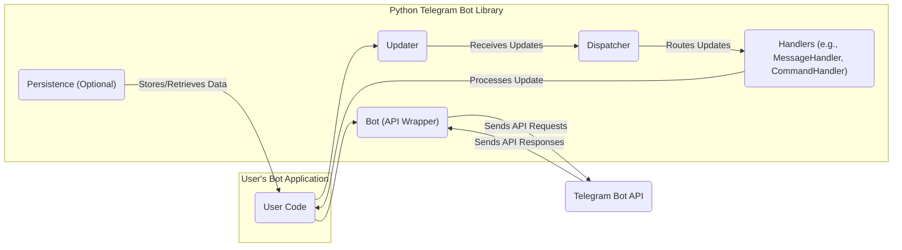
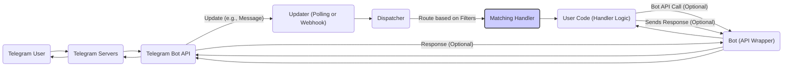

# Project Design Document: Python Telegram Bot Library

**Version:** 1.1
**Date:** October 26, 2023
**Author:** AI Software Architect

## 1. Introduction

This document provides a detailed architectural design of the `python-telegram-bot` library. This design will serve as the foundation for subsequent threat modeling activities, allowing for a comprehensive understanding of the system's components, interactions, and potential vulnerabilities. The document aims to be clear, concise, and informative for both technical and non-technical audiences involved in the security assessment process.

## 2. Project Overview

The `python-telegram-bot` library is a Python wrapper around the Telegram Bot API. It simplifies the process of creating and managing Telegram bots by providing a high-level, object-oriented interface. The library handles the underlying communication with the Telegram servers, allowing developers to focus on the bot's logic and functionality.

**Key Features:**

*   Asynchronous and synchronous API interaction.
*   Automatic handling of updates from Telegram (polling and webhooks).
*   Convenient message handling and command processing.
*   Support for various Telegram features like inline keyboards, custom keyboards, and media uploads.
*   Extensibility through handlers and filters.
*   Built-in rate limiting and error handling mechanisms.

## 3. Architectural Design

The library's architecture can be broken down into several key components that interact to facilitate communication with the Telegram Bot API.

### 3.1. Component Diagram

**Component Descriptions:**

*   **User Code:** This represents the Python code written by the developer using the `python-telegram-bot` library to define the bot's behavior.
*   **Updater:** Responsible for fetching new updates from Telegram. It can operate in two modes:
    *   **Polling:** Periodically sends requests to the Telegram Bot API to check for new updates.
    *   **Webhooks:** Configured to receive updates pushed by Telegram to a specified URL.
*   **Dispatcher:** Receives updates from the `Updater` and routes them to the appropriate `Handler` based on defined filters (e.g., message content, command).
*   **Handlers:** Specific classes designed to process different types of updates. Examples include:
    *   `MessageHandler`: Handles text messages, media, etc.
    *   `CommandHandler`: Handles messages starting with a specific command (e.g., `/start`).
    *   `CallbackQueryHandler`: Handles interactions with inline keyboard buttons.
*   **Bot (API Wrapper):** A class that provides methods for interacting with the Telegram Bot API. It handles tasks like sending messages, editing messages, sending media, etc.
*   **Persistence (Optional):**  Allows the bot to store and retrieve data, such as user states or conversation history. This is an optional component that the user can implement using various storage mechanisms.
*   **Telegram Bot API:** The official HTTP-based API provided by Telegram for interacting with bots.

### 3.2. Data Flow Diagram (Message Processing)

**Data Flow Description:**

1. A "Telegram User" sends a message or interacts with the bot.
2. "Telegram Servers" receive the interaction.
3. The "Telegram Bot API" receives the interaction.
4. The "Updater (Polling or Webhook)" in the `python-telegram-bot` library fetches the update, either by polling the API or receiving it via a webhook.
5. The "Updater (Polling or Webhook)" passes the update to the "Dispatcher".
6. The "Dispatcher" analyzes the update and routes it to the "Matching Handler" based on predefined filters.
7. The "User Code (Handler Logic)" within the "Matching Handler" processes the update.
8. Optionally, the "User Code (Handler Logic)" can use the "Bot (API Wrapper)" class to make API calls back to the "Telegram Bot API" (e.g., sending a reply).
9. The "Bot (API Wrapper)" class sends the API request to the "Telegram Bot API".
10. The "Telegram Bot API" processes the request and sends a response back to the "Bot (API Wrapper)" class.
11. The "Bot (API Wrapper)" class handles the response and makes it available to the "User Code (Handler Logic)".
12. The "User Code (Handler Logic)" might then send a response back to the user via the "Bot (API Wrapper)" class.
13. The "Bot (API Wrapper)" class sends the message to the "Telegram Bot API".
14. The "Telegram Bot API" delivers the message to the "Telegram Servers".
15. The "Telegram Servers" deliver the message to the "Telegram User".

### 3.3. Key Interactions

The following list describes the key interactions between the components:

*   **User Code <-> Updater:** The user code configures the `Updater` with the bot's API token and specifies the update retrieval method (polling or webhook).
*   **Updater <-> Telegram Bot API:** The `Updater` communicates with the Telegram Bot API to fetch new updates. This interaction involves HTTP requests and responses.
*   **Updater <-> Dispatcher:** The `Updater` passes received updates to the `Dispatcher` for processing.
*   **Dispatcher <-> Handlers:** The `Dispatcher` routes updates to the appropriate `Handler` based on defined filters.
*   **Handlers <-> User Code:** The `Handlers` execute the user-defined logic to process specific types of updates.
*   **User Code <-> Bot:** The user code uses the `Bot` class to interact with the Telegram Bot API, such as sending messages, editing messages, etc.
*   **Bot <-> Telegram Bot API:** The `Bot` class sends API requests to and receives responses from the Telegram Bot API.
*   **User Code <-> Persistence (Optional):** The user code interacts with the optional persistence layer to store and retrieve data.

## 4. Security Considerations

This section outlines potential security considerations based on the architectural design. These points will be further explored during the threat modeling process.

**Potential Threat Areas:**

*   **API Token Management:** The bot's API token is a critical secret. Its exposure could allow unauthorized access and control of the bot.
    *   Storing the token securely (e.g., environment variables, secure vault).
    *   Preventing accidental leakage in code or logs.
*   **Webhook Security:** If using webhooks, the endpoint receiving updates must be secured to prevent unauthorized access and manipulation of updates.
    *   Using HTTPS for communication.
    *   Verifying the authenticity of incoming requests from Telegram.
    *   Protecting the webhook endpoint from denial-of-service attacks.
*   **Input Validation:**  User input received through Telegram messages should be carefully validated to prevent injection attacks or unexpected behavior.
    *   Sanitizing user input before processing.
    *   Avoiding direct execution of user-provided code.
*   **Dependency Management:** The library relies on external dependencies. Vulnerabilities in these dependencies could impact the security of the bot.
    *   Keeping dependencies up-to-date.
    *   Regularly scanning dependencies for known vulnerabilities.
*   **Rate Limiting:** While the library has built-in rate limiting, improper configuration or vulnerabilities could lead to abuse or denial of service.
*   **Error Handling:**  Detailed error messages could reveal sensitive information. Proper error handling and logging are crucial.
*   **Persistence Security (If Used):** If the bot uses persistence, the storage mechanism must be secured to protect sensitive data.
    *   Using appropriate authentication and authorization for the storage.
    *   Encrypting sensitive data at rest and in transit.
*   **Man-in-the-Middle Attacks:** Communication between the library and the Telegram Bot API should be protected against eavesdropping.
    *   The library uses HTTPS, which provides encryption.
*   **Code Injection:**  Care must be taken when constructing dynamic messages or using user input in API calls to prevent code injection vulnerabilities.

## 5. Deployment Considerations

The `python-telegram-bot` library can be deployed in various environments, which can influence the security posture.

**Common Deployment Scenarios:**

*   **Local Machine:** Running the bot directly on a developer's machine for testing or personal use.
*   **Virtual Private Server (VPS):** Deploying the bot on a VPS provides more control and resources.
*   **Cloud Platforms (e.g., AWS, Google Cloud, Azure):** Utilizing cloud services for hosting and scalability.
*   **Containerized Environments (e.g., Docker, Kubernetes):** Deploying the bot within containers for isolation and portability.
*   **Serverless Functions (e.g., AWS Lambda, Google Cloud Functions):** Running the bot's logic as serverless functions, often used for webhook-based bots.

The choice of deployment environment impacts aspects like network security, access control, and the security of the underlying infrastructure.

## 6. Future Considerations

Potential future enhancements or changes to the library could introduce new security considerations.

**Possible Future Developments:**

*   Enhanced Authentication/Authorization Mechanisms: Exploring more robust ways to authenticate with the Telegram Bot API or manage bot permissions.
*   Improved Input Validation and Sanitization Utilities: Providing more built-in tools for developers to handle user input securely.
*   Integration with Security Scanning Tools:  Facilitating integration with static and dynamic analysis tools for automated security checks.
*   More Granular Rate Limiting Options:  Allowing developers to configure more specific rate limits based on different actions.

## 7. Conclusion

This design document provides a comprehensive overview of the `python-telegram-bot` library's architecture, highlighting its key components, data flow, and potential security considerations. This document serves as a crucial input for the subsequent threat modeling process, enabling a systematic identification and analysis of potential vulnerabilities. By understanding the system's design, we can effectively assess and mitigate security risks associated with using this library to build Telegram bots.
