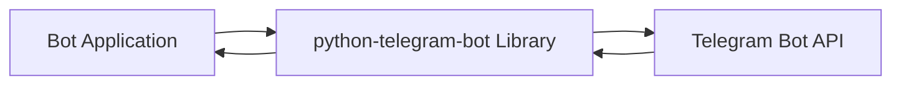
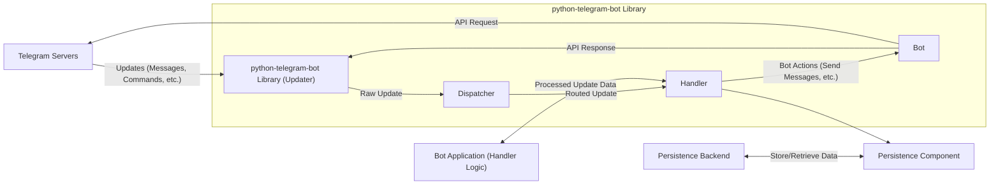

# Project Design Document: Python Telegram Bot Library

**Version:** 1.1
**Date:** October 26, 2023
**Prepared By:** Gemini (AI Language Model)

## 1. Introduction

This document provides an enhanced architectural design of the `python-telegram-bot` library (referenced from [https://github.com/python-telegram-bot/python-telegram-bot](https://github.com/python-telegram-bot/python-telegram-bot)). This design serves as a robust foundation for subsequent threat modeling activities, aiming to identify potential security vulnerabilities and risks associated with the library's functionality and usage. The improvements in this version focus on providing greater clarity and more specific details relevant to security analysis.

## 2. Goals

*   Clearly define the architectural components and their interactions within the `python-telegram-bot` library with enhanced detail.
*   Illustrate the data flow between the library, the Telegram Bot API, and the application utilizing the library, highlighting potential points of interest for security analysis.
*   Identify key interfaces and boundaries within the system, explicitly noting security implications.
*   Provide sufficient and specific detail for security experts to perform thorough and targeted threat modeling.

## 3. Non-Goals

*   Detailed design of specific bot implementations built using the library's features.
*   In-depth analysis of the internal workings of the Telegram Bot API itself beyond its interaction with the library.
*   Performance benchmarking or optimization strategies for the library.
*   Low-level implementation details of the underlying Python code within the library.

## 4. High-Level Architecture

The `python-telegram-bot` library acts as a crucial intermediary, abstracting the complexities of the Telegram Bot API and providing a Pythonic interface for bot developers. This architecture simplifies the creation of Telegram bots by handling low-level communication and data parsing.

*   **Bot Application:** The custom Python code written by a developer that leverages the `python-telegram-bot` library to define the specific logic and behavior of their Telegram bot.
*   **python-telegram-bot Library:** The core Python package responsible for managing communication with the Telegram Bot API, handling incoming updates from Telegram, and providing a structured way for the Bot Application to interact with the API.
*   **Telegram Bot API:** The external HTTP-based API provided by Telegram, which allows developers to programmatically control their bots, send and receive messages, and interact with users.

## 5. Component Details

The `python-telegram-bot` library is composed of several interconnected components, each with specific responsibilities:

*   **Updater:**
    *   Primary responsibility is fetching new updates from the Telegram Bot API.
    *   Supports two main modes of operation:
        *   **Polling:** Periodically sends requests to the Telegram API to check for new updates.
        *   **Webhooks:** Configures a URL where Telegram will send updates as they occur. This requires the bot application to be accessible over HTTPS.
    *   Manages the underlying HTTP connection and authentication using the provided bot token.
    *   Handles potential network errors and retries.
*   **Dispatcher:**
    *   Receives raw updates from the `Updater`.
    *   Analyzes the update type and content.
    *   Routes the update to the appropriate registered `Handler` based on predefined rules and filters.
    *   Manages a collection of different types of handlers.
*   **Handlers:**
    *   Define the logic to be executed when specific types of updates are received.
    *   Common handler types include:
        *   `CommandHandler`: Triggers on specific bot commands (e.g., `/start`).
        *   `MessageHandler`: Triggers on text messages, optionally filtered by content type (e.g., text, photo).
        *   `CallbackQueryHandler`: Triggers when users interact with inline keyboard buttons.
        *   `InlineQueryHandler`: Triggers when users type the bot's username in the chat input field.
        *   `ChosenInlineResultHandler`: Triggers when a user selects a result from an inline query.
        *   `PollHandler`, `PollAnswerHandler`: Handle poll and poll answer updates.
        *   `ChatMemberHandler`, `ChatJoinRequestHandler`: Handle updates related to chat members.
    *   Receive update information and a `CallbackContext` object.
*   **Bot:**
    *   Provides a set of methods that directly map to the Telegram Bot API endpoints.
    *   Encapsulates the logic for making API calls (e.g., `send_message`, `edit_message`, `send_photo`).
    *   Manages the bot's API token, which is used for authentication with the Telegram API.
    *   Handles serialization and deserialization of data for API requests and responses.
*   **Context Types:**
    *   Provide structured objects passed to handlers, containing relevant information about the incoming update and the current state.
    *   `CallbackContext`:  Allows sharing data between handlers and accessing bot-specific information. Can be used for storing conversation state.
    *   `ExtCallbackContext`: An extended version of `CallbackContext` offering more features.
*   **Persistence:**
    *   An optional component that allows bots to store and retrieve data.
    *   Supports various backend implementations, such as:
        *   Filesystem-based storage.
        *   Database integrations (e.g., SQLite, PostgreSQL, MongoDB).
        *   In-memory storage.
    *   Provides a consistent interface for saving and loading bot data, user data, and chat data.
*   **Utilities:**
    *   Offers helper functions and classes to simplify common tasks.
    *   Examples include tools for creating inline keyboards, formatting messages, and handling file uploads.

## 6. Data Flow

The following diagram illustrates the typical flow of data when a user interacts with a Telegram bot built using this library:

*   **Incoming Updates:** Telegram servers send various update types (messages, commands, button presses, etc.) to the bot. The delivery mechanism depends on whether polling or webhooks are configured.
*   **Updater Reception:** The `Updater` component within the library receives these raw updates from the Telegram API.
*   **Dispatcher Routing:** The `Dispatcher` analyzes the update and determines the appropriate `Handler` to process it based on defined rules.
*   **Handler Execution:** The matched `Handler` within the Bot Application is executed. It receives the update data and a `CallbackContext`.
*   **Bot Actions:** The `Handler` logic may interact with the `Bot` component to perform actions like sending messages back to the user, editing existing messages, or sending media.
*   **API Requests:** The `Bot` component constructs and sends API requests to the Telegram servers, including the bot's API token for authentication.
*   **API Responses:** Telegram servers send responses back to the `Bot` component, indicating the success or failure of the API call.
*   **Persistence Interaction (Optional):** The `Handler` may interact with the `Persistence` component to store or retrieve data related to the conversation, user preferences, or bot state.

## 7. Key Interfaces and Boundaries

*   **Telegram Bot API Endpoint:** The external HTTPS endpoint (`api.telegram.org`) that serves as the primary communication interface between the library and Telegram's infrastructure. Security measures here are largely outside the scope of the library itself, but the library's interaction with it is critical.
*   **Bot Application Interface (Library API):** The set of classes, methods, and event handlers provided by the `python-telegram-bot` library that developers use within their Bot Application code. This includes registering handlers, accessing the `Bot` instance, and utilizing utility functions. This is a crucial boundary for developers to understand for secure usage.
*   **Handler Interface:** The defined structure and expected input/output of handler functions. Developers must adhere to this interface for the `Dispatcher` to correctly route updates. Improperly designed handlers can introduce vulnerabilities.
*   **Persistence Interface:** The abstract interface provided by the `Persistence` component for storing and retrieving data. Different backend implementations adhere to this interface. Security considerations vary depending on the chosen backend.
*   **Configuration Interface:** How the bot's API token, webhook URL (if used), and other settings are provided to the library. This often involves environment variables, configuration files, or direct instantiation. Securely managing the API token at this interface is paramount.
*   **Webhook Endpoint (if used):** When using webhooks, the publicly accessible HTTPS endpoint configured to receive updates from Telegram. This endpoint is a critical security boundary that needs careful consideration.

## 8. Security Considerations (Detailed)

This section expands on the initial security considerations, providing more specific examples and potential threats.

*   **API Token Management:**
    *   **Threat:** Exposure of the bot's API token can allow an attacker to gain complete control of the bot, impersonate it, send unauthorized messages, and potentially access user data.
    *   **Considerations:** How does the library handle the token internally? Are there any logging or storage mechanisms that could inadvertently expose it? Developers must use secure methods for storing and providing the token (e.g., environment variables, secure vault).
*   **Input Validation:**
    *   **Threat:** Malicious users could send crafted updates designed to exploit vulnerabilities in the bot's logic or the library itself (e.g., command injection, cross-site scripting in messages, denial-of-service by sending large payloads).
    *   **Considerations:** How does the library sanitize or validate incoming data from Telegram? Are there any assumptions made about the format or content of updates? Developers need to implement robust input validation in their handlers.
*   **Webhook Security (if used):**
    *   **Threat:** If the webhook endpoint is not properly secured, attackers could send fake updates to the bot, triggering unintended actions or injecting malicious data.
    *   **Considerations:** The library supports verifying the authenticity of incoming webhook requests using the `secret_token`. Is this feature used and configured correctly? HTTPS is mandatory for webhooks to ensure confidentiality.
*   **Data Storage Security (if persistence is used):**
    *   **Threat:** If the bot stores sensitive data (user information, chat history), vulnerabilities in the persistence mechanism could lead to data breaches.
    *   **Considerations:** Does the library offer options for encrypting data at rest? What are the default security settings for different persistence backends? Developers need to choose appropriate storage solutions and configure them securely.
*   **Rate Limiting:**
    *   **Threat:** While not a direct vulnerability in the library, failing to handle Telegram's rate limits can lead to the bot being temporarily blocked, impacting availability.
    *   **Considerations:** Does the library provide any built-in mechanisms for handling rate limits (e.g., retries with backoff)? Developers need to be aware of these limits and design their bots accordingly.
*   **Error Handling:**
    *   **Threat:** Poor error handling can leak sensitive information in error messages or lead to unexpected behavior that attackers could exploit.
    *   **Considerations:** How does the library handle exceptions and errors during API calls and update processing? Are error messages sanitized before being logged or displayed?
*   **Dependency Management:**
    *   **Threat:** Vulnerabilities in third-party libraries that `python-telegram-bot` depends on could indirectly affect the security of bots using it.
    *   **Considerations:**  Regularly updating dependencies is crucial. Are there mechanisms for checking for known vulnerabilities in dependencies?
*   **Code Injection Risks in Handlers:**
    *   **Threat:** If developers dynamically execute code based on user input without proper sanitization, it can lead to arbitrary code execution on the bot's server.
    *   **Considerations:** This is primarily a developer responsibility, but the library's design should encourage secure coding practices.
*   **Denial of Service (DoS):**
    *   **Threat:** Attackers might try to overwhelm the bot with a large number of requests or large payloads, causing it to become unresponsive.
    *   **Considerations:** How does the library handle a high volume of incoming updates? Are there any built-in mechanisms for preventing DoS attacks? The choice of polling vs. webhooks can impact susceptibility to DoS.

## 9. Deployment Considerations (Security Focused)

Deploying a bot securely involves several considerations beyond the library itself:

*   **Secure Hosting Environment:** The infrastructure where the bot application runs must be secure. This includes proper OS hardening, security patching, and access controls. Cloud providers offer various security features that should be utilized.
*   **Network Security:** Firewall rules should be configured to restrict access to the bot's server. If using webhooks, ensure only Telegram's servers can reach the webhook endpoint (though IP address verification is generally discouraged due to Telegram's dynamic infrastructure).
*   **Secrets Management:**  The bot's API token and any other secrets (e.g., database credentials) must be stored and managed securely. Avoid hardcoding secrets in the code. Use environment variables, dedicated secrets management tools, or cloud provider services.
*   **Access Control:** Restrict access to the bot's code, configuration, and hosting environment to authorized personnel only. Use strong authentication and authorization mechanisms.
*   **Logging and Monitoring:** Implement comprehensive logging to track bot activity and detect potential security incidents. Monitor the bot's performance and resource usage for anomalies.
*   **HTTPS Configuration (for Webhooks):** Ensure the webhook endpoint is served over HTTPS with a valid SSL/TLS certificate. This protects the confidentiality and integrity of the communication between Telegram and the bot.
*   **Regular Updates:** Keep the `python-telegram-bot` library and its dependencies up-to-date to patch known security vulnerabilities.
*   **Security Audits and Penetration Testing:** Periodically conduct security audits and penetration testing to identify potential weaknesses in the bot's design and deployment.

This enhanced design document provides a more detailed and security-focused view of the `python-telegram-bot` library's architecture, aiming to facilitate a more comprehensive and effective threat modeling process.