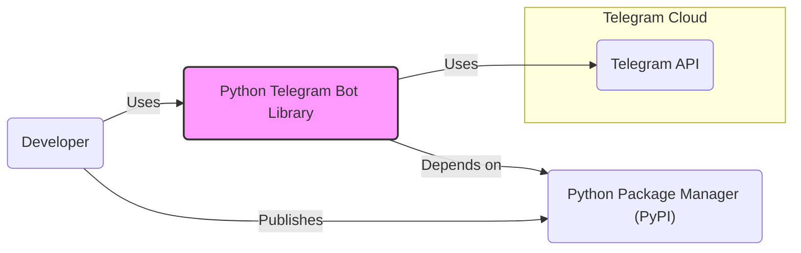
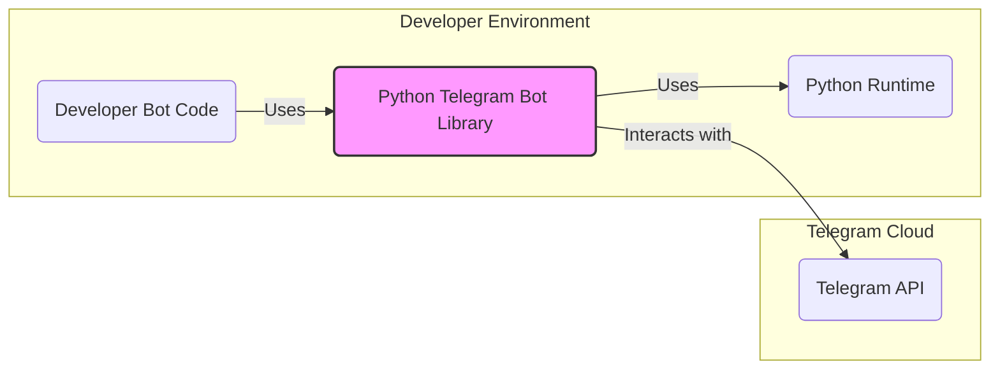
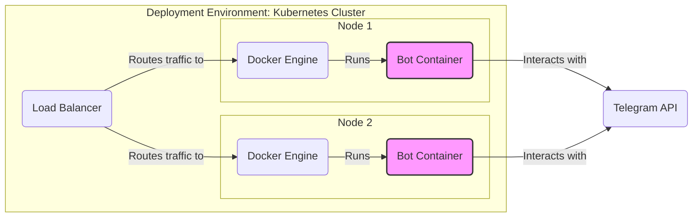
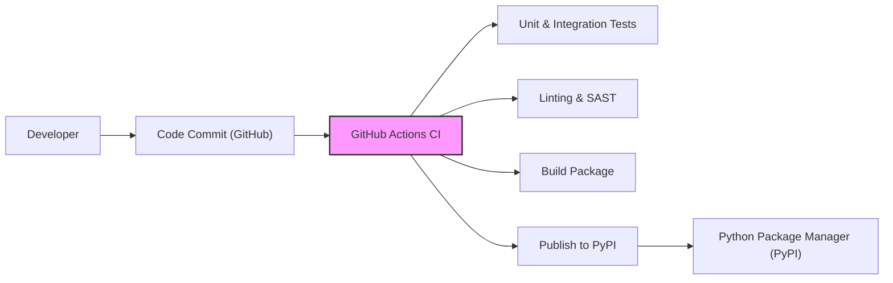

# BUSINESS POSTURE

- Business Priorities and Goals:
  - Provide a robust, reliable, and easy-to-use Python library for developers to create Telegram bots.
  - Foster a thriving community around the library, encouraging contributions and ensuring long-term maintenance.
  - Enable developers to quickly prototype and deploy Telegram bots for various use cases.
- Business Risks:
  - Reputational damage due to security vulnerabilities in the library, leading to user data breaches or bot compromises.
  - Decreased adoption if the library is perceived as insecure or difficult to use.
  - Lack of community support and maintenance if the project is not actively managed or contributions are not welcomed.
  - Legal and compliance issues if bots built with the library violate Telegram's terms of service or data privacy regulations.

# SECURITY POSTURE

- Existing Security Controls:
  - security control: Code hosted on GitHub, leveraging GitHub's infrastructure security. Implemented: GitHub platform.
  - security control: Publicly accessible issue tracker for reporting bugs and vulnerabilities. Implemented: GitHub Issues.
  - security control: Open-source nature allows for community code review and scrutiny. Implemented: Open GitHub repository.
- Accepted Risks:
  - accepted risk: Security vulnerabilities in user-developed bots due to improper use of the library or insecure coding practices.
  - accepted risk: Reliance on Telegram's API security; vulnerabilities in the Telegram API are outside the library's control.
  - accepted risk: Potential for supply chain attacks if dependencies are compromised (addressed by dependency management practices, but inherent risk remains).
- Recommended Security Controls:
  - security control: Implement automated Static Application Security Testing (SAST) in the CI/CD pipeline to identify potential code vulnerabilities.
  - security control: Implement Dependency Vulnerability Scanning to monitor and update vulnerable dependencies.
  - security control: Conduct periodic security audits of the library's codebase by security experts.
  - security control: Provide comprehensive security documentation for library users, outlining best practices for secure bot development.
  - security control: Establish a clear process for reporting and handling security vulnerabilities, including a security policy and contact information.
- Security Requirements:
  - Authentication:
    - Requirement: The library should securely handle Telegram Bot API tokens, preventing accidental exposure in logs or code.
    - Requirement: The library should encourage users to store API tokens securely, e.g., using environment variables or secure configuration management.
  - Authorization:
    - Requirement: The library should provide mechanisms for users to implement authorization logic within their bots to control access to bot functionalities.
    - Requirement: The library itself does not handle user authorization but should facilitate secure implementation by bot developers.
  - Input Validation:
    - Requirement: The library should provide tools and guidance for users to validate and sanitize user inputs received from Telegram to prevent injection attacks.
    - Requirement: The library's internal parsing of Telegram API responses should be robust and resistant to malformed or malicious data.
  - Cryptography:
    - Requirement: The library should utilize secure communication channels (HTTPS) for all interactions with the Telegram API.
    - Requirement: If the library provides any cryptographic functionalities (e.g., for data encryption), it should use well-vetted and secure cryptographic libraries and algorithms.

# DESIGN

## C4 CONTEXT

- Context Diagram Elements:
  - - Name: Developer
    - Type: Person
    - Description: Software developers who use the Python Telegram Bot Library to create Telegram bots.
    - Responsibilities: Develop Telegram bots using the library, deploy and maintain bots, adhere to security best practices.
    - Security controls: Secure development practices, secure storage of API tokens, input validation in bot logic.
  - - Name: Python Telegram Bot Library
    - Type: Software System
    - Description: A Python library that provides an interface to the Telegram Bot API, simplifying bot development.
    - Responsibilities: Provide a stable and secure API wrapper, handle communication with Telegram API, offer utilities for bot development.
    - Security controls: Input validation of API responses, secure handling of API tokens (within library code), adherence to secure coding practices.
  - - Name: Telegram API
    - Type: External System
    - Description: Telegram's official API for interacting with the Telegram platform and building bots.
    - Responsibilities: Provide bot functionalities, handle message routing, user authentication, and data storage for Telegram.
    - Security controls: Telegram's internal security measures, API authentication (Bot Tokens), rate limiting, encryption in transit (HTTPS).
  - - Name: Python Package Manager (PyPI)
    - Type: External System
    - Description: The Python Package Index, a repository for Python software packages, used to distribute the library.
    - Responsibilities: Host and distribute Python packages, manage package versions, provide package installation tools (pip).
    - Security controls: PyPI's infrastructure security, package signing (optional), malware scanning (to some extent).

## C4 CONTAINER

- Container Diagram Elements:
  - - Name: Developer Bot Code
    - Type: Application
    - Description: The Python code written by developers that utilizes the Python Telegram Bot Library to implement specific bot functionalities.
    - Responsibilities: Implement bot logic, handle user interactions, manage bot state, apply security best practices in bot implementation.
    - Security controls: Input validation, authorization logic, secure data handling, secure storage of sensitive information (if any).
  - - Name: Python Telegram Bot Library
    - Type: Library
    - Description: The core Python library providing classes and functions to interact with the Telegram Bot API.
    - Responsibilities: API request/response handling, data serialization/deserialization, providing abstractions for Telegram bot functionalities.
    - Security controls: Input validation of API responses, secure handling of API tokens (within library code), protection against common web vulnerabilities (e.g., in parsing).
  - - Name: Python Runtime
    - Type: Runtime Environment
    - Description: The Python interpreter and standard library required to execute both the Python Telegram Bot Library and developer bot code.
    - Responsibilities: Execute Python code, manage memory, provide access to system resources.
    - Security controls: Operating system level security controls, Python runtime security updates, virtual environment isolation (recommended for development).
  - - Name: Telegram API
    - Type: External System
    - Description: Telegram's official API for interacting with the Telegram platform and building bots. (Same as in Context Diagram)
    - Responsibilities: (Same as in Context Diagram)
    - Security controls: (Same as in Context Diagram)

## DEPLOYMENT

- Deployment Options:
  - Option 1: Serverless Functions (e.g., AWS Lambda, Google Cloud Functions, Azure Functions) - Bots are deployed as serverless functions, triggered by Telegram webhook events.
  - Option 2: Containerized Deployment (e.g., Docker, Kubernetes) - Bots are containerized and deployed to container orchestration platforms.
  - Option 3: Virtual Machines/Dedicated Servers - Bots are deployed directly on virtual machines or dedicated servers.
- Selected Deployment Architecture: Containerized Deployment (Docker)

- Deployment Diagram Elements:
  - - Name: Kubernetes Cluster
    - Type: Infrastructure
    - Description: A Kubernetes cluster providing container orchestration and management for bot deployments.
    - Responsibilities: Container scheduling, scaling, health monitoring, load balancing, service discovery.
    - Security controls: Kubernetes RBAC, network policies, pod security policies, secrets management, regular security updates.
  - - Name: Node 1 & Node 2
    - Type: Infrastructure (Compute Instance)
    - Description: Worker nodes within the Kubernetes cluster, providing compute resources for running Docker containers.
    - Responsibilities: Execute Docker containers, provide CPU, memory, and network resources.
    - Security controls: Operating system hardening, security patching, access control, network segmentation.
  - - Name: Docker Engine 1 & Docker Engine 2
    - Type: Container Runtime
    - Description: The Docker runtime environment running on each node, responsible for running and managing Docker containers.
    - Responsibilities: Container image management, container lifecycle management, resource isolation.
    - Security controls: Docker daemon security configuration, container image scanning, resource limits, seccomp profiles, AppArmor/SELinux.
  - - Name: Bot Container 1 & Bot Container 2
    - Type: Containerized Application
    - Description: Docker containers packaging the developer's bot code, Python Telegram Bot Library, and Python runtime.
    - Responsibilities: Execute bot logic, interact with Telegram API, handle bot functionalities.
    - Security controls: Security controls implemented within the bot code (as described in Container Diagram), container image built from secure base images, minimal container image.
  - - Name: Load Balancer
    - Type: Network Component
    - Description: Distributes incoming traffic across multiple bot container instances for scalability and availability.
    - Responsibilities: Traffic distribution, health checks, SSL termination (optional).
    - Security controls: DDoS protection, rate limiting, access control lists, TLS/SSL encryption.
  - - Name: Telegram API
    - Type: External System
    - Description: Telegram's official API for interacting with the Telegram platform. (Same as in Context Diagram)
    - Responsibilities: (Same as in Context Diagram)
    - Security controls: (Same as in Context Diagram)

## BUILD

- Build Process Description:
  - Developer commits code changes to the GitHub repository.
  - GitHub Actions CI pipeline is triggered on code commits.
  - CI pipeline performs the following steps:
    - Runs unit and integration tests to ensure code quality and functionality.
    - Executes linting and Static Application Security Testing (SAST) tools to identify code style issues and potential vulnerabilities.
    - Builds the Python package (e.g., using setuptools).
    - Publishes the built package to the Python Package Index (PyPI).
- Build Diagram Elements:
  - - Name: Developer
    - Type: Person
    - Description: Software developer contributing to the Python Telegram Bot Library.
    - Responsibilities: Write code, fix bugs, implement features, commit code changes.
    - Security controls: Secure development practices, code review (pull requests), adherence to coding standards.
  - - Name: Code Commit (GitHub)
    - Type: Version Control System
    - Description: Code changes committed to the GitHub repository, triggering the CI pipeline.
    - Responsibilities: Version control, code history tracking, collaboration platform.
    - Security controls: GitHub access controls, branch protection rules, commit signing (optional).
  - - Name: GitHub Actions CI
    - Type: CI/CD System
    - Description: GitHub's built-in CI/CD service used to automate the build, test, and publish process.
    - Responsibilities: Automated build pipeline execution, test automation, linting, SAST, package building, publishing.
    - Security controls: GitHub Actions secrets management, workflow permissions, secure runner environment, dependency scanning.
  - - Name: Unit & Integration Tests
    - Type: Automated Tests
    - Description: Automated tests to verify the functionality and correctness of the library code.
    - Responsibilities: Ensure code quality, detect regressions, improve code reliability.
    - Security controls: Test coverage for security-relevant functionalities, secure test data management.
  - - Name: Linting & SAST
    - Type: Security Tooling
    - Description: Static analysis tools to identify code style issues and potential security vulnerabilities.
    - Responsibilities: Code quality enforcement, early vulnerability detection, adherence to coding standards.
    - Security controls: Regularly updated SAST rules, configuration to detect relevant vulnerability types.
  - - Name: Build Package
    - Type: Build Process
    - Description: The process of packaging the library code into a distributable format (e.g., a Python wheel or sdist).
    - Responsibilities: Package creation, metadata generation, ensuring package integrity.
    - Security controls: Secure build environment, verification of build artifacts.
  - - Name: Publish to PyPI
    - Type: Package Publishing
    - Description: The process of uploading the built package to the Python Package Index (PyPI) for distribution.
    - Responsibilities: Package distribution, version management, making the library available to users.
    - Security controls: PyPI API key security, package signing (optional), verification of package integrity before publishing.
  - - Name: Python Package Manager (PyPI)
    - Type: External System
    - Description: The Python Package Index, hosting the published Python Telegram Bot Library. (Same as in Context Diagram)
    - Responsibilities: (Same as in Context Diagram)
    - Security controls: (Same as in Context Diagram)

# RISK ASSESSMENT

- Critical Business Processes:
  - Providing a secure, reliable, and usable Python library for Telegram bot development.
  - Maintaining the integrity and availability of the library's codebase and distribution channels.
  - Protecting the reputation of the project and the trust of the developer community.
- Data to Protect and Sensitivity:
  - Library Source Code: Publicly available, but integrity and availability are critical. Unauthorized modifications or deletion could severely impact the project. Sensitivity: Medium (Integrity and Availability).
  - PyPI Package: Publicly available, but integrity is crucial. Compromised packages could lead to widespread security issues for users. Sensitivity: High (Integrity).
  - GitHub Repository: Contains code, issues, and project management data. Availability and integrity are important for project continuity. Sensitivity: Medium (Integrity and Availability).
  - API Tokens (within library code - should be minimal): If accidentally exposed, could lead to unauthorized access to Telegram Bot API. Sensitivity: High (Confidentiality, Integrity, Availability).

# QUESTIONS & ASSUMPTIONS

- Questions:
  - What is the target risk appetite for this project? (Assuming moderate to high, typical for open-source projects).
  - Are there any specific compliance requirements that the library needs to adhere to (e.g., data privacy regulations)? (Assuming general best practices for data handling and security).
  - What is the process for handling security vulnerabilities reported by the community? (Assuming a public disclosure process after a reasonable fix timeframe).
- Assumptions:
  - The primary goal is to provide a secure and usable library for developers.
  - Users of the library are responsible for the security of the bots they build using it.
  - The project relies on the security of underlying platforms and services like GitHub, PyPI, and Telegram API.
  - Security is a shared responsibility between the library developers and the users.
  - The project benefits from the open-source community's scrutiny and contributions to security.