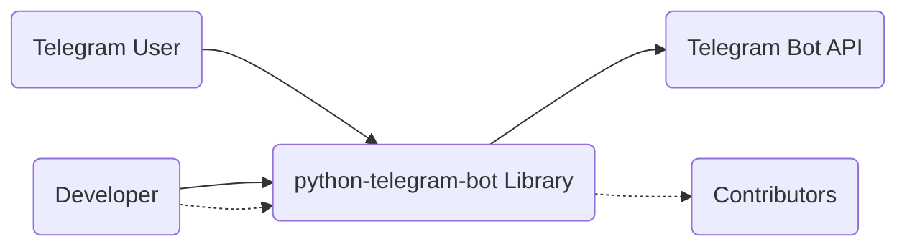
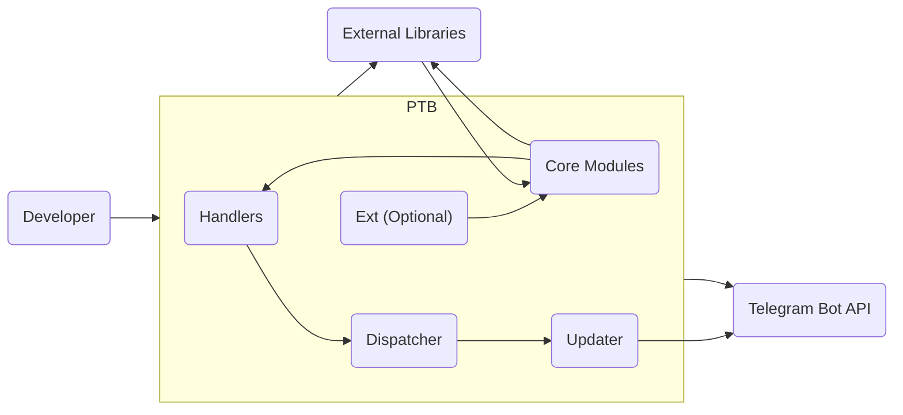
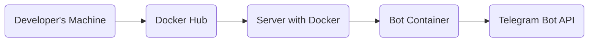
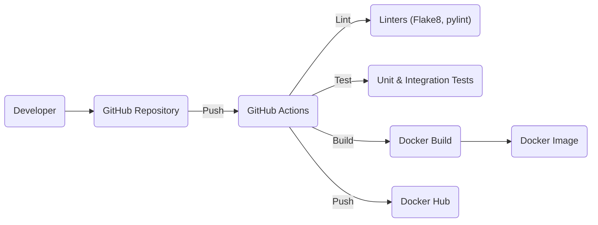

# BUSINESS POSTURE

Business Priorities and Goals:

*   Provide a user-friendly and reliable Python framework for building Telegram bots.
*   Maintain a high level of compatibility with the official Telegram Bot API.
*   Foster a strong and active open-source community around the project.
*   Ensure the library is easy to use, well-documented, and well-maintained.
*   Enable developers to create a wide variety of Telegram bots, from simple utilities to complex applications.
*   Provide asynchronous and synchronous versions of the library.

Most Important Business Risks:

*   Compromise of Telegram bots built using the library, leading to data breaches or malicious activities.
*   Inability to keep up with changes to the Telegram Bot API, rendering the library outdated or unusable.
*   Loss of community trust due to security vulnerabilities or poor maintenance.
*   Lack of adoption due to complexity or poor documentation.
*   Reputational damage due to security incidents involving bots built with the library.

# SECURITY POSTURE

Existing Security Controls:

*   security control: Code reviews: The project uses GitHub's pull request system for code reviews, ensuring that changes are reviewed by multiple contributors before being merged. (Described in CONTRIBUTING.md)
*   security control: Automated testing: The project has an extensive test suite that is run automatically on each pull request, helping to catch bugs and regressions. (Described in CONTRIBUTING.md and visible in GitHub Actions workflows)
*   security control: Static analysis: The project uses static analysis tools like Flake8 and pylint to enforce code style and identify potential issues. (Described in CONTRIBUTING.md and visible in GitHub Actions workflows)
*   security control: Dependency management: Dependencies are managed using `requirements.txt` and `setup.py` files, and automated checks are in place to identify known vulnerabilities in dependencies. (Visible in GitHub Actions workflows and project files)
*   security control: Documentation: The project has extensive documentation, including security considerations and best practices. (Available on Read the Docs)
*   security control: Issue tracking: Security vulnerabilities can be reported through GitHub's issue tracker. (Described in CONTRIBUTING.md)

Accepted Risks:

*   accepted risk: Reliance on third-party libraries: The library depends on external libraries, which could introduce vulnerabilities. This risk is mitigated by dependency management and vulnerability scanning.
*   accepted risk: User-provided code: The library executes user-provided code, which could contain vulnerabilities. This is inherent to the nature of the project and is mitigated by user awareness and security best practices.
*   accepted risk: Telegram API limitations: The library's security is ultimately limited by the security of the Telegram Bot API itself.

Recommended Security Controls:

*   security control: Implement a Content Security Policy (CSP) if applicable (e.g., if any webhooks are used).
*   security control: Regularly audit dependencies for vulnerabilities and update them promptly. Consider using automated tools like Dependabot.
*   security control: Provide clear guidelines and examples for securely handling user input and avoiding common vulnerabilities like command injection.
*   security control: Consider adding more advanced static analysis tools, such as Bandit, to specifically check for security vulnerabilities.
*   security control: Implement fuzz testing to identify potential vulnerabilities in input handling.

Security Requirements:

*   Authentication:
    *   The library must correctly handle Telegram Bot API tokens, ensuring they are stored and used securely.
    *   If webhooks are used, the library should provide mechanisms for verifying the authenticity of incoming requests from Telegram (e.g., checking the `X-Telegram-Bot-Api-Secret-Token` header).
*   Authorization:
    *   The library itself does not handle authorization, as this is typically managed by the bot developer within their application logic. However, the documentation should provide guidance on implementing authorization best practices.
*   Input Validation:
    *   The library should provide utilities or guidance for validating user input to prevent common vulnerabilities like command injection and cross-site scripting (XSS).
    *   The library should handle different types of Telegram updates (e.g., messages, callback queries, inline queries) securely, ensuring that data is properly parsed and validated.
*   Cryptography:
    *   The library should use secure cryptographic practices when handling sensitive data, such as API tokens and user data.
    *   HTTPS should be enforced for all communication with the Telegram API. The library already uses the `urllib3` library, which handles HTTPS by default.

# DESIGN

## C4 CONTEXT

Element Descriptions:

*   Element:
    *   Name: Telegram User
    *   Type: Person
    *   Description: A user interacting with a Telegram bot built using the python-telegram-bot library.
    *   Responsibilities: Sends messages, interacts with bot commands, receives responses from the bot.
    *   Security controls: Relies on Telegram's platform security.

*   Element:
    *   Name: python-telegram-bot Library
    *   Type: Software System
    *   Description: A Python framework for building Telegram bots.
    *   Responsibilities: Provides an interface for interacting with the Telegram Bot API, handles updates, manages bot logic.
    *   Security controls: Code reviews, automated testing, static analysis, dependency management, documentation, issue tracking.

*   Element:
    *   Name: Telegram Bot API
    *   Type: External System
    *   Description: The official API provided by Telegram for interacting with bots.
    *   Responsibilities: Receives requests from bots, sends updates to bots, manages bot interactions.
    *   Security controls: Relies on Telegram's platform security.

*   Element:
    *   Name: Developer
    *   Type: Person
    *   Description: A developer who uses the python-telegram-bot library to build Telegram bots.
    *   Responsibilities: Writes bot logic, integrates the library, deploys the bot.
    *   Security controls: Responsible for implementing secure coding practices within their bot application.

*   Element:
    *   Name: Contributors
    *   Type: Person
    *   Description: Open source contributors to the python-telegram-bot library.
    *   Responsibilities: Contribute code, documentation, and support to the project.
    *   Security controls: Follow the project's contribution guidelines, including code reviews and testing.

## C4 CONTAINER

Since `python-telegram-bot` is a library, the container diagram is essentially an expanded view of the library itself, showing its major components.

Element Descriptions:

*   Element:
    *   Name: Developer
    *   Type: Person
    *   Description: A developer who uses the python-telegram-bot library to build Telegram bots.
    *   Responsibilities: Writes bot logic, integrates the library, deploys the bot.
    *   Security controls: Responsible for implementing secure coding practices within their bot application.

*   Element:
    *   Name: python-telegram-bot Library
    *   Type: Software System
    *   Description: A Python framework for building Telegram bots.
    *   Responsibilities: Provides an interface for interacting with the Telegram Bot API, handles updates, manages bot logic.
    *   Security controls: Code reviews, automated testing, static analysis, dependency management, documentation, issue tracking.

*   Element:
    *   Name: Telegram Bot API
    *   Type: External System
    *   Description: The official API provided by Telegram for interacting with bots.
    *   Responsibilities: Receives requests from bots, sends updates to bots, manages bot interactions.
    *   Security controls: Relies on Telegram's platform security.

*   Element:
    *   Name: External Libraries
    *   Type: Library
    *   Description: External Python libraries used by python-telegram-bot (e.g., urllib3, certifi).
    *   Responsibilities: Provide functionalities like HTTP requests, SSL certificate verification.
    *   Security controls: Dependency management, vulnerability scanning.

*   Element:
    *   Name: Core Modules
    *   Type: Module
    *   Description: Core functionalities of the library (e.g., bot, update, base classes).
    *   Responsibilities: Provide fundamental building blocks for bot development.
    *   Security controls: Code reviews, automated testing, static analysis.

*   Element:
    *   Name: Handlers
    *   Type: Module
    *   Description: Modules for handling different types of Telegram updates (e.g., message handlers, callback query handlers).
    *   Responsibilities: Process incoming updates and trigger corresponding actions.
    *   Security controls: Code reviews, automated testing, static analysis, input validation (within developer's implementation).

*   Element:
    *   Name: Dispatcher
    *   Type: Module
    *   Description: Routes updates to the appropriate handlers.
    *   Responsibilities: Manages the flow of updates within the library.
    *   Security controls: Code reviews, automated testing, static analysis.

*   Element:
    *   Name: Updater
    *   Type: Module
    *   Description: Fetches updates from the Telegram Bot API.
    *   Responsibilities: Polls the API for new updates or sets up webhooks.
    *   Security controls: Code reviews, automated testing, static analysis, secure communication with the API (HTTPS).

*   Element:
    *   Name: Ext (Optional)
    *   Type: Module
    *   Description: Optional extensions and utilities (e.g., persistence, job queue).
    *   Responsibilities: Provide additional functionalities for bot development.
    *   Security controls: Code reviews, automated testing, static analysis.

## DEPLOYMENT

Deployment options for bots built with `python-telegram-bot` are diverse, ranging from simple local execution to complex cloud deployments. Here are a few possibilities:

1.  **Local Execution:** Running the bot script directly on a developer's machine or a dedicated server.
2.  **Cloud Platforms (PaaS):** Deploying the bot to platforms like Heroku, PythonAnywhere, Google App Engine, AWS Elastic Beanstalk, etc.
3.  **Virtual Machines (IaaS):** Deploying the bot on a virtual machine from providers like AWS EC2, Google Compute Engine, Azure Virtual Machines, etc.
4.  **Containers (Docker):** Containerizing the bot and deploying it using Docker, potentially with orchestration tools like Kubernetes or Docker Compose.
5.  **Serverless Functions:** Using serverless platforms like AWS Lambda, Google Cloud Functions, or Azure Functions to handle bot logic.

We'll describe the **Containers (Docker)** deployment in detail, as it offers a good balance of flexibility, portability, and security.

Element Descriptions:

*   Element:
    *   Name: Developer's Machine
    *   Type: Infrastructure Node
    *   Description: The developer's local machine where the bot code is written and the Docker image is built.
    *   Responsibilities: Code development, Docker image building, pushing the image to a registry.
    *   Security controls: Local development environment security, secure coding practices.

*   Element:
    *   Name: Docker Hub
    *   Type: Container Registry
    *   Description: A public container registry where the Docker image is stored. (Could also be a private registry).
    *   Responsibilities: Stores the Docker image, makes it available for deployment.
    *   Security controls: Registry access controls, image vulnerability scanning (if available).

*   Element:
    *   Name: Server with Docker
    *   Type: Infrastructure Node
    *   Description: A server (physical or virtual) with Docker installed.
    *   Responsibilities: Runs the Docker engine, pulls the image from the registry, runs the container.
    *   Security controls: Server security (firewall, OS hardening, etc.), Docker daemon security.

*   Element:
    *   Name: Bot Container
    *   Type: Container
    *   Description: A running instance of the Docker image containing the bot application.
    *   Responsibilities: Executes the bot logic, communicates with the Telegram Bot API.
    *   Security controls: Container isolation, limited container privileges, secure communication with the API (HTTPS).

*   Element:
    *   Name: Telegram Bot API
    *   Type: External System
    *   Description: The official API provided by Telegram for interacting with bots.
    *   Responsibilities: Receives requests from bots, sends updates to bots, manages bot interactions.
    *   Security controls: Relies on Telegram's platform security.

## BUILD

The build process for a bot using `python-telegram-bot` typically involves the following steps:

1.  **Development:** The developer writes the bot code using the library.
2.  **Dependency Management:** Dependencies are managed using `requirements.txt` or `setup.py`.
3.  **Testing:** The developer runs unit tests and integration tests to ensure the bot works correctly.
4.  **Containerization (Optional):** If using Docker, the developer creates a `Dockerfile` to define the bot's environment and dependencies.
5.  **Image Building (Optional):** The Docker image is built using the `docker build` command.
6.  **Image Pushing (Optional):** The Docker image is pushed to a container registry (e.g., Docker Hub).

For a more robust and secure build process, especially in a collaborative environment, a CI/CD pipeline is recommended. Here's an example using GitHub Actions:

Element Descriptions:

*   Element:
    *   Name: Developer
    *   Type: Person
    *   Description: A developer working on the bot code.
    *   Responsibilities: Writes code, commits changes, pushes to the repository.
    *   Security controls: Local development environment security, secure coding practices.

*   Element:
    *   Name: GitHub Repository
    *   Type: Code Repository
    *   Description: The repository hosting the bot's source code.
    *   Responsibilities: Stores the code, tracks changes, triggers CI/CD workflows.
    *   Security controls: Repository access controls, branch protection rules.

*   Element:
    *   Name: GitHub Actions
    *   Type: CI/CD Platform
    *   Description: The CI/CD platform used to automate the build process.
    *   Responsibilities: Runs linters, tests, builds the Docker image, pushes the image to the registry.
    *   Security controls: Secure configuration of workflows, use of secrets management.

*   Element:
    *   Name: Linters (Flake8, pylint)
    *   Type: Tool
    *   Description: Static analysis tools used to enforce code style and identify potential issues.
    *   Responsibilities: Checks the code for style violations and potential errors.
    *   Security controls: Configuration of linters to enforce security best practices.

*   Element:
    *   Name: Tests (Unit & Integration Tests)
    *   Type: Test Suite
    *   Description: Automated tests to ensure the bot's functionality.
    *   Responsibilities: Verifies that the code works as expected.
    *   Security controls: Thorough test coverage, including security-related test cases.

*   Element:
    *   Name: Docker Build
    *   Type: Process
    *   Description: The process of building the Docker image.
    *   Responsibilities: Creates the Docker image based on the `Dockerfile`.
    *   Security controls: Use of minimal base images, secure handling of secrets during build.

*   Element:
    *   Name: Docker Image
    *   Type: Artifact
    *   Description: The built Docker image containing the bot application.
    *   Responsibilities: Packages the bot and its dependencies for deployment.
    *   Security controls: Image vulnerability scanning (can be integrated into the CI/CD pipeline).

*   Element:
    *   Name: Docker Hub
    *   Type: Container Registry
    *   Description: A public container registry where the Docker image is stored. (Could also be a private registry).
    *   Responsibilities: Stores the Docker image, makes it available for deployment.
    *   Security controls: Registry access controls, image vulnerability scanning (if available).

# RISK ASSESSMENT

Critical Business Processes to Protect:

*   User interaction with the bot: Ensuring the bot responds correctly and securely to user requests.
*   Data handling: Protecting user data and preventing unauthorized access or modification.
*   Bot availability: Maintaining the bot's uptime and preventing denial-of-service attacks.
*   Reputation: Preventing the bot from being used for malicious purposes, which could damage the reputation of the developer and the library.

Data to Protect and Sensitivity:

*   Telegram User IDs: Potentially Personally Identifiable Information (PII), depending on the bot's functionality and the user's privacy settings. Sensitivity: Medium.
*   Chat History: Potentially sensitive information, depending on the content of the conversations. Sensitivity: Medium to High.
*   User-provided data: Any data provided by the user to the bot, which could include PII, financial information, or other sensitive data. Sensitivity: Varies depending on the data.
*   Bot API Token: Highly sensitive credential that grants full access to the bot. Sensitivity: High.
*   Webhook Secret Token (if used): Sensitive credential used to verify the authenticity of incoming requests from Telegram. Sensitivity: High.

# QUESTIONS & ASSUMPTIONS

Questions:

*   Are there any specific compliance requirements (e.g., GDPR, CCPA) that the bots built with this library need to adhere to?
*   What is the expected scale of usage for bots built with this library (e.g., number of users, message volume)?
*   Are there any specific security concerns or past incidents related to Telegram bots that should be considered?
*   What level of support is provided for developers to address security vulnerabilities in their bots?

Assumptions:

*   BUSINESS POSTURE: The primary goal is to provide a functional and user-friendly library, with security as a high priority but not necessarily the absolute top priority.
*   SECURITY POSTURE: Developers using the library have a basic understanding of security best practices and are responsible for implementing them in their bot applications.
*   DESIGN: The library's design prioritizes ease of use and flexibility, while still providing mechanisms for secure development. The deployment environment is not controlled by the library maintainers, and developers are responsible for securing their chosen deployment environment.