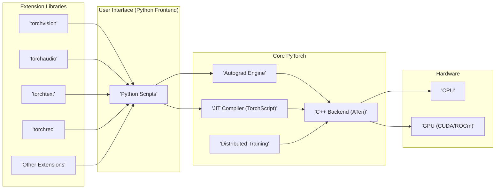
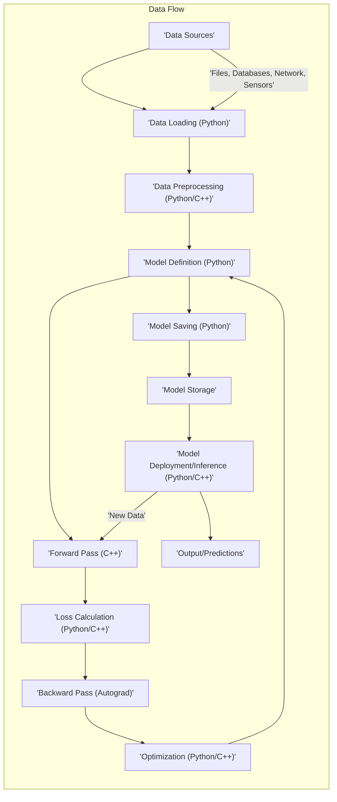

## Project Design Document: PyTorch (Improved)

**1. Introduction**

This document provides an enhanced architectural overview of the PyTorch project, specifically tailored for subsequent threat modeling activities. PyTorch is a widely adopted open-source machine learning framework used extensively for both research and production deployments. This document details its key components, data flow, and interactions to facilitate a thorough identification of potential security vulnerabilities.

**2. Goals and Objectives**

*   Provide a clear, concise, and detailed description of the PyTorch architecture, emphasizing security-relevant aspects.
*   Identify and describe key components and their interactions, highlighting potential security implications.
*   Outline the typical data flow within the PyTorch ecosystem, pinpointing stages where security controls are crucial.
*   Serve as a robust foundation for conducting a comprehensive threat model of the PyTorch project.
*   Highlight potential areas of security concern, providing specific examples for further investigation and analysis.

**3. System Architecture**

PyTorch's architecture is structured in distinct layers, each with specific responsibilities:

*   **User Interface (Python Frontend):** This is the primary point of interaction for users. It offers a high-level Python API for defining, training, and deploying neural networks. This layer handles user input and orchestrates the underlying components.
*   **C++ Backend (ATen - A Tensor Library):** This layer forms the computational core of PyTorch, providing highly optimized tensor operations. Written in C++, it ensures performance and efficiency for computationally intensive tasks.
*   **Autograd Engine:** This critical component automatically calculates gradients for backpropagation, a fundamental process in training neural networks. It tracks operations on tensors to compute gradients efficiently.
*   **Just-In-Time (JIT) Compiler (TorchScript):** This component enables the optimization and serialization of PyTorch models. TorchScript allows models to be saved and executed independently of the Python interpreter, facilitating deployment in various environments and languages.
*   **Distributed Training Components (torch.distributed):** These components facilitate the parallel training of models across multiple GPUs and machines, significantly reducing training time for large models. They handle communication and synchronization between different processes.
*   **Extension Libraries (e.g., torchvision, torchaudio, torchtext, torchrec):** These libraries provide domain-specific functionalities, extending PyTorch's capabilities for areas like computer vision, audio processing, natural language processing, and recommendation systems.
*   **Hardware Abstraction Layer (e.g., CUDA, ROCm, CPU):** This layer allows PyTorch to execute computations on different hardware platforms, abstracting away the underlying hardware details. It interfaces with specific drivers and libraries for each platform.

**4. Data Flow**

The typical data flow within PyTorch encompasses several key stages, each presenting potential security considerations:

*   **Data Acquisition:** Data is obtained from various sources, including local files, network locations, databases, and sensors. The security of these sources is paramount.
*   **Data Loading:** Data is read from the acquisition points and loaded into PyTorch tensors, often involving deserialization processes that can be vulnerable.
*   **Data Preprocessing and Augmentation:** Data is transformed and prepared for model training. This may involve normalization, cleaning, and augmentation techniques, some of which could introduce vulnerabilities if not handled carefully.
*   **Model Definition:** Neural network architectures are defined using PyTorch's Python API. The complexity and design of the model can impact its susceptibility to adversarial attacks.
*   **Forward Pass:** Input data is fed through the defined model to generate predictions. This involves complex computations within the C++ backend.
*   **Loss Calculation:** The difference between the model's predictions and the actual ground truth is calculated using a defined loss function.
*   **Backward Pass (Autograd):** Gradients are computed automatically by the Autograd engine to determine how to adjust the model's parameters.
*   **Optimization:** Model parameters are updated based on the calculated gradients using an optimization algorithm.
*   **Model Saving/Serialization:** Trained models are saved to persistent storage, often using serialization formats like `pickle`, which can pose security risks if not handled properly.
*   **Model Deployment/Inference:** Saved models are loaded and used to make predictions on new, unseen data. This stage can involve serving models through APIs, which requires careful security considerations.

**5. Key Interactions and Integrations**

PyTorch's functionality is significantly enhanced through interactions with various external systems and libraries. These integrations introduce potential security considerations:

*   **NumPy and SciPy:** Used for fundamental numerical and scientific computations. Vulnerabilities in these libraries could impact PyTorch.
*   **Operating System:** PyTorch relies on the OS for file system access, process management, network communication, and memory management. OS-level vulnerabilities can be exploited.
*   **Hardware Drivers (e.g., CUDA, ROCm drivers):** Essential for utilizing GPUs. Malicious drivers or vulnerabilities in drivers can compromise the system.
*   **Cloud Platforms (e.g., AWS, Azure, GCP):** Often used for training and deploying large models. Security misconfigurations in cloud environments can expose PyTorch deployments.
*   **Containerization Technologies (e.g., Docker, Kubernetes):** Used for packaging and deploying PyTorch applications. Vulnerabilities in container images or orchestration platforms can be exploited.
*   **ONNX (Open Neural Network Exchange):** Enables interoperability with other machine learning frameworks. Loading untrusted ONNX models can introduce security risks.
*   **C++ Extensions:** Allow users to write custom, performance-critical operations in C++. These extensions can introduce vulnerabilities if not developed with security in mind (e.g., buffer overflows, memory leaks).
*   **Python Ecosystem (e.g., Pandas, Scikit-learn):** Integrates with a wide range of Python libraries for data manipulation, preprocessing, and analysis. Vulnerabilities in these libraries can indirectly affect PyTorch applications.
*   **Networking Libraries (e.g., `torch.distributed`, RPC):** Used for distributed training and communication between nodes. Insecure network configurations or protocols can be exploited.

**6. Security Considerations (Detailed)**

Based on the architecture, data flow, and interactions, the following security considerations warrant careful attention:

*   **Supply Chain Security:**
    *   **Dependency Management:**  Ensure all dependencies (Python packages, C++ libraries) are from trusted sources and their integrity is verified. Use tools for dependency scanning and vulnerability detection.
    *   **Third-Party Code Review:**  Carefully review any third-party code integrated into PyTorch or used in conjunction with it, especially C++ extensions.
*   **Code Injection Vulnerabilities:**
    *   **C++ Extensions:**  Implement robust input validation and sanitization in custom C++ extensions to prevent buffer overflows, format string bugs, and other memory corruption issues.
    *   **Model Loading:**  Avoid using insecure deserialization methods like `pickle` for loading models from untrusted sources. Explore safer alternatives or implement rigorous integrity checks.
*   **Denial of Service (DoS) Attacks:**
    *   **Resource Exhaustion:** Implement resource limits (CPU, memory, GPU) to prevent malicious actors from exhausting system resources.
    *   **Input Validation:**  Thoroughly validate input data to prevent excessively large or malformed inputs that could lead to performance degradation or crashes.
*   **Data Security and Privacy:**
    *   **Data at Rest:** Encrypt sensitive training data and model parameters stored on disk. Implement strong access controls to restrict access.
    *   **Data in Transit:** Encrypt data transmitted over the network, especially during distributed training or when serving models via APIs (use TLS/SSL).
    *   **Privacy-Preserving Techniques:** Consider using techniques like federated learning or differential privacy when dealing with sensitive data.
*   **Model Poisoning Attacks:**
    *   **Data Integrity:** Implement mechanisms to verify the integrity of training data and detect malicious modifications.
    *   **Secure Training Pipelines:** Secure the training environment and infrastructure to prevent unauthorized access and manipulation.
*   **Adversarial Attacks:**
    *   **Robustness Testing:**  Evaluate the model's resilience against adversarial examples.
    *   **Adversarial Training:**  Train models with adversarial examples to improve their robustness.
*   **Distributed Training Security:**
    *   **Authentication and Authorization:** Implement strong authentication and authorization mechanisms for nodes participating in distributed training.
    *   **Secure Communication:** Use secure communication protocols (e.g., TLS) for all communication between distributed training nodes.
*   **Vulnerabilities in Native Libraries:**
    *   **Regular Updates:** Keep PyTorch and all its dependencies (including CUDA drivers, system libraries) up-to-date to patch known vulnerabilities.
    *   **Security Monitoring:**  Monitor security advisories and vulnerability databases for any reported issues affecting PyTorch or its dependencies.
*   **Serialization/Deserialization Vulnerabilities:**
    *   **Secure Formats:** Prefer safer serialization formats over `pickle` when dealing with untrusted data or models.
    *   **Integrity Checks:** Implement cryptographic signatures or checksums to verify the integrity of loaded model files.
*   **API Security (for deployed models):**
    *   **Authentication and Authorization:** Implement robust authentication and authorization mechanisms for accessing deployed models via APIs.
    *   **Input Validation:**  Thoroughly validate input data sent to the API to prevent injection attacks and other vulnerabilities.
    *   **Rate Limiting:** Implement rate limiting to prevent abuse and denial-of-service attacks.

**7. Assumptions and Constraints**

*   This document provides a high-level architectural overview and does not delve into the implementation details of every single module or function within PyTorch.
*   The primary focus is on the core PyTorch framework and its most common integration points.
*   The security considerations listed are intended to be comprehensive but may not cover every possible vulnerability. A thorough threat modeling exercise is necessary for a complete assessment.
*   The architecture and features of PyTorch are continuously evolving, so this document represents a snapshot in time.

**8. Future Considerations**

*   Develop more detailed diagrams for specific security-sensitive components (e.g., the Autograd engine, distributed training modules).
*   Create granular data flow diagrams for specific use cases, highlighting trust boundaries and potential attack vectors.
*   Conduct a formal threat modeling exercise using methodologies like STRIDE or PASTA to systematically identify and categorize threats.
*   Develop specific security recommendations and mitigation strategies for the identified threats.
*   Regularly update this design document to reflect changes in the PyTorch architecture and emerging security threats.
