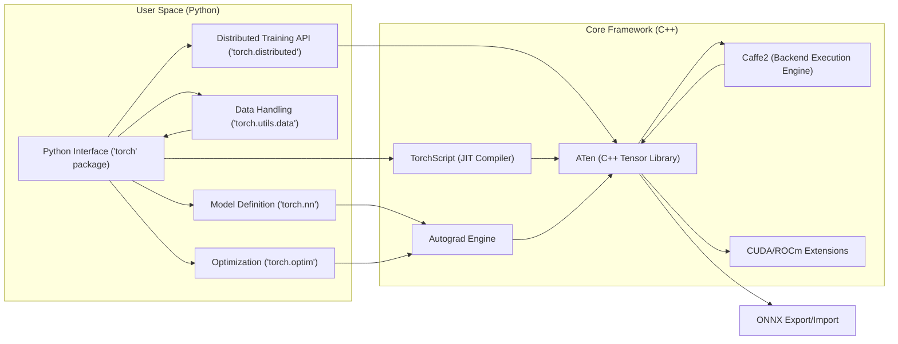
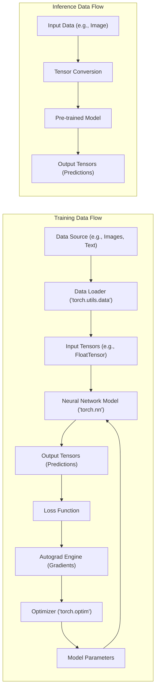

## Project Design Document: PyTorch Framework for Threat Modeling (Improved)

**1. Introduction**

This document provides a detailed architectural overview of the PyTorch framework, specifically tailored for subsequent threat modeling activities. It elaborates on the key components, their intricate interactions, and the flow of various data types within the system. The purpose is to establish a solid foundation for identifying potential security vulnerabilities and informing the design of appropriate mitigation strategies. This document is intended to be a resource for security engineers, developers, and anyone involved in ensuring the security of PyTorch-based systems.

**2. System Overview**

PyTorch is a widely adopted open-source machine learning framework, primarily developed by Meta's AI Research lab (FAIR). It offers a rich ecosystem for developing, training, and deploying deep learning models. The framework's core is implemented in C++ for optimal performance, complemented by a user-friendly and expressive Python interface. PyTorch supports both CPU and GPU acceleration, making it versatile for various computational needs, and is extensively used in both academic research and industrial applications.

**3. Architectural Diagram**

**4. Key Components and their Functionality**

* **Python Interface (`torch` package):**
    * Serves as the primary interaction point for users.
    * Provides high-level, Pythonic APIs for:
        * **Tensor manipulation:** Creating, transforming, and performing operations on tensors.
        * **Model definition (`torch.nn`):** Building neural network architectures using pre-defined layers or custom modules.
        * **Data handling (`torch.utils.data`):**  Efficiently loading, preprocessing, and batching datasets.
        * **Optimization (`torch.optim`):** Implementing various optimization algorithms for training models.
        * **Distributed training API (`torch.distributed`):** Facilitating model training across multiple devices and machines.
    * Acts as a wrapper around the underlying C++ functionalities, offering a user-friendly abstraction.

* **TorchScript (JIT Compiler):**
    * Enables the Just-In-Time compilation and serialization of PyTorch models.
    * Allows for:
        * **Performance optimization:** By compiling Python code into optimized intermediate representations.
        * **Deployment without Python:** Running models in environments where the Python interpreter is not available.
        * **Interoperability:** Facilitating model exchange and deployment across different platforms.

* **ATen (A Tensor Library):**
    * The foundational C++ tensor library at the heart of PyTorch.
    * Provides highly optimized implementations of fundamental mathematical operations on tensors.
    * Supports various data types and hardware backends (CPU, CUDA, ROCm).
    * Forms the bedrock for both low-level computations and higher-level functionalities.

* **Caffe2 (Backend Execution Engine):**
    * The core execution engine responsible for the low-level execution of tensor operations.
    * Manages the actual computation on the target hardware (CPU or GPU).
    * Performs graph optimization to enhance execution efficiency.
    * Handles memory management and kernel dispatch.

* **Autograd Engine:**
    * The automatic differentiation engine that is crucial for training neural networks.
    * Dynamically tracks operations performed on tensors during the forward pass.
    * Automatically computes gradients of loss functions with respect to model parameters using the chain rule.
    * Enables efficient backpropagation, the core of training deep learning models.

* **CUDA/ROCm Extensions:**
    * Allows users to extend PyTorch's functionality by writing custom operations in C++ or CUDA/ROCm.
    * Provides a mechanism for:
        * **Performance-critical operations:** Implementing highly optimized kernels for specific tasks.
        * **Specialized functionalities:** Adding support for unique hardware or algorithms.
    * Introduces potential security considerations due to the execution of user-provided native code.

* **ONNX Export/Import:**
    * Supports exporting PyTorch models to the Open Neural Network Exchange (ONNX) format.
    * Enables interoperability with other machine learning frameworks like TensorFlow, scikit-learn, and deployment platforms.
    * Allows for importing ONNX models into PyTorch, facilitating model sharing and reuse.

**5. Data Flow (Examples)**

The data flow within PyTorch can be illustrated through common scenarios:

* **Training a Simple Image Classifier:**
    1. **Data Loading:** Image data and labels are loaded from disk using `torch.utils.data.ImageFolder` and `DataLoader`. This involves reading image files and potentially performing augmentations.
    2. **Tensor Conversion:** Images are converted into PyTorch tensors (e.g., `torch.FloatTensor` with dimensions [batch_size, channels, height, width]). Labels are also converted to tensors (e.g., `torch.LongTensor`).
    3. **Model Forward Pass:** Input image tensors are passed through a defined neural network model (e.g., a `torch.nn.Conv2d` layer followed by `torch.nn.ReLU` and `torch.nn.Linear`). These operations are executed by ATen and Caffe2.
    4. **Loss Calculation:** The model's output (predicted class probabilities) is compared to the ground truth labels using a loss function (e.g., `torch.nn.CrossEntropyLoss`).
    5. **Gradient Calculation:** The Autograd engine computes gradients of the loss with respect to the model's weights and biases.
    6. **Parameter Update:** An optimizer (e.g., `torch.optim.Adam`) uses the calculated gradients to update the model's parameters.

* **Inference with a Pre-trained Model:**
    1. **Model Loading:** A pre-trained model is loaded from a saved file (e.g., using `torch.load`).
    2. **Input Preparation:** New input data (e.g., a single image) is preprocessed and converted into a PyTorch tensor.
    3. **Model Forward Pass:** The input tensor is passed through the loaded model.
    4. **Output Interpretation:** The model's output tensor is interpreted to obtain the prediction (e.g., the predicted class label).

**Data Flow Diagram:**

**6. External Interfaces and Dependencies (Detailed)**

PyTorch interacts with a range of external components and libraries, creating potential attack surfaces:

* **Operating System:**
    * **File System Access:** For loading datasets, saving and loading models, logging, and accessing configuration files. Vulnerabilities in file system handling could be exploited.
    * **Memory Management:** Relies on the OS for memory allocation and deallocation. Memory corruption vulnerabilities in PyTorch or its dependencies could lead to crashes or arbitrary code execution.
    * **Process Management:** Used for multi-processing data loading and distributed training. Improper process management could lead to resource exhaustion or security breaches.
    * **System Calls:** PyTorch and its extensions make system calls. Vulnerabilities in the OS or incorrect usage of system calls can be exploited.

* **Hardware (CPU/GPU):**
    * **CPU:** Direct execution of tensor operations. Vulnerabilities in CPU microcode or related drivers could be a concern, although less directly attributable to PyTorch.
    * **GPU (CUDA/ROCm):**  Relies on NVIDIA CUDA or AMD ROCm drivers and libraries for GPU acceleration. Vulnerabilities in these drivers could be exploited by malicious code executed within PyTorch.

* **CUDA/ROCm:**
    * **Driver Vulnerabilities:** Security flaws in the CUDA or ROCm drivers could be exploited if PyTorch interacts with them in an insecure way or if malicious CUDA/ROCm extensions are loaded.
    * **Kernel Execution:** Custom CUDA/ROCm kernels execute with high privileges. Vulnerabilities in these kernels could compromise the system.

* **BLAS/LAPACK Libraries (e.g., OpenBLAS, MKL):**
    * **Linear Algebra Computations:** Used by ATen for optimized linear algebra operations. Vulnerabilities in these libraries could lead to incorrect computations or crashes.

* **Python Interpreter:**
    * **Python Ecosystem Vulnerabilities:** PyTorch relies on the Python interpreter and its standard library. Vulnerabilities in these components could indirectly affect PyTorch.
    * **Package Management (pip):**  Dependencies are often managed using pip. Compromised packages or insecure installation practices could introduce vulnerabilities.

* **NumPy:**
    * **Interoperability:**  PyTorch tensors can be easily converted to and from NumPy arrays. Vulnerabilities in NumPy's handling of array data could potentially be exploited.

* **Network:**
    * **Distributed Training:** Communication between nodes in a distributed training setup can be a target for attacks if not properly secured (e.g., eavesdropping, man-in-the-middle).
    * **Remote Data Loading:** Loading data from network sources introduces risks if the sources are compromised or if insecure protocols are used.
    * **Model Serving:** Deploying PyTorch models over a network exposes them to potential attacks if not properly secured.

* **File System:**
    * **Data Loading:** Reading data files from disk. Maliciously crafted data files could exploit vulnerabilities in data loading libraries.
    * **Model Saving/Loading (Serialization):**  Saving and loading models using `torch.save` and `torch.load` relies on Python's `pickle` module, which has known security vulnerabilities if used with untrusted data.
    * **Logging:** Writing log files. If log files are not properly secured, they could expose sensitive information.

* **External C++/CUDA Libraries:**
    * **Security of Third-Party Code:** When using custom C++/CUDA extensions, the security of that external code becomes a concern. Vulnerabilities in these extensions could compromise the entire PyTorch environment.

**7. Security Considerations (Categorized and Prioritized)**

This section outlines security considerations, categorized for clarity and with an initial sense of potential impact and likelihood. This will be further refined during formal threat modeling.

* **Code Execution & Injection Risks (High Impact, Medium to High Likelihood):**
    * **Malicious C++/CUDA Extensions:**  Loading and executing untrusted or compromised custom extensions can lead to arbitrary code execution with high privileges.
    * **Pickle Vulnerabilities:** Deserializing untrusted model files or other data using `torch.load` can lead to arbitrary code execution.
    * **Input Data Exploits:**  Crafted input data designed to exploit vulnerabilities in data loading or processing logic could lead to unexpected behavior or code execution.

* **Data Security & Integrity Risks (Medium to High Impact, Medium Likelihood):**
    * **Model Tampering:** Unauthorized modification of trained models could lead to incorrect predictions or malicious behavior.
    * **Data Poisoning:** Injecting malicious data into training datasets can compromise the integrity and effectiveness of the trained model.
    * **Information Leakage:**  Exposure of sensitive data through logging, error messages, or side-channel attacks.

* **Availability & Denial of Service Risks (Medium Impact, Medium Likelihood):**
    * **Resource Exhaustion:**  Crafted inputs or malicious code could consume excessive resources (CPU, memory, GPU), leading to denial of service.
    * **Distributed Training Attacks:**  Compromising nodes in a distributed training setup could disrupt or halt the training process.

* **Dependency Management Risks (Medium Impact, Medium Likelihood):**
    * **Vulnerable Dependencies:**  Using outdated or vulnerable versions of external libraries (e.g., NumPy, BLAS) can introduce security flaws.
    * **Supply Chain Attacks:**  Compromised dependencies introduced through package managers.

* **Authentication & Authorization Risks (Context Dependent, Medium Likelihood):**
    * **Insecure Distributed Training Setup:** Lack of proper authentication and authorization in distributed training environments.
    * **Unauthorized Access to Models or Data:** Insufficient access controls for model repositories or data storage.

**8. Conclusion**

This improved design document provides a more detailed and nuanced understanding of the PyTorch architecture, emphasizing aspects critical for threat modeling. By elaborating on component interactions, data flow examples, and external interfaces, it offers a clearer picture of potential attack surfaces. The categorized and prioritized security considerations serve as a starting point for a more in-depth threat analysis. This document remains a living artifact and will be updated to reflect the evolving nature of the PyTorch project.