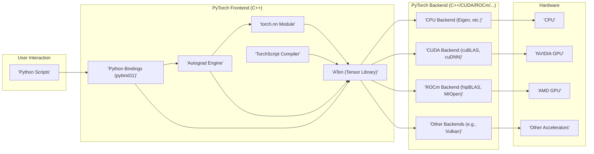

## Project Design Document: PyTorch (Improved)

**1. Introduction**

This document provides an enhanced design overview of the PyTorch project, an open-source machine learning framework widely used for research and production. The focus is on elucidating the architectural components, data flow mechanisms, and inter-component relationships, specifically with the intent of facilitating comprehensive threat modeling. This document serves as the foundational artifact for identifying potential security vulnerabilities and attack vectors within the PyTorch ecosystem.

**2. Goals and Objectives**

PyTorch is designed with the following core objectives:

* **Developer Ergonomics:** To offer an intuitive and flexible Python-first API for building and experimenting with machine learning models.
* **Research Agility:** To provide the necessary building blocks and extensibility for cutting-edge research in deep learning.
* **High Performance:** To enable efficient execution of computationally intensive tasks on diverse hardware through optimized backend implementations.
* **Scalable Training:** To support distributed training paradigms for handling large datasets and complex models across multiple devices and machines.
* **Seamless Deployment:** To offer tools and pathways for deploying trained models into various production environments.
* **Hardware Acceleration:** To leverage the power of GPUs and other specialized hardware for accelerated computation.

**3. High-Level Architecture**

The PyTorch architecture is structured in a layered fashion, promoting modularity and abstraction:

* **User Interface Layer (Python):**  The primary point of interaction for developers, providing a high-level API for model definition, training, and inference.
* **Frontend Layer (C++):**  Implements the core logic and bridges the Python API to the performance-critical backend. This layer includes the Autograd engine and the core tensor operations.
* **Backend Layer (C++/CUDA/ROCm/Others):**  Contains the optimized implementations of tensor operations and neural network primitives for different hardware platforms.
* **Hardware Abstraction Layer:** Provides a consistent interface for the Backend Layer to interact with various hardware accelerators.

**4. Key Components and Interactions**

* **Python Scripts:**  User-written Python code that defines and manipulates PyTorch models, data, and training procedures. This is the primary interface for interacting with the framework.
* **Python Bindings (pybind11):**  Facilitate seamless communication between the Python interpreter and the C++ frontend, enabling Python code to invoke C++ functions and manage C++ objects.
* **Autograd Engine:**  A crucial component responsible for automatic differentiation. It dynamically constructs a computation graph during the forward pass and uses it to compute gradients during the backward pass. It tracks operations on `torch.Tensor` objects.
* **`torch.nn` Module:**  Provides a collection of pre-built neural network layers (e.g., `Linear`, `Conv2d`, `RNN`) and loss functions, simplifying model construction. These layers internally utilize the ATen library.
* **ATen (Tensor Library):**  The foundational C++ library that implements the core tensor data structure (`torch.Tensor`) and a wide range of mathematical operations on tensors. It provides a unified interface for different hardware backends.
* **TorchScript Compiler:**  A just-in-time (JIT) compiler that allows tracing and compiling PyTorch models into an intermediate representation (TorchScript). This enables optimization, serialization, and execution in environments without the Python interpreter.
* **CPU Backend (Eigen, etc.):**  Implements ATen tensor operations for execution on CPUs, often leveraging optimized libraries like Eigen for linear algebra.
* **CUDA Backend (cuBLAS, cuDNN):**  Implements ATen tensor operations for execution on NVIDIA GPUs, utilizing libraries like cuBLAS for basic linear algebra and cuDNN for deep neural network primitives.
* **ROCm Backend (hipBLAS, MIOpen):** Implements ATen tensor operations for execution on AMD GPUs, utilizing libraries like hipBLAS and MIOpen.
* **Other Backends (e.g., Vulkan):**  Support for other hardware accelerators through dedicated backend implementations.
* **CPU:** The central processing unit, responsible for general-purpose computations.
* **NVIDIA GPU:**  Graphics processing units from NVIDIA, widely used for accelerating deep learning workloads through CUDA.
* **AMD GPU:** Graphics processing units from AMD, used for accelerating deep learning workloads through ROCm.
* **Other Accelerators:**  Specialized hardware like TPUs or FPGAs that can be integrated through custom backends.

**Interactions:**

* User Python scripts interact with PyTorch by creating and manipulating `torch.Tensor` objects and `torch.nn` modules.
* Python API calls are translated into corresponding C++ function calls in the Frontend Layer via the Python Bindings.
* The Autograd Engine intercepts operations on tensors, building the dynamic computation graph.
* `torch.nn` modules internally utilize ATen functions for their computations.
* The TorchScript Compiler can analyze and compile models defined using `torch.nn` and ATen operations.
* ATen dispatches tensor operations to the appropriate Backend based on the tensor's device (CPU, CUDA, ROCm, etc.).
* Backend implementations execute the tensor operations on the target hardware.

**5. Data Flow**

The typical flow of data through a PyTorch training or inference process involves these stages:

* **Data Ingestion:** Raw data is loaded from various sources (e.g., files, databases, network streams) and transformed into `torch.Tensor` objects. This often involves data preprocessing steps.
* **Model Input:** Input tensors are fed into the defined neural network model.
* **Forward Propagation:** Data propagates through the layers of the model. Each layer performs specific transformations on the input tensors, generating intermediate outputs. The Autograd Engine records these operations.
* **Output Generation:** The final layer(s) of the model produce the output predictions or embeddings.
* **Loss Calculation (Training):**  During training, a loss function compares the model's predictions with the ground truth labels, quantifying the error.
* **Gradient Computation (Training):** The Autograd Engine traverses the recorded computation graph in reverse to calculate the gradients of the loss with respect to the model's parameters.
* **Parameter Update (Training):** An optimizer uses the computed gradients to update the model's parameters, aiming to minimize the loss function.

**6. Security Considerations (Detailed)**

Considering the architecture and data flow, potential security concerns include:

* **Supply Chain Vulnerabilities:**
    * **Dependency Risks:** PyTorch relies on numerous third-party libraries (e.g., NumPy, SciPy, CUDA Toolkit). Vulnerabilities in these dependencies could impact PyTorch.
    * **Build Process Integrity:**  Compromise of the build environment or dependencies could lead to the introduction of malicious code into PyTorch binaries.
* **Input Data Security:**
    * **Adversarial Attacks:**  Maliciously crafted input data designed to fool the model or cause unexpected behavior (e.g., denial of service).
    * **Data Poisoning:**  Introducing malicious data into the training set to degrade model performance or bias its predictions.
    * **Deserialization Vulnerabilities:**  Loading data from untrusted sources using `pickle` or other serialization methods can lead to arbitrary code execution if the data is tampered with.
* **Model Security:**
    * **Model Poisoning:**  Attacks targeting the training process to inject vulnerabilities or backdoors into the trained model.
    * **Model Stealing/Extraction:**  Techniques to reverse-engineer or extract the parameters and architecture of a proprietary model.
    * **Model Inversion Attacks:**  Attempts to reconstruct sensitive training data from the model's parameters or outputs.
    * **Serialization/Deserialization Risks:**  Loading models from untrusted sources can lead to code execution if the model file is compromised (similar to data deserialization).
* **Distributed Training Security:**
    * **Man-in-the-Middle Attacks:**  Eavesdropping or manipulating communication between training nodes.
    * **Byzantine Fault Tolerance:**  Ensuring robustness against malicious or faulty nodes in a distributed training setup.
    * **Authentication and Authorization:**  Securing access to training resources and preventing unauthorized participation.
* **Native Code Vulnerabilities:**
    * **Memory Safety Issues:**  Bugs in the C++, CUDA, or ROCm backend code (e.g., buffer overflows, use-after-free) could lead to crashes or arbitrary code execution.
    * **Integer Overflows:**  Potential vulnerabilities in numerical computations within the backend.
* **Side-Channel Attacks:**
    * **Timing Attacks:**  Inferring information about the model or input data by analyzing the execution time of operations.
    * **Power Analysis Attacks:**  Analyzing power consumption to extract sensitive information.
* **Deployment Environment Security:**
    * **Access Control:**  Restricting access to deployed models and related resources.
    * **API Security:**  Securing APIs used to interact with deployed models.
    * **Container Security:**  Ensuring the security of container images used for deployment.

**7. Deployment Considerations (Expanded)**

The security implications of PyTorch deployment vary significantly depending on the environment:

* **Local Machine Deployment:**  Primarily concerns the security of the user's machine and the potential for local attacks. Model and data integrity are key concerns.
* **Cloud Deployment:** Introduces risks associated with cloud infrastructure, including access control, data security in the cloud, and potential vulnerabilities in cloud services. Secure API design and management are crucial.
* **Edge Device Deployment:**  Presents challenges related to resource constraints, physical security of the device, and secure communication with central servers. Model optimization for resource-constrained environments is also important.
* **Web Service Deployment:**  Requires robust API security measures, including authentication, authorization, input validation, and protection against common web vulnerabilities (e.g., injection attacks).
* **Mobile Deployment:**  Similar to edge deployment, with added considerations for mobile operating system security and potential reverse engineering of mobile applications.

**8. Technologies Used**

* **Primary Programming Languages:** Python, C++, CUDA C/C++, HIP (for ROCm)
* **Build System:** CMake
* **Python Binding Library:** pybind11
* **Linear Algebra Libraries:** Eigen (CPU), cuBLAS (CUDA), hipBLAS (ROCm)
* **Deep Neural Network Libraries:** cuDNN (CUDA), MIOpen (ROCm)
* **Communication Libraries (for Distributed Training):**  gloo, NCCL, MPI
* **Serialization Libraries:** `pickle` (Python), potentially custom C++ serialization mechanisms.
* **Hardware Acceleration APIs:** CUDA, ROCm, potentially others like oneAPI.

This improved design document provides a more detailed and security-focused overview of the PyTorch project, intended to facilitate a more thorough and effective threat modeling process.