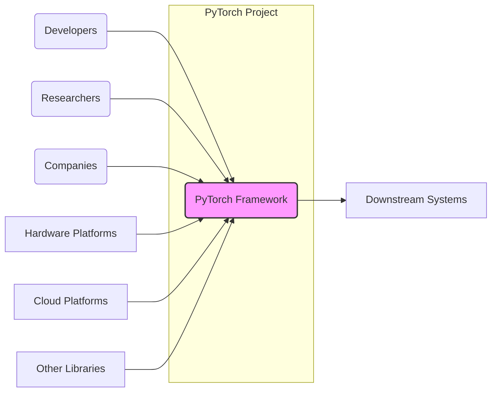

# BUSINESS POSTURE

The PyTorch project is an open-source machine learning framework designed to accelerate the path from research prototyping to production deployment. It aims to provide researchers and developers with a flexible, efficient, and user-friendly platform for building and deploying machine learning models.

Business Priorities and Goals:
- Accelerate machine learning research and development.
- Foster a strong and active community of researchers and developers.
- Provide a robust and performant framework for production deployments.
- Enable innovation in the field of artificial intelligence.
- Maintain and improve the quality, stability, and security of the framework.

Most Important Business Risks:
- Security vulnerabilities in the PyTorch framework could be exploited to compromise systems and data that rely on it.
- Supply chain attacks targeting PyTorch dependencies or build processes could introduce malicious code into the framework.
- Lack of trust in the security of PyTorch could hinder adoption by security-conscious organizations.
- Performance or stability issues could negatively impact user experience and adoption.
- Community fragmentation or lack of contributions could slow down development and innovation.

# SECURITY POSTURE

Existing Security Controls:
- security control: Code reviews are conducted by maintainers and community members to identify potential security vulnerabilities. Implemented as part of the GitHub pull request process.
- security control: Public issue reporting on GitHub allows users to report potential security vulnerabilities. Described in the project's contribution guidelines and issue templates.
- security control: Vulnerability patching and security updates are released by the PyTorch team in response to reported vulnerabilities. Communicated through release notes and security advisories.
- security control: Dependency scanning is likely used to identify known vulnerabilities in third-party libraries. Implemented in the CI/CD pipelines.
- accepted risk: Open-source nature implies that vulnerability disclosure is public, which could be exploited before patches are widely deployed.
- accepted risk: Reliance on community contributions means that security responsiveness can be variable depending on community engagement.

Recommended Security Controls:
- recommended security control: Implement automated Static Application Security Testing (SAST) tools in the CI/CD pipeline to proactively identify potential code-level vulnerabilities.
- recommended security control: Implement Software Composition Analysis (SCA) tools to continuously monitor dependencies for vulnerabilities and license compliance issues.
- recommended security control: Establish a formal Security Response Team and a clear vulnerability disclosure and response policy.
- recommended security control: Conduct regular penetration testing and security audits of the PyTorch framework and its build and release processes.
- recommended security control: Enhance supply chain security measures, including dependency pinning, checksum verification, and signing of release artifacts.

Security Requirements:
- Authentication: Not directly applicable to the PyTorch framework itself, as it is a library. Authentication is relevant for systems built using PyTorch, which should implement appropriate authentication mechanisms for user access and API interactions.
- Authorization: Similar to authentication, authorization is primarily the responsibility of systems built using PyTorch. PyTorch itself provides mechanisms for model access control within those systems if needed.
- Input Validation: Critical for systems using PyTorch to process external data. PyTorch framework should be robust against malformed inputs, but applications must implement thorough input validation to prevent attacks like adversarial examples or data poisoning.
- Cryptography: PyTorch relies on cryptographic libraries for certain operations. Security requirements include ensuring the use of strong and up-to-date cryptographic algorithms and libraries. Secure handling of cryptographic keys and sensitive data within applications built using PyTorch is also crucial.

# DESIGN

## C4 CONTEXT



Context Diagram Elements:

- Element:
    - Name: PyTorch Framework
    - Type: Software System
    - Description: The core machine learning framework, providing tools and libraries for building, training, and deploying machine learning models.
    - Responsibilities:
        - Provide a comprehensive set of machine learning algorithms and tools.
        - Offer a flexible and efficient computational backend.
        - Support various hardware platforms and accelerators.
        - Facilitate model development, training, and deployment.
    - Security controls:
        - Input validation within framework components.
        - Secure coding practices in development.
        - Vulnerability patching and security updates.

- Element:
    - Name: Developers
    - Type: Person
    - Description: Software engineers and programmers who use PyTorch to build applications and systems.
    - Responsibilities:
        - Utilize PyTorch to develop machine learning applications.
        - Contribute to the PyTorch project through code contributions and issue reporting.
        - Deploy and maintain applications built with PyTorch.
    - Security controls:
        - Secure development practices when using PyTorch.
        - Input validation in applications using PyTorch.
        - Secure configuration and deployment of PyTorch-based applications.

- Element:
    - Name: Researchers
    - Type: Person
    - Description: Machine learning researchers who use PyTorch for experimentation, model development, and advancing the state-of-the-art in AI.
    - Responsibilities:
        - Use PyTorch for research and experimentation.
        - Contribute to the PyTorch community through research findings and code contributions.
        - Identify and report potential issues or improvements in PyTorch.
    - Security controls:
        - Secure handling of research data when using PyTorch.
        - Responsible disclosure of potential vulnerabilities found during research.

- Element:
    - Name: Companies
    - Type: Organization
    - Description: Businesses and organizations that adopt PyTorch for building and deploying machine learning solutions in various industries.
    - Responsibilities:
        - Integrate PyTorch into their products and services.
        - Deploy and maintain PyTorch-based systems in production environments.
        - Contribute to the PyTorch ecosystem through adoption and feedback.
    - Security controls:
        - Secure deployment and operation of PyTorch in production.
        - Compliance with relevant security standards and regulations.
        - Security monitoring and incident response for PyTorch-based systems.

- Element:
    - Name: Hardware Platforms
    - Type: Infrastructure
    - Description: Physical hardware like CPUs, GPUs, and specialized accelerators that PyTorch runs on.
    - Responsibilities:
        - Provide the computational resources for PyTorch execution.
        - Ensure compatibility and performance for PyTorch workloads.
    - Security controls:
        - Hardware security features (e.g., secure boot, memory protection).
        - Physical security of hardware infrastructure.

- Element:
    - Name: Cloud Platforms
    - Type: Infrastructure
    - Description: Cloud computing environments (e.g., AWS, Azure, GCP) where PyTorch can be deployed and utilized.
    - Responsibilities:
        - Provide scalable and reliable infrastructure for PyTorch deployments.
        - Offer managed services and tools for machine learning workflows.
    - Security controls:
        - Cloud platform security controls (e.g., IAM, network security, data encryption).
        - Compliance certifications (e.g., SOC 2, ISO 27001).

- Element:
    - Name: Other Libraries
    - Type: Software System
    - Description: External libraries and dependencies that PyTorch relies on, such as NumPy, SciPy, and CUDA.
    - Responsibilities:
        - Provide supporting functionalities for PyTorch.
        - Ensure compatibility and interoperability with PyTorch.
    - Security controls:
        - Security of third-party libraries (dependency management, vulnerability scanning).
        - Regular updates to address security vulnerabilities in dependencies.

- Element:
    - Name: Downstream Systems
    - Type: Software System
    - Description: Applications, services, and systems built using PyTorch as a core component.
    - Responsibilities:
        - Utilize PyTorch to implement machine learning functionalities.
        - Provide specific services or applications to end-users.
    - Security controls:
        - Application-level security controls (authentication, authorization, input validation).
        - Secure integration with PyTorch framework.
        - Data protection and privacy measures.

## C4 CONTAINER

```mermaid
graph LR
    subgraph "PyTorch Framework"
        subgraph "Core Libraries"
            CL(Core C++ Libraries)
        end
        subgraph "Frontend"
            FE(Python Frontend)
        end
        subgraph "Backend"
            BE(Backend Dispatcher)
            EG(Execution Graph)
            AC(Accelerator Support)
        end
        subgraph "Build and Test"
            BT(Build System)
            TT(Testing Framework)
        end
        subgraph "Documentation"
            DOC(Documentation System)
        end
    end
    FE --> CL
    FE --> BE
    BE --> EG
    BE --> AC
    BT --> CL
    BT --> FE
    BT --> BE
    BT --> DOC
    TT --> CL
    TT --> FE
    TT --> BE
    style "PyTorch Framework" fill:#f9f,stroke:#333,stroke-width:2px
```

Container Diagram Elements:

- Element:
    - Name: Core C++ Libraries
    - Type: Container
    - Description: The foundational C++ libraries that implement the core functionalities of PyTorch, including tensor operations, neural network layers, and automatic differentiation.
    - Responsibilities:
        - Provide efficient and performant implementations of core machine learning algorithms.
        - Manage memory and computational resources.
        - Expose C APIs for other components.
    - Security controls:
        - Memory safety practices in C++ code.
        - Input validation at the C API level.
        - Static and dynamic analysis tools during development.

- Element:
    - Name: Python Frontend
    - Type: Container
    - Description: The Python interface that provides a user-friendly API for interacting with PyTorch, defining models, and running computations.
    - Responsibilities:
        - Expose a Pythonic API for PyTorch functionalities.
        - Handle user input and translate Python code into backend operations.
        - Provide high-level abstractions for machine learning tasks.
    - Security controls:
        - Input validation of user-provided Python code and data.
        - Secure handling of Python dependencies.
        - Protection against Python-specific vulnerabilities.

- Element:
    - Name: Backend Dispatcher
    - Type: Container
    - Description: The component responsible for dispatching operations to the appropriate backend execution engines based on hardware and optimization strategies.
    - Responsibilities:
        - Route operations to optimized execution paths.
        - Manage execution across different hardware backends (CPU, GPU, etc.).
        - Optimize performance based on hardware capabilities.
    - Security controls:
        - Secure communication and data transfer between frontend and backend.
        - Access control to backend resources and functionalities.
        - Robust error handling and fault tolerance.

- Element:
    - Name: Execution Graph
    - Type: Container
    - Description: Represents the computational graph of operations to be executed, enabling optimizations and efficient execution.
    - Responsibilities:
        - Optimize the execution order of operations.
        - Enable graph-level optimizations for performance.
        - Manage data flow and dependencies between operations.
    - Security controls:
        - Integrity checks of the execution graph to prevent manipulation.
        - Secure handling of intermediate data within the graph.

- Element:
    - Name: Accelerator Support
    - Type: Container
    - Description: Components that provide support for various hardware accelerators like GPUs and TPUs, enabling efficient execution on specialized hardware.
    - Responsibilities:
        - Interface with hardware-specific APIs (e.g., CUDA, ROCm).
        - Optimize operations for accelerator architectures.
        - Manage memory and data transfer on accelerators.
    - Security controls:
        - Secure interaction with hardware drivers and APIs.
        - Isolation and sandboxing of accelerator-specific code.
        - Protection against hardware-level vulnerabilities.

- Element:
    - Name: Build System
    - Type: Container
    - Description: The system responsible for building PyTorch from source code, including compilation, linking, and packaging.
    - Responsibilities:
        - Automate the build process across different platforms.
        - Manage dependencies and build configurations.
        - Generate distributable packages of PyTorch.
    - Security controls:
        - Secure build environment and toolchain.
        - Supply chain security measures for dependencies.
        - Integrity checks of build artifacts.

- Element:
    - Name: Testing Framework
    - Type: Container
    - Description: The framework used for automated testing of PyTorch, ensuring functionality, performance, and stability.
    - Responsibilities:
        - Execute unit tests, integration tests, and performance benchmarks.
        - Identify and report bugs and regressions.
        - Ensure code quality and reliability.
    - Security controls:
        - Security testing as part of the testing framework (e.g., fuzzing, vulnerability scanning).
        - Secure test data and environments.

- Element:
    - Name: Documentation System
    - Type: Container
    - Description: The system that generates and hosts the PyTorch documentation, providing user guides, API references, and tutorials.
    - Responsibilities:
        - Create and maintain comprehensive documentation.
        - Publish documentation in accessible formats.
        - Ensure documentation accuracy and completeness.
    - Security controls:
        - Protection against website vulnerabilities (e.g., XSS, CSRF).
        - Secure hosting and delivery of documentation content.
        - Content integrity checks to prevent tampering.

## DEPLOYMENT

Deployment Architecture: Cloud Deployment on Kubernetes

```mermaid
graph LR
    subgraph "Cloud Environment (e.g., AWS, GCP)"
        subgraph "Kubernetes Cluster"
            subgraph "Nodes"
                NP1(Node Pool 1)
                NP2(Node Pool 2)
            end
            subgraph "Services"
                PS(PyTorch Serving Service)
            end
            subgraph "Pods"
                P1(PyTorch Serving Pod 1) --> NP1
                P2(PyTorch Serving Pod 2) --> NP1
                P3(PyTorch Serving Pod 3) --> NP2
            end
            KCM(Kubernetes Control Plane) --> Nodes
            KCM --> Services
            Services --> Pods
        end
        LB(Load Balancer) --> PS
        INET[Internet] --> LB
    end
    style "Kubernetes Cluster" fill:#ccf,stroke:#333,stroke-width:1px
    style "Nodes" fill:#eee,stroke:#333,stroke-width:1px
    style "Services" fill:#eee,stroke:#333,stroke-width:1px
    style "Pods" fill:#eee,stroke:#333,stroke-width:1px
    style "Cloud Environment (e.g., AWS, GCP)" fill:#fff,stroke:#333,stroke-width:2px
```

Deployment Diagram Elements:

- Element:
    - Name: Cloud Environment (e.g., AWS, GCP)
    - Type: Infrastructure Environment
    - Description: The cloud provider infrastructure where the PyTorch serving application is deployed.
    - Responsibilities:
        - Provide the underlying infrastructure for Kubernetes and other services.
        - Ensure availability, scalability, and security of the cloud environment.
    - Security controls:
        - Cloud provider security controls (IAM, network security, encryption).
        - Compliance certifications.
        - Security monitoring and logging.

- Element:
    - Name: Kubernetes Cluster
    - Type: Container Orchestration Platform
    - Description: A Kubernetes cluster used to orchestrate and manage the deployment of PyTorch serving applications.
    - Responsibilities:
        - Manage container deployments, scaling, and updates.
        - Provide service discovery and load balancing within the cluster.
        - Ensure high availability and fault tolerance.
    - Security controls:
        - Kubernetes security controls (RBAC, network policies, pod security policies).
        - Regular security updates and patching of Kubernetes components.
        - Security audits and vulnerability scanning of the cluster.

- Element:
    - Name: Node Pool 1 & Node Pool 2
    - Type: Compute Instance Group
    - Description: Groups of virtual machines or physical servers that act as worker nodes in the Kubernetes cluster, running PyTorch serving pods.
    - Responsibilities:
        - Provide compute resources for running containerized applications.
        - Execute container workloads as scheduled by Kubernetes.
    - Security controls:
        - Operating system hardening and security patching.
        - Instance-level security controls (firewalls, intrusion detection).
        - Regular security audits of node configurations.

- Element:
    - Name: PyTorch Serving Service
    - Type: Kubernetes Service
    - Description: A Kubernetes service that exposes the PyTorch serving application within the cluster, providing a stable endpoint for accessing the application.
    - Responsibilities:
        - Load balance traffic across multiple PyTorch serving pods.
        - Provide service discovery and a stable IP address for the application.
    - Security controls:
        - Network policies to restrict access to the service.
        - Service account management and least privilege principles.

- Element:
    - Name: PyTorch Serving Pod 1, 2, 3
    - Type: Kubernetes Pod
    - Description: Individual instances of the PyTorch serving application running as containers within Kubernetes pods.
    - Responsibilities:
        - Execute the PyTorch serving application code.
        - Process incoming requests and return predictions.
    - Security controls:
        - Container image security scanning and vulnerability management.
        - Resource limits and quotas to prevent resource exhaustion.
        - Application-level security controls within the serving application.

- Element:
    - Name: Kubernetes Control Plane
    - Type: Management Component
    - Description: The control plane of the Kubernetes cluster, managing the overall state and operations of the cluster.
    - Responsibilities:
        - Orchestrate container deployments and scaling.
        - Manage cluster resources and configurations.
        - Provide API access to the cluster.
    - Security controls:
        - Secure access to the Kubernetes API server (authentication, authorization).
        - Encryption of sensitive data at rest and in transit.
        - Regular security audits and hardening of control plane components.

- Element:
    - Name: Load Balancer
    - Type: Network Component
    - Description: A cloud load balancer that distributes incoming internet traffic to the PyTorch Serving Service in the Kubernetes cluster.
    - Responsibilities:
        - Distribute traffic across multiple Kubernetes service instances.
        - Provide SSL termination and DDoS protection.
        - Ensure high availability and scalability of the application endpoint.
    - Security controls:
        - SSL/TLS encryption for traffic to the application.
        - Web Application Firewall (WAF) to protect against web attacks.
        - Rate limiting and traffic filtering to mitigate DDoS attacks.

- Element:
    - Name: Internet
    - Type: Network
    - Description: The public internet from which users access the PyTorch serving application.
    - Responsibilities:
        - Provide connectivity for users to access the application.
    - Security controls:
        - N/A - External network, security is managed at the perimeter (Load Balancer).

## BUILD

```mermaid
graph LR
    DEV[Developer] --> VCS[Version Control System (GitHub)]
    VCS --> CI[CI/CD System (GitHub Actions)]
    CI --> BC[Build Container Image]
    CI --> SAST[Static Analysis Security Testing]
    CI --> SCA[Software Composition Analysis]
    BC --> AR[Artifact Repository (e.g., GitHub Packages, Docker Hub)]
    AR --> DEPLOY[Deployment Environment]
    style CI fill:#ccf,stroke:#333,stroke-width:1px
```

Build Process Diagram Elements:

- Element:
    - Name: Developer
    - Type: Person
    - Description: A software developer contributing code to the PyTorch project.
    - Responsibilities:
        - Write and commit code changes.
        - Participate in code reviews.
        - Address issues and bugs.
    - Security controls:
        - Secure coding practices.
        - Code review participation.
        - Local development environment security.

- Element:
    - Name: Version Control System (GitHub)
    - Type: Software System
    - Description: GitHub repository used for managing the PyTorch source code and collaboration.
    - Responsibilities:
        - Store and manage source code.
        - Track changes and versions.
        - Facilitate collaboration and code reviews.
    - Security controls:
        - Access control and authentication for repository access.
        - Branch protection and code review enforcement.
        - Audit logging of repository activities.

- Element:
    - Name: CI/CD System (GitHub Actions)
    - Type: Automation System
    - Description: GitHub Actions used for automating the build, test, and release processes of PyTorch.
    - Responsibilities:
        - Automate build and test workflows.
        - Run security scans and checks.
        - Publish build artifacts.
    - Security controls:
        - Secure configuration of CI/CD pipelines.
        - Secrets management for credentials and API keys.
        - Isolation of build environments.
        - Audit logging of CI/CD activities.

- Element:
    - Name: Build Container Image
    - Type: Software System
    - Description: Container image used as the build environment for compiling and packaging PyTorch.
    - Responsibilities:
        - Provide a consistent and reproducible build environment.
        - Include necessary build tools and dependencies.
    - Security controls:
        - Base image security scanning and hardening.
        - Minimal set of tools and dependencies in the image.
        - Regular updates of the base image and tools.

- Element:
    - Name: Static Analysis Security Testing (SAST)
    - Type: Security Tool
    - Description: SAST tools integrated into the CI/CD pipeline to automatically analyze source code for potential security vulnerabilities.
    - Responsibilities:
        - Identify code-level vulnerabilities (e.g., CWEs).
        - Provide reports and recommendations for remediation.
    - Security controls:
        - Regular updates of SAST tools and vulnerability databases.
        - Configuration of SAST tools to match project security policies.

- Element:
    - Name: Software Composition Analysis (SCA)
    - Type: Security Tool
    - Description: SCA tools integrated into the CI/CD pipeline to analyze dependencies for known vulnerabilities and license compliance issues.
    - Responsibilities:
        - Identify vulnerabilities in third-party libraries and dependencies.
        - Provide reports and recommendations for remediation or updates.
        - Track license compliance of dependencies.
    - Security controls:
        - Regular updates of SCA tools and vulnerability databases.
        - Configuration of SCA tools to match project security policies.

- Element:
    - Name: Artifact Repository (e.g., GitHub Packages, Docker Hub)
    - Type: Storage System
    - Description: Repository used to store and distribute build artifacts, such as Python packages, container images, and binaries.
    - Responsibilities:
        - Securely store build artifacts.
        - Provide access control for artifact downloads.
        - Versioning and management of artifacts.
    - Security controls:
        - Access control and authentication for artifact repository.
        - Integrity checks of stored artifacts (checksums, signatures).
        - Vulnerability scanning of stored container images.

- Element:
    - Name: Deployment Environment
    - Type: Infrastructure Environment
    - Description: Target environment where PyTorch is deployed (e.g., cloud, on-premises).
    - Responsibilities:
        - Run and execute PyTorch applications.
        - Provide runtime environment and dependencies.
    - Security controls:
        - Environment-specific security controls (see Deployment section).

# RISK ASSESSMENT

Critical Business Processes:
- Providing a secure and reliable machine learning framework to the community.
- Maintaining the integrity and trustworthiness of the PyTorch codebase and releases.
- Ensuring the continuous availability and performance of the framework.

Data Sensitivity:
- PyTorch itself does not directly handle sensitive user data. However, it is used to process and analyze sensitive data in downstream applications.
- Sensitivity level of data processed by PyTorch-based applications is highly variable and depends on the specific use case. It can range from publicly available data to highly confidential personal or financial information.
- The models trained using PyTorch can also be considered sensitive intellectual property.
- Build artifacts and release packages need to be protected to maintain supply chain security.

# QUESTIONS & ASSUMPTIONS

Questions:
- What are the specific security policies and standards that PyTorch project adheres to?
- Is there a formal Security Response Team or process for handling security vulnerabilities?
- What are the current SAST and SCA tools used in the CI/CD pipeline?
- Are there regular penetration testing or security audits conducted for the PyTorch project?
- What is the process for managing and updating dependencies to address security vulnerabilities?

Assumptions:
- PyTorch project prioritizes security as a key aspect of its development and release process.
- Community contributions and code reviews play a significant role in identifying and addressing security issues.
- Standard open-source security practices are generally followed, but there is room for improvement in formalizing and enhancing security controls.
- The deployment architecture described is a representative example and can be adapted to various scenarios.
- The build process diagram reflects common practices for open-source projects using GitHub and CI/CD.