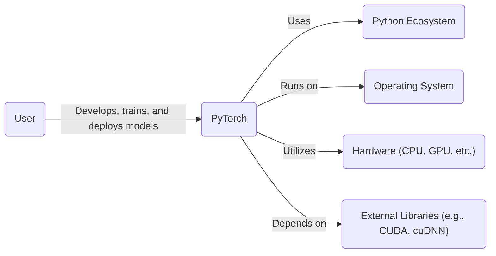
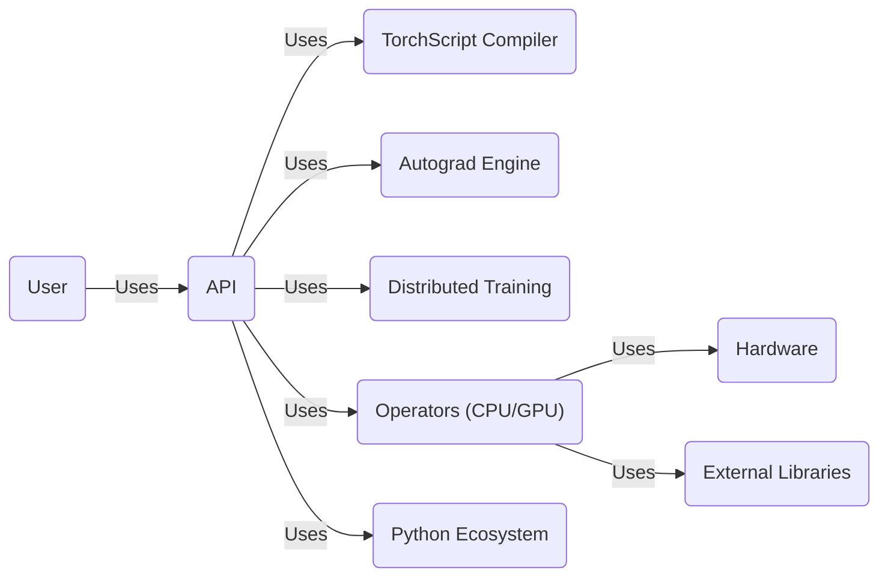
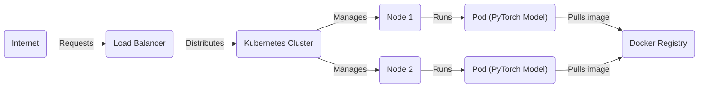
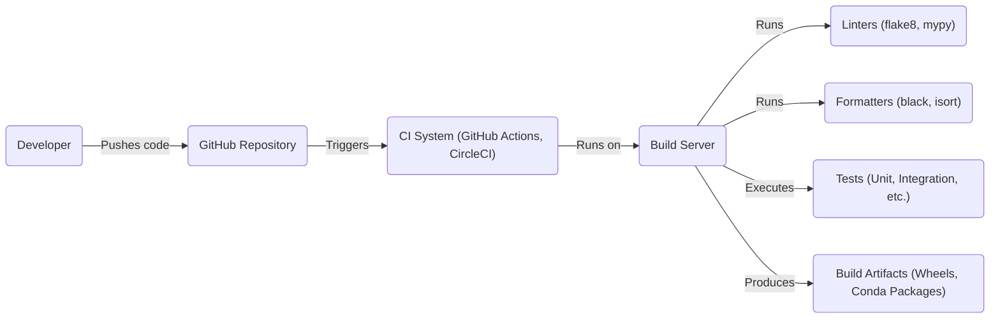

# BUSINESS POSTURE

PyTorch, as a deep learning framework, aims to provide researchers and developers with a flexible, efficient, and easy-to-use platform for building and deploying machine learning models. The business priorities and goals can be summarized as:

*   Accelerate Research: Enable rapid prototyping and experimentation with new deep learning models and techniques.
*   Ease of Use: Provide a user-friendly API and comprehensive documentation to lower the barrier to entry for deep learning.
*   Performance: Offer high-performance computation on CPUs and GPUs to enable training and deployment of large-scale models.
*   Flexibility: Support a wide range of deep learning tasks and architectures, from simple models to complex, cutting-edge research.
*   Community and Ecosystem: Foster a vibrant community and ecosystem of users, contributors, and related projects.
*   Production Readiness: Facilitate the deployment of trained models to production environments, including mobile and embedded systems.
*   Open Source: Maintain an open-source development model to encourage collaboration and transparency.

Based on these priorities, the most important business risks that need to be addressed are:

*   Compromised Model Integrity: Malicious actors could potentially tamper with pre-trained models or training data, leading to incorrect or biased predictions.
*   Supply Chain Vulnerabilities: Dependencies on external libraries or components could introduce vulnerabilities that could be exploited.
*   Data Poisoning: Malicious actors could inject poisoned data into training datasets, leading to compromised model behavior.
*   Denial of Service: Attacks targeting the infrastructure supporting PyTorch development or distribution could disrupt access for users.
*   Intellectual Property Theft: Source code or proprietary algorithms could be stolen or leaked.
*   Reputational Damage: Security incidents or vulnerabilities could damage the reputation and trust in the PyTorch project.

# SECURITY POSTURE

Existing security controls and accepted risks, focusing on the secure software development lifecycle and deployment model:

*   security control: Code Reviews: PyTorch has a well-established code review process on GitHub, requiring multiple reviewers for pull requests before merging. (Described in GitHub repository's contribution guidelines).
*   security control: Static Analysis: The project uses static analysis tools like linters (e.g., flake8, mypy) and code formatters (e.g., black, isort) to identify potential code quality and security issues. (Visible in CI workflows and configuration files).
*   security control: Continuous Integration (CI): PyTorch utilizes extensive CI pipelines (GitHub Actions, CircleCI) to automatically build, test, and validate code changes. (Visible in CI workflow definitions).
*   security control: Issue Tracking: Security vulnerabilities and bugs are tracked and managed through GitHub Issues. (Visible in the GitHub repository).
*   security control: Community Engagement: The large and active PyTorch community helps identify and report potential security issues.
*   security control: Documentation: Security considerations are documented, although they could be more centralized and comprehensive.
*   accepted risk: Limited Formal Security Audits: While the project benefits from community scrutiny and CI, there isn't evidence of regular, comprehensive, independent security audits.
*   accepted risk: Dependency Management: Managing a large number of dependencies introduces inherent risks, although efforts are made to keep them up-to-date.
*   accepted risk: User-Provided Code Execution: PyTorch, by its nature, executes user-provided code (models and scripts), which inherently carries risks.

Recommended security controls (high priority):

*   Implement a comprehensive Software Bill of Materials (SBOM) for all releases.
*   Conduct regular, independent security audits and penetration testing.
*   Establish a dedicated security team or point of contact.
*   Develop a formal vulnerability disclosure program.
*   Enhance documentation with a dedicated security section, including best practices for users.
*   Integrate Software Composition Analysis (SCA) tools to identify vulnerabilities in dependencies.
*   Consider implementing fuzzing to test for unexpected inputs and edge cases.

Security Requirements:

*   Authentication: Not directly applicable to the core PyTorch framework itself, but relevant for related services (e.g., model repositories, forums).
*   Authorization: Not directly applicable to the core framework, but relevant for related services.
*   Input Validation: Crucial for preventing code injection and other vulnerabilities. PyTorch should provide utilities and guidance for users to validate and sanitize inputs to their models.
*   Cryptography: PyTorch should utilize secure cryptographic libraries for any operations involving sensitive data (e.g., loading encrypted models or data). It should also provide guidance on secure handling of cryptographic keys.

# DESIGN

## C4 CONTEXT

*   Elements Description:

    *   Element:
        1.  Name: User
        2.  Type: Person
        3.  Description: Researchers, developers, and data scientists who use PyTorch to build and deploy machine learning models.
        4.  Responsibilities: Develops, trains, deploys, and evaluates machine learning models using PyTorch. Provides input data and defines model architectures.
        5.  Security controls: Implements input validation and sanitization in their code. Follows security best practices for model development and deployment.

    *   Element:
        1.  Name: PyTorch
        2.  Type: Software System
        3.  Description: The core PyTorch deep learning framework.
        4.  Responsibilities: Provides APIs for defining, training, and deploying neural networks. Manages computation on various hardware platforms.
        5.  Security controls: Code reviews, static analysis, CI, community engagement.

    *   Element:
        1.  Name: Python Ecosystem
        2.  Type: Software System
        3.  Description: The broader Python ecosystem, including package managers (pip, conda) and other libraries.
        4.  Responsibilities: Provides the underlying programming language and package management infrastructure.
        5.  Security controls: Package signing (in some cases), community vigilance.

    *   Element:
        1.  Name: Hardware (CPU, GPU, etc.)
        2.  Type: Hardware
        3.  Description: The physical hardware on which PyTorch computations are performed.
        4.  Responsibilities: Executes the computational operations defined by PyTorch models.
        5.  Security controls: Hardware-level security features (e.g., secure boot, memory encryption).

    *   Element:
        1.  Name: Operating System
        2.  Type: Software System
        3.  Description: The operating system (e.g., Linux, Windows, macOS) on which PyTorch runs.
        4.  Responsibilities: Provides the underlying system resources and interfaces for PyTorch.
        5.  Security controls: OS-level security features (e.g., access control, firewalls).

    *   Element:
        1.  Name: External Libraries (e.g., CUDA, cuDNN)
        2.  Type: Software System
        3.  Description: External libraries that PyTorch depends on for specific functionalities, such as GPU acceleration.
        4.  Responsibilities: Provide optimized low-level implementations of deep learning operations.
        5.  Security controls: Vendor-provided security updates and patches.

## C4 CONTAINER

*   Elements Description:

    *   Element:
        1.  Name: User
        2.  Type: Person
        3.  Description: Researchers and developers interacting with PyTorch.
        4.  Responsibilities: Writes code using the PyTorch API.
        5.  Security controls: Input validation, secure coding practices.

    *   Element:
        1.  Name: API
        2.  Type: API
        3.  Description: The public-facing API of PyTorch.
        4.  Responsibilities: Provides a high-level interface for users to interact with the framework.
        5.  Security controls: Input validation (to the extent possible), documentation of secure usage.

    *   Element:
        1.  Name: TorchScript Compiler
        2.  Type: Container
        3.  Description: Compiles PyTorch models into a serialized, platform-independent representation.
        4.  Responsibilities: Enables model deployment to environments without a Python dependency.
        5.  Security controls: Code reviews, static analysis.

    *   Element:
        1.  Name: Autograd Engine
        2.  Type: Container
        3.  Description: Automatically computes gradients for tensor operations.
        4.  Responsibilities: Enables backpropagation for model training.
        5.  Security controls: Code reviews, extensive testing.

    *   Element:
        1.  Name: Distributed Training
        2.  Type: Container
        3.  Description: Facilitates training models across multiple devices or machines.
        4.  Responsibilities: Coordinates communication and data transfer between workers.
        5.  Security controls: Secure communication protocols (if applicable), access control.

    *   Element:
        1.  Name: Operators (CPU/GPU)
        2.  Type: Container
        3.  Description: Low-level implementations of tensor operations, optimized for different hardware.
        4.  Responsibilities: Performs the actual computations.
        5.  Security controls: Code reviews, performance optimization, testing.

    *   Element:
        1.  Name: Python Ecosystem
        2.  Type: Software System
        3.  Description: The Python environment and external Python packages.
        4.  Responsibilities: Provides the runtime environment and dependencies.
        5.  Security controls: Package management security practices.

    *   Element:
        1.  Name: Hardware
        2.  Type: Hardware
        3.  Description: The underlying CPU, GPU, or other hardware.
        4.  Responsibilities: Executes the compiled code.
        5.  Security controls: Hardware-level security features.

    *   Element:
        1.  Name: External Libraries
        2.  Type: Software System
        3.  Description: Libraries like CUDA, cuDNN, and others.
        4.  Responsibilities: Provides optimized low-level routines.
        5.  Security controls: Vendor security updates.

## DEPLOYMENT

PyTorch models can be deployed in various ways, including:

1.  **Local Python Environment:** Directly running the model within a Python environment on a local machine.
2.  **Cloud-Based Virtual Machines (VMs):** Deploying the model on VMs in cloud platforms like AWS, Google Cloud, or Azure.
3.  **Containerized Environments (Docker, Kubernetes):** Packaging the model and its dependencies into containers for portability and scalability.
4.  **Serverless Functions:** Deploying the model as a serverless function (e.g., AWS Lambda, Azure Functions).
5.  **Mobile Devices (iOS, Android):** Using PyTorch Mobile to deploy models on mobile platforms.
6.  **Embedded Systems:** Deploying models on embedded devices with limited resources.

We'll describe the containerized deployment using Docker and Kubernetes in detail:

*   Elements Description:

    *   Element:
        1.  Name: Internet
        2.  Type: External
        3.  Description: The source of incoming requests to the deployed model.
        4.  Responsibilities: Sends requests to the load balancer.
        5.  Security controls: Network firewalls, intrusion detection systems.

    *   Element:
        1.  Name: Load Balancer
        2.  Type: Infrastructure
        3.  Description: Distributes incoming traffic across multiple instances of the PyTorch model.
        4.  Responsibilities: Directs traffic to healthy pods.
        5.  Security controls: TLS termination, DDoS protection.

    *   Element:
        1.  Name: Kubernetes Cluster
        2.  Type: Infrastructure
        3.  Description: Orchestrates the deployment and management of containerized applications.
        4.  Responsibilities: Schedules pods, manages resources, ensures high availability.
        5.  Security controls: Role-based access control (RBAC), network policies, pod security policies.

    *   Element:
        1.  Name: Node 1
        2.  Type: Infrastructure
        3.  Description: A worker node in the Kubernetes cluster.
        4.  Responsibilities: Runs pods.
        5.  Security controls: OS hardening, regular security updates.

    *   Element:
        1.  Name: Node 2
        2.  Type: Infrastructure
        3.  Description: Another worker node in the Kubernetes cluster.
        4.  Responsibilities: Runs pods.
        5.  Security controls: OS hardening, regular security updates.

    *   Element:
        1.  Name: Pod (PyTorch Model)
        2.  Type: Container
        3.  Description: A running instance of the PyTorch model, packaged as a Docker container.
        4.  Responsibilities: Serves model predictions.
        5.  Security controls: Minimal base image, least privilege, no sensitive data in the image.

    *   Element:
        1.  Name: Pod (PyTorch Model)
        2.  Type: Container
        3.  Description: Another running instance of the PyTorch model.
        4.  Responsibilities: Serves model predictions.
        5.  Security controls: Minimal base image, least privilege, no sensitive data in the image.

    *   Element:
        1.  Name: Docker Registry
        2.  Type: Infrastructure
        3.  Description: Stores the Docker image containing the PyTorch model and its dependencies.
        4.  Responsibilities: Provides access to the image for deployment.
        5.  Security controls: Authentication, authorization, image scanning.

## BUILD

The PyTorch build process is complex and involves multiple stages and tools. It primarily uses CMake and Python's setuptools. The CI system (GitHub Actions and CircleCI) plays a crucial role in automating the build and testing process.

*   Security Controls in Build Process:

    *   Code Reviews: All code changes undergo mandatory code reviews before being merged.
    *   Linters and Formatters: Static analysis tools enforce code style and identify potential issues.
    *   Automated Testing: Extensive unit and integration tests are run on every build.
    *   CI/CD: The build process is fully automated, reducing the risk of manual errors.
    *   Dependency Management: Dependencies are managed through `requirements.txt` and `setup.py` files, although more robust dependency management (e.g., SBOM) is recommended.
    *   Build Servers: Build servers are typically ephemeral and provisioned on demand, reducing the risk of persistent compromises.

# RISK ASSESSMENT

*   Critical Business Processes:

    *   Model Training: The ability to train accurate and reliable models is fundamental.
    *   Model Deployment: Deploying models to various environments (research, production, mobile, etc.) is crucial.
    *   Community Collaboration: Maintaining a healthy and active open-source community is vital for the project's success.
    *   Continuous Integration and Delivery: Ensuring the continuous and reliable delivery of updates and new features.

*   Data Sensitivity:

    *   Training Data: Can range from publicly available datasets to highly sensitive, proprietary data. The sensitivity depends entirely on the user and their specific use case. PyTorch itself doesn't inherently handle sensitive data, but users must be aware of the risks associated with the data they use.
    *   Model Weights: Trained model weights can be considered sensitive, as they may encode information about the training data or represent valuable intellectual property.
    *   Source Code: The PyTorch source code itself is open source, but specific, customized versions or proprietary extensions might be considered sensitive.
    *   User Code: User-provided code (models, scripts) can contain sensitive information or proprietary algorithms.

# QUESTIONS & ASSUMPTIONS

*   Questions:

    *   Are there any specific compliance requirements (e.g., GDPR, HIPAA) that PyTorch users typically need to adhere to?
    *   What is the process for handling security vulnerabilities reported by external researchers?
    *   Are there any plans to implement more formal security audits or certifications?
    *   What mechanisms are in place to detect and prevent the distribution of malicious pre-trained models?
    *   How are secrets (e.g., API keys, credentials) managed during the build and deployment processes?

*   Assumptions:

    *   BUSINESS POSTURE: We assume that the primary goal is to provide a robust and flexible deep learning framework, balancing performance, ease of use, and security.
    *   SECURITY POSTURE: We assume that the existing security controls are primarily focused on code quality and preventing common coding errors, with less emphasis on proactive threat modeling and mitigation.
    *   DESIGN: We assume that the deployment environment is typically a cloud-based or containerized infrastructure, although other deployment scenarios are possible. We assume users are responsible for securing their own data and deployment environments. We assume that users are responsible for the security of their own code that uses the PyTorch library.