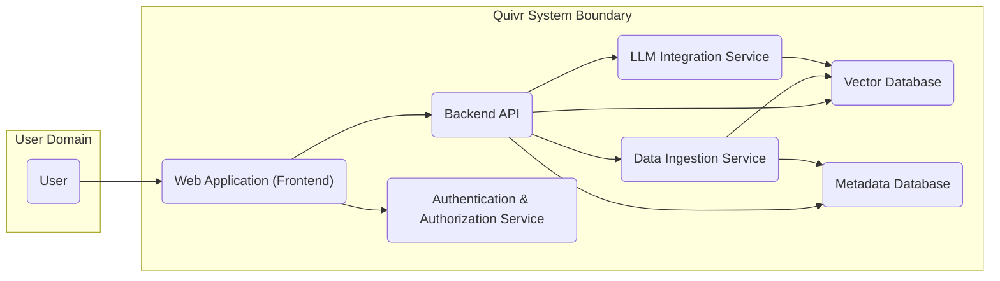
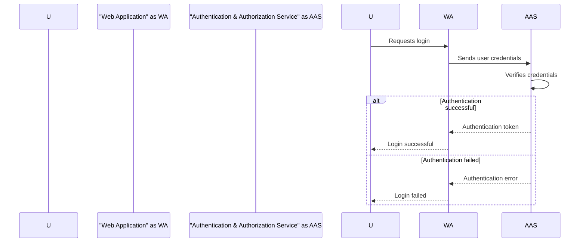
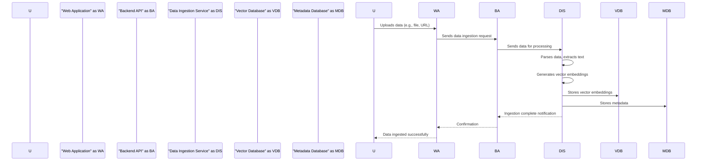
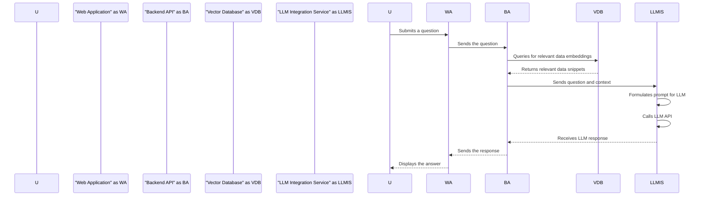

## Project Design Document: Quivr - Your Personal AI Second Brain

**Version:** 1.1
**Date:** October 26, 2023
**Author:** AI Architecture Expert

### 1. Project Overview

Quivr is a personal AI knowledge base and assistant designed to empower users to store, organize, and retrieve information from diverse sources. By leveraging Large Language Models (LLMs), Quivr understands user queries and provides contextually relevant answers based on the user's curated knowledge. This document details the architecture and core components of the Quivr project, serving as a foundation for subsequent threat modeling exercises.

### 2. Goals

*   Establish a secure and dependable platform for users to manage and safeguard their personal knowledge assets.
*   Facilitate seamless data ingestion from various sources, including local files, web URLs, and potential integrations with other applications.
*   Offer an intuitive and user-friendly interface for interacting with the AI assistant and querying the knowledge base effectively.
*   Integrate with state-of-the-art LLMs to deliver intelligent, context-aware, and insightful responses.
*   Prioritize user data privacy and grant users comprehensive control over their information.

### 3. Non-Goals

*   This document does not delve into the specific implementation details of the LLM integration, such as intricate prompt engineering strategies or fine-tuning methodologies.
*   Detailed specifications for the User Interface (UI) and User Experience (UX) design are outside the scope of this document.
*   Specific infrastructure choices for deployment (e.g., a detailed comparison of AWS vs. Azure services) are not addressed herein.
*   In-depth performance optimization strategies and benchmarking are not included in this design.

### 4. Target Audience

*   Software Engineers involved in the development and maintenance of Quivr.
*   Security Engineers responsible for identifying and mitigating security risks.
*   DevOps Engineers managing the deployment and infrastructure of the application.
*   Project Managers overseeing the development lifecycle and strategic direction.

### 5. High-Level Architecture

The following diagram illustrates the high-level architecture of the Quivr project, emphasizing the key interactions between different parts of the system:

**Key Components:**

*   **User:** The individual who interacts with the Quivr system to manage and query their knowledge.
*   **Web Application (Frontend):** The user-facing interface built to provide a rich and interactive experience for accessing Quivr's features.
*   **Backend API:** The core logic layer that processes requests from the frontend, manages data flow, and orchestrates interactions between backend services.
*   **Data Ingestion Service:** The component responsible for securely and efficiently importing data from various sources, preparing it for storage and retrieval.
*   **Vector Database:** A specialized database optimized for storing and querying vector embeddings, enabling semantic search capabilities.
*   **Metadata Database:** A traditional database used to store structured information about the ingested data, facilitating organization and filtering.
*   **LLM Integration Service:** The bridge between Quivr and external Large Language Models, responsible for formulating queries and processing responses.
*   **Authentication & Authorization Service:** The security cornerstone responsible for verifying user identities and controlling access to resources within the system.

### 6. Component Details

This section provides a more granular description of each component, outlining its purpose, functionality, underlying technologies, and key security considerations:

*   **Web Application (Frontend):**
    *   **Purpose:** To provide users with a visual and interactive interface to access Quivr's functionalities.
    *   **Functionality:**
        *   User authentication and registration workflows.
        *   Intuitive mechanisms for data ingestion (file uploads, URL inputs, etc.).
        *   A natural language query interface for interacting with the knowledge base.
        *   Tools for viewing, organizing, and managing ingested data.
        *   Clear display of responses generated by the AI assistant.
    *   **Technology:** Typically implemented using modern JavaScript frameworks like React, Vue.js, or Angular, along with HTML and CSS.
    *   **Security Considerations:** Susceptible to common web application vulnerabilities such as Cross-Site Scripting (XSS) and Cross-Site Request Forgery (CSRF). Requires secure handling of user credentials, session management, and Content Security Policy (CSP) implementation.

*   **Backend API:**
    *   **Purpose:** To serve as the central processing unit and communication hub for the Quivr system.
    *   **Functionality:**
        *   Receiving and validating requests originating from the frontend application.
        *   Enforcing authentication and authorization policies for all incoming requests.
        *   Orchestrating the data ingestion process by communicating with the Data Ingestion Service.
        *   Executing queries against the Vector and Metadata Databases.
        *   Interacting with the LLM Integration Service to generate responses.
        *   Managing user profiles, settings, and data access permissions.
    *   **Technology:** Commonly built using frameworks like Node.js (with Express.js), Python (with Flask or Django), or Go. Employs RESTful API principles for communication.
    *   **Security Considerations:** Requires robust authentication and authorization mechanisms (e.g., JWT). Vulnerable to API-specific attacks like injection flaws (SQL injection, NoSQL injection), broken authentication, and mass assignment vulnerabilities. Rate limiting and input validation are crucial.

*   **Data Ingestion Service:**
    *   **Purpose:** To reliably and securely import data from various sources and prepare it for use within Quivr.
    *   **Functionality:**
        *   Receiving data payloads from the Backend API.
        *   Supporting parsing of diverse file formats (e.g., PDF, TXT, DOCX, Markdown).
        *   Extracting textual content from ingested data.
        *   Generating vector embeddings of the extracted text using a pre-trained embedding model.
        *   Persisting the generated vector embeddings in the Vector Database.
        *   Storing relevant metadata about the ingested data in the Metadata Database.
    *   **Technology:** May be implemented as a separate microservice or integrated within the Backend API. Often utilizes libraries for document parsing (e.g., Apache Tika) and embedding generation (e.g., libraries from TensorFlow or PyTorch).
    *   **Security Considerations:** Must handle potentially malicious or malformed files safely to prevent denial-of-service or code execution vulnerabilities. Secure communication channels with the Vector and Metadata Databases are essential.

*   **Vector Database:**
    *   **Purpose:** To provide efficient storage and retrieval of vector embeddings, enabling semantic similarity searches for question answering.
    *   **Functionality:**
        *   Storing and indexing high-dimensional vector embeddings.
        *   Performing fast nearest neighbor searches based on query embeddings.
        *   Supporting filtering and metadata-based queries alongside vector searches.
    *   **Technology:** Typically a specialized vector database solution such as Pinecone, Weaviate, Milvus, or Qdrant.
    *   **Security Considerations:** Access control mechanisms are critical to prevent unauthorized access to sensitive vector data. Encryption of data at rest and in transit is necessary. Regular backups and disaster recovery plans are important.

*   **Metadata Database:**
    *   **Purpose:** To store structured metadata associated with the ingested data, facilitating organization and filtering.
    *   **Functionality:**
        *   Storing metadata attributes such as the source URL, file name, upload timestamp, associated user ID, and tags.
        *   Enabling efficient filtering, sorting, and querying of ingested data based on metadata.
    *   **Technology:** A traditional relational database (e.g., PostgreSQL, MySQL) or a NoSQL document database (e.g., MongoDB) are common choices.
    *   **Security Considerations:** Standard database security best practices apply, including robust access control lists (ACLs), encryption of sensitive data, regular security audits, and secure configuration management.

*   **LLM Integration Service:**
    *   **Purpose:** To act as an intermediary between Quivr and external Large Language Model APIs.
    *   **Functionality:**
        *   Receiving user queries and contextually relevant data snippets from the Backend API.
        *   Constructing effective prompts for the chosen LLM, incorporating the user's query and retrieved data.
        *   Securely sending requests to the LLM API.
        *   Processing and sanitizing the response received from the LLM.
        *   Returning the processed response to the Backend API for presentation to the user.
    *   **Technology:** Implemented using libraries and SDKs provided by the LLM provider (e.g., OpenAI Python library).
    *   **Security Considerations:** Secure storage and management of API keys are paramount. Measures to mitigate prompt injection attacks are necessary. Careful handling of potentially sensitive information passed to and received from the LLM is crucial. Rate limiting API calls to avoid exceeding usage limits and potential cost overruns.

*   **Authentication & Authorization Service:**
    *   **Purpose:** To manage user identities, verify their credentials, and control access to protected resources within the Quivr system.
    *   **Functionality:**
        *   User registration and account creation.
        *   Secure user login and authentication processes.
        *   Password management functionalities (e.g., password reset).
        *   Session management to maintain user login states.
        *   Authorization checks to enforce access control policies based on user roles and permissions.
    *   **Technology:** Can be a custom implementation or leverage established identity providers (e.g., Auth0, Okta, Firebase Authentication). Often utilizes protocols like OAuth 2.0 and OpenID Connect.
    *   **Security Considerations:** Requires robust security measures to protect user credentials from unauthorized access and breaches. Implementation must adhere to security best practices for authentication and authorization, including secure password hashing, multi-factor authentication (MFA), and protection against brute-force attacks.

### 7. Data Flow Diagrams

This section visually represents the flow of data through the system for key user interactions.

#### 7.1 User Authentication Flow

#### 7.2 Data Ingestion Flow

#### 7.3 Question Answering Flow

### 8. Security Considerations (Preliminary)

This section outlines preliminary security considerations for each component, which will be further analyzed during the threat modeling process.

*   **Web Application (Frontend):**
    *   Potential Threats: XSS, CSRF, Clickjacking, insecure handling of sensitive data in the browser.
    *   Mitigation Strategies: Input sanitization, output encoding, anti-CSRF tokens, secure headers (CSP, HSTS), regular security updates.
*   **Backend API:**
    *   Potential Threats: Injection attacks (SQL, NoSQL), broken authentication/authorization, mass assignment, API abuse (rate limiting).
    *   Mitigation Strategies: Parameterized queries, input validation, strong authentication and authorization mechanisms (JWT), rate limiting, API security best practices.
*   **Data Ingestion Service:**
    *   Potential Threats: Malicious file uploads leading to code execution or denial of service, insecure communication with databases.
    *   Mitigation Strategies: File type validation, sandboxing of file processing, secure communication protocols (TLS), input validation.
*   **Vector Database:**
    *   Potential Threats: Unauthorized access to vector data, data breaches, lack of encryption.
    *   Mitigation Strategies: Access control lists, encryption at rest and in transit, regular backups, strong authentication.
*   **Metadata Database:**
    *   Potential Threats: SQL injection, unauthorized data access, data breaches.
    *   Mitigation Strategies: Parameterized queries, strong authentication and authorization, encryption at rest and in transit, regular backups.
*   **LLM Integration Service:**
    *   Potential Threats: Prompt injection attacks, exposure of API keys, insecure handling of LLM responses.
    *   Mitigation Strategies: Careful prompt construction, secure storage of API keys (e.g., using environment variables or secrets management), input and output sanitization.
*   **Authentication & Authorization Service:**
    *   Potential Threats: Brute-force attacks, credential stuffing, insecure password storage, session hijacking.
    *   Mitigation Strategies: Strong password policies, multi-factor authentication, secure password hashing (e.g., bcrypt), secure session management (e.g., HTTP-only cookies), account lockout policies.

### 9. Deployment Considerations

While specific deployment strategies are outside the scope of this document, the following are general considerations for deploying and managing the Quivr system:

*   **Cloud Platforms:** Utilizing cloud providers like AWS, Azure, or GCP for infrastructure and managed services.
*   **Containerization:** Employing Docker for packaging and deploying components, ensuring consistency across environments.
*   **Orchestration:** Using Kubernetes to manage and scale containerized applications.
*   **Load Balancing:** Distributing traffic across multiple instances of services for high availability and performance.
*   **Auto-Scaling:** Automatically adjusting the number of running instances based on demand.
*   **Monitoring and Logging:** Implementing comprehensive monitoring and logging solutions for performance analysis and security auditing.
*   **Infrastructure as Code (IaC):** Managing infrastructure through code (e.g., Terraform, CloudFormation) for automation and version control.

This improved design document provides a more detailed and refined overview of the Quivr project's architecture and components. It serves as a more robust foundation for subsequent threat modeling activities, enabling a deeper understanding of potential security vulnerabilities and the development of effective mitigation strategies.