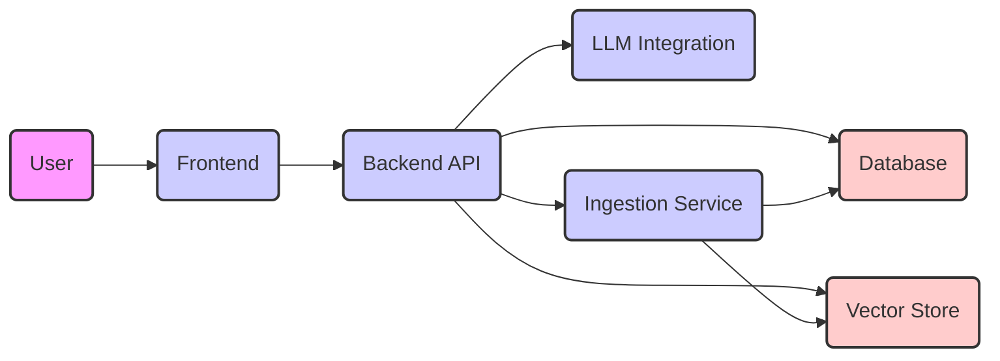
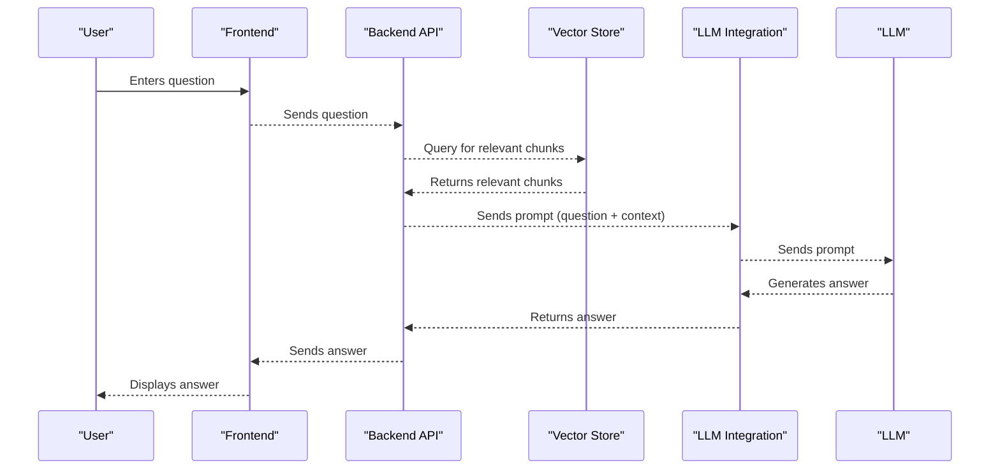

# Project Design Document: Quivr - Your Generative AI Knowledge Assistant

**Version:** 1.1
**Date:** October 26, 2023
**Author:** AI Software Architect

## 1. Introduction

This document provides a detailed design overview of the Quivr project, a generative AI knowledge assistant as found on GitHub ([https://github.com/quivrhq/quivr](https://github.com/quivrhq/quivr)). This document aims to clearly articulate the system's architecture, components, data flow, and key technologies. It will serve as a foundation for subsequent threat modeling activities, providing the necessary context and details about the system's workings.

## 2. Goals and Objectives

The primary goals of Quivr are to:

*   Provide users with a personalized AI assistant capable of answering questions based on user-provided knowledge bases.
*   Enable users to upload and manage various types of documents as knowledge sources in a secure and organized manner.
*   Leverage Large Language Models (LLMs) to generate coherent, contextually relevant, and accurate answers.
*   Offer a user-friendly and intuitive interface for interacting with the AI assistant across different devices.
*   Maintain a strong focus on user privacy, data security, and the confidentiality of uploaded knowledge.

## 3. High-Level Architecture

The Quivr system can be broadly divided into the following key components, interacting to provide the core functionality:

*   **Frontend:** The user interface, providing a visual way for users to interact with the application.
*   **Backend API:**  The core logic of the application, handling requests, processing data, and orchestrating interactions between other services.
*   **Database:**  Persistent storage for user data, document metadata, application settings, and potentially processed document content.
*   **Vector Store:**  Specialized database for storing document embeddings, optimized for efficient semantic similarity searches.
*   **LLM Integration:**  The interface responsible for communicating with and utilizing the capabilities of a Large Language Model.
*   **Ingestion Service:**  Handles the processing of uploaded documents, including text extraction, chunking, and embedding generation.

## 4. Detailed Component Description

### 4.1. Frontend

*   **Functionality:**
    *   Provides a graphical user interface (GUI) for users to interact with Quivr.
    *   Handles user authentication (login, registration) and session management.
    *   Allows users to upload and manage their knowledge documents.
    *   Provides a chat interface for users to ask questions and receive answers.
    *   Displays generated answers in a clear and understandable format.
    *   May include features for managing user profiles, application settings, and feedback.
*   **Technology:** Likely built using a modern JavaScript framework such as React, Vue.js, or Svelte, along with HTML and CSS for structure and styling.
*   **Interactions:** Communicates with the Backend API via standard HTTP requests, potentially using RESTful APIs or GraphQL.

### 4.2. Backend API

*   **Functionality:**
    *   Acts as the central nervous system of the application, handling all core logic.
    *   Authenticates and authorizes user requests before processing.
    *   Receives and processes user queries from the Frontend.
    *   Orchestrates the interaction between the Database, Vector Store, LLM Integration, and Ingestion Service.
    *   Manages document metadata and triggers the Ingestion Service for new uploads.
    *   Retrieves relevant document chunks from the Vector Store based on semantic similarity to the user's query.
    *   Constructs prompts for the LLM, including the user's question and relevant context.
    *   Receives generated answers from the LLM Integration and sends them back to the Frontend.
    *   Manages user data, including profiles, document ownership, and potentially chat history.
*   **Technology:** Likely implemented using a robust backend framework such as Python (with FastAPI or Django), Node.js (with Express.js), or Go.
*   **Interactions:**
    *   Receives requests from the Frontend.
    *   Queries the Database for user authentication, authorization, and data retrieval.
    *   Queries the Vector Store to find semantically similar document embeddings.
    *   Sends requests to the LLM Integration to generate answers based on provided prompts.
    *   Communicates with the Ingestion Service to process uploaded documents.

### 4.3. Database

*   **Functionality:**
    *   Provides persistent storage for structured data within the application.
    *   Stores user account information, including credentials and profiles.
    *   Stores metadata about uploaded documents, such as title, upload date, file type, size, and user association.
    *   May store processed document content or chunks, depending on the Vector Store implementation and data management strategy.
    *   Can store chat history or conversation logs for future reference or analysis.
    *   May store API keys or configuration settings for external services.
*   **Technology:** Could be a relational database like PostgreSQL or MySQL, or a NoSQL database like MongoDB, depending on the application's data model and scalability requirements.
*   **Interactions:** The Backend API performs read and write operations on the Database to manage application data. The Ingestion Service might also write metadata to the Database.

### 4.4. Vector Store

*   **Functionality:**
    *   Specialized database designed for efficient storage and retrieval of vector embeddings.
    *   Stores vector representations of document content, enabling semantic similarity searches.
    *   Allows the system to quickly find documents or chunks of documents that are semantically related to a user's query.
*   **Technology:** Common choices include dedicated vector databases like Pinecone, Weaviate, ChromaDB, or cloud-based vector search services offered by major cloud providers.
*   **Interactions:**
    *   The Ingestion Service writes vector embeddings to the Vector Store after processing documents.
    *   The Backend API queries the Vector Store with vector representations of user queries to find relevant document chunks.

### 4.5. LLM Integration

*   **Functionality:**
    *   Acts as an intermediary to interact with a Large Language Model (LLM) service.
    *   Formats and sends prompts to the LLM, including the user's question and relevant document context.
    *   Receives the generated answer from the LLM.
    *   Handles authentication and authorization with the LLM provider.
    *   May implement logic for handling API rate limits and error responses from the LLM service.
    *   Could potentially support multiple LLM providers, allowing for flexibility and redundancy.
*   **Technology:** Involves using Software Development Kits (SDKs) or Application Programming Interfaces (APIs) provided by LLM providers such as OpenAI, Cohere, or Hugging Face.
*   **Interactions:** The Backend API sends requests to the LLM Integration to generate answers.

### 4.6. Ingestion Service

*   **Functionality:**
    *   Responsible for processing newly uploaded documents to make their content searchable by the AI.
    *   Receives uploaded documents from the Backend API.
    *   Extracts textual content from various file formats (e.g., PDF, DOCX, TXT, Markdown).
    *   Splits the extracted text into smaller, manageable chunks to fit within the LLM's context window and improve retrieval accuracy.
    *   Generates vector embeddings for each chunk using a suitable embedding model.
    *   Stores the generated embeddings in the Vector Store.
    *   Stores document metadata and potentially the processed chunks in the Database.
*   **Technology:** May utilize libraries for document parsing (e.g., Apache Tika, PyPDF2, python-docx) and embedding generation (e.g., libraries from the Sentence Transformers or Hugging Face Transformers). Could be implemented as a separate microservice or as a module within the Backend API.
*   **Interactions:**
    *   Receives document uploads from the Backend API.
    *   Writes vector embeddings to the Vector Store.
    *   Writes document metadata and potentially processed content to the Database.

## 5. Data Flow

The following outlines the typical data flow for a user asking a question:

1. The **User** inputs a question through the **Frontend**.
2. The **Frontend** sends the question to the **Backend API**.
3. The **Backend API** receives the question and potentially authenticates the user.
4. The **Backend API** queries the **Vector Store** using a vector representation of the user's question to find semantically similar document chunks.
5. The **Vector Store** returns a ranked list of relevant document chunks and their associated scores.
6. The **Backend API** retrieves the actual content of the top-ranked document chunks (if not already stored in the Vector Store, it may fetch them from the Database).
7. The **Backend API** constructs a prompt for the LLM, including the user's question and the retrieved relevant document context.
8. The **Backend API** sends the prompt to the **LLM Integration**.
9. The **LLM Integration** forwards the prompt to the configured **Large Language Model**.
10. The **Large Language Model** processes the prompt and generates an answer.
11. The **LLM Integration** receives the generated answer from the LLM.
12. The **LLM Integration** sends the answer back to the **Backend API**.
13. The **Backend API** sends the answer back to the **Frontend**.
14. The **Frontend** displays the answer to the **User**.

The data flow for uploading a document is as follows:

1. The **User** uploads a document via the **Frontend**.
2. The **Frontend** sends the document to the **Backend API**.
3. The **Backend API** receives the document and initiates the ingestion process.
4. The **Backend API** sends the document to the **Ingestion Service**.
5. The **Ingestion Service** processes the document: extracts text, splits it into chunks, and generates vector embeddings for each chunk.
6. The **Ingestion Service** stores the generated vector embeddings in the **Vector Store**.
7. The **Ingestion Service** stores document metadata (and potentially the processed chunks) in the **Database**.
8. The **Backend API** updates the **Frontend** to indicate the successful document upload.

## 6. Technology Stack

*   **Frontend:**
    *   Programming Language: JavaScript
    *   Framework/Libraries: Likely React, Vue.js, or Svelte; HTML; CSS
*   **Backend API:**
    *   Programming Language: Likely Python, Node.js, or Go
    *   Framework: e.g., FastAPI, Flask, Express.js
*   **Database:**
    *   Potentially PostgreSQL, MySQL, MongoDB, or a similar database system
*   **Vector Store:**
    *   Potentially Pinecone, Weaviate, ChromaDB, or a cloud-based vector search service like those offered by AWS, Google Cloud, or Azure.
*   **LLM Integration:**
    *   SDKs or APIs for interacting with LLM providers such as the OpenAI Python library, Cohere Python SDK, or Hugging Face Transformers.
*   **Ingestion Service:**
    *   Programming Language: Likely Python
    *   Libraries for document parsing: e.g., Apache Tika, PyPDF2, python-docx
    *   Libraries for embedding generation: e.g., Sentence Transformers, Hugging Face Transformers
*   **Deployment:**
    *   Likely containerized using Docker
    *   Potentially orchestrated with Kubernetes
    *   Cloud provider infrastructure (e.g., AWS, Google Cloud, Azure)

## 7. Deployment Architecture

A typical deployment architecture for Quivr would involve containerizing the core components and deploying them to a suitable environment. This might include:

*   Dedicated containers for the Frontend, Backend API, and Ingestion Service, allowing for independent scaling and management.
*   A managed database service provided by a cloud provider to ensure high availability and reliability.
*   A managed vector store service or a self-hosted vector database cluster, depending on cost and performance requirements.
*   Potentially, a message queue (e.g., RabbitMQ, Kafka) for asynchronous task processing, particularly for handling document ingestion in the background.
*   A reverse proxy server (e.g., Nginx, Apache) to handle incoming requests, load balancing, and SSL termination, enhancing security and performance.
*   Consideration for using a Content Delivery Network (CDN) to serve static assets for the Frontend, improving loading times for users.

## 8. Security Considerations (Detailed)

This section outlines key security considerations for the Quivr project, which will be crucial for threat modeling:

*   **Authentication and Authorization:**
    *   Implement strong password policies and multi-factor authentication (MFA) for user accounts.
    *   Use secure session management techniques to prevent session hijacking.
    *   Implement role-based access control (RBAC) to restrict access to sensitive data and functionalities based on user roles.
    *   Securely manage API keys and tokens used for accessing external services.
*   **Data Privacy and Security:**
    *   Encrypt sensitive data at rest (e.g., using database encryption) and in transit (e.g., using HTTPS).
    *   Implement secure file upload mechanisms with validation to prevent malicious uploads.
    *   Ensure proper handling and sanitization of user-provided data to prevent data leaks or corruption.
    *   Comply with relevant data privacy regulations (e.g., GDPR, CCPA).
*   **Input Validation and Sanitization:**
    *   Thoroughly validate all user inputs on both the Frontend and Backend to prevent injection attacks (e.g., SQL injection, cross-site scripting (XSS)).
    *   Sanitize user inputs before storing them in the database or using them in LLM prompts.
*   **API Security:**
    *   Secure the Backend API using authentication mechanisms like JWT (JSON Web Tokens) or OAuth 2.0.
    *   Implement rate limiting to prevent abuse and denial-of-service (DoS) attacks.
    *   Enforce proper authorization checks for all API endpoints.
    *   Regularly audit API endpoints for vulnerabilities.
*   **LLM Security:**
    *   Be aware of potential vulnerabilities related to LLM interactions, such as prompt injection attacks, where malicious input can manipulate the LLM's output.
    *   Implement strategies to mitigate prompt injection risks, such as careful prompt construction and input filtering.
    *   Monitor LLM usage and costs to prevent unexpected expenses or abuse.
*   **Dependency Management:**
    *   Maintain an up-to-date inventory of all software dependencies.
    *   Regularly scan dependencies for known vulnerabilities and update them promptly.
    *   Use dependency management tools to automate vulnerability checks.
*   **Secure Storage of Secrets:**
    *   Avoid storing sensitive information like API keys, database credentials, and encryption keys directly in the codebase or configuration files.
    *   Utilize secure secret management solutions (e.g., HashiCorp Vault, AWS Secrets Manager, Google Cloud Secret Manager, Azure Key Vault).
*   **Infrastructure Security:**
    *   Follow security best practices for configuring the underlying infrastructure (e.g., secure network configurations, firewalls, intrusion detection systems).
    *   Regularly patch and update operating systems and other infrastructure components.
    *   Implement monitoring and logging to detect and respond to security incidents.

## 9. Assumptions and Constraints

*   The project is assumed to follow a standard web application architecture with a clear separation of concerns between the Frontend and Backend.
*   The specific LLM provider and vector store implementation are assumed to be configurable and can be swapped out if needed.
*   The deployment environment is assumed to be a cloud-based infrastructure, offering scalability and reliability.
*   Performance and scalability are important considerations, influencing the choice of technologies and architectural patterns.
*   User privacy and data security are paramount and will guide design decisions.

This improved design document provides a more detailed and comprehensive overview of the Quivr project, enhancing its value for subsequent threat modeling activities by providing a clear understanding of the system's components, data flows, and security considerations.