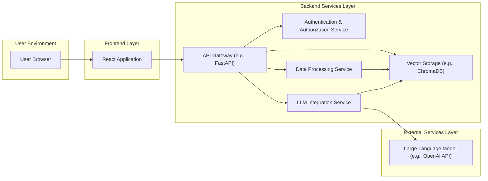

# Project Design Document: Quivr - Your Personal AI Knowledge Base

**Version:** 1.1
**Date:** October 26, 2023
**Author:** AI Architecture Expert

## 1. Introduction

This document details the design of the Quivr project, a personal AI knowledge base application. Quivr empowers users to upload and interact with their documents, websites, and other knowledge sources, leveraging Large Language Models (LLMs) for intelligent question answering and information retrieval. This document provides a comprehensive architectural overview and serves as the foundation for subsequent threat modeling activities.

## 2. Goals and Objectives

The primary goals of Quivr are:

*   Provide an intuitive user interface for seamless uploading and management of personal knowledge sources.
*   Enable users to pose natural language questions and receive contextually relevant answers derived from their uploaded data.
*   Effectively utilize LLMs for advanced semantic search, information extraction, and insightful summarization.
*   Prioritize user privacy and maintain robust data security throughout the application lifecycle.
*   Offer a scalable and reliable platform capable of handling growing knowledge bases and user demand.

## 3. High-Level Architecture

Quivr employs a modular, service-oriented architecture to promote maintainability, scalability, and independent deployment of components. The following diagram illustrates the key components and their interactions:

**Components:**

*   **User Browser:** The web browser application through which users access and interact with Quivr.
*   **Frontend (React Application):**  Responsible for rendering the user interface, handling user interactions, and communicating with the backend API.
*   **Backend Services:** The core logic of the application, encompassing data processing, storage, and LLM interactions.
    *   **API Gateway (FastAPI):**  The central entry point for all backend requests, responsible for routing, request validation, and potentially cross-cutting concerns like rate limiting.
    *   **Authentication & Authorization Service:** Manages user accounts, authentication (verifying user identity), and authorization (controlling access to specific resources and functionalities).
    *   **Data Processing Service:**  Handles the ingestion, parsing, and preparation of user-uploaded data. This includes document parsing, text chunking, and generating vector embeddings.
    *   **Vector Storage (ChromaDB):**  Stores the generated vector embeddings, enabling efficient similarity searches for relevant information retrieval.
    *   **LLM Integration Service:**  Orchestrates communication with the external LLM API for generating embeddings, answering questions, and potentially other LLM-powered features.
*   **External Services (Large Language Model):**  The third-party LLM service utilized for its natural language processing capabilities.

## 4. Detailed Component Design

### 4.1. Frontend (React Application)

*   **Purpose:**  Provides a user-friendly and interactive interface for all Quivr functionalities.
*   **Key Features:**
    *   Secure user authentication and registration workflows.
    *   Intuitive drag-and-drop or file selection for document uploads.
    *   Clear display of processing status for uploaded documents.
    *   Text input area for users to ask questions.
    *   Display of answers generated by the LLM, potentially with source attribution.
    *   Mechanisms for managing knowledge bases (collections of uploaded documents).
    *   Potentially user profile management and settings.
*   **Technology:** React, potentially leveraging state management libraries like Redux or Zustand, UI component libraries like Material UI or Ant Design, and build tools like Webpack or Vite.
*   **Security Considerations:**
    *   Implementation of robust measures against Cross-Site Scripting (XSS) vulnerabilities through input sanitization and secure coding practices.
    *   Secure handling of user input to prevent injection attacks (e.g., command injection).
    *   Strict adherence to secure authentication and authorization flows, ensuring sensitive data is not exposed.

### 4.2. Backend Services

#### 4.2.1. API Gateway (FastAPI)

*   **Purpose:**  Acts as a reverse proxy and traffic controller for all backend services, providing a single point of entry for client requests.
*   **Key Features:**
    *   Defines and manages API endpoints for all core functionalities, including user authentication, document management (upload, delete), and question answering.
    *   Routes incoming requests to the appropriate backend service based on the endpoint.
    *   Performs basic request validation (e.g., data types, required fields).
    *   Implements middleware for cross-cutting concerns such as logging, authentication, authorization, and setting security headers.
    *   May include rate limiting mechanisms to protect against abuse.
*   **Technology:** FastAPI (Python), chosen for its performance, asynchronous capabilities, and automatic API documentation generation.
*   **Security Considerations:**
    *   Protection against common web application attacks, including SQL injection (if directly interacting with a database), and Cross-Site Request Forgery (CSRF) through appropriate security headers and token management.
    *   Implementation of robust rate limiting and request throttling to mitigate denial-of-service attacks.
    *   Secure handling and storage of any API keys or authentication tokens used for internal service communication.

#### 4.2.2. Authentication & Authorization Service

*   **Purpose:**  Manages user identities, verifies user credentials, and controls access to protected resources and functionalities.
*   **Key Features:**
    *   Provides endpoints for user registration, login, and password management (reset, change).
    *   Securely stores user credentials, employing strong hashing algorithms (e.g., bcrypt) and salting.
    *   Manages user sessions, potentially using JWT (JSON Web Tokens) for stateless authentication.
    *   Implements role-based access control (RBAC) or attribute-based access control (ABAC) to define and enforce permissions for different users or groups.
*   **Technology:**  Could be a dedicated service built with frameworks like Flask or Django, or integrated with the API Gateway using libraries like `python-jose`. Alternatively, leveraging an external identity provider (e.g., Auth0, Firebase Authentication) is a viable option.
*   **Security Considerations:**
    *   Ensuring secure storage of user credentials using strong, salted hashing algorithms.
    *   Implementing measures to prevent brute-force attacks on login attempts (e.g., account lockout).
    *   Secure generation, storage, and revocation of session tokens or cookies, protecting against session hijacking.
    *   Rigorous enforcement of authorization policies to prevent unauthorized access to data and functionalities.

#### 4.2.3. Data Processing Service

*   **Purpose:**  Handles the ingestion, parsing, transformation, and preparation of user-uploaded data for efficient querying.
*   **Key Features:**
    *   Receives uploaded files from the API Gateway.
    *   Identifies the file type (e.g., PDF, TXT, DOCX) and utilizes appropriate parsing libraries.
    *   Extracts textual content from the uploaded files.
    *   Splits the extracted text into smaller, semantically meaningful chunks to optimize LLM processing and retrieval.
    *   Generates vector embeddings for each text chunk by interacting with the LLM Integration Service.
    *   Stores the generated embeddings and associated metadata (e.g., source document, chunk ID) in the Vector Storage.
*   **Technology:** Python, leveraging libraries such as `PyPDF2` or `pdfminer.six` for PDF parsing, `python-docx` for DOCX parsing, and potentially libraries for advanced text splitting and preprocessing.
*   **Security Considerations:**
    *   Thorough validation of uploaded file types and sizes to prevent malicious uploads or resource exhaustion.
    *   Sanitization of parsed content to prevent potential injection attacks if the content is later displayed or processed in other contexts.
    *   Secure communication with the Vector Storage to protect the integrity and confidentiality of the stored embeddings.

#### 4.2.4. Vector Storage (ChromaDB)

*   **Purpose:**  Provides efficient storage and retrieval of vector embeddings, enabling semantic similarity searches for question answering.
*   **Key Features:**
    *   Stores vector embeddings along with associated metadata, facilitating filtering and contextual understanding.
    *   Offers efficient similarity search algorithms based on vector distance metrics (e.g., cosine similarity).
    *   Provides APIs for adding, querying, updating, and deleting embeddings.
    *   May offer features for indexing and optimizing vector searches.
*   **Technology:** ChromaDB (or alternative vector databases like Pinecone, Weaviate, FAISS), chosen for its ease of use and suitability for semantic search.
*   **Security Considerations:**
    *   Implementation of access control mechanisms to restrict access to the vector database, preventing unauthorized modification or deletion of embeddings.
    *   Consideration of data encryption at rest and in transit to protect the confidentiality of the stored embeddings.
    *   Regular backups and disaster recovery planning to ensure data availability.

#### 4.2.5. LLM Integration Service

*   **Purpose:**  Acts as an intermediary between Quivr's backend and the external Large Language Model API, abstracting away the complexities of direct API interaction.
*   **Key Features:**
    *   Receives text chunks from the Data Processing Service and calls the external LLM API to generate corresponding vector embeddings.
    *   Receives user questions from the API Gateway.
    *   Generates a vector embedding for the user's question using the external LLM API.
    *   Queries the Vector Storage to find the most semantically similar text chunk embeddings based on the question embedding.
    *   Retrieves the content of the most relevant text chunks from the Vector Storage (or potentially a separate data store if full text is not stored in the vector database).
    *   Constructs a prompt for the external LLM, including the user's question and the retrieved relevant context.
    *   Sends the prompt to the external LLM API to generate a natural language answer.
    *   Returns the generated answer to the API Gateway.
*   **Technology:** Python, utilizing libraries specific to the chosen LLM provider (e.g., the OpenAI Python library).
*   **Security Considerations:**
    *   Secure storage and management of API keys required to access the external LLM service, avoiding hardcoding and utilizing secure secret management solutions.
    *   Implementation of rate limiting and robust error handling for interactions with the external LLM API to prevent service disruptions or unexpected costs.
    *   Careful construction of prompts sent to the LLM to mitigate the risk of prompt injection attacks, where malicious input could manipulate the LLM's behavior.

### 4.3. External Services (Large Language Model)

*   **Purpose:**  Provides advanced natural language processing capabilities, including generating vector embeddings for text and answering questions based on provided context.
*   **Examples:** OpenAI API (e.g., models like `text-embedding-ada-002`, `gpt-3.5-turbo`, `gpt-4`), Cohere, AI21 Labs.
*   **Security Considerations:**
    *   Reliance on the security, availability, and data privacy policies of the chosen external service provider.
    *   Understanding and adhering to the LLM provider's terms of service and data usage policies.

## 5. Data Flow

The following describes the typical data flow when a user asks a question:

1. **User Question Input:** The user enters a question through the Frontend.
2. **Question Submission:** The Frontend sends the question to the API Gateway via an HTTPS request.
3. **Authentication and Authorization:** The API Gateway authenticates the user via the Authentication & Authorization Service.
4. **Question Routing:** The API Gateway routes the authenticated request to the LLM Integration Service.
5. **Question Embedding Generation:** The LLM Integration Service generates a vector embedding for the user's question by calling the External LLM API.
6. **Similarity Search:** The LLM Integration Service queries the Vector Storage using the question embedding to find the most relevant text chunk embeddings.
7. **Context Retrieval:** The Vector Storage returns the IDs (and potentially the content) of the most relevant text chunks.
8. **Prompt Construction:** The LLM Integration Service constructs a prompt for the External LLM, including the user's question and the retrieved context.
9. **Answer Generation Request:** The LLM Integration Service sends the prompt to the External LLM API.
10. **Answer Generation:** The External LLM generates a natural language answer based on the provided context.
11. **Answer Response:** The External LLM sends the generated answer back to the LLM Integration Service.
12. **Answer Routing:** The LLM Integration Service sends the answer back to the API Gateway.
13. **Answer Delivery:** The API Gateway sends the answer to the Frontend.
14. **Answer Display:** The Frontend displays the answer to the user.

A similar data flow exists for document uploads, where the Data Processing Service handles the parsing, chunking, and embedding generation before storing the embeddings in the Vector Storage.

## 6. Deployment Architecture

Quivr can be deployed on various cloud platforms using containerization and orchestration technologies. A potential deployment architecture includes:

*   **Cloud Provider:**  A major cloud provider such as AWS, Google Cloud Platform (GCP), or Azure.
*   **Containerization:** Docker for packaging each backend service and the frontend application into isolated containers.
*   **Orchestration:** Kubernetes for managing and scaling the containerized applications, providing features like automated deployments, scaling, and self-healing.
*   **API Gateway:**  A managed API Gateway service provided by the cloud provider (e.g., AWS API Gateway, Google Cloud API Gateway, Azure API Management) for enhanced security, scalability, and management.
*   **Compute:**  A managed Kubernetes service (e.g., Amazon EKS, Google Kubernetes Engine, Azure Kubernetes Service) to host the containerized applications.
*   **Vector Storage:**  A managed vector database service (if available from the chosen cloud provider) or a self-hosted instance of ChromaDB deployed within the Kubernetes cluster.
*   **Database (for user accounts):** A managed relational database service (e.g., Amazon RDS, Google Cloud SQL, Azure SQL Database) for storing user credentials and other application data.
*   **CI/CD Pipeline:**  An automated Continuous Integration/Continuous Deployment pipeline using tools like Jenkins, GitLab CI, or GitHub Actions to streamline the build, test, and deployment process.

## 7. Technology Stack

*   **Frontend:** React, JavaScript (ES6+), HTML5, CSS3, potentially TypeScript, and associated build tools (Webpack/Vite).
*   **Backend:** Python (FastAPI), potentially with libraries like SQLAlchemy for database interaction, and libraries for interacting with the chosen LLM provider.
*   **Vector Storage:** ChromaDB (or a similar vector database).
*   **Database:** PostgreSQL (or another relational database like MySQL).
*   **Containerization:** Docker.
*   **Orchestration:** Kubernetes.
*   **Cloud Provider:** (To be determined, e.g., AWS, GCP, Azure).
*   **LLM API:** OpenAI API (or another LLM provider's API).

## 8. Security Considerations (Detailed)

This section provides a more detailed overview of security considerations for each component, which will be further elaborated upon during the threat modeling process.

*   **User Browser:**
    *   Mitigation of Cross-Site Scripting (XSS) vulnerabilities through secure coding practices, input sanitization, and Content Security Policy (CSP) implementation.
    *   Protection against Cross-Site Request Forgery (CSRF) attacks using anti-CSRF tokens.
    *   Ensuring secure communication over HTTPS to protect data in transit.

*   **Frontend (React Application):**
    *   Secure handling of sensitive data, avoiding storing secrets or API keys in the frontend code.
    *   Regularly updating frontend dependencies to patch known security vulnerabilities.
    *   Implementing proper input validation to prevent injection attacks.

*   **API Gateway (FastAPI):**
    *   Implementation of robust authentication and authorization mechanisms to control access to API endpoints.
    *   Rate limiting and request throttling to prevent denial-of-service attacks.
    *   Protection against common web application attacks (e.g., SQL injection if directly interacting with a database, command injection).
    *   Secure handling of API keys and other sensitive credentials.

*   **Authentication & Authorization Service:**
    *   Secure storage of user credentials using strong, salted hashing algorithms.
    *   Implementation of multi-factor authentication (MFA) for enhanced security.
    *   Protection against brute-force attacks on login attempts.
    *   Secure session management using secure cookies or tokens with appropriate expiration times.

*   **Data Processing Service:**
    *   Validation of uploaded file types and sizes to prevent malicious uploads.
    *   Sanitization of parsed content to prevent injection attacks.
    *   Secure communication with the Vector Storage and other backend services.

*   **Vector Storage (ChromaDB):**
    *   Implementation of access control lists (ACLs) or other mechanisms to restrict access to the vector database.
    *   Encryption of data at rest and in transit.
    *   Regular backups and disaster recovery planning.

*   **LLM Integration Service:**
    *   Secure storage and management of API keys for the external LLM service, potentially using a secrets management service.
    *   Rate limiting and error handling for interactions with the external API.
    *   Careful construction of prompts to mitigate the risk of prompt injection attacks.
    *   Logging and monitoring of interactions with the LLM API for security auditing.

*   **External Services (Large Language Model):**
    *   Understanding and adhering to the LLM provider's security and privacy policies.
    *   Considering data privacy implications when sending user data to the external LLM service.

## 9. Future Considerations

*   **Enhanced Data Source Support:** Expanding support to include various data sources beyond document uploads, such as website scraping, database connections, and integration with other applications.
*   **Advanced Search and Filtering:** Implementing more sophisticated search capabilities, including filtering by document type, date, or other metadata, and allowing users to refine their queries.
*   **User Collaboration Features:** Enabling users to share knowledge bases, collaborate on document annotations, and potentially ask questions collaboratively.
*   **Integration with External Tools:**  Developing integrations with other productivity tools and platforms, such as note-taking applications or project management software.
*   **LLM Fine-tuning:** Exploring the possibility of fine-tuning LLMs on user-specific data to improve the accuracy and relevance of answers (with careful consideration of privacy implications and user consent).
*   **Summarization and Key Takeaways:** Implementing features to automatically summarize documents or provide key takeaways.

This improved design document provides a more detailed and comprehensive overview of the Quivr project's architecture. It serves as a solid foundation for development efforts and provides valuable input for conducting a thorough threat model to identify and mitigate potential security vulnerabilities.