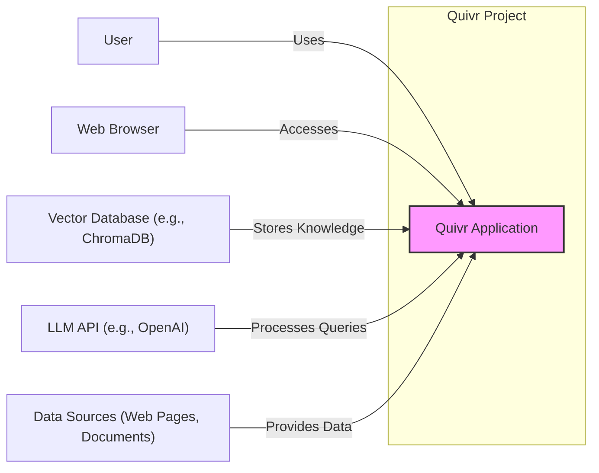
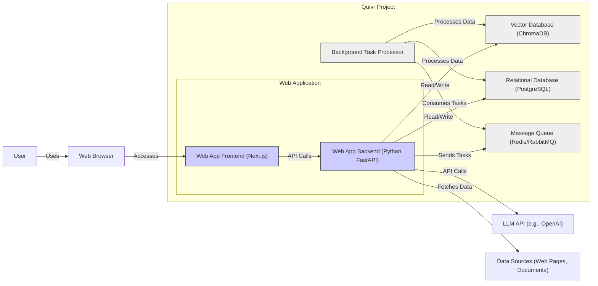
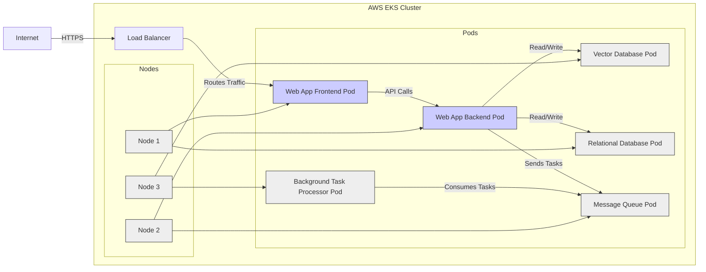

# BUSINESS POSTURE

This project, Quivr, aims to create a personal AI-powered knowledge base. The primary business priority for such a project, whether for an individual or a company, is to enhance knowledge management and accessibility, leading to improved decision-making, efficiency, and potentially innovation.

For a startup or a company adopting Quivr, the business goals could include:

*   Improved employee onboarding and training by providing a centralized knowledge repository.
*   Faster access to critical information for employees, reducing time spent searching for data.
*   Enhanced research and development capabilities by leveraging collective knowledge.
*   Better customer support through quick access to product documentation and solutions.
*   Competitive advantage by leveraging internal knowledge more effectively.

The most important business risks associated with these priorities and goals are:

*   Data Loss: Loss of valuable knowledge base data due to system failures, security breaches, or accidental deletion. This can severely impact the ability to access and utilize critical information.
*   Data Breach and Confidentiality: Unauthorized access to sensitive information stored in the knowledge base. This is especially critical if the knowledge base contains proprietary information, trade secrets, or personal data. A breach can lead to financial loss, reputational damage, and legal liabilities.
*   System Unavailability: Inability to access the knowledge base when needed due to system downtime, infrastructure failures, or cyberattacks. This can disrupt business operations and reduce productivity.
*   Data Integrity: Corruption or modification of data within the knowledge base, leading to inaccurate or unreliable information. This can result in poor decision-making and operational errors.
*   Compliance and Regulatory Risks: Failure to comply with data privacy regulations (e.g., GDPR, CCPA) if the knowledge base stores personal data. This can lead to significant fines and legal repercussions.

# SECURITY POSTURE

Based on the provided GitHub repository and typical open-source projects, the existing security controls are likely minimal, especially concerning a project in active development.  It's crucial to establish a robust security posture as the project evolves and potentially handles more sensitive data or wider user access.

Existing Security Controls:

*   security control: Code hosted on GitHub - provides version control and some level of access control through GitHub permissions. Implemented: GitHub repository settings.
*   security control: Open Source project - community review can potentially identify vulnerabilities over time. Implemented: Publicly available code.

Accepted Risks:

*   accepted risk: Limited formal security testing - as an open-source project, dedicated security testing might be ad-hoc or community-driven, leading to potential vulnerabilities being missed.
*   accepted risk: Dependency vulnerabilities - reliance on open-source libraries and packages introduces the risk of vulnerabilities in those dependencies.
*   accepted risk: Lack of dedicated security team - security is likely handled by the core development team, who may not have specialized security expertise.

Recommended Security Controls (High Priority):

*   security control: Implement automated security scanning in CI/CD pipeline (SAST, DAST, Dependency scanning).
*   security control: Conduct regular penetration testing and vulnerability assessments.
*   security control: Implement robust input validation and sanitization across all application layers.
*   security control: Implement secure configuration management for all components (servers, databases, applications).
*   security control: Implement access control lists and principle of least privilege for all resources.
*   security control: Implement data encryption at rest and in transit for sensitive data.
*   security control: Establish incident response plan for security incidents.
*   security control: Conduct security awareness training for developers and users.

Security Requirements:

*   Authentication:
    *   Requirement: Secure user authentication mechanism to verify user identity.
    *   Requirement: Support for strong password policies and multi-factor authentication (MFA) should be considered for enhanced security.
    *   Requirement: Session management to securely manage user sessions and prevent unauthorized access.
*   Authorization:
    *   Requirement: Role-based access control (RBAC) to manage user permissions and access to different features and data within the knowledge base.
    *   Requirement: Principle of least privilege should be enforced, granting users only the necessary permissions to perform their tasks.
    *   Requirement: Secure API authorization to protect backend APIs from unauthorized access.
*   Input Validation:
    *   Requirement: Comprehensive input validation on all user inputs to prevent injection attacks (e.g., SQL injection, Cross-Site Scripting - XSS).
    *   Requirement: Input sanitization and encoding to neutralize potentially malicious inputs.
    *   Requirement: Validation should be performed on both client-side and server-side.
*   Cryptography:
    *   Requirement: Encryption of sensitive data at rest (e.g., database encryption, file system encryption).
    *   Requirement: Encryption of data in transit using HTTPS for all communication channels.
    *   Requirement: Secure storage and management of cryptographic keys.
    *   Requirement: Use of strong and up-to-date cryptographic algorithms and libraries.

# DESIGN

## C4 CONTEXT

Context Diagram Elements:

*   Element:
    *   Name: User
    *   Type: Person
    *   Description: Individuals who interact with the Quivr application to manage and query their knowledge base.
    *   Responsibilities: Access and manage personal knowledge, query the knowledge base using natural language, provide feedback on the system.
    *   Security controls: Authentication to access the application, authorization based on user roles (if implemented).
*   Element:
    *   Name: Web Browser
    *   Type: Software System
    *   Description: The web browser used by users to access the Quivr application's user interface.
    *   Responsibilities: Rendering the user interface, handling user interactions, communicating with the Quivr application.
    *   Security controls: Browser security features (e.g., Content Security Policy), HTTPS communication.
*   Element:
    *   Name: Quivr Application
    *   Type: Software System
    *   Description: The core application that provides the knowledge base functionality, including data ingestion, storage, querying, and AI processing.
    *   Responsibilities: Managing user authentication and authorization, ingesting data from various sources, storing and indexing knowledge in the vector database, processing user queries using LLM APIs, providing a user interface.
    *   Security controls: Authentication, authorization, input validation, data encryption, secure API communication, security logging and monitoring.
*   Element:
    *   Name: Vector Database (e.g., ChromaDB)
    *   Type: Software System
    *   Description: A specialized database used to store and efficiently search vector embeddings of the knowledge base content.
    *   Responsibilities: Storing vector embeddings, providing efficient similarity search capabilities for semantic queries.
    *   Security controls: Access control to the database, data encryption at rest, network security.
*   Element:
    *   Name: LLM API (e.g., OpenAI)
    *   Type: External System
    *   Description: A third-party Large Language Model API used by Quivr to process natural language queries and generate responses based on the knowledge base.
    *   Responsibilities: Natural language processing, semantic understanding, generating responses based on provided context.
    *   Security controls: API key management, secure API communication (HTTPS).
*   Element:
    *   Name: Data Sources (Web Pages, Documents)
    *   Type: External System
    *   Description: External sources from which knowledge base data is ingested, such as web pages, documents, and other files.
    *   Responsibilities: Providing data to be ingested into the knowledge base.
    *   Security controls: Data source validation (ensure trusted sources), secure data retrieval methods.

## C4 CONTAINER

Container Diagram Elements:

*   Element:
    *   Name: Web App Frontend (Next.js)
    *   Type: Web Application
    *   Description: The client-side application built with Next.js, responsible for rendering the user interface and handling user interactions.
    *   Responsibilities: Presenting the user interface, handling user input, making API calls to the backend, managing user sessions in the browser.
    *   Security controls: Input validation (client-side), protection against XSS, secure session management (cookies, tokens), HTTPS communication.
*   Element:
    *   Name: Web App Backend (Python FastAPI)
    *   Type: API Application
    *   Description: The server-side application built with Python and FastAPI, responsible for handling API requests from the frontend, business logic, and data access.
    *   Responsibilities: User authentication and authorization, API endpoint management, data validation and sanitization, interacting with databases and external APIs, task queue management.
    *   Security controls: Authentication, authorization, input validation, secure API design, protection against injection attacks, secure logging, rate limiting, API key management for external APIs.
*   Element:
    *   Name: Vector Database (ChromaDB)
    *   Type: Database
    *   Description: ChromaDB is used to store vector embeddings of the knowledge base content for efficient semantic search.
    *   Responsibilities: Storing and indexing vector embeddings, providing vector similarity search functionality.
    *   Security controls: Access control lists, network security (firewall rules), data encryption at rest, regular security updates.
*   Element:
    *   Name: Relational Database (PostgreSQL)
    *   Type: Database
    *   Description: A relational database (likely PostgreSQL) used to store application data, user information, metadata, and potentially structured knowledge base content.
    *   Responsibilities: Storing structured data, managing user accounts, storing application configuration.
    *   Security controls: Access control lists, database user management, data encryption at rest, regular security updates, database backups.
*   Element:
    *   Name: Message Queue (Redis/RabbitMQ)
    *   Type: Messaging System
    *   Description: A message queue system (e.g., Redis or RabbitMQ) used for asynchronous task processing, such as data ingestion, indexing, and background AI processing.
    *   Responsibilities: Queuing and delivering tasks to background task processors, decoupling backend API from long-running tasks.
    *   Security controls: Access control to the message queue, secure communication channels (if supported), monitoring and logging.
*   Element:
    *   Name: Background Task Processor
    *   Type: Application
    *   Description: A worker application that processes tasks from the message queue, performing background operations like data ingestion, indexing, and AI processing.
    *   Responsibilities: Consuming tasks from the message queue, processing data, interacting with databases and external APIs, updating the vector database and relational database.
    *   Security controls: Secure task processing logic, error handling, secure communication with other components, logging and monitoring.

## DEPLOYMENT

Deployment Architecture: Cloud-Based Containerized Deployment (using Docker and Kubernetes on AWS EKS)

Deployment Diagram Elements:

*   Element:
    *   Name: AWS EKS Cluster
    *   Type: Infrastructure
    *   Description: Amazon Elastic Kubernetes Service (EKS) cluster, a managed Kubernetes service for container orchestration.
    *   Responsibilities: Container orchestration, resource management, scalability, high availability.
    *   Security controls: Network policies, IAM roles for service accounts, Kubernetes RBAC, security updates, vulnerability scanning of container images.
*   Element:
    *   Name: Nodes (Node 1, Node 2, Node 3)
    *   Type: Infrastructure
    *   Description: Worker nodes within the EKS cluster, virtual machines that run containerized applications (Pods).
    *   Responsibilities: Running container workloads, providing compute resources.
    *   Security controls: Operating system hardening, security patching, node security groups, intrusion detection systems.
*   Element:
    *   Name: Pods (WebAppFrontendPod, WebAppBackendPod, VectorDatabasePod, RelationalDatabasePod, MessageQueuePod, BackgroundTaskProcessorPod)
    *   Type: Container
    *   Description: Kubernetes Pods, the smallest deployable units in Kubernetes, each containing one or more containers of the application components.
    *   Responsibilities: Running specific application containers (frontend, backend, database, etc.).
    *   Security controls: Container image security scanning, resource limits, security context settings, network policies.
*   Element:
    *   Name: Load Balancer
    *   Type: Infrastructure
    *   Description: AWS Elastic Load Balancer (ELB) in front of the EKS cluster, distributing incoming traffic to the Web App Frontend Pods.
    *   Responsibilities: Load balancing, traffic routing, SSL termination, high availability.
    *   Security controls: HTTPS termination, security groups, DDoS protection, access logs.
*   Element:
    *   Name: Internet
    *   Type: Network
    *   Description: Public internet network from which users access the Quivr application.
    *   Responsibilities: Providing network connectivity for users.
    *   Security controls: N/A - external network, focus on application and infrastructure security.

## BUILD

Build Process using GitHub Actions:

```mermaid
flowchart LR
    Developer["Developer"] -- Code Commit --> GitHub["GitHub Repository"]
    GitHub -- GitHub Push --> GitHubActions["GitHub Actions Workflow"]
    subgraph GitHubActions
        CheckoutCode["Checkout Code"]
        BuildWebApp["Build Web App (Frontend & Backend)"]
        RunTests["Run Unit & Integration Tests"]
        SAST["Static Application Security Testing (SAST)"]
        DependencyScan["Dependency Vulnerability Scan"]
        Containerize["Containerize Application (Docker Build)"]
        PushImage["Push Docker Image to Container Registry (e.g., Docker Hub, AWS ECR)"]
    end
    GitHubActions -- Build Artifacts & Container Image --> ContainerRegistry["Container Registry"]

    style GitHubActions fill:#ccf,stroke:#333,stroke-width:1px
```

Build Process Description:

1.  Developer commits code changes to the GitHub Repository.
2.  A GitHub Actions workflow is triggered on code push.
3.  Checkout Code step retrieves the latest code from the repository.
4.  Build Web App step compiles the frontend (Next.js) and builds the backend (Python FastAPI) application.
5.  Run Tests step executes unit and integration tests to ensure code quality and functionality.
6.  Static Application Security Testing (SAST) step performs static code analysis to identify potential security vulnerabilities in the codebase.
7.  Dependency Vulnerability Scan step scans project dependencies for known vulnerabilities.
8.  Containerize Application step builds Docker images for the application components.
9.  Push Docker Image to Container Registry step pushes the built Docker images to a container registry (e.g., Docker Hub, AWS ECR).
10. Container Registry stores the build artifacts and container images, ready for deployment.

Build Process Security Controls:

*   security control: Secure Code Repository (GitHub) - Access control, audit logs, branch protection. Implemented: GitHub repository settings.
*   security control: Automated Build Pipeline (GitHub Actions) - Controlled build environment, versioned workflows, audit logs. Implemented: GitHub Actions workflows.
*   security control: Static Application Security Testing (SAST) - Automated code analysis for vulnerability detection. Implemented: Integrated SAST tool in CI pipeline.
*   security control: Dependency Vulnerability Scanning - Automated scanning of dependencies for known vulnerabilities. Implemented: Dependency scanning tool in CI pipeline.
*   security control: Unit and Integration Tests - Ensure code quality and reduce potential vulnerabilities through testing. Implemented: Test suites in codebase, executed in CI pipeline.
*   security control: Container Image Scanning - Vulnerability scanning of Docker images before deployment. Recommended: Integrate container image scanning in CI/CD pipeline or container registry.
*   security control: Secure Container Registry - Access control, vulnerability scanning, image signing. Implemented: Container registry security features (e.g., AWS ECR, Docker Hub).

# RISK ASSESSMENT

Critical Business Processes to Protect:

*   Knowledge Retrieval: The ability for users to effectively search and retrieve information from the knowledge base. Disruption of this process directly impacts user productivity and the core value proposition of Quivr.
*   Data Ingestion and Processing: The process of adding new knowledge to the system, including data extraction, embedding generation, and indexing. Failure in this process prevents the knowledge base from being updated and remaining relevant.
*   System Availability: Ensuring the Quivr application is accessible and operational when users need it. Downtime can disrupt workflows and hinder access to critical information.
*   User Authentication and Authorization: Securely verifying user identities and controlling access to the knowledge base and its features. Failure in this area can lead to unauthorized access and data breaches.

Data to Protect and Sensitivity:

*   Knowledge Base Content: This is the most critical data asset. Sensitivity depends on the nature of the knowledge stored. It could range from public information to highly confidential business data, trade secrets, or personal information. Sensitivity level needs to be determined based on the intended use case.
*   User Data: User accounts, profiles, settings, and potentially usage data. Sensitivity level is typically considered personal data and requires protection according to privacy regulations.
*   API Keys and Credentials: API keys for LLM APIs (e.g., OpenAI) and database credentials. Highly sensitive data that must be protected to prevent unauthorized access to external services and the database.
*   Application Logs: Logs containing application activity, errors, and security events. Can contain sensitive information if not properly managed and secured. Sensitivity level depends on the content of the logs.

# QUESTIONS & ASSUMPTIONS

Questions:

*   What is the intended deployment environment (cloud, on-premise, hybrid)?
*   What is the expected scale of users and data volume?
*   What is the sensitivity level of the data to be stored in the knowledge base?
*   Are there any specific compliance requirements (e.g., GDPR, HIPAA, SOC 2)?
*   What are the performance and availability requirements for the application?
*   What is the budget and resources available for security implementation?
*   What level of security expertise is available within the development and operations teams?

Assumptions:

*   The project will be deployed in a cloud environment (AWS, GCP, or Azure).
*   The knowledge base will contain potentially sensitive business information.
*   Security is a high priority for the project, especially as it matures and handles more data.
*   A DevOps approach with CI/CD pipeline will be used for development and deployment.
*   The project will leverage open-source components and cloud-managed services where possible.
*   User authentication and authorization are essential security requirements.
*   Data encryption at rest and in transit will be implemented for sensitive data.