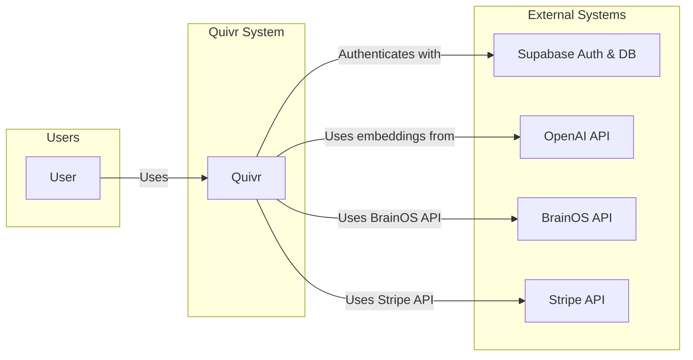
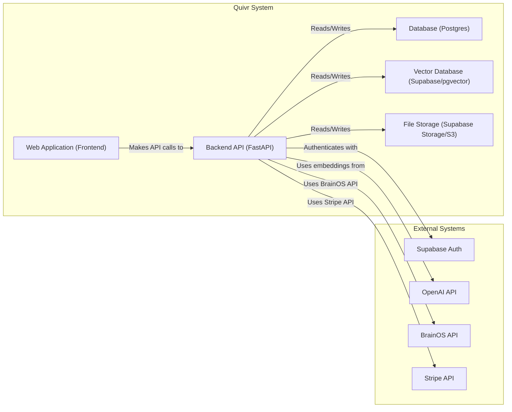
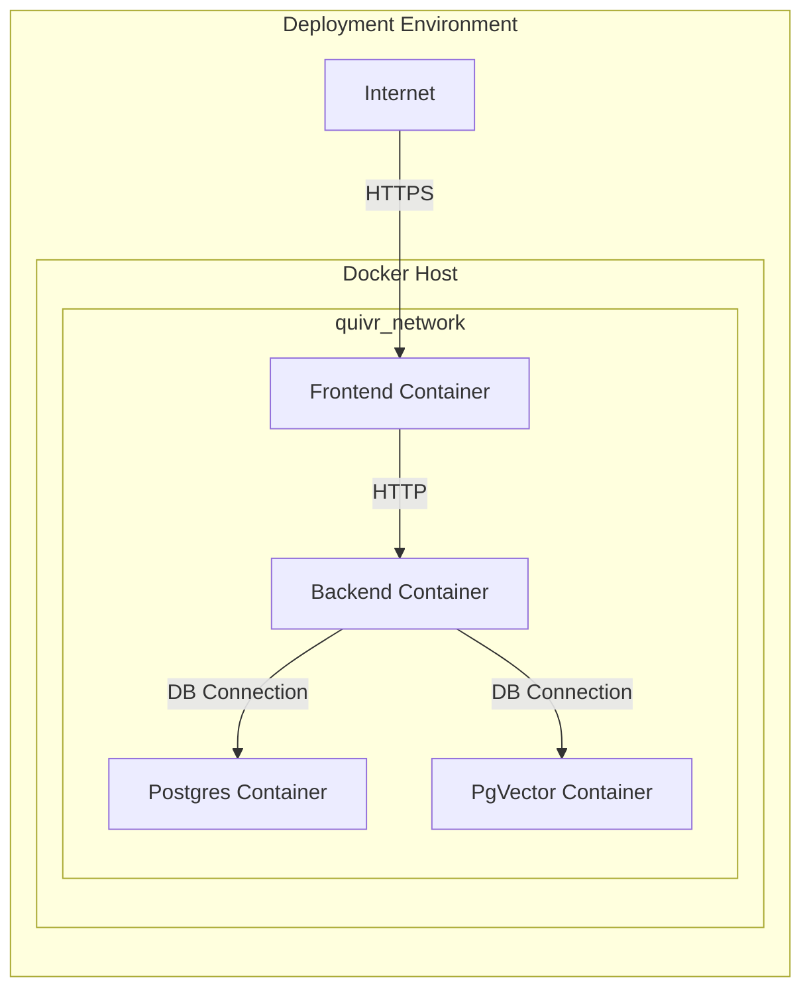

Okay, let's create a design document for the Quivr project based on the provided GitHub repository.

# BUSINESS POSTURE

Quivr, positioned as a "second brain," aims to provide users with a private, cloud-based or self-hosted solution for storing and retrieving unstructured information. The project appears to be in a relatively early stage, balancing rapid development with the need to establish robust security.

Priorities:

*   Rapid feature development and iteration.
*   Attracting and retaining users by providing a useful and reliable service.
*   Maintaining user trust by ensuring data privacy and security.
*   Offering both cloud-based and self-hosted deployment options to cater to different user preferences.
*   Open source.

Goals:

*   Become a leading solution for personal knowledge management.
*   Build a strong community around the project.
*   Potentially monetize the cloud-based offering.

Business Risks:

*   Data breaches or loss, leading to reputational damage and loss of user trust.
*   Competition from established players in the knowledge management space.
*   Difficulty in scaling the infrastructure to meet growing demand.
*   Inability to secure sufficient funding or resources to sustain development.
*   Vulnerabilities in third-party dependencies, leading to exploits.
*   Lack of adoption due to complexity or usability issues.

# SECURITY POSTURE

Existing Security Controls:

*   security control: Authentication via Supabase (described in Supabase documentation and project code).
*   security control: API key management (mentioned in documentation).
*   security control: Use of environment variables for configuration (evident in code and documentation).
*   security control: Docker-based deployment for containerization (Dockerfile and docker-compose.yml).
*   security control: HTTPS usage (implied, but should be explicitly enforced).
*   security control: Basic input sanitization (observed in code, but needs thorough review).
*   security control: Dependency management using `poetry` (pyproject.toml and poetry.lock).

Accepted Risks:

*   accepted risk: Potential vulnerabilities in third-party dependencies (inherent risk in any software project).
*   accepted risk: Limited security auditing and penetration testing (due to early stage of development).
*   accepted risk: Reliance on Supabase for authentication and database security (outsourcing security responsibility).
*   accepted risk: Potential for user error in self-hosted deployments (users are responsible for their own infrastructure security).

Recommended Security Controls:

*   Implement comprehensive input validation and sanitization throughout the application.
*   Conduct regular security audits and penetration testing.
*   Implement a robust secrets management solution (e.g., HashiCorp Vault).
*   Enforce HTTPS and HSTS (HTTP Strict Transport Security).
*   Implement rate limiting and other measures to prevent abuse.
*   Establish a clear security vulnerability disclosure policy.
*   Implement Content Security Policy (CSP) to mitigate XSS attacks.
*   Implement regular security training for developers.
*   Use static code analysis tools (SAST) to identify potential vulnerabilities.
*   Use dynamic application security testing (DAST) to identify vulnerabilities in the running application.
*   Use software composition analysis (SCA) to identify vulnerabilities in third-party dependencies.

Security Requirements:

*   Authentication:
    *   Support strong password policies.
    *   Consider multi-factor authentication (MFA).
    *   Implement secure session management.
    *   Protect against brute-force attacks.
*   Authorization:
    *   Implement role-based access control (RBAC) or attribute-based access control (ABAC).
    *   Ensure that users can only access their own data.
    *   Implement granular permissions for different types of data and actions.
*   Input Validation:
    *   Validate all user inputs on the server-side.
    *   Use a whitelist approach to allow only known-good characters.
    *   Sanitize inputs to prevent cross-site scripting (XSS) and other injection attacks.
*   Cryptography:
    *   Use strong encryption algorithms (e.g., AES-256) for data at rest and in transit.
    *   Use secure key management practices.
    *   Use a cryptographically secure random number generator (CSPRNG).
    *   Store passwords using a strong, adaptive, one-way hashing function (e.g., Argon2, bcrypt).
*   Data Protection:
    *   Implement data loss prevention (DLP) measures.
    *   Regularly back up data.
    *   Implement a data retention policy.

# DESIGN

## C4 CONTEXT

Element Descriptions:

*   Element:
    *   Name: User
    *   Type: Person
    *   Description: A person who uses Quivr to store and retrieve information.
    *   Responsibilities:
        *   Creating, editing, and deleting documents.
        *   Uploading files.
        *   Interacting with the Quivr interface.
        *   Managing their account.
    *   Security controls:
        *   Authentication via Supabase.
        *   Authorization based on user roles and permissions.

*   Element:
    *   Name: Quivr
    *   Type: Software System
    *   Description: The Quivr application itself, providing the core functionality.
    *   Responsibilities:
        *   Managing user data.
        *   Providing the user interface.
        *   Interacting with external services.
        *   Enforcing security policies.
    *   Security controls:
        *   Input validation and sanitization.
        *   HTTPS enforcement.
        *   API key management.
        *   Rate limiting.

*   Element:
    *   Name: Supabase Auth & DB
    *   Type: External System
    *   Description: Supabase provides authentication and database services.
    *   Responsibilities:
        *   Managing user accounts.
        *   Storing user data securely.
        *   Providing authentication APIs.
    *   Security controls:
        *   Supabase's built-in security features.

*   Element:
    *   Name: OpenAI API
    *   Type: External System
    *   Description: OpenAI provides the embedding models for semantic search.
    *   Responsibilities:
        *   Generating embeddings for text data.
    *   Security controls:
        *   API key authentication.

*   Element:
    *   Name: BrainOS API
    *   Type: External System
    *   Description: BrainOS provides additional capabilities.
    *   Responsibilities:
        *   Providing API for integration.
    *   Security controls:
        *   API key authentication.

*   Element:
    *   Name: Stripe API
    *   Type: External System
    *   Description: Stripe provides payment processing capabilities.
    *   Responsibilities:
        *   Providing API for integration.
    *   Security controls:
        *   API key authentication.

## C4 CONTAINER

Element Descriptions:

*   Element:
    *   Name: Web Application (Frontend)
    *   Type: Web Application
    *   Description: The user interface, built with a framework like React, Vue, or similar.
    *   Responsibilities:
        *   Rendering the user interface.
        *   Handling user interactions.
        *   Making API calls to the backend.
    *   Security controls:
        *   Input validation (client-side).
        *   Protection against XSS (using framework features).
        *   CSP.

*   Element:
    *   Name: Backend API (FastAPI)
    *   Type: API
    *   Description: The backend API, built with FastAPI, handles business logic and data access.
    *   Responsibilities:
        *   Handling API requests.
        *   Performing business logic.
        *   Interacting with the database and other services.
        *   Enforcing security policies.
    *   Security controls:
        *   Input validation (server-side).
        *   Authentication and authorization.
        *   Rate limiting.
        *   API key management.

*   Element:
    *   Name: Database (Postgres)
    *   Type: Database
    *   Description: PostgreSQL database for storing structured data.
    *   Responsibilities:
        *   Storing user data, document metadata, etc.
    *   Security controls:
        *   Database access controls.
        *   Encryption at rest (if supported by Supabase).
        *   Regular backups.

*   Element:
    *   Name: Vector Database (Supabase/pgvector)
    *   Type: Database
    *   Description: Stores vector embeddings for semantic search.
    *   Responsibilities:
        *   Storing and querying vector embeddings.
    *   Security controls:
        *   Database access controls.

*   Element:
    *   Name: File Storage (Supabase Storage/S3)
    *   Type: Blob Storage
    *   Description: Stores uploaded files.
    *   Responsibilities:
        *   Storing and retrieving files.
    *   Security controls:
        *   Access controls.
        *   Encryption at rest.

*   Element:
    *   Name: Supabase Auth
    *   Type: External System
    *   Description: Supabase provides authentication services.
    *   Responsibilities:
        *   Managing user accounts.
        *   Providing authentication APIs.
    *   Security controls:
        *   Supabase's built-in security features.

*   Element:
    *   Name: OpenAI API
    *   Type: External System
    *   Description: OpenAI provides the embedding models for semantic search.
    *   Responsibilities:
        *   Generating embeddings for text data.
    *   Security controls:
        *   API key authentication.

*   Element:
    *   Name: BrainOS API
    *   Type: External System
    *   Description: BrainOS provides additional capabilities.
    *   Responsibilities:
        *   Providing API for integration.
    *   Security controls:
        *   API key authentication.

*   Element:
    *   Name: Stripe API
    *   Type: External System
    *   Description: Stripe provides payment processing capabilities.
    *   Responsibilities:
        *   Providing API for integration.
    *   Security controls:
        *   API key authentication.

## DEPLOYMENT

Possible Deployment Solutions:

1.  **Supabase Hosted:** Deploying the entire application (frontend, backend, database) on Supabase's managed platform.
2.  **Hybrid (Supabase + Vercel/Netlify):** Using Supabase for backend and database, and Vercel or Netlify for frontend hosting.
3.  **Self-Hosted (Docker):** Using the provided Docker Compose configuration to deploy the application on a user-controlled server.
4.  **Cloud Provider (AWS/GCP/Azure):** Deploying the application on a cloud provider using services like AWS ECS, Google Kubernetes Engine, or Azure Kubernetes Service.

Chosen Solution (for detailed description): **Self-Hosted (Docker)**

Element Descriptions:

*   Element:
    *   Name: Docker Host
    *   Type: Server
    *   Description: A server (physical or virtual) running Docker Engine and Docker Compose.
    *   Responsibilities:
        *   Running the Docker containers.
        *   Providing network connectivity.
        *   Managing resources (CPU, memory, storage).
    *   Security controls:
        *   Operating system security hardening.
        *   Firewall configuration.
        *   Regular security updates.
        *   Intrusion detection and prevention systems.

*   Element:
    *   Name: Frontend Container
    *   Type: Container
    *   Description: Docker container running the Quivr frontend application.
    *   Responsibilities:
        *   Serving the frontend application to users.
    *   Security controls:
        *   Container isolation.
        *   Regular image updates.

*   Element:
    *   Name: Backend Container
    *   Type: Container
    *   Description: Docker container running the Quivr backend API.
    *   Responsibilities:
        *   Handling API requests.
        *   Interacting with the database and other services.
    *   Security controls:
        *   Container isolation.
        *   Regular image updates.

*   Element:
    *   Name: Postgres Container
    *   Type: Container
    *   Description: Docker container running the PostgreSQL database.
    *   Responsibilities:
        *   Storing user data, document metadata, etc.
    *   Security controls:
        *   Container isolation.
        *   Database access controls.
        *   Regular image updates.

*   Element:
    *   Name: PgVector Container
    *   Type: Container
    *   Description: Docker container running the PgVector.
    *   Responsibilities:
        *   Storing user data, document metadata, etc.
    *   Security controls:
        *   Container isolation.
        *   Database access controls.
        *   Regular image updates.

*   Element:
    *   Name: Internet
    *   Type: Network
    *   Description: The public internet.
    *   Responsibilities:
        *   Providing network connectivity to users.
    *   Security controls:
        *   HTTPS encryption.
        *   Firewall.

## BUILD

The Quivr project utilizes a combination of tools for building and packaging the application.  The primary build process is centered around Docker and Docker Compose, simplifying deployment and ensuring consistency across environments.

```mermaid
graph LR
    Developer["Developer"] --> Git["Git Repository (GitHub)"]
    Git --> Trigger["Build Trigger (e.g., Push, Pull Request)"]
    Trigger --> CI["CI/CD Pipeline (e.g., GitHub Actions)"]
    CI --> Build["Build Steps"]
    Build --> DockerBuild["Docker Build (Backend, Frontend)"]
    DockerBuild --> DockerCompose["Docker Compose Build"]
    DockerCompose --> Publish["Publish Docker Images (e.g., Docker Hub)"]
    Publish --> Artifacts["Build Artifacts (Docker Images)"]
```

Build Process Description:

1.  **Developer:** Developers write code and commit changes to the Git repository (GitHub).
2.  **Git:** The GitHub repository stores the source code and tracks changes.
3.  **Build Trigger:** A build is triggered by events like pushes to the main branch or pull requests.  While not explicitly defined in the repository, GitHub Actions is a likely candidate for CI/CD.
4.  **CI/CD Pipeline:** A CI/CD pipeline (e.g., GitHub Actions) orchestrates the build process.
5.  **Build Steps:** The pipeline executes various build steps, including:
    *   **Dependency Installation:**  `poetry install` is used to install Python dependencies for the backend.  Frontend dependencies are likely managed with `npm` or `yarn`.
    *   **Linting:**  Linters (e.g., `flake8`, `pylint` for Python, `eslint` for JavaScript) are used to enforce code style and identify potential errors.
    *   **Testing:** Unit tests and integration tests are executed to verify code correctness.  The repository contains some tests, but a more comprehensive test suite is recommended.
    *   **Static Analysis:** SAST tools (e.g., `bandit` for Python, `SonarQube`) can be integrated to scan for security vulnerabilities.
    *   **SCA:** SCA tools can be used to identify vulnerabilities in third-party dependencies.
6.  **Docker Build:**  Dockerfiles are used to build separate images for the frontend and backend.
7.  **Docker Compose Build:** Docker Compose is used to build and link the containers together, defining the application's multi-container architecture.
8.  **Publish Docker Images:**  The built Docker images can be published to a container registry (e.g., Docker Hub, GitHub Container Registry).
9.  **Build Artifacts:** The final build artifacts are the Docker images, ready for deployment.

Security Controls in Build Process:

*   security control: **Dependency Management:** `poetry` and `npm`/`yarn` manage dependencies, and lock files (`poetry.lock`, `package-lock.json`/`yarn.lock`) ensure consistent builds.
*   security control: **Linting:** Linters enforce code style and help prevent common errors.
*   security control: **Testing:** Automated tests help ensure code quality and prevent regressions.
*   security control: **Containerization:** Docker provides isolation and reduces the attack surface.
*   security control: **(Recommended) SAST:** Integrate static analysis tools to identify vulnerabilities early in the development lifecycle.
*   security control: **(Recommended) SCA:** Integrate software composition analysis tools to identify vulnerabilities in third-party dependencies.
*   security control: **(Recommended) Image Scanning:** Scan Docker images for vulnerabilities before deployment.

# RISK ASSESSMENT

Critical Business Processes:

*   User data storage and retrieval.
*   User authentication and authorization.
*   Integration with external services (OpenAI, Supabase, BrainOS, Stripe).
*   Application availability and performance.

Data Sensitivity:

*   **User-Uploaded Documents:**  Potentially highly sensitive, containing personal or confidential information.  Sensitivity varies greatly depending on user input.
*   **User Account Information:**  Includes email addresses, usernames, and potentially other personal data.  Moderately sensitive.
*   **Usage Data:**  Information about how users interact with the application.  Potentially sensitive, depending on the level of detail collected.
*   **API Keys and Secrets:**  Highly sensitive, providing access to external services and internal resources.

# QUESTIONS & ASSUMPTIONS

Questions:

*   What is the specific threat model for self-hosted deployments?  Are users expected to have a certain level of technical expertise?
*   What are the plans for handling data breaches or security incidents?
*   What are the long-term plans for scaling the application?
*   What level of support is provided for self-hosted deployments?
*   Are there any specific compliance requirements (e.g., GDPR, HIPAA) that need to be considered?
*   What is the process for handling user data deletion requests?
*   What are the specific security features provided by Supabase, and how are they configured?
*   How are API keys for external services managed and secured?
*   What is the expected user base size and growth rate?
*   What is the budget allocated for security measures?

Assumptions:

*   BUSINESS POSTURE: The project is currently prioritizing rapid development and feature growth over extensive security hardening.
*   BUSINESS POSTURE: The project aims to attract a large user base, including both technical and non-technical users.
*   SECURITY POSTURE: Supabase provides a reasonable level of security for authentication and database management.
*   SECURITY POSTURE: Users of self-hosted deployments are responsible for securing their own infrastructure.
*   DESIGN: The provided Docker Compose configuration is the primary deployment method.
*   DESIGN: The application relies heavily on external services (Supabase, OpenAI, BrainOS, Stripe).
*   DESIGN: The application is designed to be scalable, but specific scaling strategies are not yet fully defined.
*   DESIGN: The development team is aware of basic security principles but may not have extensive security expertise.