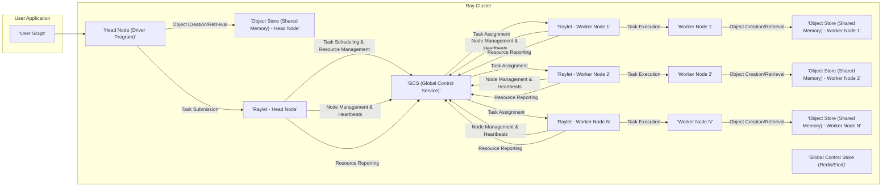
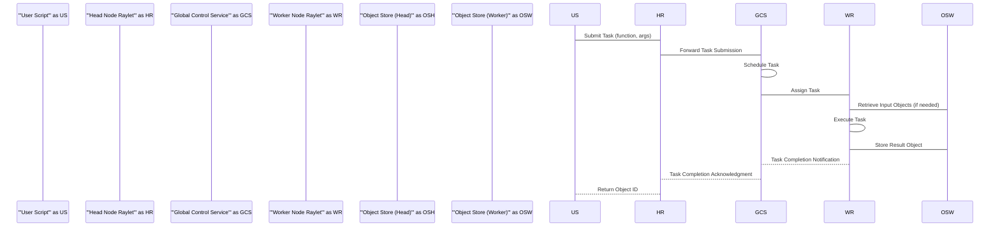

# Project Design Document: Ray Distributed Computing Framework

## 1. Introduction

This document provides an enhanced design overview of the Ray distributed computing framework, building upon the initial design. It details the key architectural components, their interactions, and the overall system design with greater clarity and depth. This document serves as a robust foundation for subsequent threat modelling activities.

## 2. Goals

The primary goals of the Ray project are:

*   **General-purpose distributed computing:** To enable the parallel and distributed execution of Python, and increasingly other languages, across a cluster of machines.
*   **Ease of use:** To provide a simple, intuitive, and Pythonic API for developers to parallelize their applications with minimal code changes.
*   **Scalability:** To seamlessly support applications ranging from single-machine prototyping to massive-scale deployments involving thousands of nodes.
*   **Fault tolerance:** To ensure the system can gracefully recover from node and process failures, maintaining application progress.
*   **Performance:** To offer highly efficient execution of distributed tasks and management of large distributed datasets.
*   **Dynamic Task Graphs:** To support complex workflows and dependencies between tasks, enabling sophisticated distributed applications.

## 3. High-Level Architecture

Ray employs a distributed architecture centered around a cluster of interconnected nodes. A central control plane manages the cluster's resources and orchestrates task scheduling, while worker processes execute user-defined code.

## 4. Key Components

The Ray architecture is built upon several core components, each with specific responsibilities:

*   **Driver Program (Head Node):**
    *   The entry point for a Ray application, where the user's Python script begins execution.
    *   Utilizes the Ray API to define and submit tasks (remote functions) and actors (distributed stateful objects).
    *   Interacts with the Ray cluster to orchestrate the execution of these distributed computations.
*   **Worker Nodes:**
    *   The computational units of the Ray cluster, responsible for executing tasks assigned by the scheduler.
    *   Each worker node runs one or more Raylet processes to manage local resources and task execution.
    *   Hosts local object stores for efficient storage and retrieval of distributed objects.
*   **Raylet:**
    *   A lightweight, per-node agent that serves as the core resource manager and task executor on each node.
    *   Communicates with the Global Control Service (GCS) to receive task assignments and report node status.
    *   Manages the execution of tasks and actors on its local node, including process creation and monitoring.
    *   Manages the local object store, handling object creation, retrieval, and eviction.
*   **Global Control Service (GCS):**
    *   A scalable and fault-tolerant service that maintains the global state of the Ray cluster.
    *   Stores information about available resources across the cluster, registered actors and their locations, and pending tasks.
    *   Implements the central scheduler, responsible for assigning tasks to available worker nodes based on resource requirements, data locality, and other scheduling policies.
    *   Often implemented using a distributed key-value store like Redis or Etcd for persistence and coordination.
*   **Object Store (Shared Memory):**
    *   A distributed shared-memory store enabling efficient sharing of large, immutable objects between tasks and actors running on the same or different nodes.
    *   Each node maintains its own local object store, leveraging shared memory for performance.
    *   Objects are referenced by unique IDs, allowing tasks and actors to retrieve them regardless of their physical location. Ray handles the underlying data transfer if the object is not local.
*   **Scheduler:**
    *   The component responsible for making decisions about where and when to execute tasks.
    *   Centralized within the GCS, it considers factors like resource availability (CPU, GPU, memory), data locality (where required input objects reside), and task priorities.

## 5. Data Flow

The typical data flow within a Ray application involves these key steps:

1. **Task Definition and Submission:** The user's driver program defines tasks (remote functions) and submits them to the Ray cluster via the local Raylet on the head node.
2. **Task Scheduling:** The Raylet on the head node forwards the task submission to the GCS. The central scheduler within the GCS determines the most suitable worker node for execution.
3. **Task Assignment:** The GCS informs the Raylet on the chosen worker node about the new task assignment.
4. **Input Object Retrieval:** The Raylet on the worker node retrieves any necessary input objects from its local object store or, if the objects are remote, fetches them from the object store on the node where they reside.
5. **Task Execution:** The Raylet on the worker node launches a worker process to execute the task.
6. **Object Creation:** If the task produces a result, the worker process stores the resulting object in the local object store of the worker node.
7. **Object Retrieval by Other Tasks/Actors:** Other tasks or actors needing the output object can retrieve it using its object ID. Ray handles the data transfer between object stores if the object is not locally available.
8. **Actor Creation and Invocation:** When a user creates an actor, it is instantiated on a specific worker node. Subsequent invocations on that actor are routed to the Raylet managing that actor's process.

## 6. Security Considerations

Security is a crucial aspect of any distributed system. Here are key security considerations for the Ray framework:

*   **Authentication and Authorization:** Ensuring only authorized nodes and users can interact with the Ray cluster is paramount.
    *   **Node Authentication:** Mechanisms are needed to verify the identity of nodes joining the cluster to prevent unauthorized nodes from participating. This could involve shared secrets, certificates, or other cryptographic methods.
    *   **User Authentication:** When users interact with the Ray cluster (e.g., submitting jobs, accessing dashboards), their identity needs to be verified. Integration with existing identity providers (like LDAP or OAuth) or the use of API keys could be considered.
    *   **Authorization:** Once authenticated, users and nodes should only have access to the resources and actions they are permitted to use. Role-Based Access Control (RBAC) could be implemented to manage permissions. For instance, restricting who can submit tasks, access specific objects, or manage cluster resources.
*   **Data Confidentiality and Integrity:** Protecting data both in transit and at rest is essential.
    *   **Transport Layer Security (TLS):** Encrypting all communication channels between Ray components (e.g., between Raylets, between the driver and Raylets) using TLS can prevent eavesdropping and tampering.
    *   **Object Store Encryption:**  Consider options for encrypting data stored in the distributed object store. This could involve encryption at rest using keys managed by a key management system.
    *   **Data Integrity Checks:** Implementing mechanisms to ensure the integrity of data during transfer and storage, such as checksums or cryptographic signatures, can detect accidental or malicious modifications.
*   **Network Security:** Securing the network environment where the Ray cluster operates is critical.
    *   **Network Segmentation:** Isolating the Ray cluster within a dedicated network segment with firewalls can limit the attack surface.
    *   **Port Management:** Restricting access to the ports used by Ray components to only authorized entities can prevent unauthorized connections.
    *   **Secure Communication Protocols:**  Enforcing the use of secure protocols (like gRPC with TLS) for internal communication.
*   **Code Injection Prevention:** Protecting against the execution of malicious code within the Ray environment is crucial.
    *   **Input Validation and Sanitization:** Carefully validating and sanitizing any user-provided code or data before execution can prevent injection attacks.
    *   **Sandboxing and Containerization:** Executing tasks within isolated environments like containers or sandboxes can limit the potential impact of malicious code.
    *   **Secure Deserialization Practices:**  Being cautious about deserializing data from untrusted sources to prevent vulnerabilities.
*   **Denial of Service (DoS) Protection:** Safeguarding the cluster against resource exhaustion attacks is important for availability.
    *   **Resource Quotas and Limits:** Implementing quotas on resources like CPU, memory, and the number of tasks or actors a user can create can prevent resource monopolization.
    *   **Rate Limiting:** Limiting the rate at which users can submit tasks or perform other actions can mitigate DoS attempts.
    *   **Monitoring and Alerting:** Continuously monitoring resource usage and network traffic can help detect and respond to DoS attacks.
*   **Supply Chain Security:** Ensuring the integrity of the Ray codebase and its dependencies is vital.
    *   **Secure Development Practices:** Following secure coding guidelines and conducting regular security audits can reduce vulnerabilities.
    *   **Dependency Scanning:** Using tools to scan dependencies for known vulnerabilities and keeping them up-to-date.
    *   **Code Signing:** Signing Ray components to verify their authenticity and integrity.
*   **Access Control to Cluster Management Functions:** Restricting access to administrative functionalities is crucial to prevent unauthorized modifications or disruptions.
    *   **Strong Authentication for Administrative Tasks:** Requiring strong credentials and potentially multi-factor authentication for users performing administrative actions.
    *   **Auditing:** Logging administrative actions to track who made changes and when.
    *   **Principle of Least Privilege:** Granting only the necessary permissions to administrators.

## 7. Future Considerations

This improved design document provides a more detailed and robust understanding of the Ray architecture. Future enhancements could include:

*   **Detailed Component Designs:** Developing more in-depth design specifications for individual components like the scheduler, object store, and communication protocols.
*   **Security Architecture:** Creating a dedicated security architecture document outlining specific security mechanisms and policies in detail.
*   **Deployment Models:** Documenting different deployment options and their security implications (e.g., on-premise, cloud).
*   **Integration with Security Tools:** Exploring integrations with existing security tools for monitoring, vulnerability scanning, and incident response.

This document serves as a valuable input for the subsequent threat modelling phase, enabling a comprehensive analysis of potential security risks and the development of appropriate mitigation strategies.