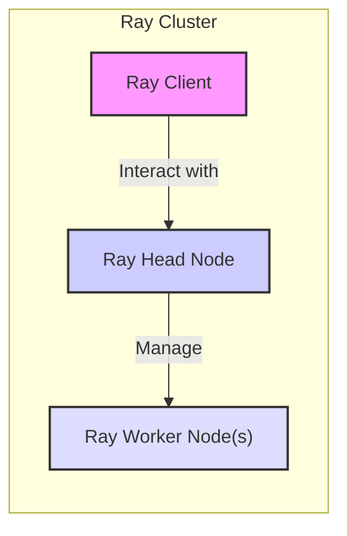
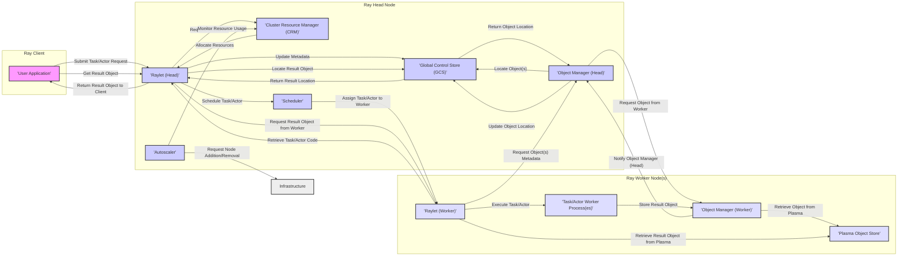

# Project Design Document: Ray

**Version:** 1.1
**Date:** October 26, 2023
**Prepared By:** AI Software Architect

## 1. Introduction

This document provides an enhanced architectural design of the Ray project, an open-source framework for building distributed applications. It serves as a foundation for subsequent threat modeling activities, detailing key components, their interactions, and the overall system architecture with a focus on security considerations.

## 2. Project Goals and Scope

Ray's primary goal is to simplify the development and scaling of Python and Java applications across distributed clusters. This design document focuses on the core architectural elements of Ray and their interactions, specifically to facilitate the identification of potential security vulnerabilities.

The scope includes:

*   Core Ray components and their functionalities.
*   Communication pathways between components.
*   Data flow within the system.
*   Deployment considerations relevant to security.

The scope excludes:

*   Specific implementation details of individual components.
*   Detailed API specifications.
*   User-level application code built on top of Ray.

## 3. System Overview

Ray is a distributed system characterized by a central head node coordinating a network of worker nodes. It offers abstractions for managing stateless tasks and stateful actors, handling resource allocation, scheduling, and fault tolerance.

## 4. Architectural Components

The Ray architecture comprises the following key components:

*   **Ray Client:**
    *   Description: The interface through which users interact with the Ray cluster, providing APIs for submitting tasks and actors.
    *   Responsibilities: Initiating computations and retrieving results.
    *   Interactions: Communicates with the Ray Head Node.

*   **Ray Head Node (Raylet):**
    *   Description: The central control plane of the Ray cluster, hosting critical management services.
    *   Responsibilities: Cluster management, resource allocation, scheduling, and maintaining cluster metadata.
    *   Sub-components:
        *   **Global Control Store (GCS):**
            *   Description: A distributed key-value store for cluster metadata.
            *   Responsibilities: Storing and managing information about nodes, objects, tasks, and actors.
            *   Interactions: Accessed by various components on the head and worker nodes.
        *   **Cluster Resource Manager (CRM):**
            *   Description: Tracks available resources across the cluster.
            *   Responsibilities: Monitoring resource usage and making resource allocation decisions.
            *   Interactions: Communicates with the Scheduler and Autoscaler.
        *   **Object Manager (Head):**
            *   Description: Manages metadata for objects in the distributed object store.
            *   Responsibilities: Tracking object locations and managing object references.
            *   Interactions: Communicates with Worker Object Managers and the GCS.
        *   **Scheduler:**
            *   Description: Assigns tasks and actor creations to worker nodes.
            *   Responsibilities: Determining the optimal placement of computations based on resource requirements and policies.
            *   Interactions: Communicates with the CRM and Worker Raylets.
        *   **Autoscaler:**
            *   Description: Dynamically adjusts the number of nodes in the cluster.
            *   Responsibilities: Monitoring workload demands and scaling the cluster up or down.
            *   Interactions: Communicates with the CRM and the underlying infrastructure provider.

*   **Ray Worker Node (Raylet):**
    *   Description: Runs on each machine in the cluster, responsible for executing tasks and actors.
    *   Responsibilities: Executing computations and managing local resources.
    *   Sub-components:
        *   **Object Manager (Worker):**
            *   Description: Manages the local object store on the worker node.
            *   Responsibilities: Storing and retrieving objects in shared memory.
            *   Interactions: Communicates with the Head Object Manager and local Task/Actor Worker Processes.
        *   **Task/Actor Worker Processes:**
            *   Description: Execute user-defined functions or actor methods.
            *   Responsibilities: Performing the actual computations.
            *   Interactions: Communicates with the local Object Manager to access data.
        *   **Distributed Object Store (Plasma):**
            *   Description: A shared-memory object store for zero-copy data sharing.
            *   Responsibilities: Providing efficient storage and retrieval of objects.
            *   Interactions: Accessed by Task/Actor Worker Processes and the local Object Manager.

*   **Ray Dashboard:**
    *   Description: A web-based user interface for monitoring the Ray cluster.
    *   Responsibilities: Providing insights into cluster status, resource utilization, and task/actor progress.
    *   Interactions: Communicates with the Ray Head Node to retrieve cluster information.

## 5. Component Interactions and Data Flow

**Detailed Data Flow Steps:**

1. **Task/Actor Submission:** The user application (Ray Client) sends a request to the Ray Head Node (Raylet) to execute a task or create an actor.
2. **Metadata Update:** The Head Raylet updates the Global Control Store (GCS) with details about the new task or actor.
3. **Resource Allocation:** The Head Raylet requests necessary resources from the Cluster Resource Manager (CRM). The CRM allocates resources based on availability and defined policies.
4. **Scheduling:** The Scheduler on the Head Node determines the most suitable worker node for executing the task or actor.
5. **Task/Actor Assignment:** The Head Raylet informs the chosen Worker Raylet about the assigned task or actor.
6. **Code Retrieval:** The Worker Raylet retrieves the code required for the task or actor execution (if not already present locally).
7. **Object Metadata Request:** If the task or actor requires specific input objects, the Worker Raylet requests metadata (location) of these objects from the Head Object Manager.
8. **Object Location Lookup:** The Head Object Manager queries the GCS to find the locations of the required objects.
9. **Object Location Return:** The GCS returns the locations of the objects to the Head Object Manager.
10. **Object Request from Worker:** The Head Object Manager instructs the Object Manager on the worker node where the object resides to provide the object.
11. **Object Retrieval from Plasma:** The Worker Object Manager retrieves the requested object from its local Plasma Object Store.
12. **Execution:** The Task/Actor Worker Process on the Worker Node executes the assigned computation using the retrieved objects.
13. **Result Storage:** The result of the computation is stored in the local Plasma Object Store on the Worker Node.
14. **Result Notification:** The Worker Object Manager notifies the Head Object Manager about the availability and location of the result object.
15. **Result Location Update:** The Head Object Manager updates the GCS with the location of the result object.
16. **Result Retrieval Initiation:** The user application (Ray Client) requests the result object from the Head Raylet.
17. **Result Location Retrieval:** The Head Raylet retrieves the location of the result object from the GCS.
18. **Result Request from Worker:** The Head Raylet requests the result object from the appropriate Worker Node's Raylet.
19. **Result Retrieval from Plasma:** The Worker Raylet retrieves the result object from its local Plasma store.
20. **Result Return to Client:** The Head Raylet sends the result object back to the user application (Ray Client).
21. **Autoscaling Monitoring:** The Autoscaler continuously monitors resource utilization within the cluster.
22. **Scaling Actions:** Based on monitoring data, the Autoscaler requests the addition or removal of nodes from the underlying infrastructure to match the workload demands.

## 6. Security Considerations

This section outlines potential security considerations based on the described architecture, providing a basis for threat modeling.

*   **Authentication and Authorization:**
    *   How are Ray Clients authenticated when connecting to the cluster?
    *   Are there mechanisms to authorize access to specific resources or functionalities within the cluster (e.g., submitting tasks, accessing specific actors)?
    *   How is communication between nodes (Head and Workers) authenticated and authorized? Is mutual TLS used?
*   **Data Confidentiality and Integrity:**
    *   How is sensitive data protected both in transit between components and at rest within the object store? Is encryption used for inter-node communication and within Plasma?
    *   How is the integrity of data stored in the distributed object store ensured? Are there checksums or other integrity checks?
    *   Are there mechanisms to prevent unauthorized access to intermediate results or data processed by tasks and actors?
*   **Network Security:**
    *   What network protocols are used for communication between Ray components? Are these protocols secured (e.g., TLS)?
    *   Are there recommendations or enforced configurations for network segmentation and firewall rules to restrict access to Ray components?
    *   How are ports used by Ray components managed and secured?
*   **Control Plane Security (Ray Head Node):**
    *   How is access to the Global Control Store (GCS) controlled and secured? What authentication and authorization mechanisms are in place?
    *   How is the integrity and availability of the GCS ensured? What are the backup and recovery mechanisms?
    *   What measures are in place to prevent unauthorized modifications to cluster configuration and metadata?
*   **Worker Node Security:**
    *   How are worker nodes secured against malicious code execution within tasks and actors? Are there sandboxing or isolation mechanisms?
    *   How is access to local resources (e.g., file system, network) on worker nodes controlled for tasks and actors?
    *   How is the integrity of the Ray runtime environment on worker nodes ensured?
*   **Supply Chain Security:**
    *   How are the dependencies of Ray managed and verified to prevent the introduction of vulnerabilities? Are software bills of materials (SBOMs) used?
    *   How are Ray releases signed and verified?
*   **Monitoring and Logging:**
    *   Are there comprehensive logging and monitoring mechanisms in place to detect and respond to security incidents? What security-relevant events are logged?
    *   Are audit logs maintained for administrative actions and security-related events?
*   **Ray Dashboard Security:**
    *   How is access to the Ray Dashboard authenticated and authorized? Are standard web security practices (e.g., input validation, protection against XSS/CSRF) implemented?
    *   Is communication with the Ray Dashboard encrypted (HTTPS)?
*   **Object Store Security (Plasma):**
    *   What are the security considerations for the shared memory object store? How is access controlled to prevent unauthorized reads or writes?
    *   Are there mechanisms to prevent information leakage through shared memory?

## 7. Deployment Considerations

The security of a Ray deployment is heavily influenced by the deployment environment.

*   **Cloud vs. On-Premise:**
    *   Cloud deployments can leverage cloud provider security services (e.g., IAM, network security groups, encryption services).
    *   On-premise deployments require manual configuration and management of security controls.
*   **Containerization (e.g., Docker, Kubernetes):**
    *   Containerization can provide isolation and simplify deployment but introduces container security considerations (e.g., image scanning, vulnerability management, secure container runtime).
    *   Kubernetes deployments require careful configuration of RBAC, network policies, and secrets management.
*   **Network Configuration:**
    *   Proper network segmentation and firewall rules are critical for isolating the Ray cluster and controlling access between components and external networks.
    *   Consider using private networks and VPNs for secure communication.
*   **Identity and Access Management (IAM):**
    *   Integration with existing IAM systems can streamline authentication and authorization for Ray clients and administrative access.
    *   Consider using role-based access control (RBAC) for managing permissions within the Ray cluster.

## 8. Future Considerations

Future developments in Ray may introduce new security considerations.

*   **Enhanced Security Features:**  Planned integrations for more advanced authentication protocols (e.g., Kerberos), fine-grained authorization policies, and end-to-end encryption.
*   **Secure Multi-Tenancy:**  Mechanisms to provide strong isolation and security boundaries between different users or applications sharing a Ray cluster.
*   **Federated Learning and Secure Aggregation:** Security considerations for supporting privacy-preserving distributed computations.

This enhanced design document provides a more detailed and security-focused view of the Ray architecture, facilitating a more thorough and effective threat modeling process.