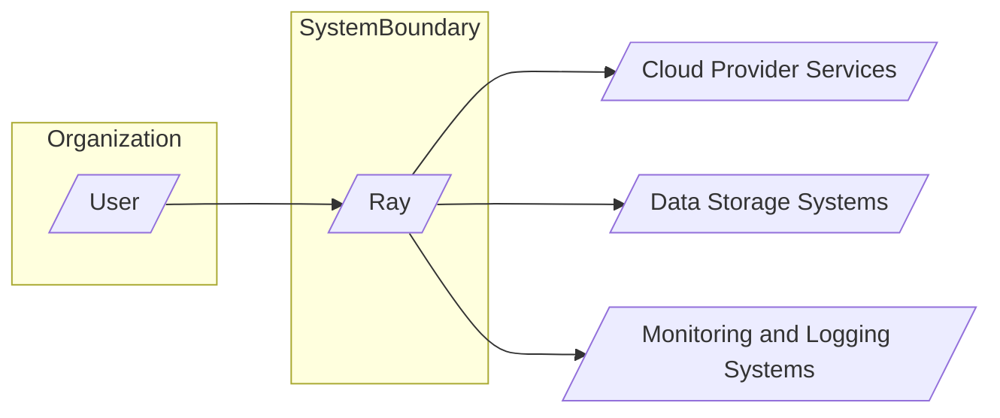
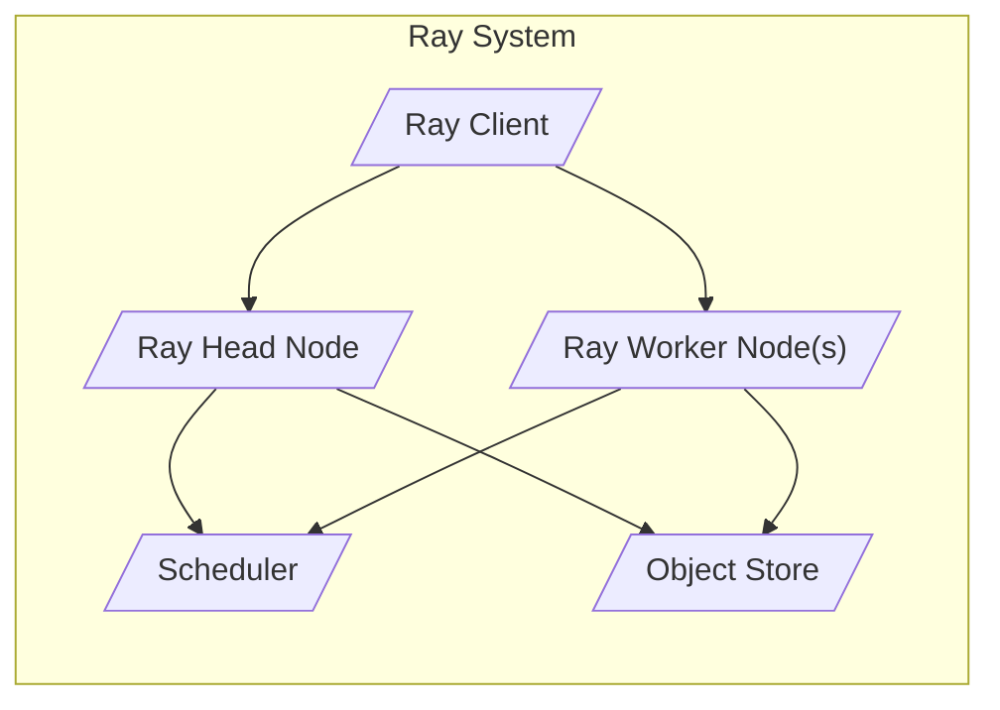
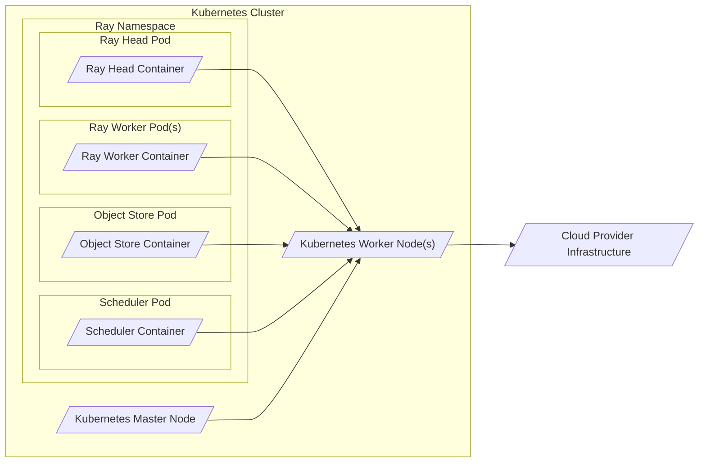
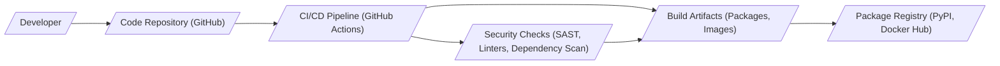

# BUSINESS POSTURE

Ray is an open-source project focused on providing a unified framework for scaling AI and Python applications. Its primary business goal is to simplify distributed computing and make it accessible to developers and organizations of all sizes. By offering a high-performance, flexible, and user-friendly platform, Ray aims to accelerate innovation in AI, machine learning, and other compute-intensive domains.

Business priorities for Ray include:

- User adoption and community growth: Expanding the user base and fostering a vibrant community are crucial for the long-term success and sustainability of an open-source project like Ray.
- Performance and scalability: Maintaining and improving Ray's performance and scalability are essential to meet the demands of modern AI and distributed applications.
- Feature richness and ease of use: Continuously adding new features and improving the user experience are important to attract and retain users.
- Stability and reliability: Ensuring the stability and reliability of the Ray platform is critical for production deployments and user trust.

Key business risks associated with Ray include:

- Security vulnerabilities: Security flaws in Ray could lead to data breaches, service disruptions, and reputational damage, hindering user adoption and trust.
- Performance bottlenecks: Performance issues could limit Ray's scalability and effectiveness, impacting user satisfaction and competitiveness.
- Lack of adoption: If Ray fails to gain sufficient user adoption, it may struggle to attract contributors and maintain momentum.
- Competition: The distributed computing and AI platform landscape is competitive. Ray needs to differentiate itself and maintain a competitive edge.

# SECURITY POSTURE

Existing security controls for the Ray project, based on common open-source practices and repository analysis:

- security control: Code reviews:  Likely implemented through GitHub pull requests, where community members and maintainers review code contributions. (Implemented in: GitHub Pull Request process)
- security control: Static code analysis:  Potentially integrated into the development workflow or CI/CD pipelines to identify potential code quality and security issues. (Potentially implemented in: CI/CD pipelines, but not explicitly documented)
- security control: Vulnerability scanning:  Likely performed on dependencies and potentially on the Ray codebase itself, although specific tools and processes are not explicitly documented. (Potentially implemented, but not explicitly documented)
- security control: Issue tracking and security reporting: GitHub Issues are used for bug reports and feature requests, and likely also for security vulnerability reporting. (Implemented in: GitHub Issues)
- security control: Access control: GitHub repository access controls manage who can contribute code and manage the project. (Implemented in: GitHub repository permissions)

Accepted risks for the Ray project:

- accepted risk: Reliance on community contributions: Open-source projects rely on community contributions, which can introduce security vulnerabilities if not properly vetted.
- accepted risk: Publicly disclosed vulnerabilities: Security vulnerabilities are typically publicly disclosed after a fix is available, which can create a window of opportunity for attackers.
- accepted risk: Complexity of distributed systems: Distributed systems are inherently complex, increasing the potential for subtle security vulnerabilities.

Recommended security controls to implement:

- recommended security control: Security-focused code reviews:  Establish specific guidelines and checklists for code reviews focusing on security best practices and common vulnerability patterns.
- recommended security control: Automated security scanning in CI/CD: Integrate SAST, DAST, and dependency scanning tools into the CI/CD pipeline to automatically detect security vulnerabilities before deployment.
- recommended security control: Regular penetration testing: Conduct periodic penetration testing by security experts to identify vulnerabilities in a controlled environment.
- recommended security control: Security incident response plan: Develop and document a clear incident response plan to handle security vulnerabilities and breaches effectively.
- recommended security control: Security training for developers: Provide security training to developers to raise awareness of security best practices and common vulnerabilities.

Security requirements for Ray:

- Authentication:
    - security requirement: Secure authentication mechanisms for accessing Ray clusters and services, especially in multi-user environments.
    - security requirement: Support for various authentication methods, such as token-based authentication, and integration with existing identity providers.
- Authorization:
    - security requirement: Fine-grained authorization controls to manage access to Ray resources and functionalities based on user roles and permissions.
    - security requirement: Policy enforcement mechanisms to ensure that only authorized users can perform specific actions.
- Input validation:
    - security requirement: Robust input validation to prevent injection attacks and other input-related vulnerabilities.
    - security requirement: Input sanitization and encoding to mitigate cross-site scripting (XSS) and other injection risks.
- Cryptography:
    - security requirement: Secure communication channels using encryption (e.g., TLS/SSL) to protect data in transit between Ray components and clients.
    - security requirement: Secure storage of sensitive data, such as credentials and encryption keys, using appropriate encryption techniques.
    - security requirement: Proper handling of cryptographic keys, including secure generation, storage, and rotation.

# DESIGN

## C4 CONTEXT

Context Diagram Elements:

- Name: User
  - Type: Person
  - Description: Developers, data scientists, and operators who use Ray to build and run distributed applications.
  - Responsibilities: Develop and deploy applications using Ray, manage Ray clusters, monitor application performance.
  - Security controls: Authentication to access Ray clusters (if applicable), authorization based on user roles.

- Name: Ray
  - Type: Software System
  - Description: A unified framework for scaling AI and Python applications. Provides APIs and runtime environment for distributed computing.
  - Responsibilities: Distributed task execution, actor management, object storage, resource scheduling, cluster management.
  - Security controls: Authentication and authorization mechanisms, input validation, secure communication channels, security scanning during development.

- Name: Cloud Provider Services
  - Type: Software System
  - Description: Cloud infrastructure services (e.g., compute, networking, storage) provided by cloud providers like AWS, Azure, GCP, used to deploy and run Ray clusters.
  - Responsibilities: Providing infrastructure resources, managing virtual machines or containers, network connectivity, storage services.
  - Security controls: Cloud provider's security controls (IAM, network security groups, encryption at rest and in transit), infrastructure security hardening.

- Name: Data Storage Systems
  - Type: Software System
  - Description: External data storage systems (e.g., object storage, databases, file systems) used by Ray applications to store and retrieve data.
  - Responsibilities: Persistent data storage, data retrieval, data management.
  - Security controls: Data storage system's security controls (access control lists, encryption at rest and in transit, data backup and recovery).

- Name: Monitoring and Logging Systems
  - Type: Software System
  - Description: Systems used to monitor the health and performance of Ray clusters and applications, and to collect logs for debugging and auditing.
  - Responsibilities: Monitoring cluster metrics, application logs, alerting, performance analysis.
  - Security controls: Access control to monitoring data, secure storage of logs, audit logging.

## C4 CONTAINER

Container Diagram Elements:

- Name: Ray Client
  - Type: Application
  - Description: Client-side library and tools that allow users to interact with Ray clusters, submit jobs, and manage applications.
  - Responsibilities: API for interacting with Ray, job submission, application management, user authentication (if applicable).
  - Security controls: Client-side input validation, secure communication with Ray Head and Worker nodes, user authentication and authorization.

- Name: Ray Head Node
  - Type: Application
  - Description: The central control plane of a Ray cluster. Manages cluster state, resource scheduling, and metadata.
  - Responsibilities: Cluster management, resource scheduling, metadata storage, API endpoint for clients, monitoring and logging.
  - Security controls: Authentication and authorization for client access, secure inter-component communication, input validation, access control to cluster management functions, security monitoring.

- Name: Ray Worker Node(s)
  - Type: Application
  - Description: Nodes that execute tasks and actors in a Ray cluster.
  - Responsibilities: Task execution, actor management, object storage access, resource utilization reporting.
  - Security controls: Secure communication with Ray Head and Object Store, resource isolation, input validation for task execution, access control to local resources.

- Name: Object Store
  - Type: Data Store
  - Description: Distributed shared memory system used by Ray to efficiently store and share objects between tasks and actors.
  - Responsibilities: Object storage, object retrieval, data sharing, memory management.
  - Security controls: Access control to objects, data encryption in transit and at rest (optional, depending on implementation), memory isolation.

- Name: Scheduler
  - Type: Application
  - Description: Component responsible for scheduling tasks and actors onto available resources in the Ray cluster.
  - Responsibilities: Task scheduling, resource allocation, workload balancing.
  - Security controls: Access control to scheduling functions, prevention of resource exhaustion, fair resource allocation.

## DEPLOYMENT

Deployment Architecture: Cloud Deployment on Kubernetes

Deployment Diagram Elements:

- Name: Kubernetes Cluster
  - Type: Infrastructure
  - Description: Kubernetes cluster deployed on cloud provider infrastructure, used to orchestrate and manage Ray components.
  - Responsibilities: Container orchestration, resource management, service discovery, scaling, high availability.
  - Security controls: Kubernetes RBAC, network policies, pod security policies, container security scanning, Kubernetes security hardening.

- Name: Ray Namespace
  - Type: Logical Deployment Unit
  - Description: Kubernetes namespace dedicated to deploying Ray components, providing isolation and resource management within the cluster.
  - Responsibilities: Resource isolation, access control within the Ray deployment.
  - Security controls: Kubernetes namespace isolation, namespace-level RBAC.

- Name: Ray Head Pod
  - Type: Container
  - Description: Kubernetes pod hosting the Ray Head Container.
  - Responsibilities: Running the Ray Head application.
  - Security controls: Container security context, resource limits, network policies.

- Name: Ray Worker Pod(s)
  - Type: Container
  - Description: Kubernetes pods hosting Ray Worker Containers.
  - Responsibilities: Running Ray Worker applications.
  - Security controls: Container security context, resource limits, network policies.

- Name: Object Store Pod
  - Type: Container
  - Description: Kubernetes pod hosting the Object Store Container.
  - Responsibilities: Running the Object Store service.
  - Security controls: Container security context, resource limits, persistent volume security, network policies.

- Name: Scheduler Pod
  - Type: Container
  - Description: Kubernetes pod hosting the Scheduler Container.
  - Responsibilities: Running the Scheduler service.
  - Security controls: Container security context, resource limits, network policies.

- Name: Kubernetes Master Node
  - Type: Infrastructure
  - Description: Kubernetes master node managing the Kubernetes cluster.
  - Responsibilities: Cluster control plane, API server, scheduler, controller manager, etcd.
  - Security controls: Kubernetes master node security hardening, access control to master components, secure API server configuration.

- Name: Kubernetes Worker Node(s)
  - Type: Infrastructure
  - Description: Kubernetes worker nodes executing containers and workloads.
  - Responsibilities: Running containers, resource provisioning, container runtime.
  - Security controls: Kubernetes worker node security hardening, container runtime security, node-level security policies.

- Name: Cloud Provider Infrastructure
  - Type: Infrastructure
  - Description: Underlying cloud infrastructure provided by the cloud provider (e.g., virtual machines, networking, storage).
  - Responsibilities: Providing physical infrastructure, network connectivity, storage services.
  - Security controls: Cloud provider's infrastructure security controls (physical security, network security, data center security).

## BUILD

Build Process Diagram Elements:

- Name: Developer
  - Type: Person
  - Description: Software developers contributing code to the Ray project.
  - Responsibilities: Writing code, submitting code changes, code reviews.
  - Security controls: Developer workstations security, secure coding practices, code review participation.

- Name: Code Repository (GitHub)
  - Type: Software System
  - Description: GitHub repository hosting the Ray source code.
  - Responsibilities: Version control, code collaboration, pull request management.
  - Security controls: Access control to the repository, branch protection, code review enforcement.

- Name: CI/CD Pipeline (GitHub Actions)
  - Type: Software System
  - Description: Automated CI/CD pipeline using GitHub Actions to build, test, and publish Ray artifacts.
  - Responsibilities: Automated build process, testing, artifact generation, security checks, deployment to package registries.
  - Security controls: Secure pipeline configuration, access control to CI/CD secrets, build environment security, artifact signing.

- Name: Build Artifacts (Packages, Images)
  - Type: Data
  - Description: Software packages (e.g., Python packages) and container images produced by the build process.
  - Responsibilities: Distribution of Ray software, deployment of Ray components.
  - Security controls: Artifact signing, integrity checks, vulnerability scanning of artifacts.

- Name: Security Checks (SAST, Linters, Dependency Scan)
  - Type: Software System
  - Description: Automated security scanning tools integrated into the CI/CD pipeline to detect vulnerabilities.
  - Responsibilities: Static code analysis, linting, dependency vulnerability scanning.
  - Security controls: Tool configuration, vulnerability reporting, integration with CI/CD pipeline.

- Name: Package Registry (PyPI, Docker Hub)
  - Type: Software System
  - Description: Public package registries used to distribute Ray packages and container images.
  - Responsibilities: Hosting and distributing Ray artifacts, version management.
  - Security controls: Registry security controls, artifact signing verification, vulnerability scanning of hosted artifacts.

# RISK ASSESSMENT

Critical business processes protected by Ray:

- Distributed computation: Ray enables users to perform large-scale computations across clusters of machines, which is critical for many AI and data processing tasks.
- Machine learning training and inference: Ray accelerates the training of complex machine learning models and enables real-time inference at scale.
- Real-time applications: Ray supports the development and deployment of real-time applications that require low latency and high throughput.

Data being protected and its sensitivity:

- User application data: Ray processes and manages user application data, which can range from public data to sensitive personal or business information depending on the use case. Sensitivity depends heavily on the user's application.
- Model data: Machine learning models trained and deployed using Ray can be valuable intellectual property and may contain sensitive information learned from training data. Sensitivity depends on the model and training data.
- Ray system metadata: Ray stores metadata about cluster state, jobs, and objects, which could potentially be used to gain insights into user activities or system vulnerabilities. Sensitivity is moderate.
- Logs and monitoring data: Ray generates logs and monitoring data that can contain information about system behavior and potential security events. Sensitivity is moderate.

# QUESTIONS & ASSUMPTIONS

Questions:

- What are the specific security requirements and compliance needs of Ray users (e.g., data privacy regulations, industry standards)?
- What is the risk appetite of the Ray project and its community regarding security vulnerabilities?
- Are there specific threat models or attack vectors that are considered high priority for Ray?
- What are the intended deployment environments for Ray (e.g., public cloud, private cloud, on-premises)?
- Are there any specific security features or integrations that are planned for future development?

Assumptions:

- BUSINESS POSTURE assumption: Ray aims for broad adoption across various industries and use cases, including those with moderate to high security requirements.
- SECURITY POSTURE assumption: The Ray project is committed to improving security and addressing vulnerabilities, but resources may be limited due to its open-source nature.
- DESIGN assumption: Ray is typically deployed in cloud environments using container orchestration platforms like Kubernetes.
- DESIGN assumption: Security is a shared responsibility between the Ray project, its users, and the deployment environment providers.