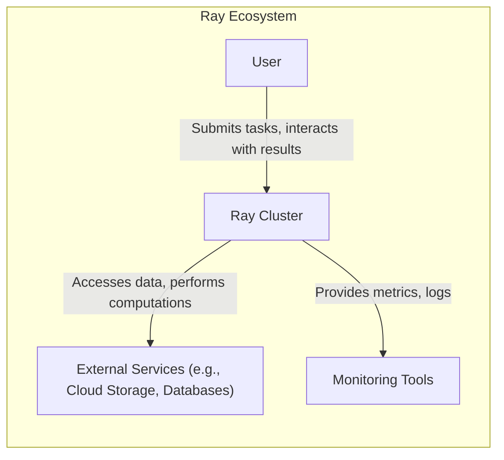
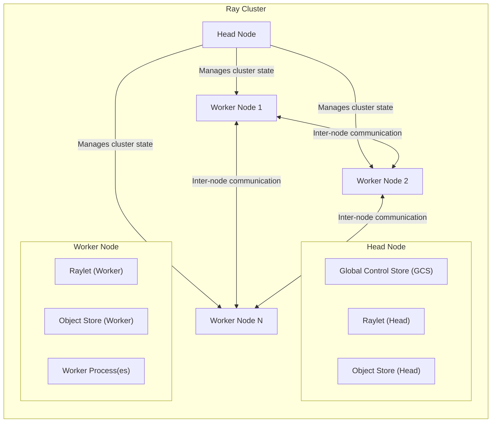
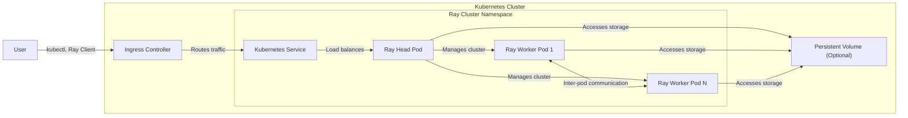
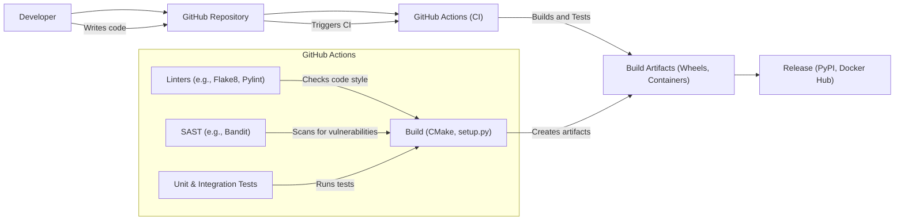

Okay, let's create a design document for the Ray project, focusing on aspects relevant to threat modeling.

# BUSINESS POSTURE

Ray is a unified framework for scaling AI and Python applications.  It's used across various industries, from startups to large enterprises, but its core value proposition centers around enabling rapid development and deployment of computationally intensive workloads.  This suggests a business posture that prioritizes:

*   _Priorities_:
    *   Scalability:  The ability to handle rapidly growing workloads is paramount.
    *   Performance:  Minimizing latency and maximizing throughput are critical for AI applications.
    *   Ease of Use:  Simplifying the development and deployment of distributed applications is a key selling point.
    *   Flexibility:  Supporting a wide range of AI frameworks and libraries is essential.
    *   Cost-Effectiveness:  Optimizing resource utilization to reduce operational costs is important, especially at scale.
    *   Reliability: Ensuring the system operates correctly and recovers from failures is crucial for production deployments.

*   _Goals_:
    *   Become the leading platform for scaling AI and Python applications.
    *   Attract a large and active community of users and contributors.
    *   Enable the development of cutting-edge AI applications.
    *   Provide a robust and reliable platform for production deployments.

*   _Business Risks_:
    *   _Data Corruption/Loss_:  Given the focus on data-intensive workloads, corruption or loss of data during processing is a major risk. This could stem from software bugs, hardware failures, or malicious attacks.
    *   _Unauthorized Access_:  Sensitive data or models could be exposed if the system is compromised. This includes both external attacks and insider threats.
    *   _Denial of Service (DoS)_:  The distributed nature of Ray makes it a potential target for DoS attacks, which could disrupt critical applications.
    *   _Resource Exhaustion_:  Malicious or unintentional workloads could consume excessive resources, leading to performance degradation or cost overruns.
    *   _Supply Chain Vulnerabilities_:  Dependencies on third-party libraries or components could introduce vulnerabilities.
    *   _Compliance Violations_:  Depending on the specific use case, failure to comply with relevant data privacy regulations (e.g., GDPR, CCPA) could result in significant penalties.
    *   _Intellectual Property Theft_: The algorithms and models deployed on Ray may represent valuable intellectual property that needs protection.

# SECURITY POSTURE

Based on the GitHub repository and general knowledge of distributed systems, here's an assessment of Ray's security posture:

*   _Existing Security Controls_:
    *   security control: _Authentication_: Ray supports authentication using tokens and TLS certificates. (See Ray documentation and code related to authentication).
    *   security control: _Authorization_: Ray provides role-based access control (RBAC) to manage permissions for different users and services. (See Ray documentation and code related to RBAC).
    *   security control: _Encryption in Transit_: Communication between Ray nodes can be encrypted using TLS. (See Ray documentation and configuration options for TLS).
    *   security control: _Input Validation_: Ray performs some input validation to prevent common attacks, such as injection vulnerabilities. (See Ray code related to data serialization and deserialization).
    *   security control: _Dependency Management_: Ray uses established package managers (pip, conda) to manage dependencies, allowing for vulnerability scanning.
    *   security control: _Regular Security Audits_: The Ray project undergoes periodic security reviews and penetration testing. (See Ray documentation and community discussions).
    *   security control: _Documentation_: Ray provides extensive documentation, including security best practices.

*   _Accepted Risks_:
    *   accepted risk: _Complexity of Distributed Systems_: The inherent complexity of distributed systems introduces a larger attack surface and makes it challenging to guarantee complete security.
    *   accepted risk: _Reliance on Third-Party Libraries_: Ray depends on numerous third-party libraries, each with its own potential vulnerabilities.
    *   accepted risk: _Performance Trade-offs_: Some security measures (e.g., fine-grained access control) can impact performance, requiring careful balancing.
    *   accepted risk: _User Misconfiguration_: Ray offers many configuration options, and incorrect settings can create security vulnerabilities.

*   _Recommended Security Controls_:
    *   _Data at Rest Encryption_: Implement encryption for data stored on persistent storage (e.g., object stores, databases) used by Ray.
    *   _Enhanced Input Sanitization_: Strengthen input validation to handle a wider range of potentially malicious inputs, especially in custom code executed within Ray tasks.
    *   _Network Segmentation_: Isolate Ray clusters from the public internet and other internal networks using firewalls and network policies.
    *   _Intrusion Detection System (IDS)_: Deploy an IDS to monitor network traffic and system activity for suspicious behavior.
    *   _Regular Vulnerability Scanning_: Automate vulnerability scanning of Ray deployments and dependencies.
    *   _Security Hardening Guides_: Provide detailed security hardening guides for different deployment environments (e.g., Kubernetes, cloud providers).
    *   _Supply Chain Security Measures_: Implement measures to verify the integrity of Ray's dependencies and prevent supply chain attacks (e.g., software signing, SBOMs).

*   _Security Requirements_:
    *   _Authentication_:
        *   All communication between Ray components and external clients must be authenticated.
        *   Support for strong authentication mechanisms (e.g., multi-factor authentication) should be considered.
        *   Authentication credentials must be securely stored and managed.
    *   _Authorization_:
        *   Access to Ray resources (e.g., tasks, objects, actors) must be controlled based on the principle of least privilege.
        *   RBAC should be granular enough to enforce fine-grained access control policies.
        *   Audit logs should record all authorization decisions.
    *   _Input Validation_:
        *   All inputs to Ray tasks and actors must be validated to prevent injection attacks and other vulnerabilities.
        *   Input validation should be performed on both the client and server sides.
        *   A whitelist approach to input validation is preferred over a blacklist approach.
    *   _Cryptography_:
        *   All sensitive data transmitted between Ray components or stored at rest must be encrypted.
        *   Strong cryptographic algorithms and key management practices must be used.
        *   Regularly review and update cryptographic configurations to address emerging threats.

# DESIGN

## C4 CONTEXT

*   _Elements Description_:
    *   _User_:
        *   Name: User
        *   Type: Person
        *   Description: A person who interacts with the Ray cluster, submitting tasks, monitoring progress, and retrieving results.
        *   Responsibilities: Submitting tasks, managing jobs, accessing results, configuring the Ray client.
        *   Security controls: Authentication, authorization (RBAC).
    *   _Ray Cluster_:
        *   Name: Ray Cluster
        *   Type: Software System
        *   Description: The core Ray system, consisting of a head node and multiple worker nodes.
        *   Responsibilities: Scheduling tasks, managing resources, executing computations, storing objects.
        *   Security controls: Authentication, authorization (RBAC), encryption in transit, input validation.
    *   _External Services_:
        *   Name: External Services
        *   Type: Software System
        *   Description: External services that Ray interacts with, such as cloud storage, databases, and other APIs.
        *   Responsibilities: Providing data storage, database access, and other external functionalities.
        *   Security controls: Dependent on the specific service (e.g., AWS IAM, database credentials).
    *   _Monitoring Tools_:
        *   Name: Monitoring Tools
        *   Type: Software System
        *   Description: Tools used to monitor the performance and health of the Ray cluster.
        *   Responsibilities: Collecting metrics, visualizing data, alerting on anomalies.
        *   Security controls: Authentication, authorization (access control for monitoring dashboards).

## C4 CONTAINER

*   _Elements Description_:
    *   _Head Node_:
        *   Name: Head Node
        *   Type: Container
        *   Description: The central node in the Ray cluster, responsible for cluster management.
        *   Responsibilities: Scheduling tasks, managing resources, storing cluster metadata.
        *   Security controls: Authentication, authorization (RBAC), encryption in transit, input validation.
    *   _Global Control Store (GCS)_:
        *   Name: Global Control Store (GCS)
        *   Type: Container
        *   Description: A key-value store that stores cluster metadata and state.
        *   Responsibilities: Storing information about tasks, objects, actors, and nodes.
        *   Security controls: Authentication, authorization, encryption (if persistent storage is used).
    *   _Raylet (Head)_:
        *   Name: Raylet (Head)
        *   Type: Container
        *   Description: The main process on the head node, responsible for scheduling and resource management.
        *   Responsibilities: Scheduling tasks, managing resources, communicating with worker nodes.
        *   Security controls: Authentication, authorization, input validation.
    *   _Object Store (Head)_:
        *   Name: Object Store (Head)
        *   Type: Container
        *   Description: Stores immutable objects that are shared between tasks and actors.
        *   Responsibilities: Storing and retrieving objects, managing object references.
        *   Security controls: Authentication, authorization, encryption (if persistent storage is used).
    *   _Worker Node_:
        *   Name: Worker Node
        *   Type: Container
        *   Description: A node in the Ray cluster that executes tasks and stores objects.
        *   Responsibilities: Executing tasks, storing objects, communicating with the head node and other worker nodes.
        *   Security controls: Authentication, authorization, encryption in transit, input validation.
    *   _Raylet (Worker)_:
        *   Name: Raylet (Worker)
        *   Type: Container
        *   Description: The main process on a worker node, responsible for task execution and resource management.
        *   Responsibilities: Executing tasks, managing resources, communicating with the head node and other worker nodes.
        *   Security controls: Authentication, authorization, input validation.
    *   _Object Store (Worker)_:
        *   Name: Object Store (Worker)
        *   Type: Container
        *   Description: Stores immutable objects that are shared between tasks and actors.
        *   Responsibilities: Storing and retrieving objects, managing object references.
        *   Security controls: Authentication, authorization, encryption (if persistent storage is used).
    *   _Worker Process(es)_:
        *   Name: Worker Process(es)
        *   Type: Container
        *   Description: Processes that execute Ray tasks and actors.
        *   Responsibilities: Executing Python code, interacting with the object store.
        *   Security controls: Input validation, sandboxing (if applicable).

## DEPLOYMENT

Ray can be deployed in various environments, including:

1.  _Local Machine_: For development and testing.
2.  _Cluster of Machines_:  Using Ray's built-in cluster launcher or manual configuration.
3.  _Kubernetes_: Using the Ray Kubernetes operator or KubeRay.
4.  _Cloud Providers (AWS, GCP, Azure)_: Leveraging cloud-specific services (e.g., EC2, GCE, AKS, EKS, GKE).

We'll describe the Kubernetes deployment using KubeRay, as it's a common and recommended approach for production deployments.

*   _Elements Description_:
    *   _Kubernetes Cluster_:
        *   Name: Kubernetes Cluster
        *   Type: Deployment Environment
        *   Description: The Kubernetes cluster where Ray is deployed.
        *   Responsibilities: Orchestrating containers, managing resources, providing networking.
        *   Security controls: Kubernetes RBAC, network policies, pod security policies.
    *   _Ray Cluster Namespace_:
        *   Name: Ray Cluster Namespace
        *   Type: Logical Grouping
        *   Description: A Kubernetes namespace dedicated to the Ray cluster.
        *   Responsibilities: Isolating Ray resources from other applications.
        *   Security controls: Kubernetes namespace isolation.
    *   _Ray Head Pod_:
        *   Name: Ray Head Pod
        *   Type: Pod
        *   Description: The Kubernetes pod running the Ray head node.
        *   Responsibilities: Running the Ray head node processes (GCS, Raylet, Object Store).
        *   Security controls: Kubernetes pod security context, network policies.
    *   _Ray Worker Pod 1/N_:
        *   Name: Ray Worker Pod 1/N
        *   Type: Pod
        *   Description: Kubernetes pods running Ray worker nodes.
        *   Responsibilities: Running the Ray worker node processes (Raylet, Object Store, Worker Processes).
        *   Security controls: Kubernetes pod security context, network policies.
    *   _Kubernetes Service_:
        *   Name: Kubernetes Service
        *   Type: Service
        *   Description: A Kubernetes service that exposes the Ray head node.
        *   Responsibilities: Providing a stable endpoint for accessing the Ray cluster.
        *   Security controls: Kubernetes service access control.
    *   _Ingress Controller_:
        *   Name: Ingress Controller
        *   Type: Service
        *   Description: An optional Kubernetes ingress controller for external access.
        *   Responsibilities: Routing external traffic to the Ray head node service.
        *   Security controls: TLS termination, authentication, authorization (depending on the ingress controller).
    *   _Persistent Volume (Optional)_:
        *   Name: Persistent Volume (Optional)
        *   Type: Storage
        *   Description: Persistent storage for Ray objects or data.
        *   Responsibilities: Providing durable storage for Ray data.
        *   Security controls: Encryption at rest, access control (depending on the storage provider).

## BUILD

Ray's build process involves multiple steps, from compiling native code to packaging Python wheels.  Security is a concern throughout this process.

*   _Description_:
    *   Developers write code and push changes to the GitHub repository.
    *   GitHub Actions, the CI/CD system, is triggered by pushes and pull requests.
    *   The CI pipeline performs several steps:
        *   _Linters_:  Code style and quality checks (e.g., Flake8, Pylint) are run to identify potential issues.
        *   _SAST_: Static Application Security Testing (e.g., Bandit) is used to scan the codebase for potential vulnerabilities.
        *   _Tests_:  Unit and integration tests are executed to ensure code correctness.
        *   _Build_:  The build process compiles native code (using CMake) and packages Python wheels (using setup.py).
    *   Build artifacts (wheels, container images) are created and stored.
    *   Releases are published to PyPI (for Python packages) and Docker Hub (for container images).

*   _Security Controls_:
    *   _Code Review_: All code changes undergo mandatory code review before being merged.
    *   _Automated Testing_: Extensive unit and integration tests are run automatically in the CI pipeline.
    *   _Static Analysis_: Linters and SAST tools are used to identify potential code quality and security issues.
    *   _Dependency Scanning_: Dependencies are managed using package managers (pip, conda), allowing for vulnerability scanning.
    *   _Signed Commits_:  Developers are encouraged to sign their commits using GPG keys.
    *   _GitHub Actions Security_:  GitHub Actions provides a secure environment for running CI/CD pipelines.

# RISK ASSESSMENT

*   _Critical Business Processes_:
    *   Execution of AI/ML workloads: The primary function of Ray is to run distributed computations for AI and ML tasks.  Disruption of this process would directly impact users' ability to train models, perform inference, and run other data-intensive applications.
    *   Data processing and transformation: Ray is often used to process and transform large datasets.  Compromise or corruption of this data could have significant consequences, depending on the sensitivity of the data.
    *   Model deployment and serving: Ray Serve is used to deploy and serve machine learning models.  Attacks on the serving infrastructure could lead to incorrect predictions, denial of service, or model theft.

*   _Data We Are Trying to Protect and Sensitivity_:
    *   _User Data_: This can range from non-sensitive data used for testing to highly sensitive data used in production applications (e.g., financial data, medical records, personal information). Sensitivity: Variable, potentially HIGH.
    *   _Model Parameters_: The trained parameters of machine learning models represent valuable intellectual property and can be highly sensitive. Sensitivity: HIGH.
    *   _Source Code_: The source code of user applications and custom Ray tasks may contain proprietary algorithms or sensitive information. Sensitivity: Variable, potentially HIGH.
    *   _Cluster Metadata_: Information about the Ray cluster, including node addresses, resource usage, and task status. Sensitivity: MEDIUM.
    *   _Authentication Credentials_: Usernames, passwords, API keys, and TLS certificates used to access the Ray cluster. Sensitivity: HIGH.

# QUESTIONS & ASSUMPTIONS

*   _Questions_:
    *   What specific compliance requirements (e.g., GDPR, HIPAA, PCI DSS) apply to Ray deployments in different use cases?
    *   What are the specific threat models and attack vectors that are most relevant to Ray users in different industries?
    *   What level of security assurance (e.g., penetration testing, formal verification) is required for different Ray deployments?
    *   What are the performance implications of different security controls, and how can we optimize the trade-off between security and performance?
    *   How can we improve the usability of Ray's security features to make it easier for users to deploy secure clusters?
    *   What mechanisms are in place for incident response and vulnerability disclosure?
    *   Are there any plans to integrate with hardware security modules (HSMs) or trusted platform modules (TPMs)?

*   _Assumptions_:
    *   _BUSINESS POSTURE_: We assume that Ray users prioritize scalability, performance, and ease of use, but also recognize the importance of security, especially for production deployments.
    *   _SECURITY POSTURE_: We assume that Ray's existing security controls provide a reasonable baseline level of security, but that further enhancements are needed to address specific threats and compliance requirements. We assume users will follow security best practices.
    *   _DESIGN_: We assume that the Kubernetes deployment model using KubeRay is the most relevant for this threat modeling exercise, as it represents a common and recommended approach for production deployments. We assume that users will have a basic understanding of Kubernetes concepts and security principles.