# Project Design Document: Ray

**Version:** 1.1
**Date:** October 26, 2023
**Author:** AI Software Architect

## 1. Introduction

This document provides a detailed architectural design of the Ray project, an open-source framework that provides a simple, universal API for building distributed applications. This document serves as a foundation for subsequent threat modeling activities, outlining the key components, their interactions, and the overall system architecture.

### 1.1. Purpose

The primary purpose of this document is to clearly and comprehensively describe the architecture of the Ray project. This description will be used as input for threat modeling exercises to identify potential security vulnerabilities and design appropriate mitigations.

### 1.2. Scope

This document covers the core architectural components of the Ray framework, including:

*   The Ray Client
*   The Ray Cluster (Head Node and Worker Nodes)
*   The Global Control Store (GCS)
*   The Object Store (Plasma)
*   The Scheduler
*   The Resource Management system
*   Core APIs and communication mechanisms

This document does not cover specific applications built on top of Ray or external integrations in detail, unless they are integral to the core Ray architecture.

### 1.3. Target Audience

This document is intended for:

*   Security engineers and architects involved in threat modeling the Ray project.
*   Developers working on the Ray project who need a comprehensive understanding of its architecture.
*   Operations teams responsible for deploying and managing Ray clusters.

## 2. Overview

Ray is a distributed computing framework designed to scale Python and other applications from a laptop to a large cluster. It enables developers to parallelize their code with minimal changes, making it suitable for a wide range of workloads, including machine learning, reinforcement learning, and general-purpose distributed applications.

The core idea behind Ray is to provide a set of simple primitives for building distributed applications:

*   **Tasks:** Remote function calls that execute asynchronously on remote workers.
*   **Actors:** Stateful, distributed objects that encapsulate state and methods.
*   **Objects:** Immutable values that can be shared efficiently across the cluster.

Ray manages the scheduling, resource allocation, and fault tolerance of these distributed computations.

## 3. Architectural Design

The Ray architecture consists of several key components that work together to provide distributed computing capabilities.

### 3.1. High-Level Architecture Diagram

```mermaid
graph LR
    subgraph "Ray Client"
        direction LR
        A("User Application")
    end
    subgraph "Ray Cluster"
        direction TB
        subgraph "Head Node"
            direction LR
            B("Ray Client API Server")
            C("Global Control Store (GCS)")
            D("Cluster Resource Manager")
            E("Scheduler")
        end
        subgraph "Worker Node(s)"
            direction LR
            F("Raylet")
            G("Object Store (Plasma)")
            H("Worker Process(es)")
        end
    end

    A --> B
    B -- "Task/Actor Submission" --> E
    B -- "Metadata Requests" --> C
    C -- "Resource Information" --> D
    D -- "Resource Allocation Decisions" --> E
    E -- "Task Assignment" --> F
    F -- "Object Requests/Storage" --> G
    F -- "Task Execution" --> H
    H -- "Object Access/Storage" --> G
```

### 3.2. Component Descriptions

*   **Ray Client:** The entry point for users to interact with the Ray cluster. It provides APIs in Python and other languages to define and execute distributed tasks and actors.
    *   Responsibilities:
        *   Submitting tasks and actor creation requests to the cluster via the Ray Client API Server.
        *   Retrieving results of tasks and actor method calls.
        *   Managing the lifecycle of Ray applications, including initialization and shutdown.
        *   Serializing and deserializing data exchanged with the cluster.
    *   Key Technologies: Python SDK, gRPC for communication with the Head Node.

*   **Ray Cluster:** The distributed environment where Ray applications are executed. It consists of one Head Node and multiple Worker Nodes.

    *   **Head Node:** The central control plane of the Ray cluster, responsible for cluster management and coordination.
        *   Responsibilities:
            *   Managing cluster metadata and state, including node information, object locations, task states, and actor states.
            *   Scheduling tasks and actor placements onto available worker nodes.
            *   Monitoring cluster resources and health, detecting node failures.
            *   Providing the Ray Client API endpoint for external interaction.
            *   Coordinating inter-node communication and data transfers.
        *   Key Components:
            *   **Ray Client API Server:**  Handles incoming requests from Ray Clients, authenticates (if configured) and authorizes requests, and interacts with other Head Node components. Uses gRPC.
            *   **Global Control Store (GCS):** A distributed key-value store that maintains the canonical state of the cluster. Provides APIs for other components to read and update cluster metadata.
            *   **Cluster Resource Manager:** Tracks the available and utilized resources (CPU, GPU, memory, custom resources) on each node in the cluster. Receives heartbeats from Raylets.
            *   **Scheduler:**  Decides where to execute tasks and create actors based on resource availability, placement policies (e.g., locality-aware scheduling), and task dependencies.

    *   **Worker Node:** Executes tasks and hosts actors, providing the computational resources for the Ray application.
        *   Responsibilities:
            *   Executing tasks assigned by the scheduler, managed by the local Raylet.
            *   Hosting and managing actor instances, handling method invocations on actors.
            *   Providing local resource management and reporting resource usage to the Head Node.
            *   Storing and retrieving objects in the local Object Store (Plasma).
            *   Communicating with other nodes for data transfer and task dependencies.
        *   Key Components:
            *   **Raylet:** A per-node agent responsible for managing local resources, communicating with the Head Node, executing tasks in worker processes, and managing the local Object Store. Uses gRPC for communication with the Head Node.
            *   **Object Store (Plasma):** An in-memory object store that allows efficient zero-copy data sharing between tasks and actors running on the same node. Implements memory management and object eviction policies.
            *   **Worker Process(es):** Python or other language processes that execute user-defined functions (tasks) and actor methods. These processes interact with the Raylet and Plasma store.

*   **Global Control Store (GCS):** A distributed, fault-tolerant key-value store that serves as the source of truth for the Ray cluster's state.
    *   Responsibilities:
        *   Storing cluster metadata, including node information, object locations (metadata, not the actual data), task states, actor states, and resource availability.
        *   Providing a consistent view of the cluster state to all components through a publish-subscribe mechanism.
        *   Facilitating leader election and fault tolerance for the control plane.
    *   Key Technologies:  Typically implemented using a distributed consensus protocol like Raft (e.g., using Redis or a custom implementation based on gRPC and a distributed log).

*   **Object Store (Plasma):** A shared-memory object store on each node that enables zero-copy data sharing between tasks and actors running on the same node.
    *   Responsibilities:
        *   Storing and retrieving immutable objects in shared memory segments.
        *   Managing object memory allocation and eviction based on usage and memory pressure.
        *   Providing efficient access to objects for local tasks and actors through shared memory pointers.
        *   Implementing mechanisms for object sealing and immutability.
    *   Key Technologies: Shared memory, memory mapping, Apache Arrow for serialization.

*   **Scheduler:** Responsible for assigning tasks and actor creation requests to specific nodes in the cluster based on available resources and placement constraints.
    *   Responsibilities:
        *   Receiving task and actor requests from the Ray Client API Server.
        *   Consulting the Cluster Resource Manager for available resources and node capabilities.
        *   Applying scheduling policies (e.g., bin packing, random, custom policies) to determine the optimal node for execution.
        *   Communicating task assignments and actor placement instructions to Raylets on worker nodes.
        *   Handling task retries and rescheduling in case of failures.
    *   Key Technologies:  Custom scheduling algorithms, potentially leveraging information from the GCS and Resource Manager.

*   **Resource Management:**  The system responsible for tracking and managing the resources available and utilized within the Ray cluster.
    *   Responsibilities:
        *   Monitoring the resources (CPU, GPU, memory, custom resources) of each node through heartbeats from Raylets.
        *   Providing resource information to the scheduler for task placement decisions.
        *   Enforcing resource limits and quotas (if configured).
        *   Detecting node failures based on heartbeat timeouts.
    *   Key Technologies:  Integration with operating system resource monitoring tools, internal data structures for tracking resource usage.

## 4. Data Flow

The following outlines the typical data flow for executing a Ray task:

1. The **User Application** on the **Ray Client** calls a Ray API (e.g., `ray.remote()`).
2. The **Ray Client** serializes the task and its arguments and sends a task submission request to the **Ray Client API Server** on the Head Node via gRPC.
3. The **Ray Client API Server** authenticates and authorizes the request, then forwards it to the **Scheduler**.
4. The **Scheduler** queries the **Cluster Resource Manager** for available resources and suitable nodes.
5. The **Scheduler** selects an appropriate **Worker Node** based on resource availability, placement policies, and data locality (if applicable).
6. The **Scheduler** informs the **Raylet** on the selected Worker Node about the task assignment, including the task's function and arguments, via gRPC.
7. The **Raylet** on the Worker Node starts a **Worker Process** (or reuses an existing one).
8. The **Raylet** fetches the task's dependencies (objects) from the **Object Store (Plasma)** on the same node (if present) or from remote Object Stores via inter-node communication.
9. The **Worker Process** executes the task using the provided function and arguments.
10. If the task produces results, the **Worker Process** serializes the results and stores them in the **Object Store (Plasma)** on the Worker Node.
11. The **Raylet** updates the task status and the location of the resulting object (if any) in the **Global Control Store (GCS)**.
12. The **Ray Client** can retrieve the results by querying the GCS for the object's location and then fetching it from the appropriate **Object Store (Plasma)**, potentially involving a data transfer if the client is on a different node.

## 5. Security Considerations

This section highlights potential security considerations within the Ray architecture, which will be further explored during threat modeling.

*   **Authentication and Authorization:**
    *   How are Ray Clients authenticated when connecting to the cluster?  Are there options for token-based authentication, mutual TLS, or integration with existing identity providers?
    *   Are there mechanisms to authorize actions performed by different clients or users? Can access control lists (ACLs) be applied to tasks, actors, or objects?
    *   How is access to sensitive data within the Object Store controlled? Can objects be marked with specific access permissions?
    *   How are internal components (e.g., Raylet to GCS, Raylet to Raylet) authenticated? Is mutual TLS used for inter-component communication?

*   **Data Security and Integrity:**
    *   How is data at rest protected within the Object Store? Is encryption at rest supported for Plasma?
    *   How is data in transit protected between components (e.g., client to head node, head node to worker node, worker to object store)? Is TLS encryption enforced for all network communication?
    *   Are there mechanisms to ensure the integrity of data stored and transmitted? Are checksums or other integrity checks used?

*   **Network Security:**
    *   What network protocols are used for communication between components? (Primarily gRPC).
    *   Is encryption (TLS) used and enforced for all network communications? How are certificates managed and rotated?
    *   How is the Ray cluster protected from unauthorized network access? Are firewalls or network segmentation recommended or enforced?
    *   Are there considerations for securing communication within different deployment environments (e.g., cloud VPCs)?

*   **Resource Management and Isolation:**
    *   How are resources (CPU, memory, GPU) isolated between different tasks and actors running on the same node? Are cgroups or other containerization technologies used?
    *   Can a malicious task or actor consume excessive resources and impact other workloads (Denial of Service)? Are there resource quotas or limits that can be enforced?
    *   Are there mechanisms to prevent resource exhaustion attacks at the cluster level?

*   **Code Injection and Execution:**
    *   How is user-provided code executed within the Ray cluster? Is it sandboxed or isolated in any way?
    *   Are there safeguards against malicious code injection through task arguments or actor definitions?
    *   What are the security implications of dynamic code loading or remote execution of arbitrary code?

*   **Dependency Management:**
    *   How are dependencies managed for tasks and actors? Are there mechanisms to ensure that only trusted dependencies are used?
    *   Are there vulnerabilities associated with using external libraries or packages with known security flaws?

*   **Control Plane Security:**
    *   How is the integrity and availability of the Global Control Store (GCS) ensured? What are the fault tolerance mechanisms? How is access to the GCS secured?
    *   What are the security implications if the Head Node is compromised? Are there backup and recovery mechanisms for the control plane?

*   **Supply Chain Security:**
    *   How is the security of the Ray codebase and its dependencies ensured? Are there regular security audits and vulnerability scanning processes?

## 6. Deployment Considerations

The security posture of a Ray deployment can be significantly influenced by the deployment environment. Key considerations include:

*   **Deployment Environment:**
    *   **Local Machine:**  Typically less secure, relying on OS-level security.
    *   **Cloud Provider (AWS, Azure, GCP):** Leverage cloud-native security services like VPCs, security groups, IAM roles, and encryption services. Proper configuration of these services is crucial.
    *   **On-Premises Data Center:** Requires careful network segmentation, firewall configuration, and physical security measures.
    *   **Kubernetes:**  Integrates with Kubernetes security features like Network Policies, RBAC, and Secrets management. Securely configuring the Kubernetes cluster is essential.
*   **Network Configuration:**  Properly configured firewalls and network segmentation are critical to restrict access to the Ray cluster and its components. Consider using private networks and VPNs for secure access.
*   **Access Control:** Implement strong authentication and authorization mechanisms for accessing the Ray cluster and its resources. Integrate with existing identity management systems if possible.
*   **Security Policies:** Adhere to organizational security policies regarding data encryption, access control, and incident response.
*   **Secrets Management:** Securely manage secrets like API keys, passwords, and certificates used by Ray components. Consider using dedicated secrets management tools.

## 7. Future Considerations

Future enhancements to the Ray architecture may introduce new security considerations. Examples include:

*   **Enhanced Authentication and Authorization Mechanisms:** Implementing more granular role-based access control (RBAC) policies for tasks, actors, and objects.
*   **Integration with Security Information and Event Management (SIEM) Systems:**  Providing comprehensive audit logging and integration with SIEM tools for security monitoring and incident detection.
*   **Support for Hardware Security Enclaves:**  Exploring the use of Trusted Execution Environments (TEEs) to enhance the security of sensitive computations.
*   **Federated Learning and Secure Multi-Party Computation (MPC) Integrations:**  Addressing the security challenges associated with these advanced use cases.
*   **Improved Secrets Management within Ray:**  Providing built-in mechanisms for securely managing secrets used by Ray applications.

This document provides a foundational understanding of the Ray project's architecture for threat modeling purposes. The identified security considerations will be further analyzed to identify specific threats and develop appropriate mitigation strategies.
