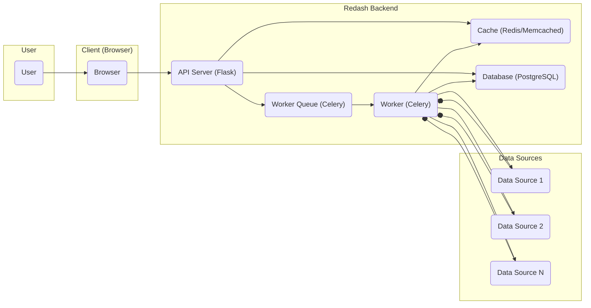
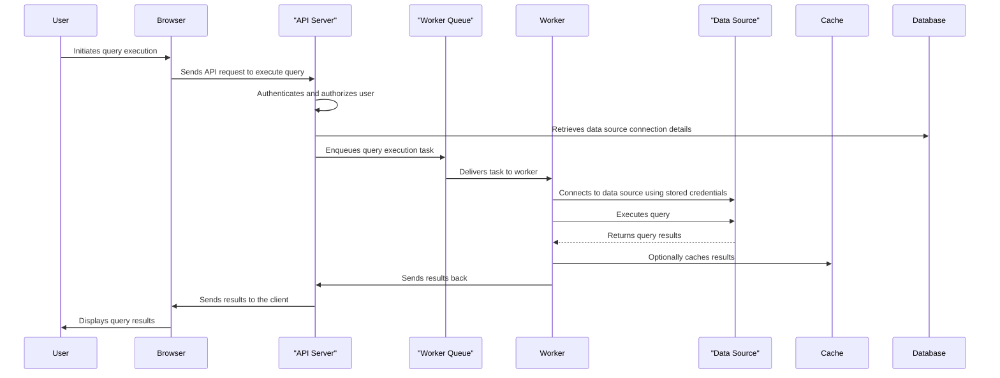
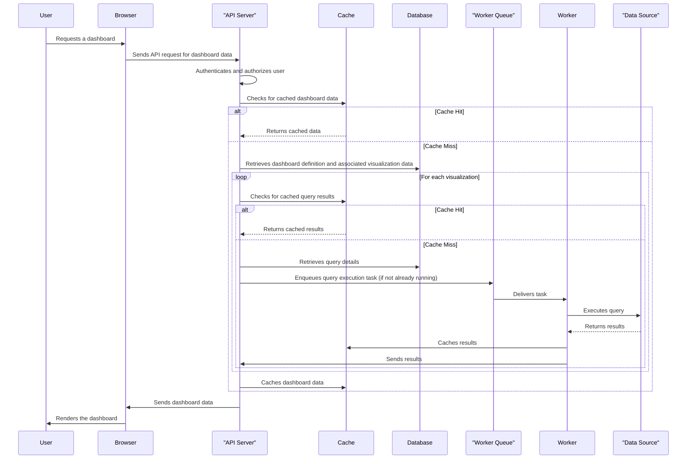

# Project Design Document: Redash for Threat Modeling

**Version:** 1.1
**Date:** October 26, 2023
**Author:** AI Cybersecurity Architect

## 1. Introduction

This document provides a detailed architectural overview of the Redash project (as represented by the GitHub repository: [https://github.com/getredash/redash](https://github.com/getredash/redash)). The primary purpose of this document is to serve as a foundational resource for conducting thorough threat modeling of the Redash application. It meticulously outlines the key components, data flows, and interactions within the Redash system, specifically highlighting areas that warrant careful security scrutiny and analysis during the threat modeling process. This document adheres to the requirement of not using markdown tables.

## 2. System Overview

Redash is an open-source, web-based platform designed to facilitate data exploration, visualization, and sharing. It allows users to connect to various data sources, write and execute queries, create visualizations from the results, and assemble these visualizations into dashboards. The core functionalities center around managing data source connections, executing queries against these sources, creating visual representations of data, and enabling the sharing of insights through dashboards.

### 2.1. High-Level Architecture Diagram

### 2.2. Key Components

*   **User:** An individual who interacts with the Redash platform through a web browser. Users are assigned different roles and permissions that dictate their access and capabilities within the system.
*   **Client (Browser):** The web browser application used by the user to access the Redash user interface. It is responsible for rendering the UI elements and communicating with the backend API via HTTP requests.
*   **API Server (Flask):** The central application server for Redash, built using the Python Flask framework. It handles user authentication, authorization, processes API requests from the client, and orchestrates the interactions between other backend components.
*   **Worker Queue (Celery):** A distributed task queue (typically implemented using Redis or RabbitMQ) used to manage and distribute asynchronous tasks, such as the execution of queries against data sources and the synchronization of data source schemas.
*   **Worker (Celery):**  Background processes that consume tasks from the worker queue. Their primary responsibility is to connect to data sources, execute queries on them, and retrieve the results.
*   **Cache (Redis/Memcached):** An in-memory data store used to cache frequently accessed data, such as the results of queries and snapshots of dashboards, to improve the performance and responsiveness of the application.
*   **Database (PostgreSQL):** The primary relational database for Redash, used to persistently store application metadata, including user accounts, data source configurations, query definitions, visualization specifications, and dashboard layouts.
*   **Data Sources:** External systems that hold the data Redash connects to. These can be various types of databases (e.g., PostgreSQL, MySQL, Snowflake), APIs (e.g., RESTful services), or other data storage solutions.

## 3. Component Details

### 3.1. API Server (Flask)

*   **Description:** The core component responsible for handling all incoming requests from the client-side application and managing the central application logic of Redash.
*   **Responsibilities:**
    *   Authenticating and authorizing users attempting to access the platform and its resources.
    *   Providing and managing API endpoints for all core functionalities, including the creation, retrieval, updating, and deletion of data sources, queries, visualizations, and dashboards.
    *   Orchestrating the execution of queries by submitting tasks to the worker queue for asynchronous processing.
    *   Serving the static assets (HTML, CSS, JavaScript) that constitute the web application's user interface.
    *   Managing user sessions and ensuring their security.
*   **Key Technologies:** Python, Flask, potentially WSGI servers like Gunicorn or uWSGI for production deployment.
*   **Security Considerations:**
    *   Susceptible to common web application vulnerabilities such as SQL injection (if dynamic query construction is not handled carefully), cross-site scripting (XSS), and cross-site request forgery (CSRF).
    *   The authentication and authorization mechanisms are critical security points and must be robust to prevent unauthorized access.
    *   API endpoints require rigorous input validation and sanitization to prevent injection attacks and other forms of malicious input.
    *   Secure session management is essential to prevent session hijacking and unauthorized access to user accounts.

### 3.2. Worker Queue (Celery)

*   **Description:** A message broker that facilitates asynchronous task processing, decoupling the API server from long-running operations like query execution.
*   **Responsibilities:**
    *   Receiving task requests from the API server.
    *   Storing and managing the queue of tasks to be processed.
    *   Distributing tasks to available worker processes for execution.
    *   Ensuring reliable task delivery and potentially implementing retry mechanisms for failed tasks.
*   **Key Technologies:** Typically Redis or RabbitMQ.
*   **Security Considerations:**
    *   Access to the message broker should be restricted to authorized Redash components to prevent unauthorized task submission or manipulation.
    *   Depending on the broker configuration, message integrity and confidentiality might be concerns, especially if sensitive data is included in task payloads. Secure communication channels might be necessary.

### 3.3. Worker (Celery)

*   **Description:**  Background processes that consume and execute tasks from the worker queue, primarily focusing on interacting with data sources.
*   **Responsibilities:**
    *   Establishing connections to configured data sources using the stored connection details and credentials.
    *   Constructing and executing queries against the connected data sources.
    *   Fetching the results of executed queries.
    *   Optionally caching query results in the designated cache.
*   **Key Technologies:** Python, and various database connector libraries (e.g., psycopg2 for PostgreSQL, pymysql for MySQL, snowflake-connector-python for Snowflake), and potentially libraries for interacting with other types of data sources.
*   **Security Considerations:**
    *   Sensitive data source credentials are managed and utilized by the workers. Secure storage and handling of these credentials are paramount to prevent unauthorized access to data sources.
    *   Vulnerabilities in the data source connector libraries could potentially be exploited if not kept up-to-date.
    *   Workers should operate with the least privileges necessary to perform their tasks, limiting the potential impact of a compromise.

### 3.4. Cache (Redis/Memcached)

*   **Description:** An in-memory data store used for caching purposes to improve the performance and scalability of Redash.
*   **Responsibilities:**
    *   Storing the results of frequently executed queries to reduce the load on data sources and improve response times.
    *   Caching dashboard snapshots or pre-rendered dashboard components.
*   **Key Technologies:** Redis or Memcached.
*   **Security Considerations:**
    *   Access to the cache should be restricted to authorized Redash components.
    *   Sensitive data, including query results, might be stored in the cache. Appropriate security measures, such as access controls and potentially encryption, should be considered.

### 3.5. Database (PostgreSQL)

*   **Description:** The primary persistent storage for Redash, holding all the application's metadata and configuration.
*   **Responsibilities:**
    *   Storing user account information, including usernames, passwords (hashed), and roles.
    *   Storing data source configurations, including connection strings and credentials (encrypted).
    *   Storing the definitions of queries, visualizations, and dashboards.
    *   Storing audit logs of user actions and system events.
*   **Key Technologies:** PostgreSQL.
*   **Security Considerations:**
    *   Database credentials must be securely managed and access to the database server should be strictly controlled.
    *   Robust access control mechanisms within the database are necessary to restrict access to sensitive data and tables.
    *   Regular database backups and a well-defined disaster recovery plan are crucial.
    *   Consider implementing data-at-rest encryption for sensitive information stored in the database.

### 3.6. Data Sources

*   **Description:** External systems that contain the data that Redash is used to query and visualize.
*   **Responsibilities:**
    *   Storing and managing the actual data.
    *   Authenticating and authorizing connections from Redash.
    *   Executing queries received from Redash and returning the results.
*   **Key Technologies:** Varies widely depending on the specific data source (e.g., PostgreSQL, MySQL, MongoDB, REST APIs, cloud services).
*   **Security Considerations:**
    *   Redash requires appropriate credentials to access data sources. The principle of least privilege should be applied when granting permissions to Redash.
    *   The security posture of the data sources themselves is critical. Vulnerabilities in the data sources could be exploited through Redash if not properly secured.

## 4. Data Flow

### 4.1. Query Execution Flow

### 4.2. Dashboard Rendering Flow

## 5. Deployment Architecture (Typical)

A typical deployment of Redash involves several interconnected components. These can be deployed on a single server for smaller installations or distributed across multiple servers or containers for larger, more scalable deployments. Common components include:

*   **Web Server (Reverse Proxy):** Handles incoming HTTP/HTTPS requests and routes them to the appropriate backend components. Examples include Nginx or Apache. This also often handles SSL/TLS termination.
*   **Application Server(s):** Runs the Redash backend application (Flask). This is often managed by WSGI servers like Gunicorn or uWSGI. Multiple instances can be run for load balancing and high availability.
*   **Worker Process(es):** Executes the Celery worker processes responsible for handling background tasks, primarily query execution. The number of worker processes can be scaled based on the workload.
*   **Message Broker:**  Manages the Celery task queue. Redis or RabbitMQ are common choices. This component is crucial for reliable task delivery.
*   **Database Server:** Hosts the PostgreSQL database, which stores Redash's metadata. This should be a robust and reliable database setup.
*   **Cache Server:** Provides caching functionality. Redis or Memcached are typically used. High availability and persistence might be considerations for this component.

These components can be deployed using various methods, including:

*   **Bare Metal or Virtual Machines:** Traditional server deployments.
*   **Containerization (Docker):** Packaging components into containers for easier deployment and management.
*   **Orchestration (Kubernetes):** Managing and scaling containerized deployments.
*   **Cloud Services:** Utilizing managed services for databases, message queues, and compute resources.

## 6. Security Considerations (High-Level)

This section outlines key security considerations for the Redash architecture, providing a starting point for the threat modeling process.

*   **Authentication and Authorization:** Implementing strong authentication mechanisms to verify user identities and robust authorization controls to manage access to resources based on the principle of least privilege. This includes securing API endpoints and ensuring proper role-based access control (RBAC).
*   **Input Validation and Sanitization:**  Thoroughly validating and sanitizing all user-provided input to prevent injection attacks (e.g., SQL injection, XSS, command injection) at all layers of the application, especially in the API server.
*   **Secure Data Source Credentials Management:**  Employing secure methods for storing and managing credentials used to connect to external data sources. This might involve encryption at rest and secure retrieval mechanisms. Avoid storing credentials directly in code or configuration files.
*   **Session Management Security:**  Implementing secure session management practices to prevent session hijacking and fixation attacks. This includes using secure cookies, HTTP-only flags, and appropriate session expiration times.
*   **Cross-Site Scripting (XSS) Prevention:**  Implementing comprehensive measures to prevent XSS attacks, including output encoding and content security policies (CSP).
*   **Cross-Site Request Forgery (CSRF) Prevention:**  Utilizing anti-CSRF tokens to protect against unauthorized actions performed on behalf of authenticated users.
*   **SQL Injection Prevention:**  Using parameterized queries or Object-Relational Mapping (ORM) features to prevent the injection of malicious SQL code. Avoid constructing SQL queries through string concatenation of user input.
*   **Data Encryption:** Encrypting sensitive data both at rest (in the database, cache, and potentially message queues) and in transit (using HTTPS/TLS for all network communication).
*   **Access Control and Network Segmentation:**  Restricting access to internal components and resources based on the principle of least privilege. Implementing network segmentation to isolate different parts of the infrastructure.
*   **Logging and Monitoring:**  Implementing comprehensive logging of security-relevant events and system activity. Setting up monitoring and alerting mechanisms to detect and respond to potential security incidents.
*   **Dependency Management and Vulnerability Scanning:**  Regularly updating dependencies to patch known vulnerabilities. Implementing vulnerability scanning tools to identify potential security weaknesses in the codebase and infrastructure.
*   **Secure Communication:** Ensuring secure communication between all components, especially between the API server and the database, message queue, and cache.
*   **Rate Limiting and Abuse Prevention:** Implementing rate limiting on API endpoints to prevent abuse and denial-of-service attacks.

## 7. Conclusion

This detailed design document provides a comprehensive architectural overview of the Redash platform, specifically tailored to facilitate effective threat modeling. By clearly outlining the key components, their responsibilities, data flows, and typical deployment scenarios, this document serves as a valuable resource for identifying potential security vulnerabilities and developing appropriate mitigation strategies. The security considerations highlighted provide a starting point for a more in-depth analysis during the threat modeling process.
