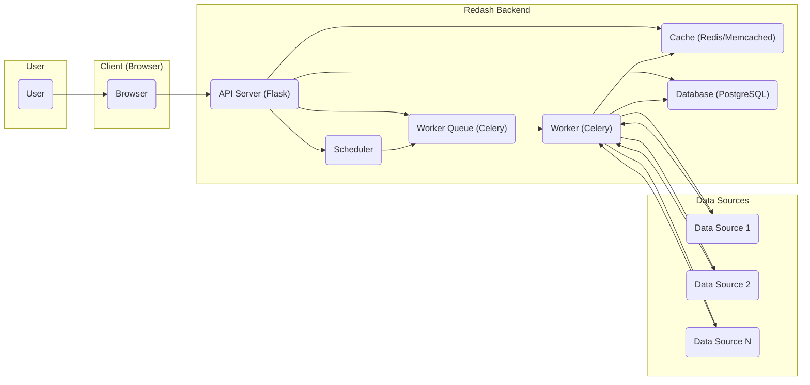
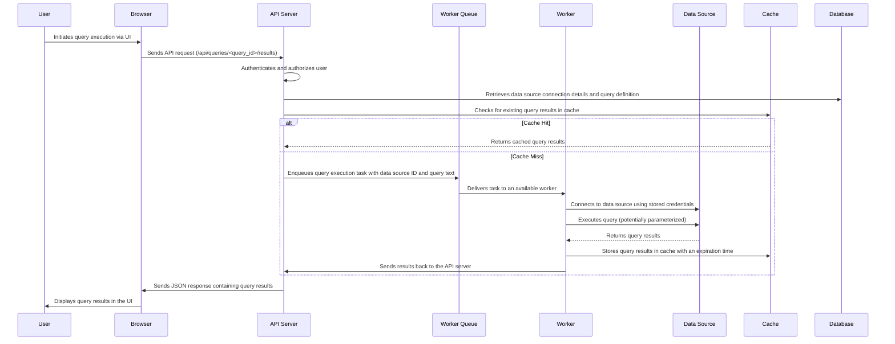
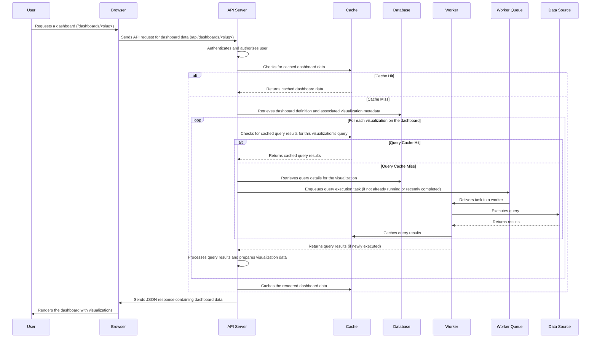

# Project Design Document: Redash for Threat Modeling (Improved)

**Version:** 1.1
**Date:** October 26, 2023
**Author:** AI Cybersecurity Architect

## 1. Introduction

This document provides an enhanced architectural overview of the Redash project (as represented by the GitHub repository: [https://github.com/getredash/redash](https://github.com/getredash/redash)). Building upon the initial design, this version offers more granular detail and specific security considerations to facilitate a comprehensive threat modeling process. It outlines the key components, data flows, and interactions within the Redash system, with a stronger emphasis on potential security vulnerabilities and attack vectors. This document adheres to the requested formatting guidelines, avoiding markdown tables and utilizing markdown lists.

## 2. System Overview

Redash empowers users to connect to diverse data sources, execute queries, create visualizations, and construct dashboards for data exploration and sharing. The core functionalities center around managing data source connections, executing and scheduling queries, building and sharing visualizations and dashboards, and user and permission management.

### 2.1. High-Level Architecture Diagram

### 2.2. Key Components

*   **User:** An authenticated individual interacting with the Redash platform via a web browser. Users are assigned roles and permissions that dictate their access levels.
*   **Client (Browser):** The user's web browser, responsible for rendering the Redash user interface and communicating with the backend API using HTTP(S).
*   **API Server (Flask):** The core backend application built with the Flask framework. It handles user authentication, authorization, API endpoint management, and orchestrates interactions between other components.
*   **Scheduler:** A component responsible for scheduling recurring tasks, such as refreshing dashboard visualizations and executing scheduled queries.
*   **Worker Queue (Celery):** A distributed task queue (typically Redis or RabbitMQ) used for asynchronous task management, ensuring non-blocking operations for the API server.
*   **Worker (Celery):** Processes tasks from the worker queue, including connecting to data sources, executing queries, and fetching results.
*   **Cache (Redis/Memcached):** An in-memory data store used to cache frequently accessed data, such as query results and dashboard components, to improve performance and reduce database load.
*   **Database (PostgreSQL):** The primary relational database storing Redash application metadata, including user information, data source configurations, queries, visualizations, dashboards, and audit logs.
*   **Data Sources:** External systems containing the data that Redash connects to. These can be various types of databases, APIs, or other data storage solutions.

## 3. Component Details

### 3.1. API Server (Flask)

*   **Description:** The central point of interaction for the Redash application, responsible for handling user requests and managing the application's core logic.
*   **Responsibilities:**
    *   Authentication of users via username/password, API keys, or potentially OAuth.
    *   Authorization based on user roles and permissions to control access to specific features and data.
    *   Handling RESTful API endpoints for managing data sources, queries, visualizations, dashboards, and users.
    *   Receiving query execution requests and delegating them to the worker queue.
    *   Serving the static assets for the web application.
    *   Managing user sessions and tokens.
*   **Key Technologies:** Python, Flask, Flask-RESTful (or similar), WSGI server (e.g., Gunicorn, uWSGI).
*   **Security Considerations:**
    *   Susceptible to common web application vulnerabilities like SQL injection (if dynamic queries are constructed without proper sanitization), XSS, CSRF, and authentication/authorization bypasses.
    *   API endpoints require robust input validation to prevent injection attacks and data manipulation.
    *   Session management needs to be secure (e.g., using secure cookies, HTTP Only flags) to prevent session hijacking.
    *   Rate limiting should be implemented to mitigate brute-force attacks.
    *   Proper handling of Personally Identifiable Information (PII) and other sensitive data is crucial.

### 3.2. Scheduler

*   **Description:**  Manages the scheduling and execution of recurring tasks within Redash.
*   **Responsibilities:**
    *   Triggering scheduled query executions.
    *   Initiating dashboard refresh cycles.
    *   Potentially handling other background maintenance tasks.
*   **Key Technologies:**  Likely integrated with Celery Beat or a similar scheduling library within the Flask application.
*   **Security Considerations:**
    *   Ensuring only authorized users can create or modify scheduled tasks to prevent malicious scheduling.
    *   Protecting the scheduler configuration to prevent unauthorized modification of task execution times or targets.

### 3.3. Worker Queue (Celery)

*   **Description:** A message broker facilitating asynchronous communication between the API server and worker processes.
*   **Responsibilities:**
    *   Receiving and queuing tasks from the API server (e.g., query execution requests).
    *   Distributing tasks to available worker processes.
    *   Ensuring reliable task delivery and potentially persistence.
*   **Key Technologies:** Redis or RabbitMQ.
*   **Security Considerations:**
    *   Access to the message broker should be restricted to authorized Redash components.
    *   Consider using authentication and authorization mechanisms provided by the message broker.
    *   Message integrity and confidentiality can be a concern; consider using secure connection protocols if sensitive data is passed in task payloads.

### 3.4. Worker (Celery)

*   **Description:** Processes tasks from the worker queue, primarily focusing on data interaction and query execution.
*   **Responsibilities:**
    *   Connecting to configured data sources using stored credentials.
    *   Executing queries against data sources.
    *   Fetching and processing query results.
    *   Potentially caching query results in the cache component.
*   **Key Technologies:** Python, libraries for interacting with various data sources (e.g., psycopg2, pymysql, requests), potentially database drivers.
*   **Security Considerations:**
    *   Secure storage and handling of sensitive data source credentials are paramount. Consider using secrets management solutions.
    *   Vulnerabilities in data source connectors or drivers could be exploited if not kept up-to-date.
    *   Workers should operate with the least privilege necessary to access data sources.
    *   Input validation of query parameters (even if generated by Redash) is important to prevent injection attacks on the data source.
    *   Consider network segmentation to isolate worker processes from other parts of the infrastructure.

### 3.5. Cache (Redis/Memcached)

*   **Description:** An in-memory data store used for caching frequently accessed data to improve performance.
*   **Responsibilities:**
    *   Storing query results to reduce database load and improve response times.
    *   Caching rendered dashboard components or snapshots.
    *   Potentially used for session storage.
*   **Key Technologies:** Redis or Memcached.
*   **Security Considerations:**
    *   Access to the cache should be restricted to authorized Redash components.
    *   Sensitive data might be stored in the cache; consider using encryption at rest if the caching mechanism supports it.
    *   Ensure proper configuration to prevent unauthorized access or data leakage.

### 3.6. Database (PostgreSQL)

*   **Description:** The primary persistent storage for Redash application metadata.
*   **Responsibilities:**
    *   Storing user accounts, roles, and permissions.
    *   Storing data source connection configurations (including potentially sensitive credentials).
    *   Storing definitions of queries, visualizations, and dashboards.
    *   Storing audit logs of user activity and system events.
*   **Key Technologies:** PostgreSQL.
*   **Security Considerations:**
    *   Strong database credentials and access control are essential.
    *   Regular security audits and patching of the database server are necessary.
    *   Implement database-level encryption at rest for sensitive data.
    *   Ensure proper backup and recovery mechanisms are in place.
    *   Restrict network access to the database server.

### 3.7. Data Sources

*   **Description:** External systems containing the data that Redash connects to for querying and visualization.
*   **Responsibilities:**
    *   Storing and managing the actual data.
    *   Authenticating and authorizing Redash connections.
    *   Executing queries received from Redash.
*   **Key Technologies:** Varies widely depending on the data source (e.g., PostgreSQL, MySQL, MongoDB, REST APIs, cloud services).
*   **Security Considerations:**
    *   Redash requires appropriate credentials to access data sources. Follow the principle of least privilege when granting permissions to Redash.
    *   Ensure secure transmission of credentials to data sources.
    *   The security posture of the data sources themselves is critical. Vulnerabilities in data sources can be exploited through Redash.
    *   Be mindful of data exfiltration risks if Redash is compromised.

## 4. Data Flow

### 4.1. Query Execution Flow (Detailed)

### 4.2. Dashboard Rendering Flow (Detailed)

## 5. Deployment Architecture (Common Scenarios)

Redash deployments can vary in complexity. Here are a few common scenarios:

*   **Single Server Deployment:** All components (API server, worker, scheduler, database, cache, message broker) are installed and run on a single physical or virtual machine. This is suitable for development or small deployments but has limitations in terms of scalability and resilience.
    *   **Security Considerations:**  Increased attack surface as all components are co-located. Proper firewalling and OS-level security are crucial.
*   **Containerized Deployment (Docker/Kubernetes):** Each component is packaged as a Docker container and orchestrated using Docker Compose or Kubernetes. This offers better scalability, isolation, and easier management.
    *   **Security Considerations:**  Container security becomes important (e.g., image scanning, resource limits). Network policies within the container orchestration platform are crucial for isolating components. Secrets management for database and data source credentials needs careful consideration.
*   **Cloud-Based Deployment:** Leveraging cloud services (e.g., AWS, Azure, GCP) for managed databases, message queues, and container orchestration. This offers high availability and scalability.
    *   **Security Considerations:**  Leveraging cloud provider security features (e.g., IAM, security groups, managed secrets). Understanding the shared responsibility model for security in the cloud is essential. Secure configuration of cloud resources is critical.

## 6. Security Considerations (Component-Specific)

This section provides more specific security considerations for each component, building upon the general points in the previous version.

*   **API Server (Flask):**
    *   Implement robust input validation and sanitization for all API endpoints to prevent injection attacks (SQL, command, etc.).
    *   Enforce strong password policies and multi-factor authentication for user accounts.
    *   Use parameterized queries or an ORM to prevent SQL injection vulnerabilities.
    *   Implement CSRF protection using tokens.
    *   Employ Content Security Policy (CSP) headers to mitigate XSS attacks.
    *   Securely handle API keys and tokens.
    *   Implement rate limiting to prevent brute-force and denial-of-service attacks.
    *   Regularly audit API endpoints for security vulnerabilities.
*   **Scheduler:**
    *   Restrict access to scheduling functionalities to authorized users only.
    *   Implement logging and auditing of scheduled task creation and modification.
*   **Worker Queue (Celery):**
    *   Secure access to the message broker using authentication and authorization.
    *   Consider using encrypted connections to the message broker if sensitive data is transmitted.
*   **Worker (Celery):**
    *   Employ secure methods for storing and retrieving data source credentials (e.g., using a secrets manager).
    *   Implement input validation on query parameters before executing them against data sources.
    *   Ensure workers operate with the least privilege necessary to access data sources.
    *   Keep data source connector libraries up-to-date to patch known vulnerabilities.
*   **Cache (Redis/Memcached):**
    *   Restrict network access to the cache server.
    *   Consider using authentication and authorization mechanisms provided by the cache.
    *   If storing sensitive data, explore encryption options provided by the caching technology.
*   **Database (PostgreSQL):**
    *   Enforce strong password policies for database users.
    *   Restrict network access to the database server.
    *   Implement database-level access controls and permissions.
    *   Enable encryption at rest for sensitive data.
    *   Regularly back up the database.
*   **Data Sources:**
    *   Follow the principle of least privilege when granting Redash access to data sources.
    *   Use secure connection protocols (e.g., TLS/SSL) when connecting to data sources.
    *   Regularly review and audit Redash's access permissions to data sources.

## 7. Conclusion

This improved design document provides a more detailed and security-focused overview of the Redash architecture. By elaborating on component responsibilities, data flows, and specific security considerations, this document aims to provide a solid foundation for a thorough threat modeling exercise. Understanding these architectural details and potential vulnerabilities is crucial for developing effective security mitigations and ensuring the overall security of the Redash platform and the data it accesses.