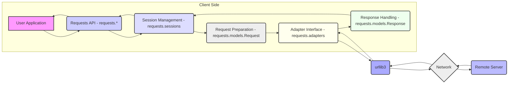
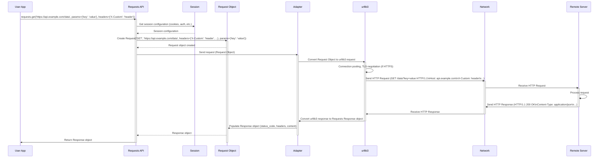

# Project Design Document: Requests Library

**Version:** 1.1
**Date:** October 26, 2023
**Author:** AI Software Architect

## 1. Introduction

This document provides an enhanced and detailed design overview of the Python Requests library, a widely adopted library for making HTTP requests. This revised document aims to offer a more granular understanding of the library's architecture, data flow, and key components, specifically tailored for effective threat modeling. It builds upon the previous version by providing more specific details and addressing potential areas of ambiguity.

The Requests library simplifies the process of sending HTTP/1.1 requests, abstracting away the complexities of manual socket programming and protocol handling. Its user-friendly API and robust features have established it as a fundamental component in numerous Python applications interacting with web services.

## 2. Goals

The primary goals of this design document are:

* **Provide a detailed and granular description of the Requests library's architecture.**
* **Elaborate on the key components, their functionalities, and interactions.**
* **Clearly illustrate the data flow during both request and response cycles with specific examples.**
* **Identify critical security considerations, potential vulnerabilities, and attack surfaces.**
* **Serve as a comprehensive and actionable reference for conducting thorough threat modeling exercises.**
* **Clarify assumptions and constraints relevant to the design.**

## 3. Scope

This document encompasses the core functionality of the Requests library, with a focus on aspects relevant to security and threat modeling:

* **Making HTTP requests (GET, POST, PUT, DELETE, PATCH, OPTIONS, HEAD).**
* **Handling various request parameters (query parameters, form data, JSON payloads, file uploads).**
* **Managing request headers (custom headers, user-agent, content-type).**
* **Processing server responses, including status codes, headers, and different content types (HTML, JSON, XML, binary).**
* **Comprehensive cookie and session management (setting, retrieving, and sending cookies).**
* **Handling different types of redirects (301, 302, 307, 308) and controlling redirection behavior.**
* **Basic and Digest authentication mechanisms, as well as handling custom authentication.**
* **Robust TLS/SSL verification, including certificate handling and custom CA bundles.**
* **Error handling and exception management within the library.**

This document does not delve into:

* **Highly specific integrations with niche libraries or application frameworks.**
* **The intricate internal implementation details of the underlying `urllib3` library beyond its interaction with Requests.**
* **Advanced or experimental features like HTTP/2 support (unless directly exposed by the Requests API).**
* **Performance optimization strategies within the library.**

## 4. High-Level Architecture

The Requests library provides a user-friendly interface built upon the robust foundation of the `urllib3` library. It simplifies HTTP interactions for developers.

**Components:**

* **User Application:** The Python code that utilizes the Requests library to interact with web services.
* **Requests API (`requests.*`):** The primary entry point for users, offering functions like `get()`, `post()`, `put()`, `delete()`, etc. This layer handles user input and orchestrates the request process.
* **Session Management (`requests.sessions.Session`):** Manages persistent session parameters like cookies, authentication, and proxies across multiple requests. Using a `Session` object is recommended for maintaining state.
* **Request Preparation (`requests.models.Request`):**  Represents the outgoing HTTP request. This component assembles the request details (URL, method, headers, body) based on user input and session settings.
* **Adapter Interface (`requests.adapters`):** Provides an abstraction layer for different transport mechanisms. The default adapter uses `urllib3`, but custom adapters can be implemented.
* **`urllib3`:** A powerful and feature-rich Python HTTP client library. Requests delegates the low-level tasks of connection pooling, TLS/SSL handling, and HTTP protocol implementation to `urllib3`.
* **Network:** The underlying network infrastructure facilitating communication between the client and the remote server.
* **Remote Server:** The web server or API endpoint that the Requests library interacts with.
* **Response Handling (`requests.models.Response`):** Represents the server's response to the HTTP request. This component parses and provides access to the response status code, headers, and content.

## 5. Detailed Design

### 5.1. Request Flow with Data Elements

The following diagram illustrates a detailed flow of an HTTP request, highlighting the data elements involved at each stage:

**Data Elements in Transit:**

* **Request from User App:** URL, HTTP method, headers (e.g., `{'X-Custom': 'header'}`), parameters (e.g., `{'key': 'value'}`), data (if POST/PUT), cookies.
* **Request Object:** Internal representation of the HTTP request containing the URL, method, prepared headers, encoded data, and potentially authentication details.
* **HTTP Request (over Network):**  Plain text representation of the request including:
    * **Request Line:** `GET /data?key=value HTTP/1.1`
    * **Headers:** `Host: api.example.com`, `X-Custom: header`, `User-Agent: ...`, `Cookie: ...`
    * **Body:** (If applicable, for POST/PUT requests, encoded according to `Content-Type`)
* **HTTP Response (over Network):** Plain text representation of the response including:
    * **Status Line:** `HTTP/1.1 200 OK`
    * **Headers:** `Content-Type: application/json`, `Set-Cookie: ...`, `Content-Length: ...`
    * **Body:** The actual content returned by the server (e.g., JSON data, HTML).
* **Response Object:**  Python object containing parsed response data: `status_code`, `headers` (dictionary), `content` (bytes), `text` (decoded content), `json()` (parsed JSON), `cookies` (RequestsCookieJar).

### 5.2. Key Components and Security Implications

| Component                     | Functionality                                                                 | Security Implications                                                                                                                                                                                             |
|------------------------------|-----------------------------------------------------------------------------|--------------------------------------------------------------------------------------------------------------------------------------------------------------------------------------------------------------------|
| **Requests API**             | Provides user-friendly functions for making requests.                         | Potential for misuse if not used carefully (e.g., constructing malicious URLs). Vulnerable if the underlying libraries have flaws.                                                                               |
| **Session Management**        | Persists session parameters (cookies, auth).                                | Improper handling of session cookies can lead to session fixation or hijacking. Storing sensitive authentication data requires careful consideration.                                                              |
| **Request Object**           | Represents the outgoing request.                                             | Vulnerable to manipulation if internal state is not properly protected. Ensuring correct encoding and escaping of data is crucial to prevent injection attacks.                                                |
| **Adapter Interface**        | Abstraction for transport mechanisms.                                        | Security depends on the underlying adapter implementation (default `urllib3`). Custom adapters could introduce vulnerabilities if not implemented securely.                                                        |
| **`urllib3`**                | Handles low-level HTTP communication, TLS/SSL.                               | Critical for security. Vulnerabilities in `urllib3` directly impact Requests. Proper TLS/SSL verification is essential to prevent man-in-the-middle attacks.                                                     |
| **Cookies (`RequestsCookieJar`)** | Manages cookies.                                                            | Improper handling of cookie attributes (e.g., `HttpOnly`, `Secure`) can lead to XSS or other cookie-based attacks. Storing sensitive data in cookies without encryption is a risk.                               |
| **Authentication (`requests.auth`)** | Handles authentication mechanisms.                                         | Vulnerable if authentication schemes are implemented insecurely or if credentials are not handled properly (e.g., stored in plaintext, transmitted over non-HTTPS).                                             |
| **Network**                    | Transmits data.                                                              | Susceptible to network-level attacks if not properly secured (e.g., eavesdropping if not using HTTPS).                                                                                                              |
| **Remote Server**              | Processes requests and sends responses.                                       | Security is the responsibility of the server. Requests can only mitigate client-side vulnerabilities. Server vulnerabilities can be exploited regardless of the client library used.                             |

### 5.3. Data Elements and Potential Threats

| Data Element          | Description                                                                 | Potential Threats                                                                                                                                                              |
|-----------------------|-----------------------------------------------------------------------------|-------------------------------------------------------------------------------------------------------------------------------------------------------------------------------|
| **URL**               | Target address of the request.                                              | URL injection, open redirects if not validated, exposure of sensitive information in the URL.                                                                               |
| **HTTP Method**       | Action to be performed.                                                     | Method tampering (though less common in typical usage).                                                                                                                         |
| **Request Headers**   | Metadata about the request.                                                 | Header injection (e.g., CRLF injection), information leakage through custom headers.                                                                                           |
| **Request Body**      | Data sent to the server.                                                     | Injection attacks (SQL injection, command injection, etc.), data breaches if sensitive data is not encrypted, exposure of sensitive information.                               |
| **Response Status Code**| Indicates the outcome of the request.                                       | Can be used by attackers to infer information about the server's state.                                                                                                        |
| **Response Headers**  | Metadata about the response.                                                | Information leakage, potential for exploitation of vulnerabilities based on specific header values.                                                                           |
| **Response Body**     | Data returned by the server.                                                | XSS vulnerabilities if displaying HTML content without proper sanitization, exposure of sensitive data if not properly protected by the server.                               |
| **Cookies**           | Small pieces of data stored by the client.                                  | Session hijacking, session fixation, cross-site scripting (if `HttpOnly` flag is missing), exposure of sensitive information if not encrypted and `Secure` flag is missing. |
| **Authentication Data**| Credentials used for authentication.                                        | Credential theft, brute-force attacks, replay attacks if not handled securely.                                                                                                  |

## 6. Security Considerations

* **TLS/SSL Verification:**  **Crucial.** Always verify server certificates (`verify=True`). Disabling verification exposes the application to man-in-the-middle attacks. If using custom certificates, manage them securely.
* **Input Validation and Sanitization:**  Validate all user-provided data before incorporating it into URLs, headers, or the request body to prevent injection attacks (SQL injection, command injection, header injection, etc.).
* **Output Encoding:** Properly encode data received from the server before displaying it in web pages or other contexts to prevent cross-site scripting (XSS) vulnerabilities.
* **Secure Cookie Handling:** Set appropriate cookie attributes (`HttpOnly`, `Secure`, `SameSite`) to mitigate cookie-based attacks. Avoid storing sensitive information in cookies without encryption.
* **Redirection Handling:** Be cautious with automatic redirects. Validate the target of redirects to prevent open redirect vulnerabilities. Consider limiting the number of redirects to prevent infinite loops.
* **Authentication Best Practices:** Use HTTPS for transmitting credentials. Avoid storing credentials directly in code. Consider using more secure authentication methods like OAuth 2.0.
* **Dependency Management:** Regularly update the Requests library and its dependencies (especially `urllib3`) to patch known security vulnerabilities. Use dependency scanning tools.
* **Error Handling:** Avoid exposing sensitive information in error messages. Implement robust error handling to prevent application crashes and information leaks.
* **Timeout Configuration:** Set appropriate timeouts for requests to prevent denial-of-service (DoS) attacks by limiting resource consumption on slow or unresponsive servers.
* **Proxy Configuration:** If using proxies, ensure the proxy server is trustworthy and the connection to the proxy is secure.
* **Rate Limiting:** Implement client-side rate limiting if interacting with APIs that have rate limits to avoid being blocked and to prevent accidental overloading of the server.

## 7. Assumptions and Constraints

* **Assumption:** The underlying network infrastructure is assumed to be reasonably secure, although the document highlights risks associated with insecure network connections.
* **Assumption:** The remote server adheres to HTTP standards and implements appropriate security measures.
* **Constraint:** The Requests library primarily supports HTTP/1.1. While `urllib3` might have some support for newer protocols, this document focuses on the features directly exposed by Requests.
* **Constraint:** This document assumes a standard deployment scenario where the Requests library is used within a Python application. Specific deployment environments might introduce additional security considerations.

## 8. Threat Model Integration

This design document provides the necessary information for conducting a thorough threat model of applications using the Requests library. Specifically:

* **Architecture Diagrams:** Help visualize the components and their interactions, identifying potential trust boundaries and attack surfaces.
* **Data Flow Diagrams:** Illustrate how data moves through the system, highlighting points where data can be intercepted, modified, or injected.
* **Component Descriptions:** Detail the functionality of each component, allowing for the identification of potential vulnerabilities within each.
* **Security Considerations:** Provide a checklist of common security issues to consider when using the library.
* **Data Elements and Potential Threats:** Directly links data elements to potential threats, facilitating the identification of assets and potential attack vectors.

Using this document, security professionals can perform activities like:

* **STRIDE analysis:**  Analyzing each component and data flow for Spoofing, Tampering, Repudiation, Information Disclosure, Denial of Service, and Elevation of Privilege threats.
* **Attack tree modeling:**  Visualizing potential attack paths by combining vulnerabilities in different components and data flows.
* **Risk assessment:**  Evaluating the likelihood and impact of identified threats.

**Example Threat Modeling Questions based on this document:**

* What happens if a malicious URL is passed to `requests.get()`? (URL injection)
* Can an attacker manipulate headers through user input? (Header injection)
* Is sensitive data being transmitted over HTTPS?
* Are cookies being handled securely with appropriate flags?
* What happens if the remote server returns a malicious response? (XSS)
* Is TLS/SSL verification enabled?

## 9. Future Considerations

* **HTTP/2 and HTTP/3 Support:**  As these protocols become more prevalent, further analysis of their security implications within the context of Requests and `urllib3` will be necessary.
* **Asynchronous Requests:**  If asynchronous request functionality is significantly expanded, a review of the concurrency and security implications will be required.
* **Advanced Authentication Mechanisms:**  As new authentication standards emerge, their integration and security within Requests should be evaluated.

## 10. Conclusion

This enhanced design document provides a comprehensive and detailed overview of the Requests library, specifically tailored for effective threat modeling. By understanding the architecture, data flow, components, and security considerations outlined in this document, developers and security professionals can better identify and mitigate potential vulnerabilities in applications that rely on this widely used library. This document serves as a valuable resource for building more secure and resilient Python applications.
