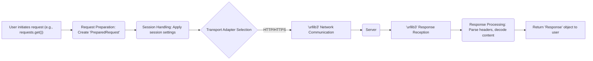

## Project Design Document: Requests Library (Improved)

**1. Introduction**

This document provides a detailed design overview of the Python Requests library (hereafter referred to as "Requests"). This document is intended to serve as a foundation for subsequent threat modeling activities. It outlines the key components, data flows, and functionalities of Requests, highlighting areas relevant to security considerations.

**2. Project Overview**

*   **Project Name:** Requests
*   **Project Repository:** https://github.com/psf/requests
*   **Project Description:** Requests is an elegant and simple HTTP library for Python, built for human beings. It allows users to send HTTP/1.1 requests with ease, abstracting away the complexities of making raw HTTP requests.
*   **Primary Goal:** To provide a user-friendly and reliable way to interact with HTTP services.
*   **Target Audience:** Python developers needing to interact with web services and APIs.

**3. System Architecture**

Requests is designed with a layered architecture, providing different levels of abstraction for various use cases. The core components work together to facilitate the sending and receiving of HTTP requests and responses.

| Component           | Description                                                                                                | Responsibilities                                                                                                                               |
| ------------------- | ---------------------------------------------------------------------------------------------------------- | ---------------------------------------------------------------------------------------------------------------------------------------------- |
| **User Interface (API)** | Provides high-level functions for making HTTP requests.                                                    | Offers functions like `get()`, `post()`, `put()`, `delete()`; provides the `Session` object for persistent settings.                     |
| **Request Preparation** | Constructs a `PreparedRequest` object from user input.                                                    | Encodes data, adds default headers, and prepares the request for transmission.                                                              |
| **Session Object (`Session`)** | Manages persistent session parameters and connection pooling.                                          | Handles cookies, authentication, default headers, proxies, and SSL verification settings across multiple requests.                         |
| **Transport Adapters** | Responsible for sending the HTTP request over the network using a specific backend.                         | Implements the actual network communication; the default adapter uses `urllib3`.                                                            |
| **`urllib3` Library** | A powerful HTTP client library providing low-level functionality.                                          | Manages connections, retries, SSL/TLS, certificate verification, and more.                                                                   |
| **Response Handling** | Processes the raw HTTP response received from the transport adapter.                                       | Parses headers, decodes content, provides access to response data (text, JSON, raw), and handles HTTP errors.                               |

**4. Data Flow**

The typical flow of a request using the Requests library can be visualized as follows:

A more detailed breakdown of the data flow:

*   **User initiates a request:** The user calls a Requests function (e.g., `requests.get()`) with a URL and optional parameters.
*   **Request preparation:** The library creates a `Request` object and then a `PreparedRequest` object, encoding data and adding headers.
*   **Session handling:** The `Session` object is used (or created if one doesn't exist). Session-level settings are applied.
*   **Transport adapter selection:** The appropriate transport adapter is selected based on the URL scheme (e.g., HTTP or HTTPS).
*   **Network communication:** The transport adapter (via `urllib3`) sends the prepared request over the network.
*   **Response reception:** The transport adapter receives the HTTP response from the server.
*   **Response processing:** The response is processed, headers are parsed, and content is decoded.
*   **Response return:** The `Response` object is returned to the user, providing access to the response data and status.

**5. Key Functionality**

*   **HTTP Methods:** Support for standard HTTP methods (GET, POST, PUT, DELETE, HEAD, OPTIONS, PATCH).
*   **URL Handling:** Parsing and manipulation of URLs.
*   **Headers:** Customization of request headers and access to response headers.
*   **Request Body:** Sending data in various formats (form data, JSON, raw bytes).
*   **Response Content:** Accessing response content as text, JSON, or raw bytes.
*   **Status Codes:** Accessing the HTTP status code of the response.
*   **Cookies:** Automatic handling of cookies, including session persistence.
*   **Redirection:** Automatic handling of HTTP redirects.
*   **Timeouts:** Setting timeouts for connection and read operations.
*   **Authentication:** Support for various authentication schemes (Basic, Digest, OAuth, etc.).
*   **SSL/TLS Verification:** Verification of server certificates for secure HTTPS connections.
*   **Proxies:** Support for using HTTP and SOCKS proxies.
*   **File Uploads:** Support for uploading files via HTTP.
*   **Streaming:** Ability to stream response content for large files.
*   **Custom Sessions:** Ability to create and manage custom `Session` objects with specific configurations.

**6. Security Considerations (Initial Thoughts)**

This section outlines potential areas of security concern that will be explored further during threat modeling.

*   **Input Validation:**
    *   Handling of user-provided URLs: Potential for injection vulnerabilities if not properly validated.
    *   Processing of user-provided headers: Risk of header injection attacks.
    *   Handling of data payloads: Potential for injection or manipulation.
*   **Network Communication:**
    *   SSL/TLS verification: Ensuring secure communication over HTTPS.
    *   Man-in-the-middle (MITM) attacks: Risks associated with insecure connections or compromised certificates.
    *   Proxy configurations: Potential for misconfiguration or malicious proxies.
*   **Authentication:**
    *   Secure storage and handling of authentication credentials.
    *   Vulnerabilities in specific authentication schemes.
*   **Cookie Handling:**
    *   Security of cookie storage and transmission.
    *   Potential for cookie hijacking or manipulation.
*   **Redirection Handling:**
    *   Open redirection vulnerabilities if not handled carefully.
*   **Dependency Security:**
    *   Security vulnerabilities in the `urllib3` library or other dependencies.
*   **Error Handling:**
    *   Information leakage through verbose error messages.
*   **Denial of Service (DoS):**
    *   Potential for resource exhaustion through malicious requests or configurations (e.g., excessive redirects, large payloads).

**7. Deployment and Usage**

Requests is primarily used as a library within Python applications. It is typically installed using `pip`.

| Aspect        | Description                                     |
| ------------- | ----------------------------------------------- |
| **Installation** | `pip install requests`                          |
| **Usage**      | Imported into Python scripts for HTTP requests. |
| **Context**    | Used in web scraping, API clients, automation. |

**8. Assumptions and Constraints**

*   **Assumption:** Users are expected to understand basic HTTP concepts.
*   **Assumption:** The underlying network infrastructure is assumed to be reasonably secure.
*   **Constraint:** Requests relies on the security features provided by the underlying operating system and network libraries.
*   **Constraint:** The security of the application using Requests is ultimately the responsibility of the application developer. Requests provides tools and options for secure communication, but proper usage is crucial.

**9. Future Considerations**

*   Ongoing maintenance and security updates to address discovered vulnerabilities.
*   Potential for incorporating more advanced security features.
*   Adapting to evolving HTTP standards and security best practices.

This document provides a comprehensive overview of the Requests library's design, laying the groundwork for a thorough threat modeling exercise. The identified security considerations will be further analyzed to identify potential vulnerabilities and mitigation strategies.
