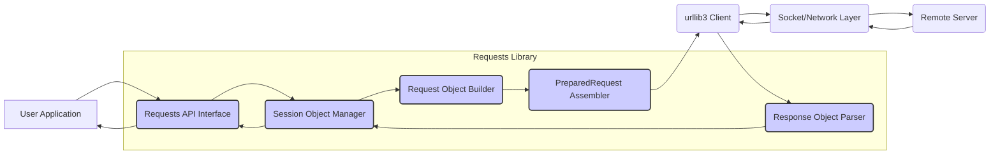

**Project Design Document: Requests Library (Improved)**

**Project Name:** Requests: HTTP for Humans™

**Project Repository:** https://github.com/psf/requests

**Document Version:** 2.0

**Date:** October 26, 2023

**Prepared By:** [Your Name/AI Assistant]

**1. Introduction**

This document provides an enhanced and more detailed design overview of the Requests library, a widely adopted Python library for simplifying HTTP interactions. Building upon the previous version, this document aims to provide an even more granular understanding of the library's architecture, components, data flow, and crucial security considerations. This enhanced detail is specifically intended to facilitate comprehensive threat modeling activities.

**1.1. Purpose**

The primary purpose of this document is to:

* **Provide a highly detailed and accurate representation of the Requests library's design and architecture.**
* **Clearly delineate the boundaries, responsibilities, and interactions of key components.**
* **Thoroughly describe the flow of data, including sensitive information, within the library.**
* **Explicitly highlight potential security vulnerabilities and attack surfaces associated with each component and data flow.**
* **Serve as a definitive and actionable reference for security engineers and analysts conducting threat modeling exercises.**

**1.2. Scope**

This document encompasses the core functionalities and architecture of the Requests library as of the current stable version (refer to the GitHub repository for the specific version). It maintains a focus on the client-side aspects of the library but provides more context regarding interactions with external systems and underlying libraries.

**1.3. Target Audience**

This document is primarily intended for:

* **Security engineers and analysts performing in-depth threat modeling and security assessments.**
* Developers contributing to the Requests library, requiring a deep understanding of its internal workings.
* Architects designing systems that integrate with the Requests library and need to understand its security implications.
* Penetration testers seeking to identify vulnerabilities within applications using Requests.

**2. Overview**

Requests remains a cornerstone of Python's HTTP ecosystem, renowned for its user-friendly API and robust feature set. It abstracts the complexities of lower-level HTTP handling, enabling developers to interact with web services efficiently. This section expands on the core features and provides a more nuanced understanding of its capabilities.

**Key Features (Expanded):**

* **Intuitive and Pythonic API:**  Emphasizes readability and ease of use, making HTTP interactions feel natural within Python code.
* **Intelligent Content Decoding:**  Automatically detects and decodes various content types (JSON, HTML, XML, etc.) based on server headers, reducing manual parsing.
* **Robust Connection Management:**  Leverages `urllib3` for efficient connection pooling, keep-alive, and retries, optimizing performance and resource utilization.
* **Comprehensive SSL/TLS Support:**  Includes robust SSL verification with customizable options, allowing for secure communication with HTTPS endpoints.
* **Flexible Authentication Mechanisms:**  Supports a wide range of authentication schemes, including Basic, Digest, OAuth, and custom authentication handlers.
* **Advanced Cookie Handling:**  Provides granular control over cookie management, including setting, retrieving, and deleting cookies, with support for session cookies and persistent cookies.
* **Stateful Session Management:**  The `Session` object enables maintaining state (cookies, headers, authentication) across multiple requests, crucial for interacting with stateful web applications.
* **Efficient Streaming Capabilities:**  Allows for handling large response bodies without loading the entire content into memory, essential for downloading large files or processing streaming data.
* **Support for Complex Request Bodies:**  Facilitates sending various types of request bodies, including form data, JSON payloads, and multipart/form-data for file uploads.
* **Extensible through Hooks:**  Provides a mechanism to intercept and modify request and response processing at various stages, enabling customization and integration with other libraries.
* **Comprehensive Proxy Support:**  Allows routing requests through various types of proxies (HTTP, SOCKS), including authenticated proxies.
* **Timeout Configuration:**  Enables setting timeouts for connection establishment and response reading, preventing indefinite hangs and improving resilience.
* **Customizable Headers and Options:**  Provides fine-grained control over request headers and various request options.

**3. Architectural Design (Detailed)**

This section provides a more granular breakdown of the Requests library's architecture, emphasizing component responsibilities and potential security implications.

**3.1. Key Components (Detailed Responsibilities and Security Considerations):**

* **A. User Application:** The Python code initiating HTTP requests. **Security Consideration:** Vulnerabilities in the user application (e.g., insecure handling of user input leading to URL manipulation) can directly impact Requests.
* **B. Requests API Interface (`requests` module):**  Provides the high-level functions (`get`, `post`, etc.). **Responsibilities:**  Receives user input, performs basic validation, and delegates to the `Session` object. **Security Considerations:**  Potential for input validation vulnerabilities if not implemented robustly. Incorrect usage by the developer can lead to insecure configurations.
* **C. Session Object Manager (`requests.Session`):** Manages persistent parameters and connection pooling. **Responsibilities:** Stores cookies, headers, authentication credentials, and manages the connection pool. **Security Considerations:**  Sensitive information (cookies, authentication) is stored within the `Session` object. Improper handling or exposure of the `Session` object can lead to security breaches. Insecure default settings or misconfigurations can weaken security.
* **D. Request Object Builder (`requests.Request`):** Represents the logical HTTP request. **Responsibilities:**  Holds the URL, method, headers, data, and other request parameters. **Security Considerations:**  Vulnerabilities can arise if request parameters are constructed based on untrusted input without proper sanitization, potentially leading to injection attacks.
* **E. PreparedRequest Assembler (`requests.PreparedRequest`):**  Transforms the `Request` object into a network-ready format. **Responsibilities:**  Encodes data, formats headers, applies authentication, and prepares the request for transmission. **Security Considerations:**  This component is crucial for preventing injection attacks (e.g., header injection). Improper encoding or handling of special characters can lead to vulnerabilities. The implementation of authentication mechanisms within this component is critical for security.
* **F. `urllib3` Client:** The underlying library handling low-level HTTP communication. **Responsibilities:**  Manages connections, performs SSL/TLS negotiation, sends the request, and receives the response. **Security Considerations:**  Vulnerabilities in `urllib3` directly impact the security of Requests. Proper SSL/TLS verification and handling of network errors are critical.
* **G. Socket/Network Layer:** The operating system's networking infrastructure. **Security Considerations:**  Susceptible to network-level attacks (e.g., MITM) if proper encryption (SSL/TLS) is not used or is misconfigured.
* **H. Remote Server:** The target server processing the request. **Security Considerations:**  The security of the remote server is outside the scope of Requests, but vulnerabilities on the server can be exploited through requests made by Requests.
* **I. Response Object Parser (`requests.Response`):**  Processes the raw HTTP response. **Responsibilities:**  Parses headers, extracts content, and handles cookies. **Security Considerations:**  Vulnerabilities can arise if response headers are not parsed securely, potentially leading to header injection or other attacks. Improper handling of cookies set by the server can also introduce security risks.

**3.2. Component Interactions (Detailed Flow):**

1. **User Initiates Request:** The user application calls a Requests API function, providing parameters.
2. **API Receives and Validates:** The Requests API interface receives the request and performs initial input validation.
3. **Session Management:** The API interacts with the `Session` object manager, either using an existing session or creating a new one. Session parameters (cookies, headers, auth) are applied.
4. **Request Object Creation:** The `Session` object manager instructs the `Request Object Builder` to create a `Request` object based on the provided parameters and session defaults.
5. **Request Preparation:** The `Session` object manager passes the `Request` object to the `PreparedRequest Assembler`. This component performs crucial security-related tasks:
    * **URL Construction and Validation:**  Combines the base URL with parameters, potentially performing validation to prevent malicious URLs.
    * **Header Processing and Sanitization:** Merges session and request headers, potentially sanitizing header values to prevent injection attacks.
    * **Data Encoding:** Encodes the request body based on the `Content-Type`, ensuring proper formatting and potentially escaping special characters.
    * **Authentication Application:** Applies the configured authentication mechanism, securely handling credentials.
    * **Cookie Attachment:**  Retrieves relevant cookies from the `Session` object and adds them to the request headers.
6. **Transmission via `urllib3`:** The `PreparedRequest` object is passed to the `urllib3` client. `urllib3` handles:
    * **Connection Pooling:**  Reusing existing connections for efficiency.
    * **SSL/TLS Negotiation:**  Establishing a secure connection with the server (if HTTPS). This involves certificate verification (by default).
    * **Request Sending:**  Transmitting the formatted HTTP request over the network.
7. **Response Reception:** `urllib3` receives the raw HTTP response from the remote server.
8. **Response Parsing:** The raw response is passed to the `Response Object Parser`. This component:
    * **Status Code Extraction:**  Reads the HTTP status code.
    * **Header Parsing:**  Parses response headers into a dictionary-like structure. **Security Consideration:**  Careful parsing is needed to prevent header injection vulnerabilities if the application later uses these headers.
    * **Content Handling:**  Stores the response body.
    * **Cookie Extraction and Storage:** Parses `Set-Cookie` headers and updates the `Session` object's cookie jar. **Security Consideration:**  Improper handling of `Set-Cookie` headers can lead to session fixation or other cookie-related vulnerabilities.
9. **Response Return:** The `Response` object is returned to the `Session` object manager and then to the user application.

**4. Data Flow (Security Focused)**

This section details the flow of data, with a particular emphasis on sensitive information and potential points of vulnerability.

**4.1. Request Data Flow (Sensitive Data Handling):**

1. **User Input (Potentially Sensitive):**  User-provided data, including URLs, headers, form data, authentication credentials, and cookies. **Threat:**  Malicious or untrusted input can be injected at this stage.
2. **Request Object (Sensitive Data Stored):**  Sensitive data is stored within the `Request` object. **Threat:**  If the `Request` object is exposed or logged inappropriately, sensitive information can be leaked.
3. **PreparedRequest (Sensitive Data Encoded):**  Sensitive data is encoded and formatted for transmission. **Threat:**  Improper encoding can lead to information leakage or injection vulnerabilities. Weak or missing encryption of sensitive data during transmission (e.g., sending credentials over HTTP) is a major risk.
4. **Transmission via `urllib3` (Encrypted if HTTPS):**  Sensitive data is transmitted over the network. **Security:**  HTTPS with proper SSL/TLS configuration provides encryption. **Threat:**  If HTTPS is not used or is misconfigured, sensitive data can be intercepted (MITM).

**4.2. Response Data Flow (Sensitive Data Handling):**

1. **Network Reception (Potentially Sensitive):**  The response from the server may contain sensitive information in headers (e.g., `Set-Cookie`) or the response body. **Threat:**  An attacker with network access could intercept this data if the connection is not secure.
2. **Response Object (Sensitive Data Stored):**  Sensitive data from the response is stored within the `Response` object. **Threat:**  Similar to the `Request` object, improper handling or logging of the `Response` object can lead to data leaks.
3. **Cookie Handling (Sensitive Data Stored):**  Cookies from the response are stored in the `Session` object's cookie jar. **Threat:**  Vulnerabilities in cookie handling can lead to session hijacking or other cookie-related attacks.
4. **Content Decoding (Potentially Sensitive Data Revealed):**  The response content is decoded. **Threat:**  If the decoding process is flawed, it could lead to vulnerabilities or expose sensitive data in unexpected ways.

**5. Security Considerations (Granular Breakdown)**

This section provides a more detailed breakdown of security considerations, linking them to specific components and potential attack vectors.

* **SSL/TLS Verification (Component F - `urllib3`):**
    * **Importance:** Crucial for preventing MITM attacks.
    * **Threat:** Disabling verification (`verify=False`) exposes the application to significant risk.
    * **Configuration:** Proper configuration of certificate paths and hostname verification is essential.
* **Hostname Verification (Component F - `urllib3`):**
    * **Importance:** Ensures the certificate belongs to the intended server.
    * **Threat:**  Bypassing hostname verification allows attackers to impersonate legitimate servers.
* **Cookie Handling (Components C, I):**
    * **Importance:** Securely managing session and persistent cookies.
    * **Threats:** Session hijacking, session fixation, cross-site scripting (XSS) through cookie manipulation if not handled properly (e.g., using `HttpOnly` and `Secure` flags).
* **Authentication (Component E):**
    * **Importance:** Securely authenticating requests.
    * **Threats:** Weak or insecure authentication schemes, improper handling of credentials, credential stuffing attacks if not implemented correctly.
* **Input Validation (Component B):**
    * **Importance:** Preventing injection attacks by validating user-provided input.
    * **Threats:** URL injection, header injection, and other injection vulnerabilities if input is not properly sanitized.
* **Dependency Security (All Components):**
    * **Importance:** Maintaining up-to-date and secure dependencies (especially `urllib3`).
    * **Threat:** Vulnerabilities in dependencies can directly impact the security of Requests.
* **Proxy Security (Component F - `urllib3`):**
    * **Importance:** Ensuring secure communication with proxy servers.
    * **Threats:**  Compromised or malicious proxies can intercept traffic or inject malicious content.
* **Redirection Handling (Component F - `urllib3`):**
    * **Importance:**  Safely handling redirects to prevent malicious redirects.
    * **Threats:** Open redirects can be exploited for phishing or to bypass security controls.
* **Timeouts (Component F - `urllib3`):**
    * **Importance:** Preventing indefinite hangs and mitigating DoS risks.
    * **Threat:**  Lack of proper timeouts can make the application vulnerable to resource exhaustion.
* **Error Handling (All Components):**
    * **Importance:**  Handling errors gracefully without revealing sensitive information.
    * **Threat:**  Verbose error messages can leak information about the application's internal workings.
* **Custom Headers (Component D, E):**
    * **Importance:**  Using custom headers securely.
    * **Threat:**  Allowing arbitrary user-controlled headers can lead to security vulnerabilities if not handled carefully by the server.

**6. Dependencies (Security Implications)**

This section expands on the dependencies and their security implications.

* **urllib3:**  As the core HTTP client, vulnerabilities in `urllib3` (e.g., related to SSL/TLS, connection handling, or parsing) directly impact Requests. Regular updates and security audits of `urllib3` are crucial.
* **charset-normalizer:**  Used for character encoding detection. Vulnerabilities could potentially lead to incorrect interpretation of data.
* **idna:**  Handles internationalized domain names. Security issues could arise if IDNs are not handled correctly, potentially leading to phishing attacks.
* **certifi:**  Provides a collection of trusted root certificates. Using an outdated or compromised `certifi` package can weaken SSL/TLS verification.

**7. Deployment and Usage (Security Context)**

The way Requests is deployed and used can significantly impact its security.

* **Web Applications:**  Requests is commonly used in web applications to interact with external APIs. **Security Considerations:**  SSRF vulnerabilities are a major concern if URLs are constructed based on user input without proper validation.
* **Command-Line Tools:**  Requests can be used in command-line tools. **Security Considerations:**  Storing sensitive credentials within the tool's configuration or command-line arguments can be a risk.
* **Scripts and Automation:**  Requests is used in scripts for automation tasks. **Security Considerations:**  Ensure proper handling of credentials and secure storage of sensitive information.

**8. Future Considerations (Security Impact)**

Future developments should consider their potential security impact.

* **Asynchronous Support:**  Careful consideration is needed to ensure asynchronous operations do not introduce new concurrency-related vulnerabilities.
* **New Authentication Methods:**  Integration of new authentication methods requires thorough security review.
* **Protocol Changes (HTTP/3):**  Adopting new protocols requires careful implementation to maintain security.

**9. Glossary (Expanded)**

* **HTTP/3:** The latest version of the Hypertext Transfer Protocol.
* **OAuth:** An open standard for access delegation, commonly used for API authorization.
* **SSRF (Server-Side Request Forgery):** A vulnerability that allows an attacker to induce the server to make HTTP requests to arbitrary destinations.
* **XSS (Cross-Site Scripting):** A type of web security vulnerability that enables attackers to inject client-side scripts into web pages viewed by other users.
* **Session Hijacking:** An attack where an attacker takes over a valid user session.
* **Session Fixation:** An attack that forces a user to use a specific session ID, allowing the attacker to hijack the session.
* **MITM (Man-in-the-Middle):** An attack where an attacker secretly relays and potentially alters the communication between two parties who believe they are directly communicating with each other.

This improved design document provides a more detailed and security-focused analysis of the Requests library, making it a more effective tool for threat modeling and security assessments. The added granularity and explicit security considerations for each component and data flow will enable a more thorough identification of potential vulnerabilities.
