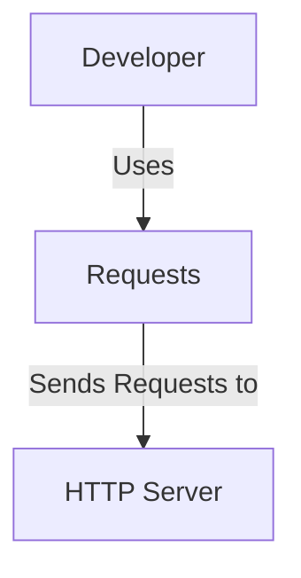
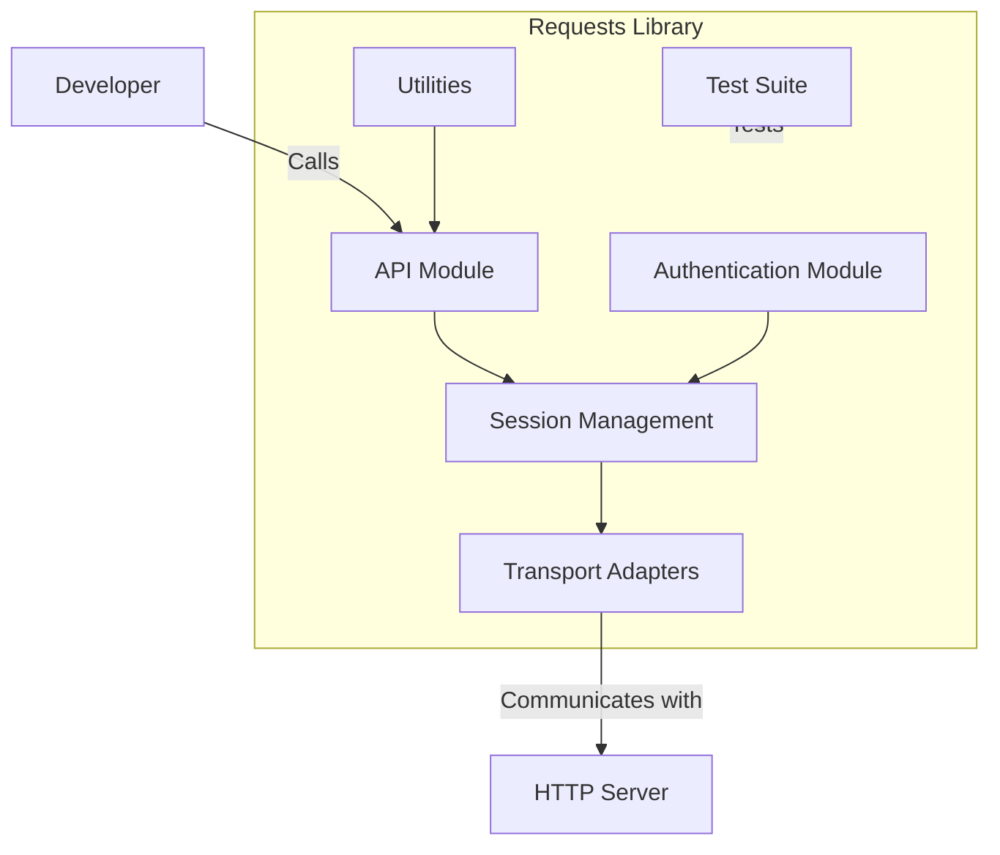
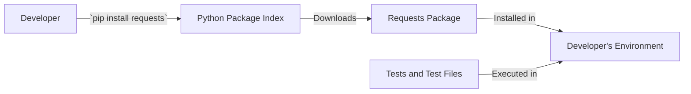
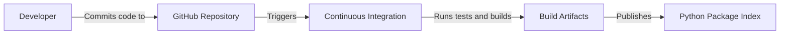

# BUSINESS POSTURE

The Requests project aims to provide a simple, yet elegant HTTP library for Python, enabling developers to send HTTP/1.1 requests effortlessly. The primary goal is to simplify HTTP client operations, making it accessible and user-friendly for Python programmers.

Important business risks that need to be addressed include:

- Ensuring security and privacy in HTTP communications, as Requests may be used in applications that handle sensitive data.
- Maintaining compatibility with evolving web standards and Python versions.
- Preserving the trust and reliability of the library, given its widespread use in over 1,000,000 repositories.

# SECURITY POSTURE

Existing security controls:

- security control: SSL/TLS certificate verification using `certifi` CA bundle.
- security control: Support for secure protocols and configurations (e.g., SSLContext).
- security control: Protection against insecure TLS versions and ciphers.
- security control: Deprecation of insecure HTTP methods and schemes.
- security control: Handling of sensitive data such as authentication credentials to prevent leakage (e.g., removal of Authorization headers on redirects).
- security control: Vulnerability disclosure process outlined in `SECURITY.md`.
- security control: Comprehensive test suite covering various security aspects.

Accepted risks:

- accepted risk: Dependency on external libraries (e.g., `urllib3`, `chardet`/`charset_normalizer`) which may introduce vulnerabilities.
- accepted risk: Potential misuse by developers leading to insecure configurations (e.g., setting `verify=False`).
- accepted risk: Reliance on third-party CA certificates which may be compromised.

Recommended high priority security controls:

- security control: Implement stricter default security configurations to minimize insecure usage.
- security control: Regularly update dependencies to incorporate security patches.
- security control: Enhance documentation to highlight best security practices.
- security control: Implement additional automated security checks in the build process.
- security control: Increase test coverage for edge cases and security vulnerabilities, including testing for improper handling of redirects, cookies, and authentication.

Security requirements:

**Authentication:**

- Should support secure authentication methods, including Basic, Digest, and OAuth.
- Should securely handle credentials and avoid exposing them in logs or error messages.

**Authorization:**

- Should ensure that HTTP methods and headers are correctly handled.
- Should not interfere with application-level authorization mechanisms.

**Input Validation:**

- Should validate and sanitize URLs and headers to prevent injection attacks.
- Should handle invalid inputs gracefully without crashing or exposing sensitive information.

**Cryptography:**

- Should use up-to-date cryptographic libraries and standards.
- Should ensure proper SSL/TLS configurations, supporting strong ciphers and protocols.
- Should validate certificates and provide warnings or errors for invalid certificates.

Implementation references:

- SSL/TLS verification is implemented in `requests.adapters` module (`cert_verify` method).
- Certificate bundle is provided via `requests.certs` module using `certifi`.
- Removal of Authorization headers on redirects is handled in `requests.sessions.SessionRedirectMixin.rebuild_auth`.
- Authentication methods are implemented in `requests.auth` module.
- Security tests are implemented in `tests/test_requests.py` and other test modules.

# DESIGN

## C4 CONTEXT

### Context Diagram Elements

| Name        | Type          | Description                                                  | Responsibilities                                       | Security controls                               |
|-------------|---------------|--------------------------------------------------------------|--------------------------------------------------------|------------------------------------------------|
| Developer   | External User | Python developer using the Requests library in their code    | Uses Requests to send HTTP requests                    | Follows best practices for secure usage         |
| Requests    | Software      | Python HTTP library (the project itself)                     | Sends HTTP/1.1 requests and handles responses          | Implements SSL/TLS verification, secure defaults |
| HTTP Server | External System | Remote server receiving HTTP requests from Requests        | Processes HTTP requests and returns responses          | Secures communication via SSL/TLS               |

## C4 CONTAINER

### Container Diagram Elements

| Name              | Type         | Description                                                    | Responsibilities                                           | Security controls                                       |
|-------------------|--------------|----------------------------------------------------------------|------------------------------------------------------------|--------------------------------------------------------|
| API Module        | Container    | Provides the high-level API functions (e.g., `get`, `post`)    | Exposes easy-to-use functions for sending HTTP requests    | Validates URLs and parameters                           |
| Session Management | Container   | Manages persistent settings across requests                    | Handles cookies, headers, and authentication across sessions | Securely stores cookies and credentials                 |
| Transport Adapters | Container   | Handles the actual transport mechanisms (e.g., HTTP, HTTPS)    | Manages connection pooling and low-level request handling  | Implements SSL/TLS configurations and verifications     |
| Authentication Module | Container | Provides authentication methods (Basic, Digest, OAuth)        | Authenticates requests as needed                           | Safely handles and stores authentication data           |
| Utilities         | Container    | Helper functions and shared utilities                          | Provides common functionality used across modules          | Input validation, error handling                        |
| Test Suite        | Container    | Collection of tests for Requests library                       | Ensures code correctness and tests various scenarios       | Tests security aspects, input validation, error handling |

## DEPLOYMENT

### Deployment Diagram Elements

| Name                    | Type             | Description                                                           | Responsibilities                                       | Security controls                                  |
|-------------------------|------------------|-----------------------------------------------------------------------|--------------------------------------------------------|---------------------------------------------------|
| PyPI                    | External System  | Python Package Index hosting Requests                                 | Hosts the Requests package for distribution            | Secure hosting, package integrity checks           |
| Requests Package        | Artifact         | The packaged Requests library                                         | Provides the library for installation                  | Signed packages, secure transfer                  |
| Developer's Environment | Environment      | The environment where the developer installs Requests                 | Runs the developer's code using Requests               | Uses secure environments, up-to-date dependencies  |
| Tests and Test Files    | Artifact         | Test scripts and files accompanying the Requests library              | Validate functionality and security of the library     | Ensure tests cover security aspects               |

## BUILD

The project is built and published using standard Python packaging tools.

- Build process uses `setup.py` for packaging.
- Publishing is done via `twine` to upload to PyPI.
- Continuous Integration workflows (e.g., GitHub Actions) are used for automated testing and building.
- Automated tests are defined in the `tests/` directory, covering functionality and security aspects.

Security controls of build process:

- security control: Isolated build environments to prevent supply chain attacks.
- security control: Dependency management to ensure all dependencies are up-to-date with security patches.
- security control: Use of code signing or hash verification for build artifacts.
- security control: Automated tests and static analysis to detect vulnerabilities early.
- security control: Code coverage metrics to ensure sufficient test coverage.

Build process diagram:

# RISK ASSESSMENT

**What are critical business processes we are trying to protect?**

- Integrity and security of HTTP communications made using the Requests library.
- Trustworthiness and reliability of the library for developers worldwide.
- Protection against supply chain attacks during distribution and installation.
- Ensuring that security vulnerabilities are identified and mitigated through testing.

**What data are we trying to protect and what is their sensitivity?**

- User authentication credentials (high sensitivity).
- Cookies and session information (medium to high sensitivity).
- Data transmitted over HTTP requests, which may include personal or confidential information (varies; potentially highly sensitive).
- Source code integrity to prevent malicious code injection.

# QUESTIONS & ASSUMPTIONS

**Questions:**

- Are there plans to expand the test suite to cover more security-related test cases, such as fuzz testing and testing for specific vulnerabilities?
- What is the policy for updating and auditing dependencies, especially regarding security patches?
- How are build artifacts secured during publishing to prevent tampering?
- Is there a process for code signing or verification of packages distributed via PyPI?
- How is the coverage of the test suite monitored and ensured for all critical components?
- Are there any static code analysis tools integrated into the build process to detect potential security issues?

**Assumptions:**

**Business Posture:**

- The project prioritizes ease of use and developer experience without compromising on security.
- Security is a high priority due to the library's widespread use and the sensitive nature of HTTP communications.
- The inclusion of comprehensive tests is essential to maintain code quality and security.

**Security Posture:**

- Existing security controls are regularly reviewed and updated to follow best practices.
- Accepted risks are documented, monitored, and mitigated where possible.
- Developers using the library are encouraged to follow secure coding practices.
- The test suite is up-to-date and covers all critical functionality, including security aspects.

**Design:**

- The library is designed to be modular, maintainable, and extensible.
- Standard Python packaging and distribution mechanisms are used to facilitate easy installation and updates.
- Continuous Integration and Continuous Deployment (CI/CD) practices are employed to maintain code quality.
- The test suite is an integral part of the development process to ensure reliability and security.
