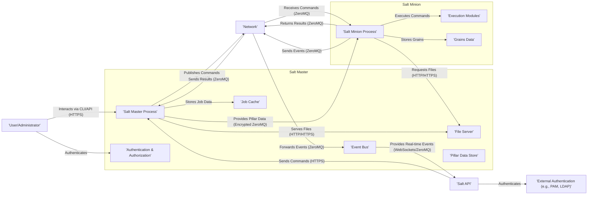
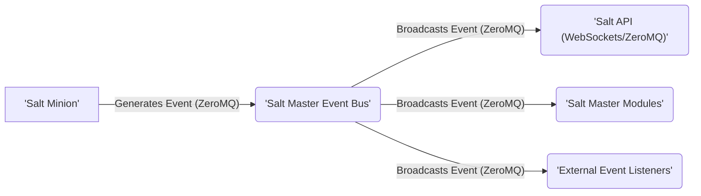

## Project Design Document: SaltStack (Improved)

**1. Introduction**

This document provides an enhanced architectural design of the SaltStack project, building upon the information available at [https://github.com/saltstack/salt](https://github.com/saltstack/salt). This improved version aims for greater clarity, detail, and a stronger focus on security considerations relevant for threat modeling. The document explicitly outlines system components, their interactions, and data flows, making it a robust foundation for subsequent threat modeling activities.

**2. Goals and Objectives**

The primary goal remains to provide a comprehensive and actionable architectural overview of SaltStack. Specific objectives of this improved document include:

*   Clearly identifying and describing the core components of the SaltStack system with enhanced detail.
*   Elaborating on the interactions and communication pathways between these components, including protocols and security mechanisms.
*   Illustrating the flow of various types of data within the system, highlighting sensitive data paths.
*   Explicitly highlighting key security-relevant aspects of the architecture, linking them to potential threats.
*   Providing a more detailed and robust foundation for future threat modeling exercises, including identifying assets, entry points, and trust boundaries.

**3. System Architecture**

SaltStack's master-minion architecture is central to its operation. The following diagram illustrates the key components and their interactions:

**4. Key Components (Detailed)**

This section provides a more detailed description of the primary components:

*   **Salt Master Process:** The core of the SaltStack system. It manages minions, distributes configurations (states), orchestrates tasks (orchestration runs), and handles authentication and authorization. It listens for connections from minions and API clients.
*   **Salt Minion Process:** An agent running on managed nodes. It establishes a secure connection with the Salt Master, receives and executes commands, and reports back the results. It also gathers system information (grains).
*   **Authentication & Authorization:** This critical component on the Salt Master verifies the identity of connecting minions (using pre-shared keys or other authentication methods) and users accessing the Salt API (using methods like PAM, LDAP, or token-based authentication). It also enforces authorization policies to control access to resources and functions.
*   **Job Cache:** A persistent storage mechanism on the Salt Master (typically a database or file system) that stores information about executed jobs, including the command, target minions, start and end times, and results. This is crucial for auditing and tracking.
*   **Event Bus:** A message bus within the Salt Master, built on ZeroMQ, that broadcasts real-time events occurring within the SaltStack infrastructure. These events can include job starts, completions, minion status changes, and custom events.
*   **File Server:** A component of the Salt Master that serves files to minions. These files include state files (SLS files), templates (Jinja), and other resources needed for configuration management. Access is typically over HTTP or HTTPS.
*   **Pillar Data Store:** A secure storage mechanism on the Salt Master for sensitive, per-minion configuration data. Pillar data is encrypted during transit to the minion.
*   **Execution Modules:** Python modules residing on the minions that perform specific actions on the managed system. SaltStack provides a wide range of built-in modules, and users can create custom modules.
*   **Grains Data:** Static information about a minion's system, such as operating system, kernel version, hardware details, and network interfaces. This data is gathered by the minion and reported to the master.
*   **Salt API:** A RESTful API provided by the Salt Master, allowing external systems and users to interact with SaltStack programmatically. It supports various authentication methods and allows for executing commands, retrieving job information, and accessing other SaltStack functionalities.
*   **External Authentication (e.g., PAM, LDAP):** Integration points allowing the Salt API to authenticate users against external authentication providers, enhancing security and integration with existing infrastructure.
*   **User/Administrator:** Individuals or automated systems interacting with SaltStack to manage infrastructure, typically through the command-line interface (CLI) or the Salt API.
*   **Network:** The underlying communication infrastructure connecting the Salt Master and Minions. Secure and reliable network connectivity is essential for SaltStack's operation.

**5. Data Flow (Detailed)**

This section elaborates on the data flows within the SaltStack system, highlighting security considerations:

*   **Command Execution:**
    *   A user or the Salt API sends a command to the Salt Master (typically over HTTPS for the API, or via the CLI which interacts with the Master).
    *   The Salt Master authenticates and authorizes the request.
    *   The Salt Master publishes the command to the targeted minions over a secure ZeroMQ channel. This communication is typically encrypted.
    *   The targeted minions receive the command over the secure ZeroMQ channel.
    *   The minions execute the command using the appropriate execution modules.
    *   The minions return the execution results to the Salt Master over the secure ZeroMQ channel.
    *   The Salt Master stores the job details and results in the Job Cache.
    *   The Salt Master can optionally notify the user or external systems about the job completion (e.g., via the Event Bus).

*   **State Application:**
    *   A user or the Salt API requests the application of a state to a minion.
    *   The Salt Master retrieves the relevant state file (SLS file) from the File Server, typically over HTTP or HTTPS.
    *   The Salt Master renders the state file, potentially using Pillar data.
    *   The Salt Master sends the rendered state to the targeted minion over a secure ZeroMQ channel.
    *   The minion executes the state using state modules.
    *   The minion returns the state execution results to the Salt Master over the secure ZeroMQ channel.

*   **Pillar Data Distribution:**
    *   When a minion initially connects to the Salt Master or when Pillar data is refreshed, the Salt Master determines the relevant Pillar data for that minion based on targeting rules.
    *   The Salt Master encrypts the Pillar data and securely transmits it to the specific minion over a secure ZeroMQ channel.
    *   The minion decrypts and stores the Pillar data securely.

*   **Event Handling:**

    *   Minions generate events for various activities (e.g., job starts, state changes).
    *   These events are published to the Salt Master's Event Bus over ZeroMQ.
    *   The Event Bus broadcasts these events to registered listeners, including the Salt API (often via WebSockets for real-time updates), internal Salt Master modules, and potentially external systems that have subscribed to the event stream.

**6. Security Considerations (Threat Modeling Focus)**

This section highlights key security aspects relevant for threat modeling, linking them to potential threats and vulnerabilities:

*   **Authentication and Authorization:**
    *   **Threats:** Unauthorized access to the Salt Master, command injection, privilege escalation.
    *   **Considerations:** Strength of minion keys, robustness of API authentication methods (e.g., token management, secure storage of credentials), effectiveness of authorization policies.
*   **Communication Security (Master-Minion):**
    *   **Threats:** Man-in-the-middle attacks, eavesdropping, data tampering.
    *   **Considerations:** Strength of encryption used for ZeroMQ communication (e.g., AES), secure key exchange mechanisms.
*   **Communication Security (Salt API):**
    *   **Threats:** Unauthorized API access, data breaches, replay attacks.
    *   **Considerations:** Use of HTTPS, TLS/SSL configuration, API authentication mechanisms (e.g., API tokens, OAuth), rate limiting, input validation.
*   **Secrets Management (Pillar Data):**
    *   **Threats:** Exposure of sensitive configuration data, credential theft.
    *   **Considerations:** Strength of Pillar encryption, secure storage of encryption keys, access control to Pillar data.
*   **Job Data Security:**
    *   **Threats:** Unauthorized access to job results, exposure of sensitive information contained in job outputs.
    *   **Considerations:** Access controls on the Job Cache, encryption of sensitive data within the cache.
*   **Event Bus Security:**
    *   **Threats:** Unauthorized monitoring of events, injection of malicious events.
    *   **Considerations:** Access controls on the Event Bus, secure authentication for event listeners.
*   **File Server Security:**
    *   **Threats:** Unauthorized access to state files and other resources, modification of configuration files.
    *   **Considerations:** Access controls on the File Server, secure authentication if required, protection against path traversal vulnerabilities.
*   **Input Validation:**
    *   **Threats:** Command injection, cross-site scripting (if web interfaces are involved), other injection attacks.
    *   **Considerations:** Robust input validation and sanitization at all entry points, particularly when handling data from minions or the API.
*   **Minion Security:**
    *   **Threats:** Compromised minions acting as attack vectors, local privilege escalation on minions.
    *   **Considerations:** Security hardening of minion systems, regular patching, secure configuration of execution modules.

**7. Deployment Considerations (Security Implications)**

The deployment architecture significantly impacts the security posture of SaltStack:

*   **Single Master:**
    *   **Security Implication:** A single point of failure and a high-value target. Compromise of the master can lead to compromise of all minions.
*   **Multi-Master:**
    *   **Security Implication:** Increased resilience and availability. However, secure synchronization and key management between masters are crucial.
*   **Master of Masters:**
    *   **Security Implication:** Complex architecture requiring careful management of trust relationships and secure communication between master levels.
*   **Cloud Deployments:**
    *   **Security Implication:** Leveraging cloud provider security features is essential. Secure configuration of cloud resources (e.g., network security groups, IAM roles) is critical.

**8. Future Considerations (Security Enhancements)**

Potential future enhancements with security implications include:

*   **Enhanced Auditing and Logging:**  More detailed and comprehensive audit logs can improve threat detection and incident response.
*   **Improved Secrets Management Integration:**  Direct integration with dedicated secrets management solutions (e.g., HashiCorp Vault, AWS Secrets Manager) can enhance the security of sensitive data.
*   **Fine-grained Authorization (RBAC):** Implementing more granular role-based access control can limit the impact of compromised accounts.
*   **Enhanced Network Security Options:**  Exploring and implementing more advanced network security features, such as mutual TLS, can further strengthen communication security.
*   **Immutable Infrastructure Principles:**  Adopting immutable infrastructure practices can reduce the attack surface and improve the security of managed nodes.

This improved design document provides a more detailed and security-focused overview of the SaltStack architecture. It serves as a valuable resource for conducting thorough threat modeling exercises by clearly outlining the components, data flows, and potential security vulnerabilities. The explicit linking of security considerations to potential threats makes it more actionable for security analysis and mitigation planning.