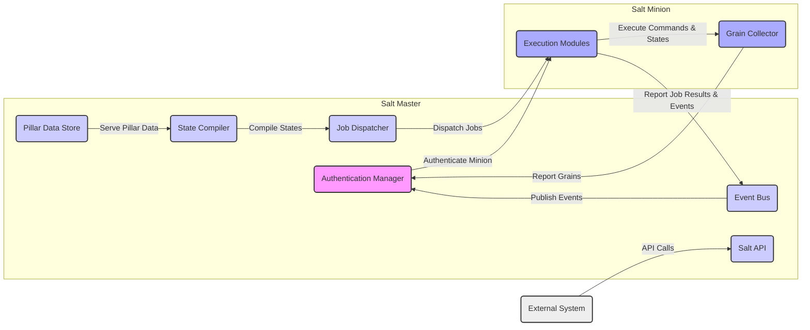
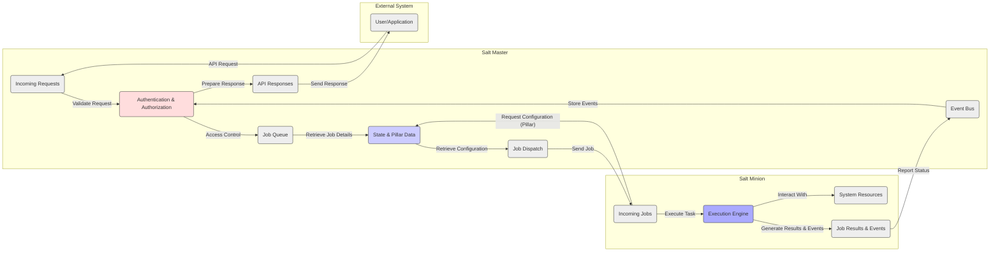

# Project Design Document: Salt

**Version:** 1.1
**Date:** October 26, 2023
**Author:** AI Software Architect

## 1. Introduction

This document provides a detailed architectural overview of the Salt project, an open-source configuration management and remote execution engine. This document is intended to serve as a foundational resource for subsequent threat modeling activities. It outlines the core components, their interactions, data flow, and key security considerations within the Salt ecosystem, providing a clear understanding of the system's structure and potential attack surfaces.

## 2. Project Goals and Objectives

* **Centralized Remote Execution:**  Enable administrators to execute commands on a large number of systems concurrently from a central point.
* **Declarative Configuration Management:** Allow users to define the desired state of systems using a declarative language, ensuring consistent configurations.
* **Automated Orchestration:** Facilitate the automation of complex, multi-step workflows across infrastructure components.
* **Event-Driven Automation:** Provide a mechanism to react to real-time system events and trigger automated responses.
* **Cloud Infrastructure Management:** Offer tools and integrations for managing resources across various cloud providers.
* **Infrastructure as Code (IaC):**  Represent infrastructure configurations in code, enabling version control, collaboration, and repeatability.

## 3. Target Audience

This document is primarily intended for:

* Security Engineers and Architects responsible for threat modeling and security assessments.
* Software Developers working on the Salt codebase or developing integrations with Salt.
* Operations Engineers responsible for deploying, managing, and maintaining Salt infrastructure.

## 4. Architectural Overview

Salt operates on a client-server model, featuring a central **Salt Master** and multiple **Salt Minions**. Communication between these components is primarily handled by the ZeroMQ messaging library, chosen for its asynchronous and high-performance capabilities.

### 4.1. Key Components

* **Salt Master:**
    * The authoritative control plane for the Salt infrastructure.
    * **Responsibilities:**
        * Authenticating Minions and managing their keys.
        * Storing and serving configuration data, including States and Pillars.
        * Scheduling and dispatching execution jobs to Minions based on targets.
        * Receiving and aggregating job results and event data from Minions.
        * Providing a RESTful API (Salt API) for external system interaction.
* **Salt Minion:**
    * An agent installed on each managed system.
    * **Responsibilities:**
        * Initiating connections to the configured Salt Master and authenticating.
        * Receiving and executing commands and state configurations pushed by the Master.
        * Reporting the outcome of job executions and system events back to the Master.
* **Salt API:**
    * A RESTful interface exposed by the Salt Master.
    * **Functionality:**
        * Enables external systems, scripts, and users to interact with Salt programmatically.
        * Provides endpoints for triggering job executions, retrieving system data, and managing Salt configurations.
        * Supports various authentication mechanisms for secure access.
* **Salt Syndic (Optional):**
    * An intermediary Salt Master that manages one or more downstream Salt Masters.
    * **Purpose:**
        * Facilitates scaling Salt deployments to manage a larger number of Minions or geographically distributed environments.
        * Provides a hierarchical management structure.
* **Transport Layer (ZeroMQ):**
    * The underlying asynchronous messaging library.
    * **Features:**
        * Enables efficient and scalable communication between the Master and Minions.
        * Supports various communication patterns, including publish/subscribe for event distribution and request/reply for job execution.
        * Configurable transport protocols (e.g., TCP).
* **Authentication Modules:**
    * Pluggable modules responsible for verifying the identity of Minions connecting to the Master.
    * **Examples:**
        * Key-based authentication (pre-shared keys).
        * External authentication providers (e.g., PAM).
* **Authorization Modules:**
    * Control access to Salt functionalities based on user or system identity.
    * **Functionality:**
        * Define permissions for executing commands, accessing data, and managing configurations.
        * Can be configured based on users, groups, or other criteria.
* **Execution Modules:**
    * Python modules residing on the Minion that perform specific actions on the managed system.
    * **Examples:**
        * Package management (installing, removing software).
        * Service management (starting, stopping services).
        * File management (creating, modifying files).
* **State Modules:**
    * Define the desired configuration state of a system in a declarative manner.
    * **Format:**
        * Typically written in YAML or Jinja templates.
        * Describe the resources to be managed and their desired properties.
    * Compiled by the Master and sent to Minions for enforcement.
* **Pillar Data:**
    * Secure, per-Minion or per-group configuration data, often containing sensitive information.
    * **Purpose:**
        * Allows for customizing configurations based on specific system attributes or roles.
        * Data is stored on the Master and securely delivered only to authorized Minions.
        * Supports various backends for storage and retrieval.
* **Grain Data:**
    * Static information about a Minion's system characteristics.
    * **Examples:**
        * Operating system details, kernel version, CPU architecture, network interfaces.
    * Automatically collected by the Minion and reported to the Master upon initial connection or refresh.
    * Used for targeting specific Minions for job execution and state application.

### 4.2. High-Level Architecture Diagram

### 4.3. Communication Flow

* **Minion Authentication Process:**
    * When a Minion starts, it attempts to establish a connection with the configured Salt Master.
    * The Master utilizes a configured authentication module to verify the Minion's identity, typically involving the exchange and validation of pre-shared keys.
    * Upon successful authentication, a persistent and secure communication channel is established using ZeroMQ.
* **Job Execution Workflow:**
    * An administrator or an automated system initiates a command or state application on the Salt Master, specifying target Minions.
    * The Master authenticates and authorizes the request based on configured permissions.
    * The Master determines the target Minions based on specified criteria (e.g., Minion IDs, grain data).
    * The Master dispatches the job, including the command or state definition, to the targeted Minions via ZeroMQ.
    * Each targeted Minion receives the job and executes the designated execution or state modules to perform the requested actions.
    * Minions report the results of the job execution, including success or failure status and any output, back to the Master.
* **State Application Process:**
    * Similar to job execution, but focused on enforcing a desired configuration state.
    * The administrator defines the desired state using state files.
    * The Master compiles the state definition, incorporating any relevant Pillar data specific to the target Minions.
    * The compiled state is transmitted to the targeted Minions.
    * Minions utilize state modules to ensure the system configuration matches the defined state, making necessary changes.
* **Event System Operation:**
    * Both Minions and the Master emit events to signal various activities and changes within the Salt infrastructure.
    * Examples of events include job completion, state changes, Minion status updates, and custom application events.
    * These events are published on the Master's event bus via ZeroMQ's publish/subscribe mechanism.
    * External systems or Salt's Reactor system can subscribe to specific event patterns and trigger automated actions in response.
* **API Interaction Flow:**
    * External systems can interact with the Salt Master through the Salt API using standard HTTP requests.
    * API requests are authenticated using configured authentication mechanisms (e.g., tokens, PAM).
    * The API provides access to a range of Salt functionalities, including initiating job executions, retrieving Minion data, and managing Salt configurations.

## 5. Data Flow Diagram

## 6. Security Considerations

This section outlines key security considerations relevant to the Salt project, which are crucial for effective threat modeling.

* **Authentication and Authorization:**
    * **Minion Authentication:**  The process of verifying the identity of Minions connecting to the Master is paramount. Weak authentication mechanisms or compromised keys can lead to unauthorized control of managed systems.
    * **Master Authentication:** Securing access to the Salt Master itself is critical. Weak passwords or insecure API access can allow attackers to manage the entire Salt infrastructure.
    * **Authorization Controls:**  Properly configured authorization rules are necessary to restrict which users or systems can perform specific actions within Salt. Insufficiently restrictive permissions can lead to privilege escalation and unauthorized modifications.
* **Data in Transit Security:**
    * **Communication Encryption:**  Encrypting communication between the Master and Minions is essential to protect sensitive data (commands, configuration data, secrets) from eavesdropping. Ensure TLS/SSL is properly configured for the `ret_port` and `publish_port`.
    * **API Security (HTTPS):** All communication with the Salt API should occur over HTTPS to prevent interception of credentials and sensitive data.
* **Data at Rest Security:**
    * **Secrets Management:**  Securely storing and managing sensitive data within Pillar is crucial. Utilize appropriate renderers (e.g., `gpg`) and access controls to protect secrets.
    * **Master Key Security:** The Salt Master's private key is highly sensitive and must be protected from unauthorized access. Compromise of this key can lead to complete control of the Salt infrastructure.
    * **Pillar Data Storage:**  Consider the security of the backend used for storing Pillar data.
* **Input Validation and Sanitization:**
    * **Command Injection Prevention:**  Carefully validate and sanitize any user-provided input used in execution modules or state files to prevent command injection vulnerabilities.
    * **Template Injection Prevention:**  Exercise caution when using Jinja templating, as improper usage can introduce template injection vulnerabilities, allowing attackers to execute arbitrary code on the Master or Minions.
* **Least Privilege Principle:**
    * **Minion User Privileges:** Minions should run with the minimum necessary privileges to perform their tasks. Avoid running Minions as root unless absolutely necessary.
    * **Master User Privileges:** The Salt Master service should also run with the least necessary privileges.
* **Auditing and Logging:**
    * **Comprehensive Logging:**  Enable and properly configure Salt's logging capabilities to track actions, events, and potential security incidents.
    * **Log Monitoring:**  Regularly monitor Salt logs for suspicious activity or security breaches. Integrate with security information and event management (SIEM) systems for centralized monitoring.
* **Dependency Management:**
    * **Secure Dependencies:** Ensure that all dependencies of Salt (Python libraries, etc.) are from trusted sources and are kept up-to-date to patch any known vulnerabilities.
* **Code Security:**
    * **Secure Coding Practices:** Adhere to secure coding practices when developing custom execution modules, state modules, or Salt extensions.
* **Default Configurations:**
    * **Review Default Settings:** Carefully review and harden default Salt configurations, as default settings may not always be the most secure.

## 7. Deployment Scenarios

* **Single Master, Multiple Minions:** A foundational deployment model where one central Salt Master manages multiple Salt Minions in a single environment.
* **Master of Masters (Syndic):** Employed for scalability and managing geographically dispersed or logically separated environments. A central Syndic Master manages multiple downstream regional or functional Salt Masters.
* **Multi-Master Setup:**  Implementing multiple active Salt Masters for high availability and load balancing, ensuring continuous operation even if one Master fails.

## 8. Technology Stack

* **Core Programming Language:** Python
* **Asynchronous Messaging Library:** ZeroMQ
* **Data Serialization Format:** MessagePack
* **Templating Engine:** Jinja
* **Data Storage (Master):** Typically the local filesystem for storing states, pillars, and authentication keys. Pillar data can be backed by various external systems.
* **Supported Operating Systems (Minion):** A wide range of Linux distributions, Windows Server, macOS, and other Unix-like systems.

## 9. Future Considerations

* **Enhanced Multi-Factor Authentication:** Exploring and implementing robust multi-factor authentication options for accessing the Salt Master and API.
* **Integration with Dedicated Secrets Management Vaults:**  Deepening integration with specialized secrets management solutions (e.g., HashiCorp Vault, CyberArk) for more secure secrets handling.
* **Fine-Grained Role-Based Access Control (RBAC):**  Developing more granular and flexible RBAC mechanisms for managing permissions within Salt.
* **Advanced Security Auditing and Compliance Features:** Enhancing built-in auditing capabilities and providing features to aid in compliance with security standards.
* **Improved Vulnerability Scanning and Remediation Integration:**  Integrating with vulnerability scanning tools to automatically identify and remediate vulnerabilities on managed systems.

This revised document provides a more detailed and structured overview of the Salt project architecture, emphasizing security considerations critical for threat modeling activities. The enhanced descriptions and diagrams aim to facilitate a deeper understanding of the system's components, interactions, and potential security risks.