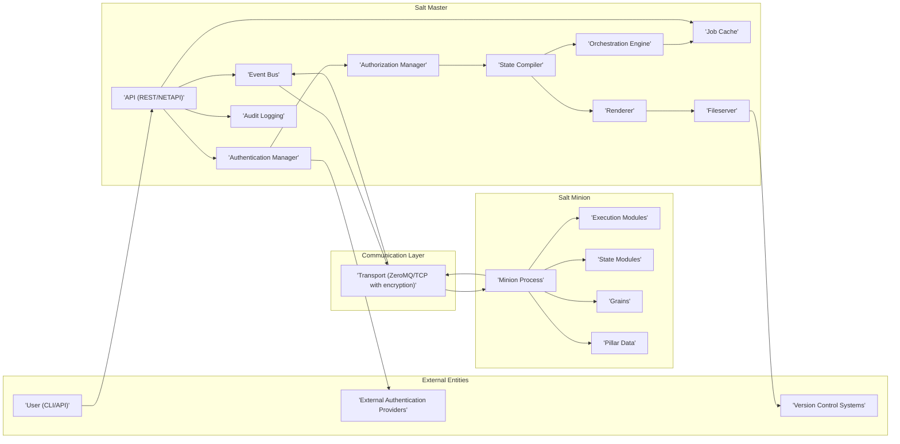
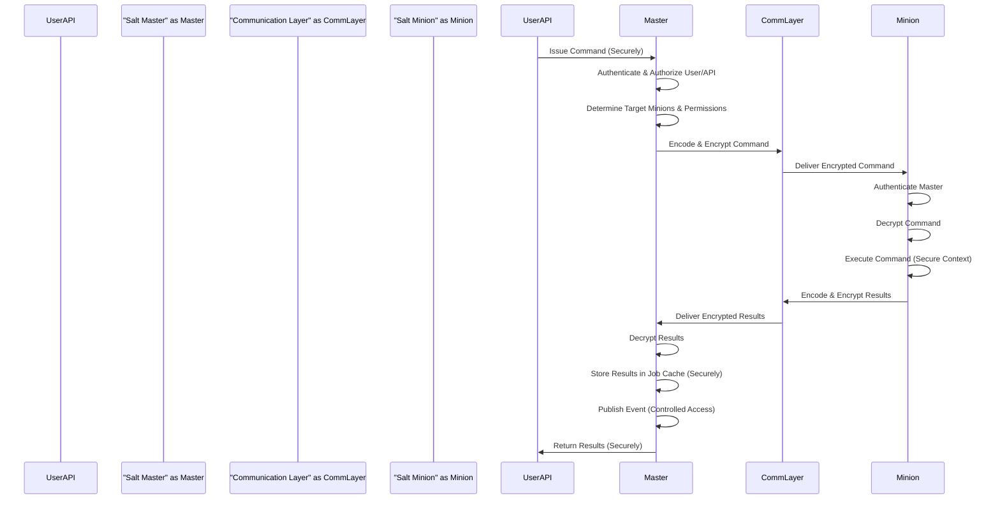

## Project Design Document: Salt (SaltStack) - Improved

**1. Introduction**

This document provides an enhanced architectural design of the Salt project (SaltStack), an open-source configuration management and remote execution engine. This improved document builds upon the previous version to offer a more detailed and security-focused perspective, specifically tailored for subsequent threat modeling activities. It meticulously outlines the key components, their interactions, data flows, and security considerations within the Salt ecosystem.

**2. Goals**

*   Provide a comprehensive and refined overview of the Salt architecture.
*   Identify key components and their functionalities with a focus on security implications.
*   Describe the data flow and communication patterns within the system, highlighting sensitive data exchanges.
*   Emphasize relevant security considerations, categorized for clarity, to facilitate effective threat modeling.
*   Detail security-focused deployment considerations.

**3. Scope**

This document covers the core components of the Salt project, including the Salt Master, Salt Minions, the communication infrastructure, and key supporting elements. It maintains a focus on the fundamental architecture but provides more granular detail where it directly impacts security. Specific Salt modules or states are discussed when their functionality is critical to understanding the overall system architecture and its security posture.

**4. Target Audience**

*   Security architects and engineers responsible for threat modeling and security assessments.
*   Software developers working on or with Salt, particularly those involved in security-sensitive areas.
*   System administrators responsible for the secure deployment and management of Salt infrastructure.
*   Threat modeling practitioners seeking a detailed understanding of Salt's architecture.

**5. High-Level Architecture**

Salt operates on a secure client-server model, with a central **Salt Master** securely controlling multiple **Salt Minions**. Communication between the Master and Minions is asynchronous, message-based, and secured through encryption.

**6. Component Descriptions**

*   **Salt Master:** The securely managed central control point for the Salt infrastructure. Its security responsibilities include:
    *   **Secure Authentication:** Authenticating Minions using pre-shared keys, and users via PAM or external providers.
    *   **Granular Authorization:** Enforcing access control policies to restrict command execution and data access.
    *   **Secure Command Dispatch:**  Ensuring commands are sent only to authorized Minions.
    *   **Job Result Security:** Securely storing and managing job results, potentially containing sensitive information.
    *   **Event Bus Security:** Controlling access to the event bus to prevent unauthorized monitoring or injection.
    *   **Secure Fileserving:**  Managing access and permissions for served files (states, modules).
    *   **Secure Rendering and Compilation:** Processing templates and states securely to prevent injection vulnerabilities.
    *   **Orchestration Security:** Ensuring secure execution of orchestrated tasks across Minions.
    *   **API Security:** Providing a secure API with authentication, authorization, and rate limiting.
    *   **Audit Logging:** Maintaining a comprehensive audit log of actions performed on the Master.

*   **Salt Minion:** A securely configured agent running on managed nodes. Its security responsibilities include:
    *   **Secure Authentication:** Authenticating to the Salt Master using its assigned key.
    *   **Command Execution within Security Context:** Executing commands within the appropriate security context.
    *   **Secure Result Reporting:** Securely transmitting execution results back to the Master.
    *   **Grains Security:** Providing accurate and non-malicious system information.
    *   **Pillar Data Security:** Securely storing and accessing only the Pillar data authorized for it.

*   **Communication Layer (Transport):**  Provides secure communication between the Master and Minions. Key security aspects:
    *   **Encryption:**  Utilizes AES encryption (or other configured ciphers) to protect data in transit.
    *   **Authentication:**  Ensures only authenticated Masters and Minions can communicate.
    *   **Integrity:**  Protects against message tampering during transmission.
    *   **Transport Protocol Choice:**  ZeroMQ offers performance and flexibility, while TCP provides broader compatibility. Security configurations should be applied to either.

*   **API (REST/NETAPI):** Provides secure programmatic access to the Salt Master's functionality. Security considerations:
    *   **Authentication:** Requires authentication (e.g., using tokens, API keys).
    *   **Authorization:** Enforces authorization policies to restrict access to specific API endpoints and actions.
    *   **Rate Limiting:**  Protects against denial-of-service attacks.
    *   **Input Validation:**  Sanitizes and validates input to prevent injection vulnerabilities.
    *   **HTTPS Enforcement:**  Should be accessed over HTTPS to protect credentials and data in transit.

*   **CLI (Command Line Interface):**  The primary way for users to interact with the Salt Master. Security considerations:
    *   **User Authentication:** Relies on the Master's authentication mechanisms.
    *   **Authorization:**  Enforces user-level authorization for command execution.
    *   **Secure Shell Access:**  Access to the Master's shell should be restricted and secured.

*   **Authentication Manager:** Securely manages the authentication process for Minions and users. Key aspects:
    *   **Minion Key Management:**  Secure generation, distribution, and acceptance of Minion keys.
    *   **User Authentication Modules:** Supports various authentication methods (PAM, external providers) with secure configuration.
    *   **Credential Storage:** Securely stores or manages access to user credentials.

*   **Authorization Manager:** Securely enforces access control policies. Key aspects:
    *   **Role-Based Access Control (RBAC):**  Allows defining roles and assigning permissions to them.
    *   **Policy Enforcement:**  Ensures that only authorized users and Minions can perform specific actions.
    *   **External Authorization Integration:**  Can integrate with external authorization systems.

*   **Job Cache:** Stores information about executed jobs. Security considerations:
    *   **Access Control:**  Restricts access to job data based on user roles.
    *   **Sensitive Data Handling:**  May require secure handling of sensitive data within job results.

*   **Event Bus:** A publish/subscribe system for events within Salt. Security considerations:
    *   **Access Control:**  Limits who can subscribe to and publish events.
    *   **Event Content Security:**  Ensuring sensitive information is not inadvertently exposed in events.

*   **Fileserver:** Securely serves files to Minions. Key security aspects:
    *   **Access Control:**  Defines which Minions can access specific files.
    *   **Backend Security:**  Security of the underlying file storage mechanism (local filesystem, VCS).
    *   **Content Integrity:**  Ensuring the integrity of served files.

*   **Renderer:** Processes templates securely. Security considerations:
    *   **Template Injection Prevention:**  Mitigating risks of template injection vulnerabilities.
    *   **Secure Context:**  Rendering templates within a secure context.

*   **State Compiler:** Compiles states securely. Security considerations:
    *   **State Definition Security:**  Ensuring state definitions do not introduce vulnerabilities.

*   **Orchestration Engine:** Executes orchestrated tasks securely. Security considerations:
    *   **Workflow Security:**  Ensuring the security of defined workflows.
    *   **Step-Level Authorization:**  Potentially enforcing authorization at each step of an orchestration.

*   **Execution Modules:** Provide the core functionality for executing commands. Security considerations:
    *   **Secure Coding Practices:**  Modules should be developed with security in mind to prevent vulnerabilities.
    *   **Input Sanitization:**  Modules should sanitize input to prevent command injection.
    *   **Privilege Management:**  Modules should operate with the least necessary privileges.

*   **State Modules:** Define the desired state of a system. Security considerations:
    *   **Idempotency and Security:**  Ensuring states are idempotent and do not introduce security risks.
    *   **Secure Defaults:**  Using secure default configurations in state definitions.

*   **Grains:** Static information about a Minion. Security considerations:
    *   **Data Sensitivity:**  Understanding the sensitivity of information exposed through Grains.
    *   **Tampering Prevention:**  Protecting against unauthorized modification of Grains data.

*   **Pillar Data:** Securely managed secret or sensitive configuration data. Security considerations:
    *   **Encryption at Rest and in Transit:**  Pillar data should be encrypted.
    *   **Access Control:**  Strictly controlling which Minions can access specific Pillar data.
    *   **Secure Storage:**  Storing Pillar data securely on the Master.

*   **Syndic (Optional):**  Extends the Salt infrastructure. Security considerations:
    *   **Secure Communication:**  Requires secure communication between Syndic Masters and subordinate Masters.
    *   **Authentication and Authorization:**  Properly authenticating and authorizing communication between Masters.

*   **Audit Logging:** Records actions performed within the Salt infrastructure. Security considerations:
    *   **Completeness and Accuracy:** Ensuring comprehensive and accurate logging.
    *   **Secure Storage:**  Storing logs securely to prevent tampering.
    *   **Access Control:**  Restricting access to audit logs.

**7. Data Flow**

The following describes the typical data flow for a common operation: securely executing a command on a Minion.

1. **User/API Interaction:** A user issues a command via the CLI or an external system sends a request through the secure API (HTTPS) to the Salt Master.
2. **Authentication and Authorization (Master):** The Master securely authenticates the user or system and rigorously verifies their authorization to execute the requested command.
3. **Command Dispatch:** The Master securely determines the target Minions based on the command's targeting criteria and the user's permissions.
4. **Message Encoding and Encryption:** The Master encodes the command into a message and encrypts it using the configured encryption protocol for the transport (e.g., AES with ZeroMQ).
5. **Secure Message Transmission:** The Master securely sends the encrypted message to the targeted Minions via the communication layer.
6. **Secure Message Reception:** The Minions securely receive the encrypted message.
7. **Authentication (Minion-side):** The Minion securely verifies the authenticity of the message from the Master using its pre-shared key.
8. **Message Decryption:** The Minion decrypts the command message.
9. **Command Execution:** The Minion executes the command using the appropriate execution module within its security context.
10. **Result Encoding and Encryption:** The Minion encodes the execution results into a message and encrypts it.
11. **Secure Result Transmission:** The Minion securely sends the encrypted results back to the Master via the communication layer.
12. **Secure Result Reception:** The Master securely receives the encrypted results.
13. **Message Decryption:** The Master decrypts the result message.
14. **Result Storage:** The Master securely stores the results in the Job Cache, respecting access controls.
15. **Event Publication:** The Master publishes an event on the event bus indicating the job's completion and status. Access to this bus is controlled.
16. **User Feedback:** The user or external system receives the results, potentially over a secure channel.

**8. Security Considerations**

This section categorizes security considerations for clarity during threat modeling:

*   **Authentication and Authorization:**
    *   **Weak Minion Key Management:**  Risk of unauthorized Minions joining the infrastructure.
    *   **Compromised Master Key:**  Complete compromise of the Salt infrastructure.
    *   **Weak User Authentication:**  Unauthorized access to the Salt Master.
    *   **Insufficient Authorization Controls:**  Users or Minions performing actions beyond their privileges.
    *   **Bypassing Authentication/Authorization:** Vulnerabilities allowing bypass of security checks.

*   **Data Protection (Confidentiality and Integrity):**
    *   **Man-in-the-Middle Attacks:**  Eavesdropping or tampering with communication between Master and Minions if encryption is weak or disabled.
    *   **Exposure of Sensitive Data in Transit:**  Unencrypted communication exposing Pillar data or command arguments.
    *   **Exposure of Sensitive Data at Rest:**  Unencrypted Pillar data or job results on the Master.
    *   **Data Tampering:**  Unauthorized modification of state files, modules, or Pillar data.
    *   **Insecure Secrets Management:**  Storing secrets in plain text within state files or Pillar data.

*   **Operational Security:**
    *   **Vulnerable Dependencies:**  Using outdated or vulnerable versions of Salt or its dependencies.
    *   **Insecure Deployment Practices:**  Exposing the Master to the public internet or using default configurations.
    *   **Insufficient Logging and Auditing:**  Lack of visibility into security events.
    *   **Denial of Service (DoS) Attacks:**  Overloading the Master or Minions with requests.
    *   **Code Injection Vulnerabilities:**  Exploiting vulnerabilities in renderers or execution modules.
    *   **Privilege Escalation:**  Exploiting vulnerabilities to gain higher privileges on the Master or Minions.
    *   **Event Bus Abuse:**  Unauthorized monitoring or injection of events.

*   **API Security:**
    *   **API Key Compromise:**  Unauthorized access through compromised API keys.
    *   **Lack of Rate Limiting:**  Susceptibility to DoS attacks.
    *   **Injection Vulnerabilities:**  SQL injection, command injection through API endpoints.
    *   **Insecure API Design:**  Exposing sensitive information through API responses.

**9. Deployment Considerations (Security Focused)**

*   **Secure Master Deployment:** Deploy the Salt Master in a hardened environment, behind firewalls, with restricted access.
*   **Network Segmentation:** Isolate the Salt infrastructure on a dedicated network segment with strict firewall rules.
*   **Strong Minion Key Management:** Implement a secure process for generating, distributing, and accepting Minion keys. Automate key acceptance where appropriate and secure.
*   **HTTPS Enforcement for API:**  Always access the Salt API over HTTPS.
*   **Regular Security Audits:** Conduct regular security audits and penetration testing of the Salt infrastructure.
*   **Principle of Least Privilege:**  Grant only the necessary permissions to users and Minions.
*   **Keep Software Updated:**  Regularly update Salt and its dependencies to patch security vulnerabilities.
*   **Secure Configuration Management:**  Use Salt itself to enforce secure configurations on the Master and Minions.
*   **Monitor Audit Logs:**  Actively monitor audit logs for suspicious activity.
*   **Secure Secrets Management Practices:** Utilize Salt's built-in features or external secrets management tools for sensitive data.
*   **Input Validation Everywhere:** Implement robust input validation on both the Master and Minions.

**10. Future Considerations (Out of Scope for Current Threat Modeling)**

*   Advanced integration with Security Information and Event Management (SIEM) systems for enhanced threat detection and response.
*   Implementation of multi-factor authentication (MFA) for user access to the Salt Master.
*   Exploration of hardware security modules (HSMs) for enhanced key management.
*   Further refinement of authorization policies using attribute-based access control (ABAC).
*   Development of more sophisticated intrusion detection and prevention mechanisms within the Salt infrastructure.

This improved document provides a more detailed and security-focused understanding of the Salt architecture, making it a more effective foundation for comprehensive threat modeling activities.