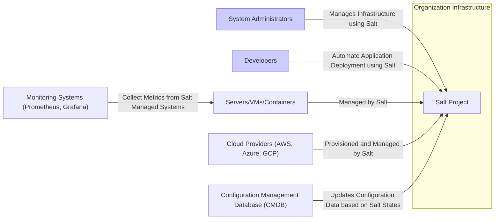
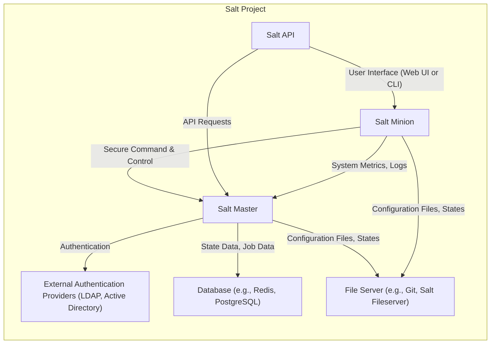
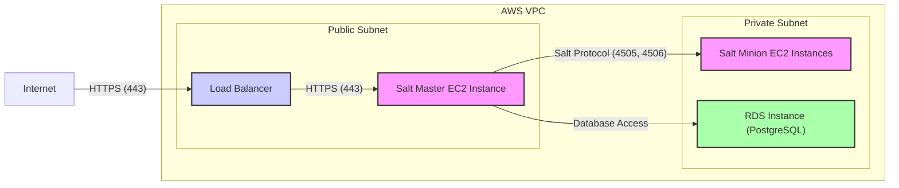
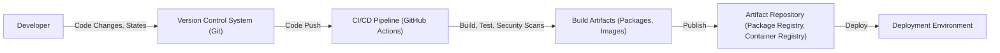

# BUSINESS POSTURE

- Business Priorities and Goals:
 - Automate infrastructure management and configuration.
 - Ensure consistent system configurations across environments.
 - Improve operational efficiency and reduce manual tasks.
 - Enable rapid and reliable deployments.
 - Enhance system security and compliance through automated configuration enforcement.
- Business Risks:
 - Misconfiguration leading to system instability or security vulnerabilities.
 - Unauthorized access to sensitive systems and data through mismanaged configurations.
 - Data breaches due to insecure configuration practices.
 - Disruption of critical services due to configuration errors.
 - Compliance violations resulting from inconsistent or non-compliant configurations.

# SECURITY POSTURE

- Existing Security Controls:
 - security control: Code review process for contributions (described in GitHub repository contribution guidelines).
 - security control: Regular security audits and vulnerability scanning (Salt project publicly announces security advisories).
 - security control: Cryptographic functions for secure communication between Salt Master and Minions (implemented in Salt codebase).
 - security control: Authentication mechanisms for Salt Master and Minions (implemented in Salt codebase, e.g., keys, PAM).
 - security control: Authorization mechanisms to control access to Salt functions and data (implemented in Salt codebase, e.g., ACLs, policies).
- Accepted Risks:
 - accepted risk: Potential vulnerabilities in third-party dependencies.
 - accepted risk: Risk of misconfiguration by users leading to security issues.
 - accepted risk: Open-source nature implies publicly known codebase, potentially easing vulnerability discovery for attackers.
- Recommended Security Controls:
 - security control: Implement automated security scanning in the CI/CD pipeline (SAST, DAST, dependency scanning).
 - security control: Enforce multi-factor authentication for access to Salt Master and related infrastructure.
 - security control: Implement secrets management solution for handling sensitive data within Salt configurations.
 - security control: Regularly review and update security configurations and policies.
 - security control: Conduct penetration testing to identify potential vulnerabilities in deployed Salt infrastructure.
- Security Requirements:
 - Authentication:
  - Requirement: Secure authentication mechanism for Salt Master and Minions to establish trusted communication.
  - Requirement: Support for various authentication methods (e.g., key-based, certificate-based, PAM).
  - Requirement: Strong password policies and enforcement if password-based authentication is used.
  - Requirement: Consider multi-factor authentication for administrative access to Salt Master.
 - Authorization:
  - Requirement: Role-Based Access Control (RBAC) to manage permissions for users and services interacting with Salt.
  - Requirement: Granular authorization policies to control access to specific Salt functions, states, and data.
  - Requirement: Principle of least privilege should be applied to all access controls.
 - Input Validation:
  - Requirement: Validate all inputs to Salt Master and Minions to prevent injection attacks (e.g., command injection, YAML injection).
  - Requirement: Sanitize user-provided data in Salt states and modules to prevent cross-site scripting (XSS) vulnerabilities if web interfaces are exposed.
  - Requirement: Input validation should be performed on both the client-side (Salt CLI, API) and server-side (Salt Master, Minion).
 - Cryptography:
  - Requirement: Use strong encryption algorithms for communication between Salt Master and Minions (e.g., AES).
  - Requirement: Securely store and manage cryptographic keys used for authentication and encryption.
  - Requirement: Implement cryptographic hashing for data integrity checks.
  - Requirement: Follow best practices for cryptographic key generation, rotation, and revocation.

# DESIGN

## C4 CONTEXT

- Context Diagram Elements:
 - Element:
  - Name: System Administrators
  - Type: Person
  - Description: IT professionals responsible for managing and maintaining the organization's infrastructure.
  - Responsibilities: Use Salt to automate system configuration, patching, and management tasks.
  - Security controls: Role-based access control to Salt Master, multi-factor authentication for administrative accounts, audit logging of actions.
 - Element:
  - Name: Developers
  - Type: Person
  - Description: Software developers who deploy and manage applications on the infrastructure.
  - Responsibilities: Use Salt to automate application deployments, environment provisioning, and configuration management for applications.
  - Security controls: Role-based access control to Salt Master, potentially limited access compared to System Administrators, audit logging of actions.
 - Element:
  - Name: Servers/VMs/Containers
  - Type: System
  - Description: Physical servers, virtual machines, and containers that are managed and configured by Salt.
  - Responsibilities: Run applications and services, execute Salt states and commands, report system status to Salt Master.
  - Security controls: Salt Minion for secure communication with Salt Master, access control lists managed by Salt, security hardening applied by Salt states.
 - Element:
  - Name: Cloud Providers (AWS, Azure, GCP)
  - Type: System
  - Description: Cloud infrastructure platforms used by the organization.
  - Responsibilities: Provide infrastructure resources (compute, storage, networking) that are provisioned and managed by Salt.
  - Security controls: Cloud provider security controls (IAM, security groups, network policies), Salt states for configuring cloud resources securely.
 - Element:
  - Name: Monitoring Systems (Prometheus, Grafana)
  - Type: System
  - Description: Systems used for monitoring the health and performance of the infrastructure and applications.
  - Responsibilities: Collect metrics and logs from Salt-managed systems to provide visibility and alerts.
  - Security controls: Secure API access for data collection, potentially integrated with Salt for automated monitoring configuration.
 - Element:
  - Name: Configuration Management Database (CMDB)
  - Type: System
  - Description: A database that stores information about the organization's IT infrastructure and configurations.
  - Responsibilities: Provide a central repository for configuration data, potentially updated by Salt based on managed system states.
  - Security controls: Access control to CMDB data, secure API for integration with Salt, data validation to ensure data integrity.
 - Element:
  - Name: Salt Project
  - Type: Software System
  - Description: SaltStack configuration management and automation software.
  - Responsibilities: Centralized configuration management, automation of tasks across infrastructure, enforcement of desired system states.
  - Security controls: Authentication and authorization mechanisms, secure communication protocols, input validation, security scanning in development, regular security updates.

## C4 CONTAINER

- Container Diagram Elements:
 - Element:
  - Name: Salt Master
  - Type: Container/Application
  - Description: The central control point of Salt, responsible for managing minions, distributing configurations, and executing commands.
  - Responsibilities: Authenticate minions and API clients, store configuration data, schedule and execute jobs, manage state and configuration distribution.
  - Security controls: Authentication mechanisms (keys, PAM, external providers), authorization policies (ACLs, RBAC), secure communication with minions and API clients, input validation, audit logging.
 - Element:
  - Name: Salt Minion
  - Type: Container/Application
  - Description: Agent installed on managed systems, responsible for executing commands and applying configurations received from the Salt Master.
  - Responsibilities: Authenticate to Salt Master, receive and execute commands and states, report system status, manage local system configuration.
  - Security controls: Authentication to Salt Master, secure communication channel, restricted privileges, input validation, local audit logging.
 - Element:
  - Name: Salt API
  - Type: Container/Application
  - Description: REST API for interacting with the Salt Master, allowing programmatic access to Salt functionality.
  - Responsibilities: Provide an API for external systems and users to manage Salt, trigger jobs, retrieve data, and integrate with other tools.
  - Security controls: API authentication and authorization (API keys, tokens, external providers), rate limiting, input validation, secure communication (HTTPS), audit logging.
 - Element:
  - Name: External Authentication Providers (LDAP, Active Directory)
  - Type: External System
  - Description: External systems used for user authentication and authorization in Salt.
  - Responsibilities: Authenticate users and services accessing Salt Master and API, provide user and group information for authorization policies.
  - Security controls: Existing security controls of the external authentication providers, secure integration with Salt (e.g., secure protocols, credential management).
 - Element:
  - Name: Database (e.g., Redis, PostgreSQL)
  - Type: Data Store
  - Description: Database used by Salt Master to store state data, job information, and other persistent data.
  - Responsibilities: Persist Salt data, provide data access for Salt Master, ensure data integrity and availability.
  - Security controls: Database access control, encryption at rest and in transit, regular backups, security hardening of the database server.
 - Element:
  - Name: File Server (e.g., Git, Salt Fileserver)
  - Type: Data Store
  - Description: System used to store Salt states, configuration files, and other resources.
  - Responsibilities: Store and serve configuration files to Salt Master and Minions, version control of configurations (if Git is used).
  - Security controls: Access control to configuration files, secure access protocols (HTTPS, SSH), version control and audit logging of changes.

## DEPLOYMENT

- Deployment Options:
 - On-Premise Deployment: Salt Master and Minions deployed within the organization's own data centers.
 - Cloud Deployment: Salt Master and Minions deployed on cloud infrastructure (e.g., AWS, Azure, GCP).
 - Hybrid Deployment: Combination of on-premise and cloud deployments, with Salt managing resources across both environments.

- Detailed Deployment (Cloud Deployment - AWS):

- Deployment Diagram Elements:
 - Element:
  - Name: Salt Master EC2 Instance
  - Type: EC2 Instance
  - Description: An EC2 instance in a public subnet running the Salt Master software.
  - Responsibilities: Central control point for Salt, manages minions, API endpoint.
  - Security controls: Security groups to restrict inbound and outbound traffic, IAM roles for access to AWS resources, OS-level security hardening, Salt Master security controls.
 - Element:
  - Name: Load Balancer
  - Type: Elastic Load Balancer (ELB)
  - Description: AWS Load Balancer in a public subnet, distributing traffic to the Salt Master instance (for API access).
  - Responsibilities: Load balancing API requests to Salt Master, providing a single entry point for API access, TLS termination.
  - Security controls: HTTPS listener, security groups to restrict access, TLS certificate management.
 - Element:
  - Name: Salt Minion EC2 Instances
  - Type: EC2 Instances
  - Description: EC2 instances in a private subnet running Salt Minion software, managed by the Salt Master.
  - Responsibilities: Execute commands and states from Salt Master, report system status.
  - Security controls: Security groups to restrict inbound traffic (only from Salt Master), IAM roles (if needed), OS-level security hardening, Salt Minion security controls.
 - Element:
  - Name: RDS Instance (PostgreSQL)
  - Type: Relational Database Service (RDS)
  - Description: AWS RDS instance running PostgreSQL, used as the database for Salt Master.
  - Responsibilities: Store Salt state data, job information, and other persistent data.
  - Security controls: RDS security groups to restrict access (only from Salt Master), encryption at rest and in transit, database access control, regular backups.
 - Element:
  - Name: Internet
  - Type: Network
  - Description: Public internet, used by administrators and external systems to access the Salt API via the Load Balancer.
  - Responsibilities: Provide network connectivity for API access.
  - Security controls: Public access is limited to HTTPS on port 443, Load Balancer and Salt API authentication and authorization.

## BUILD

- Build Process:
 - Developer commits code changes (Salt states, modules, code) to a Version Control System (e.g., Git).
 - Code push to the repository triggers the CI/CD pipeline (e.g., GitHub Actions).
 - CI/CD pipeline performs the following steps:
  - Build: Compile code, package Salt components, build container images.
  - Test: Run unit tests, integration tests, and potentially security tests.
  - Security Scans: Perform static application security testing (SAST), dependency scanning, and linting.
 - Build artifacts (packages, container images, etc.) are created.
 - Artifacts are published to an artifact repository (package registry, container registry).
 - Deployment process retrieves artifacts from the repository and deploys them to the target environment.

- Build Diagram Elements:
 - Element:
  - Name: Developer
  - Type: Person
  - Description: Software developer contributing to the Salt project or creating custom Salt states and modules.
  - Responsibilities: Write code, create Salt states, commit changes to version control.
  - Security controls: Local development environment security, code review process.
 - Element:
  - Name: Version Control System (Git)
  - Type: Software System
  - Description: Git repository hosting Salt project code and configurations.
  - Responsibilities: Version control, code collaboration, change tracking, trigger CI/CD pipeline.
  - Security controls: Access control to repository, branch protection, commit signing, audit logging.
 - Element:
  - Name: CI/CD Pipeline (GitHub Actions)
  - Type: Automation System
  - Description: Automated CI/CD pipeline using GitHub Actions (or similar tools like Jenkins, GitLab CI).
  - Responsibilities: Automated build, test, security scans, artifact creation, and publishing.
  - Security controls: Secure pipeline configuration, secrets management for credentials, vulnerability scanning of pipeline components, audit logging.
 - Element:
  - Name: Build Artifacts (Packages, Images)
  - Type: Data Artifacts
  - Description: Output of the build process, including installable packages (RPM, DEB), container images, and other distributable artifacts.
  - Responsibilities: Provide deployable units of Salt components and configurations.
  - Security controls: Signing of artifacts, integrity checks, vulnerability scanning of artifacts.
 - Element:
  - Name: Artifact Repository (Package Registry, Container Registry)
  - Type: Data Store
  - Description: Repository for storing and distributing build artifacts (e.g., GitHub Packages, Docker Registry, Artifactory).
  - Responsibilities: Securely store and distribute build artifacts, version control of artifacts, access control to artifacts.
  - Security controls: Access control to repository, secure storage, vulnerability scanning of repository, audit logging.
 - Element:
  - Name: Deployment Environment
  - Type: Environment
  - Description: Target environment where Salt components are deployed (e.g., cloud infrastructure, on-premise data center).
  - Responsibilities: Run Salt Master and Minions, execute Salt states and commands.
  - Security controls: Environment-specific security controls (network security, access control, OS hardening), Salt security controls.

# RISK ASSESSMENT

- Critical Business Processes:
 - Infrastructure provisioning and management.
 - Application deployment and configuration.
 - System patching and updates.
 - Compliance and security policy enforcement.
 - Incident response and remediation.
- Data Sensitivity:
 - Configuration data: Medium to High sensitivity (may contain system configurations, application settings, network configurations).
 - Secrets (passwords, API keys, certificates): High sensitivity (critical for system and application security).
 - System logs and audit trails: Medium sensitivity (important for security monitoring and incident investigation).
 - Job data and state information: Low to Medium sensitivity (operational data, may contain some configuration details).

# QUESTIONS & ASSUMPTIONS

- Questions:
 - What specific authentication methods are currently used for Salt Master and Minions in the target environment?
 - What authorization policies are in place to control access to Salt functionality?
 - Is there an existing secrets management solution that Salt needs to integrate with?
 - What are the specific compliance requirements that Salt needs to help address?
 - What is the expected scale and performance requirements for the Salt deployment?
- Assumptions:
 - BUSINESS POSTURE: The primary business goal is to improve operational efficiency and security through automation.
 - SECURITY POSTURE: Security is a high priority, and the organization is willing to invest in security controls. Secure software development lifecycle practices are generally followed.
 - DESIGN: Salt will be deployed in a cloud environment (AWS), using PostgreSQL as the database. Salt API will be exposed for external integrations. GitHub Actions is used for CI/CD.