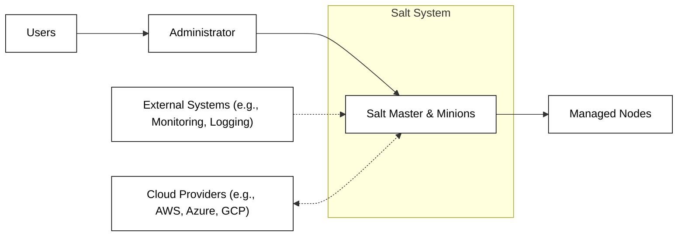
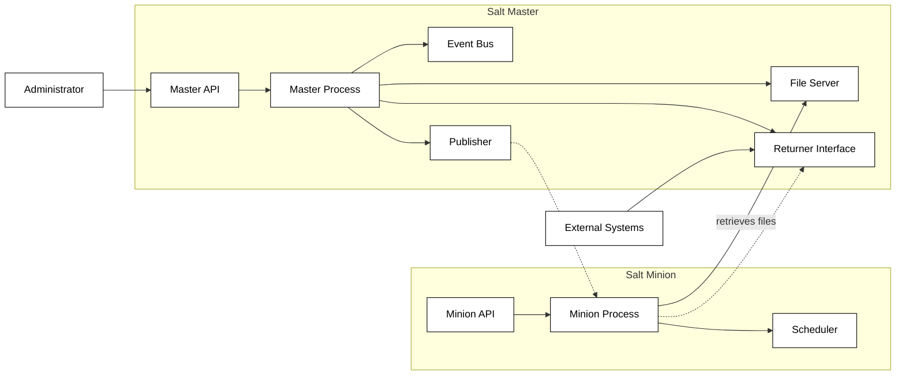
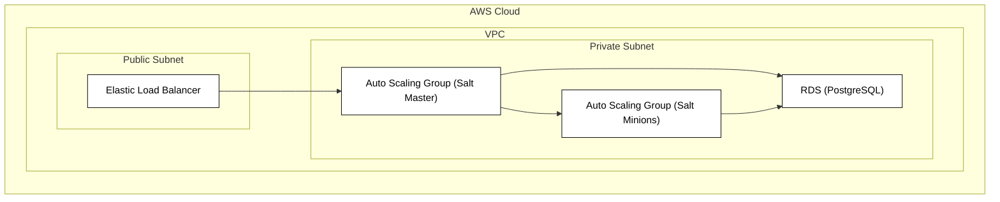
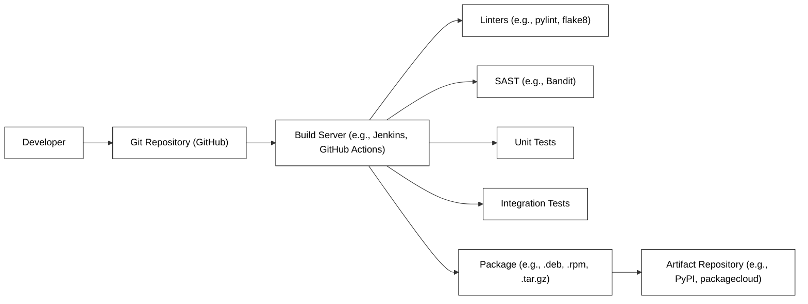

Okay, let's create a design document for the Salt Project (SaltStack Salt) based on the provided GitHub repository.

# BUSINESS POSTURE

Salt is a mature, widely-used open-source project.  It's used by organizations of all sizes, from small startups to large enterprises.  The primary business goals are:

*   Provide a robust, scalable, and fast remote execution and configuration management system.
*   Maintain a vibrant and active open-source community.
*   Offer commercial support and enterprise features through a related commercial entity (likely SaltStack, Inc., though the relationship has evolved).
*   Ensure the software is reliable and secure, given its critical role in managing infrastructure.
*   Adapt to evolving infrastructure needs (e.g., cloud, containers, serverless).

Key business priorities:

*   Maintainability:  The codebase must be maintainable and extensible to allow for continued development and community contributions.
*   Performance:  Salt must be fast and efficient, as it often manages large numbers of systems.
*   Scalability:  The architecture must scale to handle very large deployments.
*   Security:  Given that Salt has privileged access to managed systems, security is paramount.  A vulnerability in Salt could have widespread consequences.
*   Usability:  The system should be relatively easy to use and configure, despite its power and flexibility.
*   Community:  Foster a healthy and active open-source community.

Most important business risks:

*   A major security vulnerability in Salt could severely damage the reputation of the project and the trust of its users. This is the highest risk.
*   Loss of community engagement could lead to stagnation and decline of the project.
*   Inability to adapt to new technologies and infrastructure paradigms could make Salt irrelevant.
*   Performance or scalability bottlenecks could limit its usefulness in large deployments.
*   Legal or licensing issues could arise, particularly around the interaction between the open-source project and any commercial offerings.

# SECURITY POSTURE

Existing security controls (based on reviewing the GitHub repository and general knowledge of Salt):

*   security control: Cryptographic Communication: Salt uses ZeroMQ for communication, which can be configured to use TLS for encryption.  This protects data in transit between the Salt Master and Minions. (Documentation and code related to ZeroMQ and TLS configuration).
*   security control: Authentication: Salt uses a public/private key system for authentication between the Master and Minions.  Minions must be authorized by the Master before they can receive commands. (Documentation and code related to key management).
*   security control: Access Control: Salt provides mechanisms for restricting which commands can be executed by which Minions, using the `client_acl` configuration. (Documentation related to `client_acl`).
*   security control: Input Validation: Salt has some input validation mechanisms to prevent malicious commands from being executed.  However, the nature of remote execution means that careful consideration must be given to what commands are allowed. (Code related to command parsing and execution).
*   security control: Regular Security Audits:  While not explicitly stated in the repository, it's highly likely that Salt undergoes periodic security audits, given its critical role. (External documentation or announcements, if available).
*   security control: Security Advisories: Salt has a process for publishing security advisories and releasing patches for vulnerabilities. (Salt's website or security documentation).
*   security control: Use of secure coding practices: The project appears to follow some secure coding practices, such as avoiding known dangerous functions. (Code review).
*   security control: Dependency Management: Salt manages its dependencies, aiming to use secure and up-to-date versions. (Dependency files like `requirements.txt`).

Accepted risks:

*   accepted risk: Complexity: Salt is a complex system, and complex systems are inherently more difficult to secure.  The sheer size of the codebase increases the likelihood of undiscovered vulnerabilities.
*   accepted risk: User Misconfiguration: Salt is highly configurable, and incorrect configuration can lead to security vulnerabilities.  For example, overly permissive `client_acl` settings could allow unauthorized command execution.
*   accepted risk: Reliance on External Libraries: Salt relies on numerous external libraries (e.g., ZeroMQ, cryptography libraries).  Vulnerabilities in these libraries could impact Salt's security.
*   accepted risk: Execution of Arbitrary Commands: The fundamental nature of Salt is to execute commands on remote systems.  This inherently carries risk, even with access controls in place.

Recommended security controls (high priority):

*   Implement a robust Software Bill of Materials (SBOM) generation process to track all dependencies and their versions. This is crucial for supply chain security.
*   Integrate Static Application Security Testing (SAST) tools into the build pipeline to automatically scan for potential vulnerabilities.
*   Integrate Dynamic Application Security Testing (DAST) tools, particularly focusing on the API and communication interfaces.
*   Conduct regular penetration testing to identify vulnerabilities that might be missed by automated tools.
*   Implement a more granular permission system, going beyond just command-level restrictions. Consider role-based access control (RBAC) or attribute-based access control (ABAC).
*   Provide more built-in security hardening features and defaults.
*   Enhance input validation and sanitization throughout the codebase.

Security Requirements:

*   Authentication:
    *   All communication between Salt Master and Minions must be mutually authenticated.
    *   Strong, cryptographically secure authentication mechanisms must be used (e.g., public/private keys).
    *   Key management must be secure and well-documented.
    *   Support for multi-factor authentication (MFA) for user access to the Salt Master would be a valuable addition.

*   Authorization:
    *   A fine-grained authorization system must control which Minions can execute which commands.
    *   The principle of least privilege should be enforced.
    *   Authorization rules should be easy to configure and audit.

*   Input Validation:
    *   All input received from Minions, users, and external sources must be strictly validated.
    *   Input validation should be based on a whitelist approach (i.e., only allow known-good input).
    *   Input validation should occur as early as possible in the processing pipeline.

*   Cryptography:
    *   All sensitive data in transit must be encrypted using strong, industry-standard cryptographic algorithms (e.g., TLS 1.3 or higher).
    *   All sensitive data at rest (e.g., configuration files, stored credentials) should be encrypted.
    *   Cryptographic keys must be managed securely, following best practices for key generation, storage, and rotation.
    *   Use FIPS-validated cryptographic modules where required.

# DESIGN

## C4 CONTEXT

Element Descriptions:

*   1.  Name: Administrator
    *   Type: Person
    *   Description: A person who manages and configures the Salt system.
    *   Responsibilities: Configures Salt Master, manages Minions, defines states, executes commands.
    *   Security controls: Strong password policies, MFA (recommended), access control restrictions on the Salt Master.

*   2.  Name: Users
    *   Type: Person
    *   Description: Users who interact with the administrator to manage infrastructure.
    *   Responsibilities: Use infrastructure, request changes.
    *   Security controls: Access control restrictions.

*   3.  Name: Salt Master & Minions
    *   Type: Software System
    *   Description: The core Salt system, consisting of a central Master server and multiple Minion agents running on managed nodes.
    *   Responsibilities: Remote execution, configuration management, event handling.
    *   Security controls: Cryptographic communication, authentication, access control, input validation.

*   4.  Name: External Systems (e.g., Monitoring, Logging)
    *   Type: Software System
    *   Description: Systems that interact with Salt for monitoring, logging, or other purposes.
    *   Responsibilities: Collect data from Salt, provide external services.
    *   Security controls: Secure communication channels, authentication, authorization.

*   5.  Name: Cloud Providers (e.g., AWS, Azure, GCP)
    *   Type: Software System
    *   Description: Cloud platforms where Salt may be used to manage infrastructure.
    *   Responsibilities: Provide infrastructure resources.
    *   Security controls: API authentication, network security controls.

*   6.  Name: Managed Nodes
    *   Type: Software System
    *   Description: The servers, virtual machines, or containers that are managed by Salt.
    *   Responsibilities: Run the Salt Minion, execute commands, apply configurations.
    *   Security controls: Operating system hardening, security updates, application-level security controls.

## C4 CONTAINER

Element Descriptions:

*   1.  Name: Master API
    *   Type: API
    *   Description: The API exposed by the Salt Master for external interaction.
    *   Responsibilities: Handle API requests, authenticate users, forward requests to the Master Process.
    *   Security controls: TLS encryption, authentication, authorization, input validation, rate limiting.

*   2.  Name: Event Bus
    *   Type: Message Bus
    *   Description: The internal message bus used for communication between Salt components.
    *   Responsibilities: Transport events and messages between different parts of the Salt system.
    *   Security controls: Access control, potentially encryption (depending on the implementation).

*   3.  Name: File Server
    *   Type: File Server
    *   Description: Serves files (e.g., state files, pillar data) to Minions.
    *   Responsibilities: Store and serve files, handle file access requests.
    *   Security controls: Access control, authentication, potentially encryption (depending on the implementation).

*   4.  Name: Publisher
    *   Type: Publisher
    *   Description: Publishes commands and data to Minions.
    *   Responsibilities: Send messages to Minions via ZeroMQ.
    *   Security controls: Cryptographic communication (TLS), authentication.

*   5.  Name: Returner Interface
    *   Type: Interface
    *   Description: Interface for receiving data back from Minions.
    *   Responsibilities: Collect results from Minions, potentially store them in external systems.
    *   Security controls: Authentication, authorization.

*   6.  Name: Master Process
    *   Type: Process
    *   Description: The main process of the Salt Master.
    *   Responsibilities: Orchestrate all Master functionality.
    *   Security controls: Runs as a non-root user (recommended), resource limits.

*   7.  Name: Minion Process
    *   Type: Process
    *   Description: The main process of the Salt Minion.
    *   Responsibilities: Receive and execute commands, send results back to the Master.
    *   Security controls: Runs as a non-root user (recommended), resource limits.

*   8.  Name: Minion API
    *   Type: API
    *   Description: API exposed by the Salt Minion (less common, but possible).
    *   Responsibilities: Handle local API requests.
    *   Security controls: Authentication, authorization, input validation.

*   9.  Name: Scheduler
    *   Type: Scheduler
    *   Description: Schedules tasks on the Minion.
    *   Responsibilities: Execute scheduled jobs.
    *   Security controls: Access control, input validation.

*   10. Name: Administrator
    *   Type: Person
    *   Description: A person who manages and configures the Salt system.
    *   Responsibilities: Configures Salt Master, manages Minions, defines states, executes commands.
    *   Security controls: Strong password policies, MFA (recommended), access control restrictions on the Salt Master.

*   11. Name: External Systems
    *   Type: Software System
    *   Description: Systems that interact with Salt for monitoring, logging, or other purposes.
    *   Responsibilities: Collect data from Salt, provide external services.
    *   Security controls: Secure communication channels, authentication, authorization.

## DEPLOYMENT

Possible deployment solutions:

1.  Traditional on-premises deployment: Salt Master and Minions installed on physical or virtual servers within a private network.
2.  Cloud-based deployment: Salt Master and Minions deployed on virtual machines or containers within a cloud environment (e.g., AWS, Azure, GCP).
3.  Hybrid cloud deployment: A combination of on-premises and cloud-based deployments.
4.  Containerized deployment: Salt Master and Minions running as containers (e.g., Docker, Kubernetes).
5.  "Masterless" deployment: Minions configured to run without a central Master, using local state files and configuration.

Chosen deployment solution (for detailed description): Cloud-based deployment (AWS)

Element Descriptions:

*   1.  Name: Elastic Load Balancer (ELB)
    *   Type: Load Balancer
    *   Description: Distributes traffic to multiple Salt Master instances.
    *   Responsibilities: Load balancing, health checks.
    *   Security controls: TLS termination, security groups.

*   2.  Name: Auto Scaling Group (Salt Master)
    *   Type: Auto Scaling Group
    *   Description: Manages a group of Salt Master instances, automatically scaling up or down based on demand.
    *   Responsibilities: Instance management, scaling, health checks.
    *   Security controls: IAM roles, security groups, key pairs.

*   3.  Name: Auto Scaling Group (Salt Minions)
    *   Type: Auto Scaling Group
    *   Description: Manages a group of Salt Minion instances.
    *   Responsibilities: Instance management, scaling, health checks.
    *   Security controls: IAM roles, security groups, key pairs.

*   4.  Name: RDS (PostgreSQL)
    *   Type: Database
    *   Description: Used as a returner to store Minion data.
    *   Responsibilities: Data storage, retrieval.
    *   Security controls: Encryption at rest, encryption in transit, access control, security groups.

## BUILD

Salt's build process involves several steps, from compiling code to creating packages.  It uses a combination of Python's setuptools, Makefiles, and potentially other tools.

Security Controls in Build Process:

*   Code Review: All code changes should be reviewed by at least one other developer before being merged.
*   Linters: Linters (e.g., pylint, flake8) are used to enforce coding style and identify potential errors.
*   SAST: Static Application Security Testing (SAST) tools (e.g., Bandit) are used to scan the codebase for potential security vulnerabilities.
*   Unit Tests: Unit tests are used to verify the functionality of individual components.
*   Integration Tests: Integration tests are used to verify the interaction between different components.
*   Dependency Management: Dependencies are managed using tools like `requirements.txt` and are regularly reviewed for security updates.
*   Signed Packages: Packages should be digitally signed to ensure their integrity and authenticity.
*   Secure Build Environment: The build server should be secured and hardened to prevent unauthorized access.
*   SBOM Generation: A Software Bill of Materials (SBOM) should be generated during the build process.

# RISK ASSESSMENT

*   Critical Business Processes:
    *   Remote execution of commands on managed systems.
    *   Configuration management of managed systems.
    *   Event-driven automation.
    *   Data collection and reporting.

*   Data to Protect:
    *   Salt Master configuration files (including keys and secrets).
    *   Minion configuration files (including keys).
    *   State files and pillar data (may contain sensitive information).
    *   Data returned from Minions (may contain sensitive information).
    *   User credentials (if stored or used by Salt).

*   Data Sensitivity:
    *   Salt Master keys: Extremely high sensitivity (compromise allows full control of managed systems).
    *   Minion keys: High sensitivity (compromise allows impersonation of a Minion).
    *   State files and pillar data: Variable sensitivity (depending on the content).
    *   Returned data: Variable sensitivity (depending on the data collected).
    *   User credentials: High sensitivity.

# QUESTIONS & ASSUMPTIONS

*   Questions:
    *   What specific compliance requirements (e.g., PCI DSS, HIPAA, GDPR) must Salt deployments adhere to?
    *   What is the expected scale of Salt deployments (number of Minions)?
    *   What are the specific threat models that are most concerning to users of Salt?
    *   Are there any existing security incident response plans that should be considered?
    *   What level of support is provided for different operating systems and platforms?
    *   What is the process for reporting and handling security vulnerabilities?
    *   What is the long-term roadmap for Salt's security features?
    *   What external integrations are commonly used with Salt (e.g., monitoring, logging, SIEM)?
    *   What is the typical network topology for Salt deployments (e.g., firewalls, network segmentation)?
    *   How are secrets (e.g., API keys, passwords) managed within Salt deployments?

*   Assumptions:
    *   The Salt Master is a critical security boundary and must be protected accordingly.
    *   Minions are running in potentially less trusted environments.
    *   Users of Salt have a basic understanding of security best practices.
    *   The network between the Salt Master and Minions may not be fully trusted.
    *   Regular security updates will be applied to Salt and its dependencies.
    *   The primary use case is infrastructure management, not general-purpose application deployment.
    *   The organization deploying Salt has some level of security expertise.
    *   The build process is automated and reproducible.
    *   There is a mechanism for distributing updates to Salt Master and Minions.
    *   The Salt community is active and responsive to security concerns.