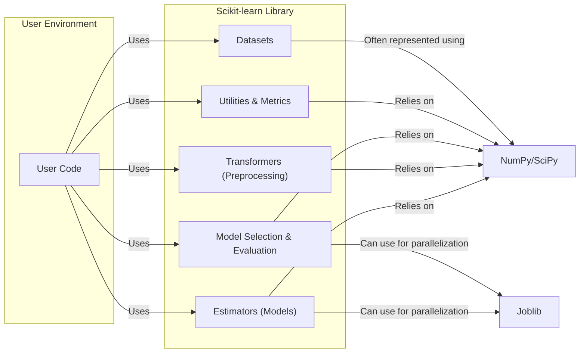
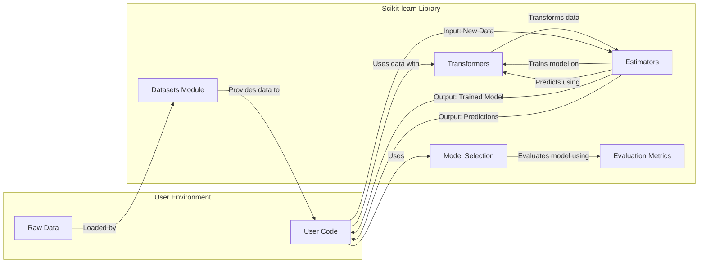

# Project Design Document: Scikit-learn Library

**Version:** 1.1
**Date:** October 26, 2023
**Author:** AI Software Architect

## 1. Introduction

This document provides a high-level architectural design of the scikit-learn project, an open-source machine learning library for Python. This document aims to provide a clear understanding of the library's structure, key components, and data flow, which will serve as the foundation for future threat modeling activities. This revision incorporates feedback to enhance clarity and adherence to formatting guidelines.

## 2. Goals and Objectives

The primary goals of scikit-learn are to:

*   Provide simple and efficient tools for data mining and data analysis.
*   Be accessible to everyone and reusable in various contexts.
*   Build upon NumPy, SciPy, and matplotlib, leveraging the existing scientific Python ecosystem.
*   Offer a wide range of supervised and unsupervised learning algorithms.
*   Maintain a high level of code quality and documentation.

For the purpose of threat modeling, the objective of this document is to clearly outline the library's architecture and potential interaction points, highlighting areas that might be susceptible to security vulnerabilities.

## 3. Scope

This design document focuses on the core architecture and components of the scikit-learn library itself. It covers:

*   Key modules and their functionalities.
*   The typical data flow within the library.
*   Interactions with external libraries and the user environment.

This document does not cover:

*   Specific machine learning algorithms in detail.
*   The internal implementation details of individual classes and functions.
*   The scikit-learn website or its infrastructure.
*   User-developed applications that utilize scikit-learn.

## 4. High-Level Architecture

The scikit-learn library can be broadly represented by the following high-level components and their interactions:

**Explanation:**

*   **User Environment:** Represents the environment where a user writes Python code to interact with scikit-learn.
*   **Scikit-learn Library:** The core of the project, containing various modules for machine learning tasks.
*   **Estimators (Models):** Represent machine learning algorithms for tasks like classification, regression, and clustering (e.g., `LinearRegression`, `SVC`, `KMeans`).
*   **Transformers (Preprocessing):** Modules for data transformation and feature engineering (e.g., `StandardScaler`, `PCA`, `OneHotEncoder`).
*   **Datasets:** Utilities for loading and generating datasets, including built-in datasets and functions for fetching real-world datasets.
*   **Model Selection & Evaluation:** Tools for splitting data, tuning hyperparameters, and evaluating model performance (e.g., `train_test_split`, `GridSearchCV`, `cross_val_score`).
*   **Utilities & Metrics:** Helper functions and metrics for various tasks, such as calculating accuracy, precision, recall, etc.
*   **NumPy/SciPy:** Fundamental scientific computing libraries that scikit-learn heavily relies on for numerical operations and data structures.
*   **Joblib:** A library used by scikit-learn for efficient parallel processing, especially for model training and evaluation.

## 5. Key Components and Interactions

Here's a more detailed breakdown of the key components:

*   **Estimators:**
    *   Core objects representing machine learning models.
    *   Implement methods like `fit(X, y)` for training and `predict(X)` for making predictions.
    *   Can be susceptible to adversarial attacks if input data is manipulated.
    *   Model persistence (saving and loading) can introduce vulnerabilities if not handled securely.
*   **Transformers:**
    *   Objects used to transform data.
    *   Implement methods like `fit(X)` to learn transformation parameters and `transform(X)` to apply the transformation.
    *   Incorrectly configured transformers can lead to data leakage or manipulation.
    *   Similar to estimators, persistence can be a vulnerability point.
*   **Datasets:**
    *   Provide access to sample datasets for learning and experimentation.
    *   Built-in datasets are generally safe, but fetching external datasets could introduce risks if the source is compromised.
    *   User-provided datasets are a significant potential attack vector (data poisoning).
*   **Model Selection and Evaluation:**
    *   Tools for optimizing and assessing model performance.
    *   Hyperparameter tuning can be computationally intensive and might be a target for denial-of-service attacks.
    *   Evaluation metrics can be manipulated to present a false sense of security.
*   **Utilities and Metrics:**
    *   Offer various helper functions.
    *   Metrics calculations are generally safe but could be misused if the underlying data is compromised.
*   **NumPy/SciPy:**
    *   Provide the fundamental numerical infrastructure.
    *   Vulnerabilities in these libraries could directly impact scikit-learn.
    *   Scikit-learn relies on the integrity and security of these dependencies.
*   **Joblib:**
    *   Enables parallel processing.
    *   Improper use of joblib could lead to resource exhaustion or other security issues.
    *   Potential vulnerabilities in joblib itself could affect scikit-learn.

**Typical Data Flow:**

**Explanation of Data Flow:**

*   **Raw Data:** The initial data source, which can be files, databases, or other sources.
*   **Datasets Module:** Scikit-learn's module for loading and managing datasets.
*   **Transformers:** Used to preprocess and transform the raw data (e.g., scaling, encoding).
*   **Estimators:** Machine learning models that are trained on the transformed data.
*   **Model Selection:** Techniques used to choose the best model and hyperparameters.
*   **Evaluation Metrics:** Used to assess the performance of the trained model.
*   **User Code:** The user's Python script that orchestrates the data loading, preprocessing, model training, and prediction.

## 6. Security Considerations (Preliminary)

Based on the architecture, potential security considerations include:

*   **Dependency Vulnerabilities:** Scikit-learn relies on numerous external libraries (NumPy, SciPy, Joblib, etc.). Vulnerabilities in these dependencies could directly impact scikit-learn.
*   **Data Poisoning:** Maliciously crafted training data can lead to compromised models that make incorrect predictions or exhibit biased behavior.
*   **Model Inversion/Extraction:** In some cases, it might be possible to infer sensitive information about the training data from a trained model.
*   **Adversarial Attacks:** Carefully crafted input data can fool trained models into making incorrect predictions.
*   **Model Persistence Vulnerabilities:** Saving and loading models (using `pickle` or similar methods) can introduce vulnerabilities if the saved model is tampered with.
*   **Code Injection:** If user-provided code or data is not properly sanitized, it could lead to code injection vulnerabilities.
*   **Denial of Service:** Resource-intensive operations (e.g., training complex models or performing extensive hyperparameter tuning) could be exploited for denial-of-service attacks.
*   **Supply Chain Attacks:** Compromise of the scikit-learn source code or its distribution channels could introduce malicious code.

## 7. Deployment Considerations

Scikit-learn is typically deployed as a library within a larger application or script. The security of the deployment environment is crucial:

*   **Secure Environment:** Ensure the environment where scikit-learn is used is secure and protected from unauthorized access.
*   **Input Validation:** Thoroughly validate all input data before feeding it into scikit-learn models or transformers.
*   **Model Security:** Implement measures to protect trained models from unauthorized access or modification.
*   **Regular Updates:** Keep scikit-learn and its dependencies updated to patch known vulnerabilities.

## 8. Technologies Used

*   **Programming Language:** Python
*   **Core Libraries:** NumPy, SciPy
*   **Parallel Processing:** Joblib
*   **Visualization (Optional):** Matplotlib, Seaborn
*   **Build System:** Setuptools, scikit-build
*   **Testing Framework:** pytest

This document provides a foundational understanding of the scikit-learn architecture for threat modeling. Further analysis will involve examining specific components and their interactions in more detail to identify potential vulnerabilities and develop mitigation strategies.
