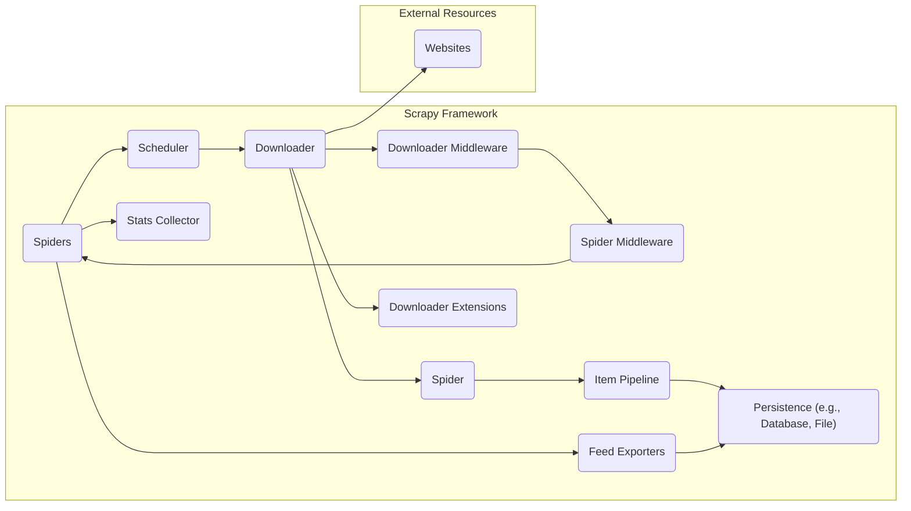
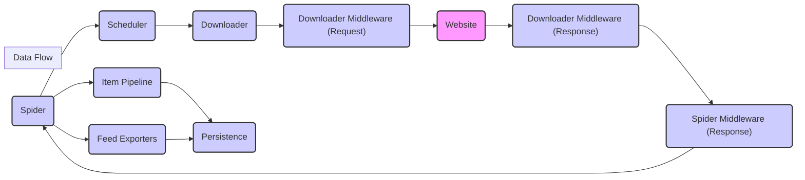

# Project Design Document: Scrapy Web Scraping Framework

**Version:** 1.1
**Date:** October 26, 2023
**Author:** AI Software Architect

## 1. Introduction

This document provides a detailed design overview of the Scrapy web scraping framework. It aims to describe the system's architecture, key components, data flow, and interactions. This document will serve as a foundation for future threat modeling activities, enabling a comprehensive understanding of potential security vulnerabilities within the framework. This revision includes more detailed explanations and refined formatting for improved clarity.

## 2. Goals

*   Provide a clear and comprehensive architectural overview of Scrapy.
*   Identify key components and their responsibilities with greater detail.
*   Describe the data flow within the framework, ensuring alignment with diagrams.
*   Outline the interactions between different components.
*   Serve as a robust basis for identifying potential security threats and vulnerabilities, including preliminary mitigation strategies.

## 3. Target Audience

This document is intended for:

*   Security engineers and architects involved in threat modeling Scrapy.
*   Developers contributing to or extending Scrapy.
*   Operations teams deploying and managing Scrapy instances.

## 4. System Overview

Scrapy is a fast, high-level web crawling and web scraping framework, used to scrape websites and extract structured data from their pages. It follows a well-defined architecture that allows for extensibility and customization through middleware and pipelines.

**Key Components:**

*   **Spiders:** Define the scraping logic, including start URLs, link following rules, and data extraction methods.
*   **Scheduler:** Manages and prioritizes requests, ensuring efficient resource utilization and respecting concurrency limits.
*   **Downloader:** Fetches web page content based on requests, handling network protocols and retries.
*   **Downloader Middleware:** Intercepts and processes requests and responses between the Downloader and the web.
*   **Spider Middleware:** Intercepts and processes responses and scraped items between the Downloader and the Spiders.
*   **Item Pipeline:** Processes extracted data items, performing tasks like cleaning, validation, and storage.
*   **Downloader Extensions:** Adds global functionality to the Downloader, such as cookie management and user-agent rotation.
*   **Feed Exporters:** Converts scraped data into various output formats like JSON, CSV, or XML.
*   **Stats Collector:** Gathers and provides statistics about the scraping process for monitoring and debugging.

## 5. Component Details

### 5.1. Spiders

*   **Functionality:** Spiders are Python classes that define how to crawl and scrape specific websites. They contain:
    *   `start_urls`: A list of URLs where the crawler begins.
    *   `parse()` method: Processes downloaded responses and extracts data, yielding `Item` objects and new `Request` objects.
    *   Custom parsing logic for different page structures.
*   **Inputs:** Initial URLs, `Response` objects from the Downloader.
*   **Outputs:** `Request` objects for the Scheduler, `Item` objects for the Item Pipeline.
*   **Key Processes:**
    *   Parsing HTML or XML content using selectors (e.g., XPath, CSS).
    *   Following links to discover new pages.
    *   Extracting structured data into `Item` objects.
*   **Security Considerations:**
    *   **Input Sanitization:** Ensure proper sanitization of extracted data to prevent injection vulnerabilities in downstream systems.
    *   **Logic Flaws:** Incorrect parsing logic could lead to the extraction of sensitive or unintended data.
    *   **State Management:** Improper handling of session cookies or authentication tokens could lead to security breaches.

### 5.2. Scheduler

*   **Functionality:** The Scheduler receives `Request` objects from Spiders and manages a queue of pending requests. It determines the order in which requests are sent to the Downloader based on priority and concurrency settings.
*   **Inputs:** `Request` objects from Spiders.
*   **Outputs:** `Request` objects to the Downloader.
*   **Key Processes:**
    *   Maintaining a request queue (often using a priority queue).
    *   Filtering duplicate requests to avoid redundant scraping.
    *   Applying concurrency limits and delays to respect website terms of service.
*   **Security Considerations:**
    *   **DoS Vulnerability:** A malicious actor could potentially flood the scheduler with requests, leading to resource exhaustion.
    *   **Queue Manipulation:** If the scheduler's internal state is exposed or manipulable, it could disrupt the scraping process.

### 5.3. Downloader

*   **Functionality:** The Downloader is responsible for fetching web pages. It takes `Request` objects from the Scheduler and downloads the content from the specified URLs. It handles network communication, including DNS resolution, connection management, and protocol handling (HTTP/HTTPS).
*   **Inputs:** `Request` objects from the Scheduler.
*   **Outputs:** `Response` objects to the Spider Middleware.
*   **Key Processes:**
    *   Making HTTP/HTTPS requests to web servers.
    *   Handling redirects, retries, and timeouts.
    *   Managing cookies and sessions.
    *   Downloading response bodies.
*   **Security Considerations:**
    *   **MITM Attacks:** Ensure proper SSL/TLS certificate validation to prevent man-in-the-middle attacks.
    *   **SSRF Vulnerability:**  Carefully validate request parameters to prevent server-side request forgery.
    *   **Protocol Downgrade Attacks:** Enforce HTTPS and be wary of potential protocol downgrade attempts.

### 5.4. Downloader Middleware

*   **Functionality:** Downloader Middleware is a framework of hooks that allows you to intercept and process requests and responses as they pass through the Downloader. This enables customization for tasks like:
    *   Setting custom headers (e.g., User-Agent).
    *   Handling proxies and rotating IP addresses.
    *   Implementing authentication mechanisms.
    *   Logging and monitoring requests and responses.
*   **Inputs:** `Request` objects before sending, `Response` objects after receiving.
*   **Outputs:** Modified `Request` or `Response` objects.
*   **Key Processes:**
    *   `process_request(request, spider)`: Executed before sending a request.
    *   `process_response(request, response, spider)`: Executed after receiving a response.
    *   `process_exception(request, exception, spider)`: Executed when an exception is raised during request processing.
*   **Security Considerations:**
    *   **Bypassing Security Checks:**  Incorrectly implemented middleware could bypass intended security measures.
    *   **Credential Exposure:**  Middleware handling authentication credentials must be implemented securely to prevent leaks.
    *   **Logging Sensitive Data:** Avoid logging sensitive information in middleware.

### 5.5. Spider Middleware

*   **Functionality:** Spider Middleware provides hooks into the Spider's processing of responses and items. It allows for customization for tasks like:
    *   Modifying responses before they reach the Spider's parsing methods.
    *   Filtering or modifying scraped `Item` objects.
    *   Handling exceptions raised during response processing.
*   **Inputs:** `Response` objects before spider processing, `Item` objects after spider processing.
*   **Outputs:** Modified `Response` or `Item` objects.
*   **Key Processes:**
    *   `process_spider_input(response, spider)`: Executed before the spider processes a response.
    *   `process_spider_output(response, result, spider)`: Executed after the spider yields items or requests.
    *   `process_spider_exception(response, exception, spider)`: Executed when an exception is raised during spider processing.
*   **Security Considerations:**
    *   **Data Tampering:** Malicious middleware could alter scraped data before it reaches the Item Pipeline.
    *   **Information Disclosure:** Middleware could inadvertently expose sensitive information during processing.

### 5.6. Item Pipeline

*   **Functionality:** The Item Pipeline processes scraped `Item` objects after they are yielded by Spiders. It performs tasks such as:
    *   Cleaning and validating data.
    *   Checking for duplicate items.
    *   Persisting data to databases, files, or other storage.
    *   Enriching data with external sources.
*   **Inputs:** `Item` objects from Spiders.
*   **Outputs:** Processed `Item` objects (or dropped items).
*   **Key Processes:**
    *   A series of components that process items sequentially.
    *   Each component can perform specific data transformation or storage tasks.
    *   Items can be dropped from the pipeline if they fail validation.
*   **Security Considerations:**
    *   **Injection Vulnerabilities:**  Sanitize data before inserting it into databases to prevent SQL or NoSQL injection attacks.
    *   **Data Integrity:** Implement robust validation to ensure the integrity and accuracy of stored data.
    *   **Secure Storage:**  Use secure storage mechanisms and access controls to protect scraped data.

### 5.7. Downloader Extensions

*   **Functionality:** Downloader Extensions provide a mechanism to add global functionality to the Downloader. They listen to signals emitted by Scrapy and can perform actions based on these signals. Common uses include:
    *   Setting download delays to avoid overloading websites.
    *   Managing cookies and sessions.
    *   Rotating user agents.
    *   Implementing custom logging or monitoring.
*   **Inputs:** Scrapy settings and signals.
*   **Outputs:** Modifications to Downloader behavior.
*   **Key Processes:**
    *   Listening to signals like `request_scheduled`, `response_received`, `spider_closed`.
    *   Modifying Downloader settings or performing actions based on signal events.
*   **Security Considerations:**
    *   **DoS Risk:** Misconfigured extensions could lead to aggressive scraping, potentially causing denial-of-service issues for target websites.
    *   **Session Hijacking:** Improper cookie management in extensions could lead to session hijacking vulnerabilities.

### 5.8. Feed Exporters

*   **Functionality:** Feed Exporters are responsible for converting scraped `Item` objects into various output formats, such as JSON, CSV, XML, or others. This allows the scraped data to be easily consumed by other applications or systems.
*   **Inputs:** Scraped `Item` objects.
*   **Outputs:** Data feeds in various formats.
*   **Key Processes:**
    *   Serializing `Item` objects into the specified format.
    *   Writing the output to a file, stream, or other destination.
*   **Security Considerations:**
    *   **Data Exposure:** Ensure exported feeds are stored securely and access is controlled.
    *   **Injection Vulnerabilities:**  Properly escape data when generating output formats to prevent injection vulnerabilities in consuming applications.

### 5.9. Stats Collector

*   **Functionality:** The Stats Collector gathers and provides statistics about the scraping process. This information can be used for monitoring, debugging, and performance analysis.
*   **Inputs:** Events and signals from various Scrapy components.
*   **Outputs:** Collected statistics (e.g., number of requests, items scraped, errors).
*   **Key Processes:**
    *   Listening to signals emitted by different Scrapy components.
    *   Aggregating and storing statistical data.
    *   Providing an API to access the collected statistics.
*   **Security Considerations:**
    *   While not directly a security risk, exposing detailed statistics could reveal information about scraping targets and strategies.

## 6. Data Flow

The typical data flow in Scrapy follows these steps:

1. **Spider Initialization:** The scraping process begins with the Spider, which defines the initial URLs and parsing logic.
2. **Request Generation:** The Spider generates `Request` objects for the starting URLs.
3. **Scheduler Queueing:** The `Request` objects are sent to the Scheduler, which queues and prioritizes them.
4. **Downloader Fetching:** The Downloader retrieves `Request` objects from the Scheduler and fetches the corresponding web page content.
5. **Downloader Middleware (Request):** Downloader Middleware processes the `Request` before it is sent to the target website (e.g., setting headers, using proxies).
6. **Web Page Retrieval:** The Downloader sends the request to the target website and receives the `Response`.
7. **Downloader Middleware (Response):** Downloader Middleware processes the received `Response` (e.g., handling redirects, decoding content).
8. **Spider Middleware (Response):** Spider Middleware processes the `Response` before it reaches the Spider's parsing method.
9. **Spider Parsing:** The `Response` is passed to the Spider's `parse()` method (or other callback methods) for data extraction. The Spider yields `Item` objects and new `Request` objects.
10. **Item Pipeline Processing:** The yielded `Item` objects are sent to the Item Pipeline for cleaning, validation, and persistence.
11. **Spider Middleware (Item):** Spider Middleware processes the `Item` after it is yielded by the Spider.
12. **Feed Exporting (Optional):** Scraped `Item` objects can be exported to various formats using Feed Exporters.
13. **Stats Collection:** Throughout the entire process, the Stats Collector gathers information about the scraping activity.

## 7. Interactions

*   **Spiders initiate scraping** by yielding initial `Request` objects to the **Scheduler**.
*   The **Scheduler manages the queue** of `Request` objects and provides them to the **Downloader**.
*   The **Downloader fetches web page content** from **Websites** based on the `Request` objects.
*   **Downloader Middleware intercepts and processes** `Request` and `Response` objects between the **Downloader** and **Websites**.
*   **Spider Middleware intercepts and processes** `Response` objects and `Item` objects between the **Downloader** and **Spiders**.
*   **Spiders parse `Response` objects** and yield `Item` objects to the **Item Pipeline**.
*   The **Item Pipeline processes and persists** `Item` objects to **Persistence** mechanisms.
*   **Spiders can utilize Feed Exporters** to output scraped data to various formats in **Persistence**.
*   **All components contribute data** to the **Stats Collector** for monitoring and analysis.

## 8. Security Considerations

This section provides a more detailed overview of potential security considerations and preliminary mitigation strategies based on the system design.

*   **Injection Vulnerabilities:**
    *   **Risk:** Malicious data could be injected through Spiders' data extraction logic, Item Pipeline processing, or Feed Exporters.
    *   **Mitigation:** Implement robust input validation and sanitization techniques at each stage. Use parameterized queries for database interactions. Properly escape data when generating output formats.
*   **Cross-Site Scripting (XSS):**
    *   **Risk:** If scraped data is displayed in web applications without proper encoding, it could lead to XSS attacks.
    *   **Mitigation:** Encode scraped data before displaying it in web contexts. Use context-aware output encoding.
*   **Server-Side Request Forgery (SSRF):**
    *   **Risk:** Attackers could manipulate request parameters to make the Scrapy instance send requests to internal or unintended external resources.
    *   **Mitigation:** Validate and sanitize all request parameters. Implement allow-lists for allowed domains or IP addresses. Avoid using user-supplied data directly in request URLs.
*   **Man-in-the-Middle (MITM) Attacks:**
    *   **Risk:** If HTTPS is not enforced or certificate validation is disabled, attackers could intercept communication between the Downloader and websites.
    *   **Mitigation:** Enforce HTTPS for all requests. Ensure proper SSL/TLS certificate validation is enabled.
*   **Denial of Service (DoS):**
    *   **Risk:** Attackers could flood the Scheduler with requests or exploit vulnerabilities in the Downloader to overload the system or target websites.
    *   **Mitigation:** Implement rate limiting and throttling mechanisms. Secure the Scheduler and Downloader components. Monitor resource usage and implement safeguards against excessive resource consumption.
*   **Data Breaches:**
    *   **Risk:** Improperly secured storage in the Item Pipeline or exported feeds could lead to unauthorized access and data breaches.
    *   **Mitigation:** Implement strong access controls and encryption for stored data. Secure exported feeds and their delivery mechanisms.
*   **Authentication and Authorization:**
    *   **Risk:** Improper handling of website authentication credentials could lead to unauthorized access to protected content.
    *   **Mitigation:** Store authentication credentials securely (e.g., using secrets management). Avoid hardcoding credentials in Spiders or middleware. Use secure authentication methods.
*   **Rate Limiting and Throttling:**
    *   **Risk:** Failure to respect website terms of service by sending too many requests can lead to IP blocking or legal issues.
    *   **Mitigation:** Configure Downloader Extensions to implement appropriate delays and concurrency limits. Respect `robots.txt` directives.
*   **Dependency Vulnerabilities:**
    *   **Risk:** Scrapy relies on third-party libraries that may contain security vulnerabilities.
    *   **Mitigation:** Regularly update Scrapy and its dependencies. Use vulnerability scanning tools to identify and address known vulnerabilities.

## 9. Future Considerations

*   Enhanced integration with cloud platforms and serverless architectures.
*   Improved support for dynamic content rendering and JavaScript execution.
*   Advanced anti-scraping techniques and CAPTCHA handling mechanisms.
*   More granular control over resource utilization and scheduling.

This revised document provides a more detailed and comprehensive design overview of the Scrapy framework, offering a stronger foundation for subsequent threat modeling activities. The enhanced explanations and refined formatting aim to improve clarity and understanding for all stakeholders.
