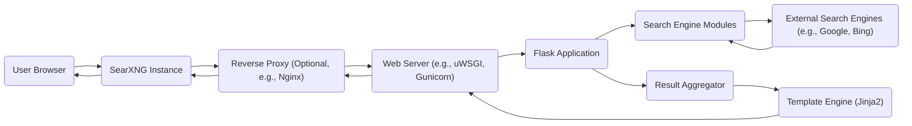
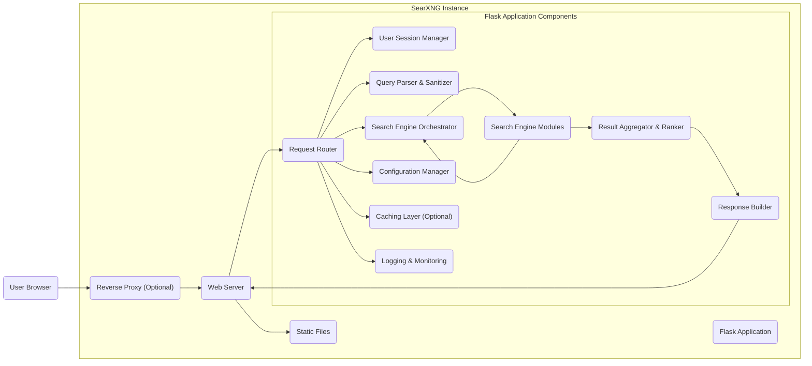

# Project Design Document: SearXNG Metasearch Engine

**Version:** 1.1
**Date:** October 26, 2023
**Author:** AI Software Architect

## 1. Introduction

This document provides an enhanced and more detailed design overview of the SearXNG metasearch engine project. It elaborates on the system's architecture, key components, data flow, and crucial considerations for security and deployment. This refined document will serve as a robust foundation for subsequent threat modeling activities.

## 2. Goals and Objectives

The fundamental goals of SearXNG are:

*   **Unwavering Privacy:** To offer users a truly private search experience by ensuring no tracking of search queries or sharing of personal information with external entities.
*   **Comprehensive Aggregation:** To gather and present search results from a diverse range of search engines, providing users with a holistic view of available information.
*   **Extensive Customization:** To empower users with the ability to tailor their search experience, including the selection of preferred search engines, categories, and interface preferences.
*   **Transparent Open Source:** To maintain a publicly accessible and transparent codebase, fostering community contributions, peer review, and trust.
*   **Simplified Deployment:** To facilitate straightforward deployment and self-hosting options for users who prioritize complete control over their data and infrastructure.

## 3. System Architecture

SearXNG employs a client-server architecture, emphasizing secure backend processing and minimizing client-side tracking mechanisms.

### 3.1. High-Level Architecture

*   **User Browser:** The web browser application utilized by the user to interact with the SearXNG interface.
*   **SearXNG Instance:** The deployed and running instance of the SearXNG application.
*   **Reverse Proxy (Optional):** An intermediary server that sits in front of the web server, often used for SSL termination, load balancing, and security enhancements.
*   **Web Server:**  Manages incoming HTTP requests and forwards them to the underlying Flask application.
*   **Flask Application:** The core Python-based application logic that drives SearXNG's functionality.
*   **Search Engine Modules:**  Dedicated modules responsible for interacting with the specific APIs or scraping mechanisms of individual external search engines.
*   **External Search Engines:** Third-party search providers that SearXNG queries to gather search results.
*   **Result Aggregator:** The component that combines, deduplicates, and ranks the search results obtained from various external sources.
*   **Template Engine (Jinja2):**  Renders the dynamic HTML pages that are presented to the user in their browser.

### 3.2. Detailed Component Architecture

*   **Reverse Proxy (Optional):**
    *   **Functionality:** Acts as an intermediary for incoming requests, providing benefits like SSL termination, load balancing across multiple SearXNG instances, and enhanced security features (e.g., web application firewall).
    *   **Technology:**  Commonly Nginx or Apache HTTP Server.
    *   **Responsibilities:**  Handling initial client connections, SSL/TLS encryption and decryption, routing requests to backend servers, and potentially implementing security policies.
*   **Web Server:**
    *   **Functionality:** Receives HTTP requests from the reverse proxy (or directly from users if no reverse proxy is used), serves static files, and forwards dynamic requests to the Flask application.
    *   **Technology:** Typically uWSGI or Gunicorn in a production environment, potentially Waitress for simpler deployments.
    *   **Responsibilities:** Managing HTTP connections, handling static file requests, and interfacing with the application server.
*   **Flask Application:**
    *   **Functionality:** The core of SearXNG, responsible for handling user requests, orchestrating searches across external engines, aggregating and ranking results, and formatting the final response.
    *   **Technology:** Python, leveraging the Flask microframework.
    *   **Responsibilities:**  Request handling, business logic execution, and coordination between different internal components.
        *   **Request Router:**
            *   **Functionality:**  Directs incoming requests to the appropriate handlers within the Flask application based on the URL path.
            *   **Technology:** Flask's routing mechanisms.
            *   **Responsibilities:**  Mapping URLs to specific application functions.
        *   **User Session Manager:**
            *   **Functionality:**  Manages user sessions and preferences (if implemented), potentially using cookies or other session storage mechanisms. Crucially, SearXNG aims for minimal session management to enhance privacy.
            *   **Technology:** Flask's session management or custom implementations.
            *   **Responsibilities:**  Storing and retrieving user-specific data (with a focus on privacy).
        *   **Query Parser & Sanitizer:**
            *   **Functionality:**  Parses the user's search query, extracts keywords and parameters, and sanitizes the input to prevent injection attacks.
            *   **Technology:** Python string manipulation, regular expressions, and potentially dedicated sanitization libraries.
            *   **Responsibilities:**  Ensuring the search query is well-formed and safe for processing.
        *   **Search Engine Orchestrator:**
            *   **Functionality:**  Determines which search engine modules to utilize for a given query based on configuration, user preferences, and potentially query characteristics.
            *   **Technology:** Python logic and configuration data.
            *   **Responsibilities:**  Selecting the appropriate search engines for each request.
        *   **Search Engine Modules:**
            *   **Functionality:**  Individual, self-contained modules responsible for interacting with the specific APIs or scraping the result pages of individual external search engines.
            *   **Technology:** Python libraries for making HTTP requests (e.g., `requests`), and HTML parsing libraries (e.g., `Beautiful Soup`, `lxml`) for scraping.
            *   **Responsibilities:**  Formulating search queries for specific engines, sending requests, handling API responses or parsing HTML, and extracting relevant search results.
        *   **Result Aggregator & Ranker:**
            *   **Functionality:**  Combines the results received from different search engine modules, removes duplicate entries, and ranks the results based on a configurable algorithm.
            *   **Technology:** Python.
            *   **Responsibilities:**  Merging, deduplicating, and ordering search results to present a unified view.
        *   **Response Builder:**
            *   **Functionality:**  Constructs the HTTP response to be sent back to the user's browser, typically by rendering HTML templates with the aggregated search results.
            *   **Technology:** Jinja2 templating engine.
            *   **Responsibilities:**  Generating the final output presented to the user.
        *   **Configuration Manager:**
            *   **Functionality:**  Loads, manages, and provides access to the application's configuration settings, including API keys for external search engines, lists of enabled/disabled engines, and various operational parameters.
            *   **Technology:** Python, potentially using configuration files in formats like YAML, TOML, or JSON, or environment variables.
            *   **Responsibilities:**  Providing a centralized mechanism for managing application settings.
        *   **Caching Layer (Optional):**
            *   **Functionality:**  Temporarily stores frequently accessed data, such as search results or responses from external search engines, to improve performance and reduce load on external services.
            *   **Technology:** In-memory caching libraries (e.g., `cachetools`, `Flask-Caching`), or dedicated caching servers (e.g., Redis, Memcached).
            *   **Responsibilities:**  Storing and retrieving cached data based on defined policies.
        *   **Logging & Monitoring:**
            *   **Functionality:**  Records application events, errors, performance metrics, and potentially user activity (while adhering to privacy principles). Monitoring tools track the health and performance of the application.
            *   **Technology:** Python's `logging` module, and potentially external monitoring tools (e.g., Prometheus, Grafana).
            *   **Responsibilities:**  Recording application behavior for debugging, auditing, and performance analysis.
*   **Static Files:**
    *   **Functionality:**  Stores static assets such as CSS stylesheets, JavaScript files, images, and other media that are directly served to the user's browser.
    *   **Technology:** Standard web technologies.
    *   **Responsibilities:**  Providing the visual presentation and client-side interactivity of the application.

## 4. Data Flow

The typical sequence of events for a user search request is as follows:

1. **User Initiates Search:** The user enters a search query into the SearXNG interface in their web browser and submits the request.
2. **Request Arrival:** The request reaches the SearXNG instance, potentially hitting a reverse proxy first.
3. **Web Server Processing:** The web server receives the HTTP request and determines how to handle it. Static file requests are served directly. Dynamic requests are passed to the Flask application.
4. **Request Routing:** The Flask application's request router directs the request to the appropriate handler function.
5. **Session Management (Minimal):** The user session manager (if enabled) might retrieve or establish a session, though SearXNG minimizes this for privacy.
6. **Query Parsing and Sanitization:** The query parser extracts the search terms and parameters, and critically, sanitizes the input to prevent potential security vulnerabilities.
7. **Search Engine Selection:** The search engine orchestrator determines which external search engines to query based on the parsed query and configured preferences.
8. **External Engine Queries:** The selected search engine modules formulate and send specific search queries to the chosen external search engines.
9. **External Results Retrieval:** The search engine modules receive the search results from the external engines, either through APIs or by scraping HTML.
10. **Result Aggregation and Ranking:** The result aggregator combines the results from all queried engines, removes duplicates, and ranks them according to its configured algorithm.
11. **Response Construction:** The response builder uses the Jinja2 template engine to generate an HTML page containing the aggregated and ranked search results.
12. **Response Delivery:** The Flask application sends the generated HTML response back to the web server.
13. **Final Response to User:** The web server sends the HTML response back to the user's browser, which then renders the search results for the user to view.

## 5. Key Components and Technologies

*   **Core Programming Language:** Python 3
*   **Web Application Framework:** Flask
*   **HTML Templating Engine:** Jinja2
*   **HTTP Request Library:** `requests`
*   **HTML Parsing Libraries (for scraping):** `Beautiful Soup`, `lxml`
*   **Production Web Servers:** uWSGI, Gunicorn, Waitress
*   **Development Web Server:** Flask's built-in development server
*   **Optional Caching Libraries:** `cachetools`, `Flask-Caching`, Redis, Memcached
*   **Configuration Management Formats:** YAML, TOML, JSON, Environment Variables
*   **Logging Library:** Python's standard `logging` module

## 6. Security Considerations (Detailed)

This section expands on the initial security considerations, providing more specific examples and potential mitigation strategies. These points will be crucial for the subsequent threat modeling process.

*   **Robust Input Validation and Sanitization:**
    *   **Threat:** Cross-Site Scripting (XSS), SQL Injection (less likely in this architecture but still a concern if data is persisted), Command Injection.
    *   **Mitigation:**  Strictly validate all user inputs, including search queries, preferences, and any other data submitted by the user. Sanitize input using appropriate libraries to remove or escape potentially malicious code. Employ context-aware output encoding.
*   **Secure Output Encoding:**
    *   **Threat:** Cross-Site Scripting (XSS).
    *   **Mitigation:**  Ensure that all data rendered in HTML templates is properly encoded based on the context (HTML escaping, JavaScript escaping, URL encoding). Jinja2's autoescaping feature should be enabled and carefully reviewed.
*   **Enforce HTTPS for All Communication:**
    *   **Threat:** Man-in-the-Middle (MITM) attacks, eavesdropping on user searches.
    *   **Mitigation:**  Mandate HTTPS for all connections to the SearXNG instance. Obtain and configure valid SSL/TLS certificates. Enforce HTTPS through redirects and HTTP Strict Transport Security (HSTS) headers.
*   **Secure Configuration Management:**
    *   **Threat:** Exposure of sensitive information like API keys, leading to unauthorized access to external services.
    *   **Mitigation:** Store sensitive configuration data securely, preferably using environment variables or dedicated secrets management solutions. Avoid hardcoding secrets in the codebase. Implement proper access controls for configuration files.
*   **Vigilant Dependency Management:**
    *   **Threat:** Exploitation of known vulnerabilities in third-party libraries.
    *   **Mitigation:**  Regularly audit and update project dependencies to patch known security vulnerabilities. Use tools like `pip-audit` or `safety` to identify and address vulnerabilities.
*   **Implementation of Rate Limiting:**
    *   **Threat:** Denial-of-Service (DoS) attacks, abuse of search functionality.
    *   **Mitigation:**  Implement rate limiting on API endpoints and search functionalities to prevent excessive requests from a single source.
*   **Security of Search Engine Modules:**
    *   **Threat:**  Exposure of sensitive information during communication with external search engines, vulnerabilities in parsing external responses.
    *   **Mitigation:**  Ensure that communication with external search engines is done over HTTPS. Carefully handle and validate responses from external engines to prevent vulnerabilities related to parsing untrusted data. Avoid storing sensitive information from external APIs unnecessarily.
*   **Caching Security Considerations:**
    *   **Threat:**  Exposure of sensitive search results if caching is not properly secured.
    *   **Mitigation:**  If caching is used, ensure that sensitive data is not cached inappropriately. Implement appropriate access controls for the cache. Consider using encrypted caching mechanisms if necessary.
*   **Secure Logging Practices:**
    *   **Threat:**  Exposure of sensitive user data or system information in log files.
    *   **Mitigation:**  Avoid logging sensitive user data (like full search queries if possible). Secure log files with appropriate permissions to prevent unauthorized access. Implement log rotation and retention policies.
*   **Content Security Policy (CSP):**
    *   **Threat:** Cross-Site Scripting (XSS) attacks.
    *   **Mitigation:**  Implement a strong Content Security Policy to control the resources that the browser is allowed to load, significantly reducing the risk of XSS attacks.
*   **Referrer Policy:**
    *   **Threat:**  Unintentional leakage of information about the user's origin when clicking on search results.
    *   **Mitigation:**  Set an appropriate Referrer Policy to control the information sent in the `Referer` header when navigating to external links from the search results page.

## 7. Deployment Considerations

SearXNG offers flexibility in deployment options:

*   **Self-Hosted Deployment:**
    *   **Details:** Users can install and run SearXNG directly on their own servers, virtual machines, or even local machines. This provides maximum control over the environment and data.
    *   **Considerations:** Requires technical expertise for installation, configuration, and maintenance. Responsible for all aspects of security and infrastructure.
*   **Containerized Deployment (Docker):**
    *   **Details:**  Deploying SearXNG using Docker containers simplifies deployment, ensures consistency across different environments, and improves portability.
    *   **Considerations:** Requires familiarity with Docker. Still responsible for managing the underlying Docker host and container orchestration if used (e.g., Docker Compose, Kubernetes).
*   **Cloud Platform Deployment:**
    *   **Details:**  Deploying SearXNG on cloud platforms like AWS, Google Cloud, or Azure leverages the platform's infrastructure and services.
    *   **Considerations:**  Involves costs associated with cloud resources. Requires understanding of the chosen cloud platform's services (e.g., virtual machines, container services, load balancers).

Key deployment considerations include:

*   **Reverse Proxy Configuration:**  Utilizing a reverse proxy (e.g., Nginx, Apache) is highly recommended for handling SSL termination, load balancing across multiple instances for scalability and resilience, and implementing security features like a Web Application Firewall (WAF).
*   **Scalability and High Availability:**  Design the deployment architecture to handle increasing user load. This may involve horizontal scaling (running multiple instances of SearXNG behind a load balancer), database optimization (if data persistence is required for certain features), and caching strategies.
*   **Monitoring and Alerting:**  Implement comprehensive monitoring tools to track the performance and health of the SearXNG instance. Set up alerts for critical issues to ensure timely intervention.
*   **Backup and Recovery Procedures:**  Establish robust backup and recovery procedures for configuration data, and any persistent data (though SearXNG aims for statelessness). Regularly test the recovery process.

## 8. Future Considerations

*   **Extensible Plugin Architecture:**  Develop a robust plugin architecture to facilitate easier extension and customization of SearXNG's functionality. This would allow developers to create and share plugins for adding new search engine modules, result processing logic, or user interface enhancements.
*   **Advanced Result Ranking Algorithms:**  Explore and implement more sophisticated algorithms for ranking aggregated search results, potentially incorporating machine learning techniques or user feedback mechanisms to improve relevance and quality.
*   **Federated Search Capabilities:**  Investigate the possibility of supporting federated search across multiple independent SearXNG instances, allowing users to search across a distributed network of private search engines.
*   **Enhanced Privacy-Preserving Features:**  Continuously research and implement new privacy-enhancing technologies, such as differential privacy or secure multi-party computation, to further strengthen user privacy.
*   **Improved User Interface and Experience:**  Continuously improve the user interface and user experience based on user feedback and best practices in web design.

This revised document provides a more detailed and comprehensive design overview of the SearXNG project, offering a stronger foundation for understanding the system's architecture and serving as a more robust basis for subsequent threat modeling activities.
