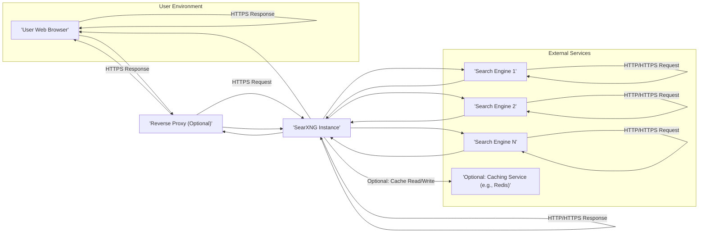
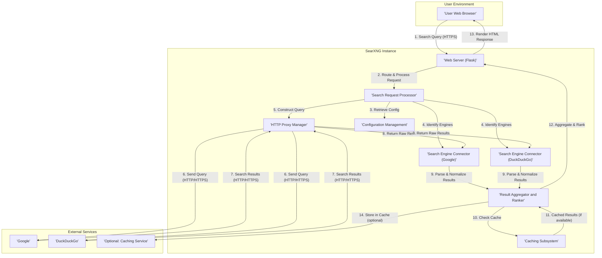

# Project Design Document: SearXNG Metasearch Engine

**Version:** 1.1
**Date:** October 26, 2023
**Author:** AI Software Architect

## 1. Introduction

This document provides an enhanced architectural design of the SearXNG metasearch engine project, based on the repository found at [https://github.com/searxng/searxng](https://github.com/searxng/searxng). This revision aims to offer a more detailed and nuanced understanding of the system's architecture, specifically to facilitate more effective threat modeling. It expands on the previous version with greater detail on component responsibilities, data transformations, and security considerations.

## 2. Goals and Objectives

The primary goals of this design document are:

*   To provide a comprehensively detailed description of the SearXNG metasearch engine's architecture.
*   To clearly delineate the responsibilities and functionalities of each key component.
*   To meticulously illustrate the flow of data within the system, highlighting transformations and interactions.
*   To establish a robust foundation for identifying and analyzing potential security vulnerabilities during subsequent threat modeling exercises.
*   To offer a clearer understanding of deployment options and their security implications.

## 3. System Architecture

The SearXNG architecture is structured into distinct layers and components that work together to deliver its functionality.

### 3.1. High-Level Architecture

*   **User Environment:** Represents the end-user interacting with SearXNG via a web browser.
*   **Reverse Proxy (Optional):** An intermediary server (e.g., Nginx, Apache) providing functionalities like SSL termination, load balancing, request routing, and caching. Its presence is optional but recommended for production deployments.
*   **SearXNG Instance:** The core application logic, responsible for orchestrating the search process, interacting with upstream engines, and presenting results.
*   **External Services:**
    *   **Upstream Search Engines:** External search providers queried by SearXNG.
    *   **Optional Caching Service:** An external caching system (like Redis or Memcached) used to store frequently accessed data for performance optimization.

### 3.2. Detailed Component Architecture (SearXNG Instance)

The SearXNG Instance is composed of several interconnected components:

*   **Web Server (Flask Application with Werkzeug):**
    *   Receives and processes incoming HTTP/HTTPS requests from users or the reverse proxy.
    *   Handles routing of requests to specific application logic.
    *   Manages sessions and cookies.
    *   Renders dynamic HTML templates using Jinja2 for the user interface.
    *   Provides API endpoints for programmatic access to search and other functionalities.
    *   Implements basic security measures like CSRF protection.
*   **Search Request Processor:**
    *   Receives user search queries from the Web Server.
    *   Performs initial sanitization and validation of the input to prevent basic injection attacks.
    *   Parses the query to identify keywords, categories, and preferences.
    *   Interacts with the Configuration Manager to determine the set of enabled search engines and user preferences.
*   **Search Engine Connector Modules (Engines):**
    *   A collection of independent modules, each responsible for interacting with a specific upstream search engine.
    *   Encapsulates the logic for constructing search queries tailored to each engine's API or search syntax.
    *   Handles authentication and authorization requirements for specific engines (if any).
    *   Parses and extracts relevant search results from the often varied HTML or API responses of upstream engines.
    *   Normalizes the extracted data into a consistent internal format.
    *   Manages error handling and retries for communication with upstream engines.
*   **HTTP Proxy Manager:**
    *   Manages outgoing HTTP/HTTPS requests to upstream search engines.
    *   Handles proxy configurations (e.g., SOCKS, HTTP proxies) as defined in the application settings.
    *   Implements techniques to anonymize requests, such as user-agent rotation, to mitigate bot detection by upstream engines.
    *   May include request throttling or delay mechanisms to avoid overloading upstream services.
*   **Result Aggregator and Ranker:**
    *   Receives normalized search results from the various Search Engine Connector Modules.
    *   Implements algorithms for deduplication of results, identifying and merging similar entries from different sources.
    *   Ranks the aggregated results based on a configurable scoring system, potentially considering factors like source diversity and relevance.
    *   Applies user-defined preferences for result ordering and filtering.
*   **Caching Subsystem:**
    *   Provides a mechanism for storing and retrieving frequently accessed data to improve performance and reduce load on upstream engines.
    *   Can utilize in-memory caching (e.g., using Flask's built-in caching) or connect to external caching services like Redis or Memcached.
    *   Stores various types of data, including raw search results from upstream engines, aggregated and ranked results, and potentially even static assets.
    *   Implements cache invalidation strategies based on time-to-live (TTL) or events.
*   **Configuration Management:**
    *   Loads and manages the application's configuration settings from various sources (e.g., configuration files, environment variables).
    *   Provides an interface for administrators to configure search engines, result preferences, proxy settings, and other operational parameters.
    *   May include validation of configuration settings to prevent errors.
*   **Logging and Monitoring:**
    *   Records application events, errors, warnings, and access logs.
    *   Provides valuable data for debugging, performance monitoring, and security auditing.
    *   Supports different logging levels and output formats.
    *   May integrate with external logging services.
*   **Static Files Handler:**
    *   Serves static assets such as CSS stylesheets, JavaScript files, images, and fonts required for the user interface.
    *   May implement caching headers for efficient delivery of static content.
*   **Internationalization (i18n) and Localization (l10n):**
    *   Manages translations for different languages supported by the application.
    *   Allows the user interface to be displayed in the user's preferred language.
    *   Handles locale-specific formatting of dates, numbers, and currencies.
*   **Authentication and Authorization (Limited):**
    *   May include basic authentication mechanisms for accessing administrative functionalities or specific features.
    *   Typically does not involve complex user management for general search operations, focusing on privacy and anonymity.

## 4. Data Flow

A detailed walkthrough of the data flow for a typical user search request:

1. **User initiates search:** The user enters a search query in their web browser and submits it to the SearXNG instance via an HTTPS request.
2. **Web Server receives and routes:** The Flask application receives the request and routes it to the Search Request Processor.
3. **Configuration retrieval:** The Search Request Processor interacts with the Configuration Management component to retrieve the list of enabled search engines and user preferences.
4. **Engine selection:** Based on the configuration, the Search Request Processor identifies the appropriate Search Engine Connector Modules to use for this query.
5. **Query construction:** The Search Request Processor instructs the HTTP Proxy Manager to prepare and send queries.
6. **Queries sent via proxy:** The HTTP Proxy Manager, utilizing configured proxies and anonymization techniques, sends the search queries to the selected upstream search engines (e.g., Google, DuckDuckGo).
7. **Upstream engines respond:** The upstream search engines process the queries and return search results (typically HTML or JSON) to the HTTP Proxy Manager.
8. **Raw results returned:** The HTTP Proxy Manager passes the raw responses back to the corresponding Search Engine Connector Modules.
9. **Parsing and normalization:** Each Search Engine Connector Module parses the raw results and normalizes the data into a consistent internal format.
10. **Cache lookup:** The Result Aggregator and Ranker checks the Caching Subsystem for previously cached results for this query.
11. **Retrieve from cache (optional):** If cached results are found and valid, they are retrieved, potentially skipping the need to query upstream engines.
12. **Aggregation and ranking:** The Result Aggregator and Ranker combines the normalized results from different engines (or the cache), deduplicates them, and ranks them according to its configured algorithms.
13. **Response rendering:** The Result Aggregator and Ranker sends the final, ranked results back to the Web Server, which renders the HTML response to be sent to the user's browser.
14. **Cache storage (optional):** The Result Aggregator and Ranker may instruct the Caching Subsystem to store the newly aggregated and ranked results for future requests.

## 5. Component Interactions

*   The **Web Server** acts as the entry point and interacts with the **Search Request Processor** to initiate the search flow.
*   The **Search Request Processor** relies on the **Configuration Management** to determine operational parameters and enabled search engines.
*   The **Search Request Processor** orchestrates the **HTTP Proxy Manager** to send requests to external services.
*   The **HTTP Proxy Manager** facilitates communication between SearXNG and **Upstream Search Engines**.
*   **Search Engine Connector Modules** handle the specific interactions with individual **Upstream Search Engines**.
*   The **Result Aggregator and Ranker** receives processed results from the **Search Engine Connector Modules**.
*   The **Result Aggregator and Ranker** interacts with the **Caching Subsystem** for storing and retrieving search results.
*   The **Web Server** interacts with the **Static Files Handler** and **Internationalization** components to render the user interface.
*   All components may interact with the **Logging and Monitoring** system to record events and errors.

## 6. Security Considerations (Detailed)

This section expands on the preliminary security considerations, providing more specific examples and potential mitigation strategies:

*   **Input Validation and Sanitization:**
    *   **Threat:** Cross-Site Scripting (XSS) attacks via malicious search queries or configuration inputs.
    *   **Mitigation:** Implement robust input validation on all user-provided data, including search terms, preferences, and administrative inputs. Sanitize input by encoding special characters before rendering in HTML or using in database queries. Employ Content Security Policy (CSP) headers.
*   **Output Encoding:**
    *   **Threat:** XSS vulnerabilities if dynamically generated content is not properly encoded.
    *   **Mitigation:** Ensure all output rendered in HTML templates is properly encoded using context-aware encoding techniques provided by the templating engine (Jinja2).
*   **Dependency Management:**
    *   **Threat:** Exploitation of known vulnerabilities in third-party libraries and dependencies.
    *   **Mitigation:** Regularly update all dependencies to their latest stable versions. Utilize dependency scanning tools to identify and address known vulnerabilities. Implement a process for reviewing and patching security issues in dependencies.
*   **Secure Communication (HTTPS):**
    *   **Threat:** Man-in-the-middle (MITM) attacks, eavesdropping on user queries and results.
    *   **Mitigation:** Enforce HTTPS for all communication between the user's browser and the SearXNG instance. Configure the web server to use strong TLS ciphers and disable insecure protocols. Consider using HTTP Strict Transport Security (HSTS) headers.
*   **Configuration Security:**
    *   **Threat:** Unauthorized access to configuration files, potentially revealing sensitive information or allowing malicious modifications.
    *   **Mitigation:** Store configuration files outside the web server's document root with restricted permissions. Avoid storing sensitive credentials directly in configuration files; use environment variables or secure secrets management solutions.
*   **Rate Limiting and DoS Protection:**
    *   **Threat:** Denial-of-Service (DoS) or Distributed Denial-of-Service (DDoS) attacks overwhelming the server with requests.
    *   **Mitigation:** Implement rate limiting on incoming requests to prevent abuse. Consider using a reverse proxy with built-in DoS protection capabilities.
*   **Proxy Security:**
    *   **Threat:** Leaking user IP addresses to upstream engines if the proxy is not configured correctly. Potential for the proxy itself to be compromised.
    *   **Mitigation:** Carefully configure the HTTP Proxy Manager to anonymize requests effectively. Use reputable and trustworthy proxy services if relying on external proxies. Secure the server hosting the SearXNG instance.
*   **Caching Security:**
    *   **Threat:** Storing sensitive information in the cache, potential for cache poisoning or unauthorized access to cached data.
    *   **Mitigation:** Carefully consider what data is cached and for how long. Implement appropriate cache invalidation strategies. If using an external caching service, ensure it is properly secured.
*   **Logging Security:**
    *   **Threat:** Sensitive information being logged, logs being tampered with or accessed by unauthorized individuals.
    *   **Mitigation:** Avoid logging sensitive user data. Secure log files with appropriate permissions. Consider using a centralized logging system with secure storage and access controls.
*   **Authentication and Authorization:**
    *   **Threat:** Unauthorized access to administrative functionalities or sensitive features.
    *   **Mitigation:** Implement strong authentication mechanisms for administrative access. Enforce proper authorization to restrict access to specific functionalities based on user roles.
*   **Protection against Bot Detection (Ethical Considerations):**
    *   **Threat:** Being blocked by upstream search engines, disrupting service.
    *   **Mitigation:** Implement responsible bot detection avoidance techniques, such as respecting `robots.txt`, using reasonable request rates, and rotating user-agents. Avoid aggressive scraping practices that could harm upstream services.

## 7. Deployment Considerations

SearXNG offers flexible deployment options, each with its own security implications:

*   **Bare Metal or Virtual Machines:**
    *   **Security Considerations:** Requires manual configuration and hardening of the operating system and web server. Responsible for managing security updates and patches.
*   **Containers (Docker):**
    *   **Security Considerations:** Provides isolation between the SearXNG instance and the host system. Requires careful construction of the Docker image to avoid including vulnerabilities. Regularly update the base image and dependencies within the container. Use a non-root user within the container.
*   **Cloud Platforms (AWS, Azure, GCP):**
    *   **Security Considerations:** Leverage cloud provider's security features like firewalls, security groups, and managed services. Follow cloud provider's security best practices. Consider using managed container services (e.g., ECS, AKS, GKE) for simplified deployment and management. Utilize secure storage options for configuration and sensitive data.
*   **Reverse Proxy Deployment (Recommended):**
    *   **Security Considerations:** Offloads SSL termination, providing encryption in transit. Can implement additional security features like web application firewall (WAF) capabilities, rate limiting, and request filtering. Requires careful configuration to avoid introducing new vulnerabilities.

Deployment steps typically involve:

*   Installing necessary prerequisites (Python, pip, etc.).
*   Cloning the SearXNG repository.
*   Configuring the application settings (using environment variables or configuration files).
*   Setting up a web server (Gunicorn, uWSGI) to serve the Flask application.
*   Optionally configuring a reverse proxy (Nginx, Apache) for enhanced security and functionality.
*   Securing the deployment with HTTPS using certificates from Let's Encrypt or other providers.
*   Implementing monitoring and logging.

## 8. Future Considerations

Potential future enhancements and their architectural impact:

*   **Enhanced API Development:**
    *   **Impact:** Requires designing secure and well-documented API endpoints. Introduces new attack vectors that need to be considered during threat modeling (e.g., API authentication, authorization, rate limiting).
*   **Plugin System:**
    *   **Impact:** Allows extending functionality but introduces potential security risks from untrusted plugins. Requires a secure plugin architecture with sandboxing and permission management.
*   **Federated Search Capabilities:**
    *   **Impact:** Involves interacting with other SearXNG instances or similar services, requiring secure communication protocols and trust management.
*   **Improved Aggregation and Personalization:**
    *   **Impact:** May involve storing user preferences or search history (with appropriate privacy considerations), requiring secure data storage and access controls.
*   **Integration with Browser Extensions:**
    *   **Impact:** Requires secure communication between the browser extension and the SearXNG instance, protecting against extension-based attacks.

This enhanced design document provides a more detailed and comprehensive understanding of the SearXNG architecture, serving as a strong foundation for in-depth threat modeling and security analysis.
