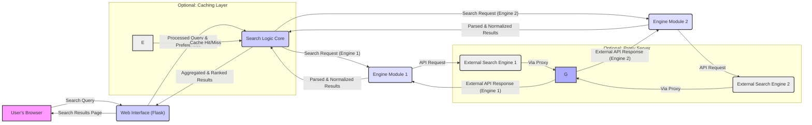
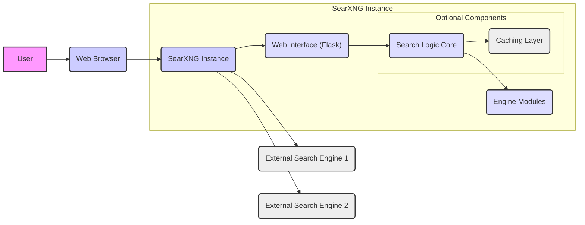

# Project Design Document: SearXNG Metasearch Engine

**Version:** 1.1
**Date:** October 26, 2023
**Author:** AI Software Architect

## 1. Introduction

This document provides a detailed design overview of the SearXNG metasearch engine project, intended to facilitate subsequent threat modeling activities. It outlines the system's architecture, key components, data flow, and important security considerations. The goal is to provide a comprehensive understanding of the system's inner workings to enable the identification of potential security vulnerabilities and risks. This document serves as a blueprint for security analysis and discussion.

## 2. Goals and Scope

The primary goal of SearXNG is to offer a privacy-respecting metasearch engine that aggregates results from various search engines without profiling users. This design document focuses on the core functionalities and architecture of the SearXNG application itself, including its web interface, search logic, and interaction with external search engines. The scope includes the logical components and their interactions but excludes the specifics of individual external search engine API implementations beyond SearXNG's interaction points. It also does not cover the underlying operating system or network infrastructure.

## 3. Target Audience

This document is intended for:

* Security engineers and architects responsible for threat modeling, security assessments, and penetration testing.
* Developers involved in the maintenance, enhancement, and future development of SearXNG.
* Operations teams responsible for deploying, managing, and monitoring SearXNG instances.

## 4. System Overview

SearXNG operates as a web application that receives search queries from users, forwards these queries to configured external search engines, aggregates and ranks the results, and presents them to the user. Key design principles include:

* **Privacy by Design:** Minimizing user tracking and data retention at all stages.
* **Federated Search:** Combining results from multiple diverse sources for comprehensive search coverage.
* **User Customization:** Allowing users to select preferred search engines, categories, and interface themes.
* **Transparency and Openness:**  Being fully open-source to encourage community review and contribution.
* **Modularity:**  Designing components for independent development and easier maintenance.

## 5. High-Level Architecture

The core of the SearXNG architecture comprises the following components:

* **Web Interface (Flask Application):** The entry point for user interaction, responsible for presenting the user interface and handling user requests.
* **Search Logic Core:** The central component that orchestrates the search process, manages engine interactions, and aggregates results.
* **Engine Modules:**  Abstraction layers for interacting with specific external search engine APIs, handling protocol and data format differences.
* **Caching Layer (Optional):**  Improves performance by storing and retrieving frequently accessed search results or engine metadata.
* **Configuration Management:**  Provides a mechanism for storing and accessing application settings and engine configurations.
* **Logging and Monitoring:**  Records application events and performance metrics for debugging, auditing, and security monitoring.
* **Proxy Integration (Optional but Recommended):**  Enhances privacy by routing outgoing requests through a proxy server.

## 6. Component Details

### 6.1. Web Interface (Flask Application)

* **Technology:** Python (Flask microframework), Jinja2 templating engine, HTML, CSS, JavaScript (primarily for front-end interactions).
* **Responsibilities:**
    * **HTTP Request Handling:** Receives and processes user requests (GET, POST) for search queries, preference updates, and other interactions.
    * **User Interface Rendering:** Dynamically generates HTML pages using Jinja2 templates, embedding search results, settings, and other dynamic content.
    * **Form Handling and Data Binding:** Processes user input from forms, including search terms and configuration options.
    * **Session Management (Optional):**  Manages user sessions using browser cookies or other mechanisms to persist user preferences across requests.
    * **Input Sanitization (Client-Side):** Implements basic client-side validation and sanitization to improve user experience and prevent simple input errors.
    * **Communication with Search Logic:** Sends processed search queries and user preferences to the Search Logic Core via internal function calls or message passing.
    * **Static Asset Serving:** Serves static files such as CSS stylesheets, JavaScript files, images, and fonts.
    * **Content Security Policy (CSP) Management:**  Defines and enforces CSP headers to mitigate XSS attacks.

### 6.2. Search Logic Core

* **Technology:** Python.
* **Responsibilities:**
    * **Query Reception and Processing:** Receives search queries and user preferences from the Web Interface.
    * **Search Engine Selection and Routing:** Determines which search engines to query based on user selections, categories, and application configuration.
    * **Request Orchestration:**  Manages the process of sending search requests to multiple Engine Modules concurrently.
    * **Asynchronous Request Management:** Utilizes asynchronous programming (e.g., `asyncio`, `threading`) to handle concurrent requests to external search engines efficiently.
    * **Response Aggregation and Normalization:** Receives and normalizes responses from different Engine Modules, handling variations in data formats and structures.
    * **Result Ranking and Deduplication:** Implements algorithms to rank and deduplicate search results from various sources to present a coherent and relevant list.
    * **Error Handling and Fallback Mechanisms:** Manages errors encountered during communication with external search engines and implements fallback strategies.
    * **Interaction with Caching Layer:**  Checks the cache for existing results before initiating new searches and stores results in the cache as needed.
    * **Communication with Engine Modules:**  Invokes methods on specific Engine Modules to perform search requests and receive results.

### 6.3. Engine Modules

* **Technology:** Python.
* **Structure:**  A collection of independent Python modules, typically organized in a dedicated directory. Each module is responsible for interacting with a specific search engine.
* **Responsibilities:**
    * **Search Engine API Abstraction:**  Provides an abstraction layer over the specific API of an external search engine.
    * **Request Formatting (Engine-Specific):**  Constructs API requests according to the target search engine's documentation, including URL parameters, headers, and authentication details (if required).
    * **Response Parsing (Engine-Specific):** Parses the API response (typically JSON, XML, or HTML) to extract relevant search result data (title, URL, snippet, etc.).
    * **Error Handling (Engine-Specific):** Handles errors specific to the target search engine's API, such as rate limiting or authentication failures.
    * **Configuration Handling (Engine-Specific):**  Manages any specific configuration required for interacting with the engine, such as API keys, custom endpoints, or user agents.
    * **Result Normalization:**  Transforms the search engine's specific result format into a common internal representation for easier aggregation.

### 6.4. Caching Layer (Optional)

* **Technology:**  Can be implemented using various technologies, including in-memory caches (e.g., `dict`, `lru_cache`), local file-based caches, or dedicated caching services like Redis or Memcached.
* **Responsibilities:**
    * **Storing Search Results:** Caches aggregated search results based on the search query and potentially other parameters (e.g., selected engines).
    * **Storing Engine Metadata:**  May cache information about external search engines, such as availability or supported features.
    * **Retrieving Cached Data:**  Provides mechanisms for retrieving cached search results or engine metadata.
    * **Cache Invalidation and Expiration:** Implements strategies for invalidating or expiring cached data to ensure freshness.
    * **Cache Management:**  Handles cache eviction policies and resource management.

### 6.5. Configuration Management

* **Technology:**  Configuration settings are typically stored in configuration files (e.g., YAML, JSON, INI), environment variables, or a combination of both.
* **Responsibilities:**
    * **Storing Application Settings:**  Holds global configuration parameters for the SearXNG instance, such as enabled features, UI settings, and logging levels.
    * **Storing Engine Configurations:**  Stores settings specific to each external search engine, including API endpoints, authentication details, and supported categories.
    * **Providing Configuration Data:**  Offers an interface for other components to access configuration settings.
    * **Configuration Loading and Parsing:**  Handles the process of loading and parsing configuration data from various sources.
    * **Configuration Validation:**  May include mechanisms for validating configuration settings to prevent errors.

### 6.6. Logging and Monitoring

* **Technology:** Python's built-in `logging` module or more advanced logging frameworks like `Loguru`. Monitoring can involve tools like Prometheus, Grafana, or simple log analysis.
* **Responsibilities:**
    * **Event Logging:** Records significant application events, errors, warnings, and informational messages.
    * **Performance Monitoring:**  Tracks performance metrics such as request latency, resource usage, and error rates.
    * **Security Auditing:**  Logs security-related events, such as authentication attempts or suspicious activity.
    * **Configurable Logging Levels:** Allows administrators to adjust the verbosity of logging output.
    * **Log Output and Storage:**  Writes logs to files, console, or external logging services (e.g., syslog, ELK stack).
    * **Metrics Export:**  Exposes performance and operational metrics for monitoring systems.

### 6.7. Proxy Integration (Optional but Recommended)

* **Technology:**  Any standard HTTP or SOCKS proxy server (e.g., Squid, Nginx as a forward proxy, Tor).
* **Responsibilities:**
    * **Outbound Request Routing:**  Routes outgoing HTTP requests to external search engines through the configured proxy server.
    * **IP Address Anonymization:**  Masks the IP address of the SearXNG instance from the external search engines, enhancing user privacy.
    * **Circumventing Blocking or Rate Limiting:**  May help to bypass IP-based blocking or rate limiting imposed by some search engines.

## 7. Data Flow

The typical data flow for a user search query is as follows:

**Detailed Steps:**

* **User Initiates Search:** The user enters a search query in their web browser and submits it.
* **Web Interface Receives Request:** The Flask application receives the HTTP request containing the search query and potentially user preferences.
* **Query Processing and Routing:** The Web Interface processes the request and passes the search query and user preferences to the Search Logic Core.
* **Cache Check (Optional):** The Search Logic Core may check the Caching Layer for existing results for the given query. If a cache hit occurs, the cached results are returned directly.
* **Engine Selection:** The Search Logic Core determines which external search engines to query based on configuration and user preferences.
* **Request to Engine Modules:** The Search Logic Core invokes the appropriate Engine Modules for each selected search engine.
* **API Requests to External Engines:** Each Engine Module constructs and sends an API request to its corresponding external search engine. This request may be routed through an optional Proxy Server.
* **API Responses from External Engines:** The external search engines respond with API responses containing search results.
* **Parsing and Normalization:** The Engine Modules parse the API responses and normalize the results into a common internal format.
* **Results Aggregation:** The Search Logic Core receives the parsed and normalized results from the Engine Modules.
* **Ranking and Deduplication:** The Search Logic Core aggregates, ranks, and deduplicates the results.
* **Cache Update (Optional):** The Search Logic Core may store the aggregated and ranked results in the Caching Layer.
* **Results to Web Interface:** The Search Logic Core sends the processed results back to the Web Interface.
* **Rendering and Display:** The Web Interface renders the HTML page with the search results and sends it back to the user's browser.

## 8. Security Considerations (For Threat Modeling)

This section outlines potential security considerations and threats that should be explored during the threat modeling process.

* **Input Validation Vulnerabilities:**
    * **Search Query Injection:** Malicious code injected into the search query could be passed to external search engines or interpreted by internal components, potentially leading to unexpected behavior or information disclosure.
    * **Preference Manipulation:**  Exploiting vulnerabilities in how user preferences are handled could allow attackers to inject malicious data or bypass security controls.
    * **Form Parameter Tampering:**  Manipulating form parameters could lead to unintended actions or access to unauthorized features.
* **Output Encoding and XSS Vulnerabilities:**
    * **Cross-Site Scripting (XSS):**  Improper encoding of search results received from external engines could allow attackers to inject malicious scripts into web pages viewed by other users. This includes both reflected and stored XSS.
    * **HTML Injection:**  Injecting arbitrary HTML into the rendered page could lead to phishing attacks or defacement.
* **Cross-Site Request Forgery (CSRF):**
    * Attackers could trick authenticated users into performing unintended actions on the SearXNG application, such as changing settings or performing searches on their behalf.
* **Server-Side Request Forgery (SSRF):**
    * If the application can be tricked into making requests to internal or external resources that it shouldn't have access to, attackers could potentially access sensitive information or interact with internal services. This is especially relevant in the Engine Modules when constructing API requests.
* **Information Disclosure:**
    * **Exposure of Sensitive Configuration:**  Configuration files containing API keys or other sensitive information could be exposed if not properly protected.
    * **Verbose Error Messages:**  Detailed error messages could reveal information about the application's internal workings, aiding attackers.
    * **Leaking Internal Paths or Data:**  Improperly configured web servers or application logic could expose internal file paths or sensitive data.
* **Denial of Service (DoS) Attacks:**
    * **Resource Exhaustion:**  Overloading the application with excessive search requests could exhaust server resources.
    * **External API Abuse:**  Sending a large number of requests to external search engines could lead to rate limiting or blocking.
    * **Regular Expression Denial of Service (ReDoS):**  Using inefficient regular expressions could lead to excessive CPU usage.
* **Dependency Vulnerabilities:**
    * Outdated or vulnerable third-party libraries and frameworks could introduce security risks. Regular dependency scanning and updates are crucial.
* **Authentication and Authorization Weaknesses (If Implemented):**
    * **Weak Password Policies:**  If user accounts are implemented, weak password policies could lead to account compromise.
    * **Insufficient Access Controls:**  Improperly configured access controls could allow unauthorized users to access sensitive features or data.
* **Privacy Violations:**
    * **Excessive Logging:**  Logging too much user data could violate privacy principles.
    * **Data Retention Policies:**  Lack of clear data retention policies could lead to unnecessary storage of user information.
    * **Third-Party Tracking:**  Unintentional inclusion of third-party tracking mechanisms could compromise user privacy.
* **Insecure Communication:**
    * Failure to use HTTPS for all communication could expose user data to eavesdropping and man-in-the-middle attacks.
* **Code Injection Vulnerabilities:**
    * **Python Code Injection:**  If user input is used to dynamically generate or execute Python code, it could lead to arbitrary code execution.
    * **Template Injection:**  Vulnerabilities in the Jinja2 templating engine could allow attackers to execute arbitrary code on the server.

## 9. Deployment Considerations

SearXNG can be deployed in various environments, each with its own security implications:

* **Bare Metal Servers:** Requires careful manual configuration and security hardening of the operating system and network.
* **Virtual Machines (VMs):** Provides a degree of isolation but still requires OS and application-level security measures.
* **Containers (Docker, Podman):** Offers improved isolation and reproducibility but requires secure container image management and orchestration.
* **Cloud Platforms (AWS, Azure, GCP):**  Leverages cloud provider security features but requires careful configuration of cloud resources and access controls.

Deployment typically involves:

* **Secure Installation of Dependencies:**  Ensuring dependencies are obtained from trusted sources and verifying their integrity.
* **Secure Configuration Management:**  Protecting configuration files containing sensitive information using appropriate permissions and encryption.
* **Web Server Hardening:**  Configuring web servers like Nginx or Apache with security best practices, including disabling unnecessary modules and setting appropriate headers.
* **Caching Security:**  Securing the caching layer to prevent unauthorized access or data manipulation.
* **Proxy Security:**  Ensuring the proxy server is securely configured and maintained.
* **Regular Security Updates:**  Applying security patches to the operating system, application dependencies, and the SearXNG application itself.
* **Network Security:**  Implementing firewalls and other network security measures to restrict access to the SearXNG instance.

## 10. Technologies Used

* **Programming Language:** Python (version 3.7 or higher recommended)
* **Web Framework:** Flask
* **Templating Engine:** Jinja2
* **Asynchronous HTTP Library (Optional):** `aiohttp`, `httpx`
* **Caching (Optional):** Redis, Memcached, `python-lru-cache`
* **Web Server (for Production):** Nginx, Apache
* **Operating System:** Linux (various distributions commonly used)
* **Configuration Management:** YAML, JSON, INI files, environment variables
* **Logging:** Python's `logging` module, `Loguru`
* **Monitoring (Optional):** Prometheus, Grafana

## 11. Diagrams

### 11.1. High-Level Architecture Diagram

This improved design document provides a more detailed and comprehensive overview of the SearXNG project, specifically tailored for threat modeling activities. It highlights key components, data flows, and potential security considerations, serving as a valuable resource for security analysis and mitigation planning.