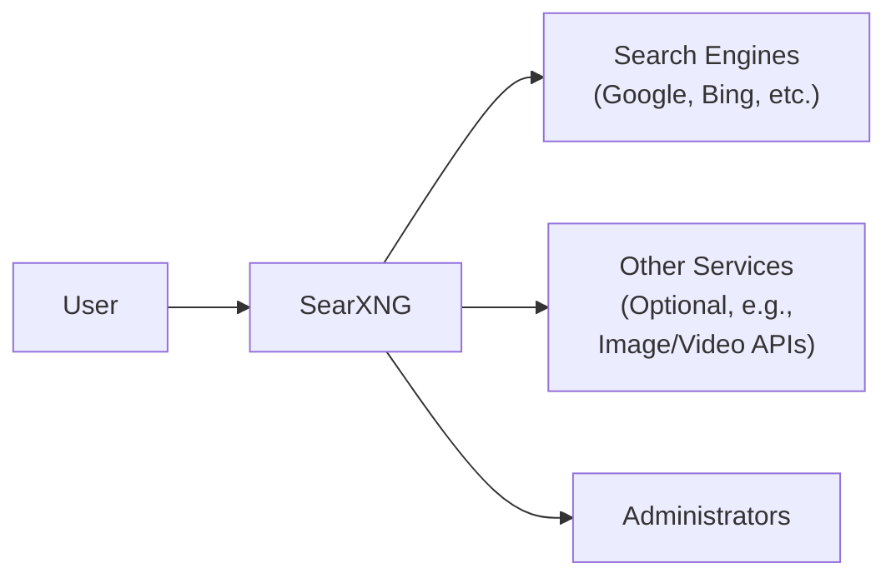
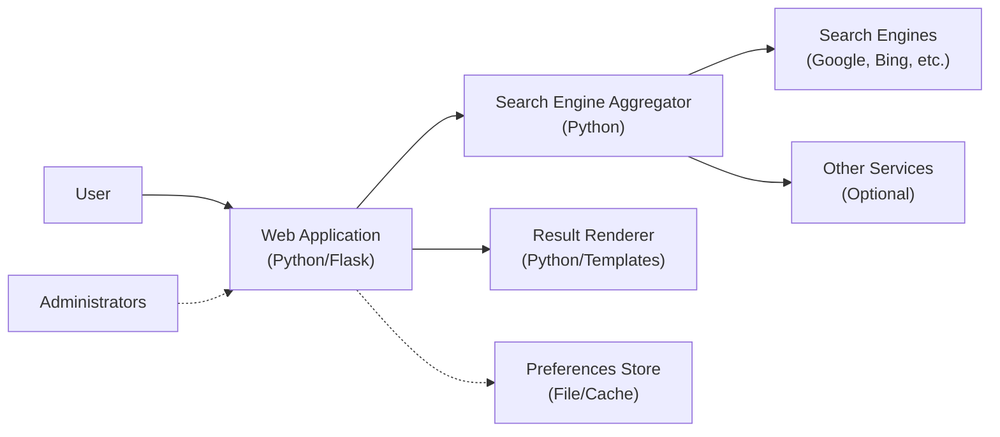
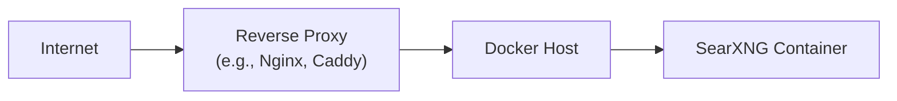
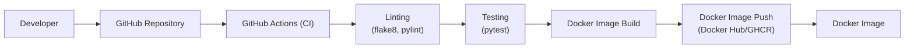

Okay, let's create a design document for the SearXNG project.

# BUSINESS POSTURE

SearXNG is a metasearch engine, aiming to provide users with aggregated search results from various sources while prioritizing privacy.

Priorities:

*   User Privacy: Ensuring users can search the internet without being tracked or profiled.
*   Accuracy and Relevance: Providing comprehensive and relevant search results by aggregating multiple search engines.
*   Customization and Flexibility: Allowing users to customize their search experience and preferences.
*   Transparency and Open Source: Maintaining an open-source codebase for community review and contribution.
*   Availability and Performance: Deliver search results quickly and reliably.

Goals:

*   Provide a privacy-respecting alternative to mainstream search engines.
*   Offer a customizable and feature-rich search experience.
*   Foster a community-driven development model.

Business Risks:

*   Legal and Compliance Risks: Navigating the complex legal landscape of data privacy and copyright regulations across different jurisdictions.
*   Reputational Risks: Potential damage to reputation if the service is perceived as unreliable, biased, or failing to protect user privacy.
*   Operational Risks: Maintaining the service's availability and performance, especially under heavy load or potential DDoS attacks.
*   Financial Risks: Ensuring the long-term sustainability of the project, given its reliance on donations and community support.
*   Security Risks: Protecting the service from attacks that could compromise user privacy or data integrity.

# SECURITY POSTURE

Existing Security Controls:

*   security control: The project is open-source, allowing for community scrutiny and security audits. (Described in the project's GitHub repository).
*   security control: The project emphasizes privacy by design, avoiding the collection of user data. (Described in the project's documentation and code).
*   security control: The project can be self-hosted, giving users full control over their data and infrastructure. (Described in the project's documentation).
*   security control: HTTPS can be enforced, encrypting communication between the user and the instance. (Described in deployment documentation).
*   security control: Configuration options to customize the behavior and security settings. (Described in the project's documentation).
*   security control: Regular updates and dependency management to address vulnerabilities. (Managed through the project's GitHub repository and issue tracker).

Accepted Risks:

*   accepted risk: Reliance on external search engines, which may have their own privacy and security vulnerabilities.
*   accepted risk: Potential for malicious actors to set up public instances with compromised configurations.
*   accepted risk: The project's effectiveness in protecting user privacy depends on the user's own security practices and the configuration of their chosen instance.

Recommended Security Controls:

*   security control: Implement Content Security Policy (CSP) to mitigate XSS attacks.
*   security control: Implement Subresource Integrity (SRI) for included resources.
*   security control: Implement HTTP Strict Transport Security (HSTS) to enforce HTTPS.
*   security control: Provide security hardening guides for self-hosting users.
*   security control: Conduct regular penetration testing and security audits.
*   security control: Implement rate limiting and anti-automation measures to prevent abuse.
*   security control: Provide clear guidelines on how to report security vulnerabilities.

Security Requirements:

*   Authentication:
    *   No user accounts are required by default, enhancing privacy.
    *   Optional authentication mechanisms (e.g., for administrative interfaces) should use strong password hashing algorithms and follow best practices for secure password management.
*   Authorization:
    *   If administrative interfaces are present, role-based access control (RBAC) should be implemented to restrict access to sensitive functions.
*   Input Validation:
    *   All user inputs (search queries, settings) must be properly validated and sanitized to prevent cross-site scripting (XSS), injection attacks, and other vulnerabilities.
    *   Output encoding should be used to prevent XSS.
*   Cryptography:
    *   HTTPS should be enforced for all communication between the user and the SearXNG instance.
    *   If sensitive data is stored (e.g., API keys for external services), it should be encrypted at rest.
    *   Cryptographic libraries should be kept up-to-date and use industry-standard algorithms.

# DESIGN

## C4 CONTEXT

Element Descriptions:

*   Element:
    *   Name: User
    *   Type: Person
    *   Description: A person who uses SearXNG to perform searches.
    *   Responsibilities: Initiates search queries, views results, customizes preferences.
    *   Security controls: Uses a web browser with security features enabled (e.g., HTTPS, ad blockers).
*   Element:
    *   Name: SearXNG
    *   Type: Software System
    *   Description: The SearXNG metasearch engine.
    *   Responsibilities: Receives search queries, aggregates results from multiple search engines, presents results to the user, handles user preferences.
    *   Security controls: Input validation, output encoding, HTTPS enforcement (configurable), privacy-focused design.
*   Element:
    *   Name: Search Engines
    *   Type: External System
    *   Description: Third-party search engines (e.g., Google, Bing, DuckDuckGo).
    *   Responsibilities: Provide search results to SearXNG.
    *   Security controls: Managed by the respective search engine providers. SearXNG relies on their security measures.
*   Element:
    *   Name: Other Services
    *   Type: External System
    *   Description: Optional external services (e.g., image APIs, video APIs, translation services).
    *   Responsibilities: Provide additional data or functionality to SearXNG.
    *   Security controls: Managed by the respective service providers. SearXNG should use secure APIs and validate responses.
*   Element:
    *   Name: Administrators
    *   Type: Person
    *   Description: People who manage and maintain a SearXNG instance.
    *   Responsibilities: Configure the instance, update software, monitor performance, ensure security.
    *   Security controls: Strong passwords, multi-factor authentication (if available), secure access to the server.

## C4 CONTAINER

Element Descriptions:

*   Element:
    *   Name: User
    *   Type: Person
    *   Description: A person who uses SearXNG to perform searches.
    *   Responsibilities: Initiates search queries, views results, customizes preferences.
    *   Security controls: Uses a web browser with security features enabled (e.g., HTTPS, ad blockers).
*   Element:
    *   Name: Web Application
    *   Type: Web Application
    *   Description: The main web application, built with Python and Flask.
    *   Responsibilities: Handles user requests, interacts with other components, serves the user interface.
    *   Security controls: Input validation, output encoding, session management, HTTPS enforcement (configurable).
*   Element:
    *   Name: Search Engine Aggregator
    *   Type: Python Module
    *   Description: The component responsible for querying external search engines.
    *   Responsibilities: Sends requests to search engines, parses responses, aggregates results.
    *   Security controls: API key management (if required), request throttling, response validation.
*   Element:
    *   Name: Search Engines
    *   Type: External System
    *   Description: Third-party search engines.
    *   Responsibilities: Provide search results.
    *   Security controls: Managed by the respective search engine providers.
*   Element:
    *   Name: Other Services
    *   Type: External System
    *   Description: Optional external services.
    *   Responsibilities: Provide additional data or functionality.
    *   Security controls: Managed by the respective service providers.
*   Element:
    *   Name: Result Renderer
    *   Type: Python Module
    *   Description: The component responsible for formatting and displaying search results.
    *   Responsibilities: Generates HTML output from aggregated search results.
    *   Security controls: Output encoding to prevent XSS.
*   Element:
    *   Name: Preferences Store
    *   Type: Data Store
    *   Description: Stores user preferences (e.g., selected search engines, themes).
    *   Responsibilities: Persists user preferences.
    *   Security controls: Access control, data validation, encryption (if sensitive data is stored).
*   Element:
    *   Name: Administrators
    *   Type: Person
    *   Description: People who manage and maintain a SearXNG instance.
    *   Responsibilities: Configure the instance, update software, monitor performance, ensure security.
    *   Security controls: Strong passwords, multi-factor authentication (if available), secure access to the server.

## DEPLOYMENT

Possible deployment solutions:

1.  Docker Container: The most common and recommended way to deploy SearXNG.
2.  Manual Installation: Installing dependencies and running the application directly on a server.
3.  Cloud Platforms: Deploying to cloud platforms like AWS, Google Cloud, or Azure using virtual machines or container services.

Chosen solution (Docker):

Element Descriptions:

*   Element:
    *   Name: Internet
    *   Type: Network
    *   Description: The public internet.
    *   Responsibilities: Provides connectivity to users.
    *   Security controls: Standard internet security protocols (e.g., DNSSEC).
*   Element:
    *   Name: Reverse Proxy
    *   Type: Server
    *   Description: A reverse proxy server (e.g., Nginx, Caddy) that handles incoming requests.
    *   Responsibilities: Terminates SSL/TLS, forwards requests to the SearXNG container, handles caching, provides load balancing (optional).
    *   Security controls: HTTPS enforcement, certificate management, DDoS protection, web application firewall (WAF) (optional).
*   Element:
    *   Name: Docker Host
    *   Type: Server
    *   Description: The server that hosts the Docker engine.
    *   Responsibilities: Runs the Docker daemon, manages containers.
    *   Security controls: Operating system security hardening, firewall, regular security updates, Docker security best practices.
*   Element:
    *   Name: SearXNG Container
    *   Type: Container
    *   Description: The Docker container running the SearXNG application.
    *   Responsibilities: Runs the SearXNG application.
    *   Security controls: Container isolation, minimal base image, regular image updates, security scanning of the container image.

## BUILD

The build process for SearXNG typically involves the following steps:

1.  Developer: A developer writes code and pushes changes to the GitHub repository.
2.  GitHub Actions (CI): GitHub Actions, the CI/CD platform used by SearXNG, automatically triggers a workflow upon code changes.
3.  Linting: The workflow runs linters (e.g., flake8, pylint) to check code style and identify potential errors.
4.  Testing: The workflow runs unit tests and integration tests to ensure code quality and functionality.
5.  Docker Image Build: If tests pass, a new Docker image is built based on the updated code.
6.  Docker Image Push: The newly built Docker image is pushed to a container registry (e.g., Docker Hub, GitHub Container Registry).

Security Controls in Build Process:

*   security control: Code review: All code changes are reviewed by other developers before being merged.
*   security control: Linting: Linters help enforce code style and identify potential security issues.
*   security control: Automated testing: Unit and integration tests help catch bugs and vulnerabilities early.
*   security control: Dependency management: Dependencies are regularly updated to address known vulnerabilities.
*   security control: Docker image security: Using minimal base images, scanning for vulnerabilities, and following Docker security best practices.
*   security control: Signed commits: Developers are encouraged to sign their commits to ensure authenticity.

# RISK ASSESSMENT

Critical Business Processes:

*   Providing search results: The core function of SearXNG is to provide users with search results.
*   Maintaining user privacy: Protecting user privacy is a fundamental principle of the project.
*   Ensuring service availability: The service should be accessible to users when they need it.

Data Sensitivity:

*   Search queries: While SearXNG itself does not store search queries by default, they are inherently sensitive as they can reveal personal information about the user.
*   User preferences: User preferences (e.g., selected search engines, themes) are less sensitive but should still be protected.
*   IP addresses: IP addresses are not stored by default, but can be logged by the reverse proxy or web server. This is considered sensitive data.
*   No other user data is collected or stored by default.

# QUESTIONS & ASSUMPTIONS

Questions:

*   Are there any specific compliance requirements (e.g., GDPR, CCPA) that need to be considered?
*   What is the expected traffic volume and load on the service?
*   What are the specific threat models or attack vectors that are of greatest concern?
*   What level of logging is required for operational and security purposes?
*   Are there any plans to integrate with other services or platforms in the future?

Assumptions:

*   BUSINESS POSTURE: The primary goal of SearXNG is to provide a privacy-focused metasearch engine.
*   BUSINESS POSTURE: The project relies on community contributions and donations for its sustainability.
*   SECURITY POSTURE: Users are responsible for configuring their own instances securely.
*   SECURITY POSTURE: The project follows secure software development practices.
*   DESIGN: The Docker deployment model is the preferred and recommended approach.
*   DESIGN: The architecture is relatively simple and modular.
*   DESIGN: External search engines and services are trusted to a reasonable extent.