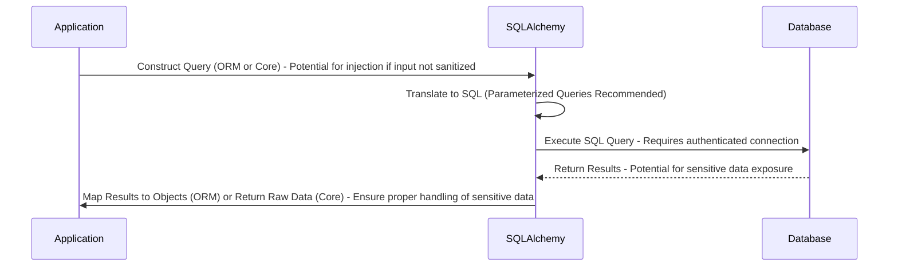
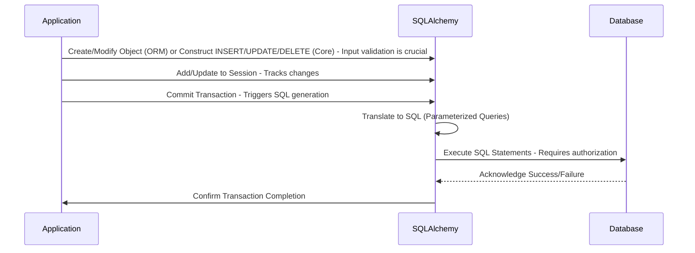

# Project Design Document: SQLAlchemy Integration in Applications

**Version:** 1.1
**Date:** October 26, 2023
**Author:** AI Software Architect

## 1. Introduction

This document outlines the design of how the SQLAlchemy library is typically integrated and utilized within a software application. This design serves as a foundation for subsequent threat modeling activities, allowing security engineers to understand the system's architecture and identify potential vulnerabilities. This document focuses on the common patterns and interactions involved when using SQLAlchemy, rather than the internal workings of the SQLAlchemy library itself.

## 2. Goals

*   Provide a clear and concise description of the typical architecture involving SQLAlchemy.
*   Identify the key components and their interactions, emphasizing potential security implications.
*   Highlight the data flow within the system, pinpointing data transformation and potential interception points.
*   Establish a robust basis for identifying potential security threats and vulnerabilities during threat modeling exercises.

## 3. Scope

This document covers the integration of SQLAlchemy within a generic application. It focuses on the interaction between the application code, the SQLAlchemy library, and the underlying database. Specific application logic, database schemas, and the internal implementation details of SQLAlchemy are considered out of scope, but the general principles of interaction and potential security ramifications are covered.

## 4. Target Audience

*   Security Engineers
*   Software Developers
*   Cloud Architects
*   Penetration Testers

## 5. System Overview

The typical architecture involving SQLAlchemy can be represented as a three-tier system:

*   **Presentation Tier (Application Logic):** This is the application code responsible for business logic, user interaction, and orchestrating data operations.
*   **Data Access Layer (SQLAlchemy):** This layer acts as an intermediary, abstracting database interactions and providing a consistent interface for the application.
*   **Data Storage Tier (Database):** This is the persistent storage layer, housing the application's data within a relational database system.

```mermaid
graph LR
    subgraph "Presentation Tier (Application)"
        A("Application Code")
    end
    subgraph "Data Access Layer (SQLAlchemy)"
        B("SQLAlchemy Core")
        C("SQLAlchemy ORM")
        D("Database Engine")
    end
    subgraph "Data Storage Tier (Database)")
        E("Database Server")
    end

    A -- "Uses ORM/Core API" --> C
    A -- "Configures and Uses" --> D
    C -- "Leverages" --> B
    B -- "Communicates via DBAPI" --> D
    D -- "Manages Connections & Executes" --> E
```

## 6. Component Details

### 6.1. Presentation Tier (Application Logic)

*   **Description:** The core of the application, containing business rules, user interface handling (if applicable), and the logic that utilizes SQLAlchemy for database interaction.
*   **Responsibilities:**
    *   Defining data models, often using SQLAlchemy's ORM for object-relational mapping.
    *   Constructing database queries using SQLAlchemy's ORM or Core expression language.
    *   Managing database sessions, transactions, and connection lifecycle (directly or indirectly).
    *   Handling data retrieved from the database, including sanitization and validation.
    *   Presenting data to users or other systems, ensuring appropriate encoding and escaping.
*   **Key Interactions:**
    *   Initializes and configures the SQLAlchemy `Engine` object, providing database connection details.
    *   Creates and manages `Session` objects for unit of work and transaction management.
    *   Defines mappings between Python classes and database tables, including relationships and constraints.
    *   Invokes SQLAlchemy methods to execute queries (SELECT, INSERT, UPDATE, DELETE) and persist data changes.
    *   Handles exceptions raised by SQLAlchemy during database operations.

### 6.2. Data Access Layer (SQLAlchemy)

*   **Description:**  The SQLAlchemy library itself, providing an abstraction layer over various database systems.
*   **Components:**
    *   **SQLAlchemy Core:** Offers a schema-centric view of the database and a powerful SQL expression language for constructing queries programmatically.
    *   **SQLAlchemy ORM (Object-Relational Mapper):** Provides a higher-level abstraction, allowing interaction with the database using Python objects and relationships, mapping classes to database tables.
    *   **Database Engine:** Manages connections to the underlying database, including connection pooling, dialect-specific SQL generation, and interaction with the Python Database API (DBAPI) driver.
*   **Responsibilities:**
    *   Abstracting differences between various database SQL dialects, providing a consistent API.
    *   Providing mechanisms for defining database schemas and data types.
    *   Managing database connections, including opening, closing, and pooling.
    *   Translating ORM operations into corresponding SQL queries.
    *   Executing SQL queries against the configured database.
    *   Fetching results from the database and converting them into Python data structures or objects.
    *   Managing transactions, including commit and rollback operations.
*   **Key Interactions:**
    *   Receives query requests and data manipulation instructions from the application layer.
    *   Constructs and executes SQL queries based on application requests.
    *   Manages the lifecycle of database connections and transactions.
    *   Interacts with the underlying database driver (DBAPI).
    *   Returns query results or status of data modification operations to the application.

### 6.3. Data Storage Tier (Database)

*   **Description:** The relational database management system (RDBMS) responsible for persistent data storage.
*   **Responsibilities:**
    *   Storing and managing application data in a structured format.
    *   Executing SQL queries received from SQLAlchemy.
    *   Enforcing data integrity constraints (e.g., primary keys, foreign keys, unique constraints).
    *   Providing data persistence, durability, and atomicity of transactions.
    *   Managing user authentication and authorization for database access.
    *   Logging database activities (depending on configuration).
*   **Key Interactions:**
    *   Receives SQL queries from the SQLAlchemy Database Engine.
    *   Authenticates and authorizes the connection based on provided credentials.
    *   Executes the received SQL queries.
    *   Returns query results to SQLAlchemy.
    *   Persists data changes made through INSERT, UPDATE, and DELETE statements.

## 7. Data Flow

The typical data flow for read and write operations using SQLAlchemy is as follows, highlighting potential security touchpoints:

### 7.1. Read Operation (Fetching Data)



*   The application code constructs a query using either SQLAlchemy's ORM or Core. **Security Note:** If user input is directly incorporated into the query string without proper sanitization or parameterization, it creates a SQL injection vulnerability.
*   SQLAlchemy translates the ORM operations into SQL or directly uses the provided SQL in the case of Core. **Security Best Practice:** SQLAlchemy's parameterization features should be used to prevent SQL injection.
*   SQLAlchemy sends the SQL query to the database. **Security Note:** This communication should ideally be over an encrypted channel (e.g., TLS/SSL). The connection requires valid authentication credentials.
*   The database executes the query and returns the results. **Security Note:** The returned data might contain sensitive information, requiring careful handling in subsequent steps.
*   SQLAlchemy receives the results. If using the ORM, it maps the rows to Python objects. If using Core, it returns the raw data.
*   The application receives the data from SQLAlchemy. **Security Note:** The application must handle sensitive data appropriately, avoiding logging or exposing it unnecessarily.

### 7.2. Write Operation (Modifying Data)



*   The application code creates or modifies data, typically by creating or updating objects when using the ORM, or by constructing INSERT, UPDATE, or DELETE statements with Core. **Security Note:** Input validation at this stage is critical to prevent data integrity issues and potential exploits.
*   When using the ORM, the application adds or updates the objects within a SQLAlchemy `Session`.
*   The application initiates a transaction commit.
*   SQLAlchemy translates the ORM operations into corresponding SQL statements or uses the provided SQL. **Security Best Practice:** Parameterized queries should be used for all data modifications.
*   SQLAlchemy sends the SQL statements to the database. **Security Note:** The database connection requires appropriate authorization to perform the requested data modifications.
*   The database executes the statements and acknowledges success or failure.
*   SQLAlchemy confirms the transaction completion to the application.

## 8. Security Considerations

This section details potential security considerations based on the architecture described, providing a foundation for threat modeling.

*   **SQL Injection:**
    *   **Threat:** Malicious SQL code injected through application inputs can be executed against the database, potentially leading to data breaches, data manipulation, or denial of service.
    *   **Mitigation:**  **Always use parameterized queries or ORM features that automatically handle parameterization.** Avoid string concatenation for building SQL queries. Implement robust input validation and sanitization on the application side. Employ static analysis tools to detect potential SQL injection vulnerabilities.
*   **Authentication and Authorization:**
    *   **Threat:** Unauthorized access to the database can lead to data breaches or manipulation. Insufficient authorization can allow users to perform actions beyond their privileges.
    *   **Mitigation:** Securely store database credentials (e.g., using environment variables, secrets management systems, not directly in code). Implement the principle of least privilege for database user accounts. Enforce role-based access control (RBAC) at both the application and database levels. Regularly review and rotate database credentials.
*   **Connection Security (Man-in-the-Middle Attacks):**
    *   **Threat:**  Unencrypted communication between the application and the database can be intercepted, exposing sensitive data like credentials and application data.
    *   **Mitigation:** **Enforce encrypted connections using TLS/SSL.** Configure the SQLAlchemy Engine to use secure connection parameters. Ensure the database server is configured to accept only secure connections.
*   **Data Validation and Sanitization:**
    *   **Threat:**  Malicious or malformed data can be injected into the database, potentially causing application errors, data corruption, or even security vulnerabilities.
    *   **Mitigation:** Implement comprehensive input validation on the application side before data is passed to SQLAlchemy. Sanitize data to remove potentially harmful characters or scripts. Utilize database constraints to enforce data integrity.
*   **Dependency Management and Vulnerabilities:**
    *   **Threat:**  Outdated versions of SQLAlchemy or the underlying database drivers may contain known security vulnerabilities that can be exploited.
    *   **Mitigation:**  Maintain an up-to-date inventory of all dependencies. Regularly update SQLAlchemy and database drivers to the latest stable versions. Subscribe to security advisories for these components. Use dependency scanning tools to identify known vulnerabilities.
*   **Information Disclosure through Error Messages:**
    *   **Threat:**  Detailed database error messages exposed to users or logs can reveal sensitive information about the database structure, data, or internal workings, aiding attackers.
    *   **Mitigation:** Configure the application and database to log errors appropriately without exposing sensitive details. Implement generic error handling for user-facing messages. Log detailed error information securely for debugging purposes.
*   **Denial of Service (DoS):**
    *   **Threat:**  Maliciously crafted or inefficient queries can overload the database, leading to performance degradation or complete service disruption.
    *   **Mitigation:** Implement query timeouts and resource limits on the database. Optimize database queries for performance. Use connection pooling to manage database connections efficiently. Implement rate limiting on application requests.
*   **ORM-Specific Vulnerabilities (e.g., Mass Assignment):**
    *   **Threat:**  Improperly configured ORM mappings or usage can lead to vulnerabilities like mass assignment, where attackers can modify unintended database fields.
    *   **Mitigation:**  Explicitly define which fields are allowed for mass assignment. Avoid using generic assignment methods without careful consideration. Regularly review ORM mappings and configurations for potential vulnerabilities.
*   **Logging Sensitive Data:**
    *   **Threat:**  Logging sensitive data (e.g., user credentials, personal information) can expose it to unauthorized access if logs are not properly secured.
    *   **Mitigation:**  Avoid logging sensitive data. If logging is necessary, redact or mask sensitive information. Securely store and manage log files with appropriate access controls.

## 9. Assumptions and Constraints

*   The application utilizes SQLAlchemy as its primary data access layer for interacting with a relational database.
*   The underlying database is a standard relational database system (e.g., PostgreSQL, MySQL, SQLite).
*   Database credentials are required for the application to establish a connection to the database.
*   The network infrastructure connecting the application and the database is assumed to be reasonably secure, but encryption should be implemented for sensitive data in transit.
*   The application is responsible for handling user authentication and authorization, which may integrate with database-level permissions.

## 10. Future Considerations

*   **Enhanced Security Auditing:** Implement more comprehensive auditing of database interactions, including who accessed what data and when.
*   **Read/Write Splitting with Security Considerations:** If implementing read/write splitting, ensure that security policies are consistently applied across all database instances.
*   **Database Firewall:** Consider implementing a database firewall to further restrict access to the database server.
*   **Regular Security Assessments:** Conduct regular penetration testing and vulnerability assessments to identify and address potential security weaknesses in the application and its database interactions.
*   **Integration with Security Information and Event Management (SIEM) Systems:** Integrate database and application logs with a SIEM system for centralized monitoring and threat detection.

This improved document provides a more detailed and security-focused understanding of SQLAlchemy integration, serving as a valuable resource for threat modeling and security analysis.
