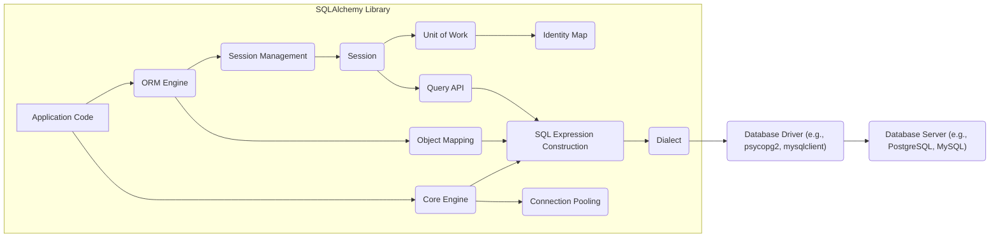
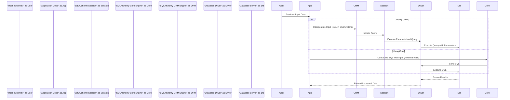

# Project Design Document: SQLAlchemy for Threat Modeling

**Version:** 2.0
**Date:** October 26, 2023
**Author:** AI Software Architect

## 1. Introduction

This document provides an enhanced and more detailed design overview of the SQLAlchemy project, specifically tailored for effective threat modeling. Building upon the previous version, this iteration further clarifies key components, functionalities, data flows, and interactions within the SQLAlchemy library, with a stronger emphasis on potential security implications. This refined information will serve as a robust foundation for identifying potential security vulnerabilities and developing targeted mitigation strategies.

## 2. Project Overview

SQLAlchemy remains a powerful and widely used Python SQL toolkit and Object-Relational Mapper (ORM). It offers developers versatile tools for database interaction, enabling Pythonic database operations instead of direct SQL writing. SQLAlchemy's dual nature, providing both a high-level ORM and a lower-level SQL toolkit, makes it a critical component in many Python applications.

## 3. System Architecture

The following diagram provides a more granular illustration of SQLAlchemy's architecture and its interactions, highlighting key areas relevant to security.

## 4. Key Components and Functionality

This section provides a more detailed breakdown of SQLAlchemy's core components, emphasizing aspects relevant to security considerations:

*   **Application Code:** The developer-written Python code utilizing SQLAlchemy. Security vulnerabilities here can arise from improper handling of user input before it reaches SQLAlchemy.
*   **ORM Engine:** The high-level interface for database interaction using object-oriented principles.
    *   **Session Management:** Responsible for creating, managing, and closing database sessions. Improper session handling could lead to resource exhaustion or data integrity issues.
    *   **Object Mapping:** Defines how Python classes are mapped to database tables. Incorrect or overly permissive mappings can expose sensitive data.
*   **Core Engine:** The lower-level abstraction over SQL, offering programmatic SQL construction.
    *   **SQL Expression Construction:** Allows building SQL queries programmatically. Directly incorporating unsanitized user input here is a primary SQL injection risk.
    *   **Connection Pooling:** Manages a pool of database connections for efficiency. Misconfigurations in connection pooling might lead to connection leaks or denial-of-service.
*   **Session:** Manages a transactional context for database operations. It tracks changes to objects and orchestrates saving them. Security concerns include ensuring proper transaction boundaries and preventing unintended data modifications.
*   **Unit of Work:** Tracks changes to objects within a Session and generates the necessary SQL to synchronize with the database. Vulnerabilities could arise if change tracking is bypassed or manipulated.
*   **Identity Map:** Ensures a single Python object exists per database row within a session. While primarily for efficiency, understanding its behavior is important for reasoning about data consistency.
*   **Query API:** Provides an object-oriented way to construct database queries. While generally safer than raw SQL, improper use can still lead to vulnerabilities if filters or ordering are not carefully managed.
*   **Dialect:** The database-specific adapter that translates SQLAlchemy's generic SQL into the target database's syntax. Dialect vulnerabilities are less common but possible.
*   **Database Driver:** The Python library providing the actual communication with the database server. Driver vulnerabilities are a significant external risk.
*   **Database Server:** The underlying database system. Its security configuration is paramount but outside SQLAlchemy's direct control.

## 5. Data Flow

This section expands on the data flow descriptions, including a dedicated flow for user input, which is critical for threat modeling.

*   **Querying Data (ORM):**
    *   Application code initiates a query via the `Session`.
    *   The `Query API` constructs SQL using the `SQL Expression Construction`.
    *   The `Dialect` translates the SQL.
    *   The `Database Driver` sends the SQL to the `Database Server`.
    *   The `Database Server` executes and returns results.
    *   The `Database Driver` receives results.
    *   The `Dialect` processes results.
    *   The `Session` materializes results into Python objects.
    *   Application code receives the objects.

*   **Saving Data (ORM):**
    *   Application code modifies/creates objects managed by the `Session`.
    *   The `Unit of Work` tracks changes.
    *   On `session.commit()`, `Unit of Work` generates INSERT/UPDATE/DELETE SQL.
    *   The `Dialect` translates these statements.
    *   The `Database Driver` sends SQL to the `Database Server`.
    *   The `Database Server` executes and persists changes.
    *   The `Session` is flushed.

*   **Executing Raw SQL (Core):**
    *   Application code constructs SQL via `SQL Expression Construction` or raw strings.
    *   The `Dialect` processes the SQL.
    *   The `Database Driver` sends SQL to the `Database Server`.
    *   The `Database Server` executes the query.
    *   The `Database Driver` returns raw results.
    *   Application code processes the raw results.

*   **User Input Data Flow:** This flow highlights how external data enters the system and interacts with SQLAlchemy.

## 6. Security-Relevant Aspects

This section provides a more structured and detailed overview of potential security concerns related to SQLAlchemy:

*   **SQL Injection Vulnerabilities:**
    *   **Risk:** Directly embedding unsanitized user input into raw SQL queries constructed using the Core toolkit is a critical vulnerability.
    *   **Mitigation (ORM):** The ORM, when used with parameterized queries (the default and recommended approach), effectively mitigates this risk. Ensure proper use of ORM features and avoid manual string formatting of SQL.
    *   **Mitigation (Core):** When using the Core toolkit, always use parameterized queries or the `text()` construct with bound parameters. Never concatenate user input directly into SQL strings.
*   **Database Credential Management:**
    *   **Risk:** Hardcoding credentials in the application code or storing them insecurely (e.g., in configuration files without encryption) exposes them to unauthorized access.
    *   **Mitigation:** Utilize secure credential management techniques such as environment variables, dedicated secrets management services (e.g., HashiCorp Vault, AWS Secrets Manager), or operating system keychains. Avoid storing plain text credentials in code.
*   **Database Permissions and Least Privilege:**
    *   **Risk:** Using a database user with excessive privileges increases the potential impact of a successful SQL injection or other database compromise.
    *   **Mitigation:** Grant the SQLAlchemy database user only the necessary permissions required for the application's functionality (e.g., `SELECT`, `INSERT`, `UPDATE` on specific tables). Avoid granting broad permissions like `DROP TABLE` or `CREATE USER`.
*   **Dependency Vulnerabilities (Database Drivers):**
    *   **Risk:** Vulnerabilities in the underlying database driver libraries can be exploited to compromise the application and the database.
    *   **Mitigation:** Regularly update database driver libraries to their latest stable versions. Monitor security advisories for known vulnerabilities in the drivers being used.
*   **Serialization and Deserialization Risks:**
    *   **Risk:** If SQLAlchemy objects are serialized (e.g., for caching or transmission), vulnerabilities in the serialization library could be exploited during deserialization.
    *   **Mitigation:** Be cautious when serializing SQLAlchemy objects, especially if the serialized data originates from untrusted sources. Consider using secure serialization formats and libraries.
*   **Logging and Information Disclosure:**
    *   **Risk:** Logging SQL queries that contain sensitive user data or database credentials can lead to information disclosure if logs are not properly secured.
    *   **Mitigation:** Implement careful logging practices. Avoid logging sensitive data in SQL queries. If logging is necessary for debugging, ensure logs are stored securely with restricted access.
*   **Configuration Security:**
    *   **Risk:** Insecure SQLAlchemy configurations (e.g., overly permissive connection pooling settings, disabled security features) can introduce vulnerabilities.
    *   **Mitigation:** Review SQLAlchemy configuration options and ensure they align with security best practices. For instance, configure appropriate connection timeouts and consider using secure connection protocols.
*   **ORM Mapping Vulnerabilities:**
    *   **Risk:** Improperly configured ORM mappings might inadvertently expose sensitive data or allow unintended modifications if relationships are not correctly defined or access controls are missing.
    *   **Mitigation:** Carefully design and review ORM mappings. Ensure that relationships accurately reflect the intended data access patterns and that appropriate constraints are in place at the database level.

## 7. Dependencies

SQLAlchemy's dependencies are critical to consider for security:

*   **Database Drivers:**  Libraries like `psycopg2` (PostgreSQL), `mysqlclient` (MySQL), `pyodbc` (various databases), and the built-in `sqlite3` are essential. Keeping these updated is crucial for patching vulnerabilities.
*   **Python Standard Library:** SQLAlchemy relies on core Python modules. While generally stable, staying updated with Python versions is also a good practice.

## 8. Deployment Scenarios

Understanding deployment scenarios helps identify potential attack vectors:

*   **Web Applications (Flask, Django):**  Exposed to web-based attacks. Input validation and protection against common web vulnerabilities are crucial alongside secure SQLAlchemy usage.
*   **Standalone Scripts/Tools:**  Security depends on the environment where these scripts run and the sensitivity of the data they handle. Secure credential management is vital.
*   **Data Pipelines:**  Authentication and authorization for accessing databases within the pipeline are critical. Secure storage of connection details is also important.
*   **Desktop Applications:**  Security considerations include protecting the application's database file (for SQLite) and securely storing connection details if connecting to remote databases.

## 9. Assumptions and Limitations

*   This document assumes a basic understanding of SQLAlchemy concepts.
*   The security of the underlying database system is not covered in detail but is a fundamental aspect of overall security.
*   Secure coding practices by developers using SQLAlchemy are paramount and assumed.

## 10. Future Considerations

*   Detailed threat modeling diagrams focusing on specific attack vectors (e.g., SQL injection through different entry points).
*   Analysis of specific SQLAlchemy security features and best practices documentation.
*   Integration with security scanning tools and their effectiveness in identifying SQLAlchemy-related vulnerabilities.
